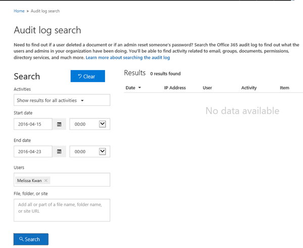

# Planning SharePoint Online business-to-business (B2B) extranet sites

The standard SharePoint Online external sharing features can be used to create a business-to-business (B2B) extranet collaboration site. There are several complimentary SharePoint Online sharing features that make SharePoint Online a great place to have simple, highly secure, and connected partners engagements.
  
If you're also using SharePoint Server 2013 or SharePoint Server 2016, we highly recommend reviewing the [available SharePoint hybrid features](https://support.office.com/article/4c89a95a-a58c-4fc1-974a-389d4f195383) to integrate SharePoint Server with Office 365. 
  
To help plan for your extranet site, we'll go over the following in tasks in this article:
  
- Choose the invitation model that works best for you.
    
- Decide if your partners users will need SharePoint Online licenses based on what features they'll need access to.
    
- Create a lifecycle plan for your guest users and what to do with the content and users accounts when you complete the collaboration for which you're creating the site.
    
When you complete this article, read [Securing a SharePoint Online extranet site](secure-extranet-site.md).
  
## Choosing how to invite partner users

One key aspect of using an extranet site is managing the external business partner users. Following are some ways the administrators can provision the partner users in their organization's directory:
  
- **User-initiated guest invitation model** - This is the default for a new site collection and the recommended model as it provides control to administrators and at the same time flexibility of end users being able to collaborate with their new business partner users without much intervention. 
    
- **Site-owner-initiated guest invitation model** - If you want more control than the default sharing model over who can invite new users to a site, you can configure the site to only allow site owners to invite new users. This prevents ad-hoc invitations from being sent out by site users. 
    
- **Admin-managed partner users model** - In an admin-managed partner users model, the Office 365 you pre-populate your organization's directory with the guest users who you'll be inviting to your site. This can be done by [importing users from other Office 365 or Azure AD](https://go.microsoft.com/fwlink/?linkid=2003563).
    
See [Securing a SharePoint Online extranet site](secure-extranet-site.md) for details on how these options relate to site sharing and which settings to choose. 
  
## Assigning licenses to partner users

Guest user accounts have limited capabilities in SharePoint Online. See [External sharing overview](external-sharing-overview.md) for details on those features and what additional capabilities can be provided. If you determine that your partner users need additional functionality, such as the ability to create team sites, you can [assign SharePoint Online licenses to these user accounts](/office365/admin/subscriptions-and-billing/assign-licenses-to-users).
  
> [!NOTE]
> Assigning an Exchange Online license to guest partner users is not supported. 
  
## Auditing and Reporting of external users

The **Office 365 activity report** in the Office 365 Compliance Center is used to view Office 365 user and admin activity within your company. The report can be filtered by date and user activity events to monitor SharePoint Online extranet invitation status, who has sent invitations, and who has accepted. 
  
To monitor the status of your extranet account invitations, including changes to the domain allow or deny list; who sent a sharing invitation, requested it, and if it was accepted, revoked or expired, see [Search the audit log in the Office 365 Security &amp; Compliance Center](/office365/securitycompliance/search-the-audit-log-in-security-and-compliance).
  
 **Example 1:**
  
To create a report that shows who has been sent invitations to your extranet site and who issued the invitation, set your report filters this way:
  

  
 **Example 2:**
  
To create a report showing all file access activities for a external partner, set your event filters as follows:
  

  
## Lifecycle management of business partner users

When a contract with a business partner ends, it is important that you remove any access that the external business partner has to SharePoint Online. Here is the checklist of administrative actions you need to take:
  
- **Remove permissions** - [Remove partners from security groups](create-external-business-sharing-site.md#managing-your-site) or [remove them if they were individually added as site members](https://support.office.com/article/8376034d-d0c7-446e-9178-6ab51c58df42). 
    
- **Delete partner accounts** - Delete the partner users from Office 365 provided they no longer need access to any other resources in your organization. See [Delete a user from your organization](/office365/admin/add-users/delete-a-user).
    
- **Archive** - Archive the site that you created for your partner in SharePoint Online. 
    
## See also

[External sharing overview](external-sharing-overview.md)
  
[Azure Active Directory B2B collaboration](https://go.microsoft.com/fwlink/?linkid=2003564)
  
[Organizational relationships in Exchange Server](https://go.microsoft.com/fwlink/?linkid=2003469)
  
[Allow users to contact external Skype for Business users](/SkypeForBusiness/set-up-skype-for-business-online/allow-users-to-contact-external-skype-for-business-users)

