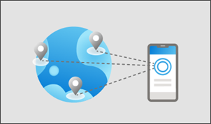
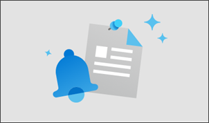
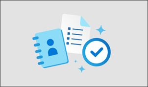

# Step 1: Review popular communication scenarios and solutions

Review popular communication scenarios to get familiar with the different types of organizational structures and details that will help narrow down potential solutions. Then, learn about Microsoft 365 communication applications, how to scope your audience(s) and determine the audience profile. Finally, pick a solution and get started planning for your specific scenario.
 
 

| Review scenarios and solutions    | Learn about methods |Scope audience   |Get started planning   |
| :------------------: | :------------------: |:---------------:|:---------------:|
|   |    |    |  |
| Learn about common communication scenarios|Review Microsoft 365 communication applications   | Identify audience, preferences, and size  |Get started planning for your specific scenario   |

### Scenario A: Use Viva Connections as a gateway to employee experiences

**Goals:** You need to engage, inform, and connect thousands of frontline and hybrid workers while in the field on a mobile device or at their desk. You want to streamline and target content from across SharePoint, Microsoft Teams, Yammer, and Stream into one curated and branded employee experience. 
 

**Considerations:** Your organization currently uses SharePoint news posts to share essential and time-sensitive information and event recordings that need to reach frontline workers. Additionally, building community and culture among the organizational is a priority and you want to make sure workers in the field can easily engage and participate in social channels. Some tools, resources, conversations, and news are more important to specific audiences and need to be highlighted in the mobile experience. 
 

**Outcome:** The outcome will allow frontline and hybrid workers to feel connected and informed while providing easy access to common tasks and tools all in one place. 

**Get started:** [Learn more about setting up Viva Connections.](guide-to-setting-up-viva-connections.md)

### Scenario B: Plan, build, and launch a home site in SharePoint

**Goals:** You need to create a landing place in your organization’s internal networking of sites – also called an intranet. You want to create a gateway to the intranet to help everyone at your organization get easily orientated to the tools, resources, and news available to them. 
 

**Considerations:** The same resources and functionality need to be available on a mobile device. Your organization has many offices in more than one country, so this landing destination needs to be available in more than one language. Additionally, some portals, news, and resources will be more relevant to certain regions and departments and should be highlighted to groups of viewers. 
 

**Outcome:** The outcome of the landing experience allows all employees to easily catch up on organizational news, access popular resources, and find help and support.

**Get started:** [Learn more about how to set a SharePoint home site.](home-site-plan.md)

### Scenario C: Plan and produce a town hall for your organization

**Goals:** You want to host a live or pre-recorded event in the form of a town hall event for a large sales and support department of more than 1,000 people. The goal of the town hall is to update everyone on the state of the business and announce new products. 
 

**Considerations:** The typical employee talks to customers regularly, and needs be up to date on all offerings. Both sales and support employees need technical information and specifications to share with customers, but support agents tend to want more in-depth information to help resolve customer issues. Both audiences like to ask questions--and get answers--during these types of events. 
 

**Outcome:** The outcome of this scenario is a large region or division of an organization engages with new information, resources, messages, and direction during a live event that’s recorded and can be viewed later.

**Get started:** [Learn more about how to plan and produce a town hall using Yammer.](hold-town-hall-using-yammer.md)

### Scenario D: Distribute organizational news for your organization

**Goals:** You need to share news that engage and inform all employees in your organization using more than one distribution method. The goal is to keep everyone at the organization up to date on initiatives, programs, events, and training opportunities. 
 

**Considerations:** You need to reach remote workers, frontline workers, and people in offices in more than one region. Also, most news will need to be in more than one language. 
 

**Outcome:** The outcome will allow for relevant news to show up to the right audience on devices and in apps that are already being used in the flow of work.

**Get started:** [Learn more about how to distribute organizational news.](distribute-corporate-news-to-your-organization.md)

### Scenario E: Connect leadership and teams across the organization

**Goals:** You need to find a way to connect leadership teams with the rest of the organization. The goal is to provide consistent and ongoing communication and connection from your top leadership representatives. 
 

**Considerations:** The audience is broad and involves multiple disciplines doing various jobs from all types of devices - both remotely and in the office. They might also span multiple geographical regions and time zones. 
 

**Outcome:** The outcome will be a sustainable communications channel that connects people and provides learning opportunities beyond typical leadership announcements.

**Get started:** [Learn more about how to connect leadership with your organization.](leadership-connection.md)

### Scenario F: Plan, build, and maintain a new employee onboarding program

**Goals:** You need to develop a scalable method of welcoming and orienting new employees. The goal is to help new employees get set up with onboarding paperwork, acquiring work devices, tools, and help understanding company policies and benefits. 
 

**Considerations:** Twice a month this organization welcomes anywhere from 25 to 100 new hires across many offices in different countries. During the event, participants can ask questions, get answers, and meet other people in their new organization. Information shared at the event will also need to be organized in one central place so afterwards new employees can access resources as needed. 
 

**Outcome:** The outcome makes new employees feel welcome and understand who and where to go to for help and more information.

**Get started:** [Learn more about how to plan and launch a new employee onboarding program.](onboard-employees.md)

### Scenario G: Build a learning and training experience for employees

**Goals:** YoYour organization is full of different types of disciplines. In order to make sure every employee is equipped with the most up-to-date industry or job-related knowledge and proficiencies, you’d like to build an experience that allows your organization to administer learning modules and experiences and track the progress and performance of each employee.
 

**Considerations:** This experience will also need to be accessible to people in all regions, across multiple devices, and in all necessary languages. Your experience will need to be able to reach remote workers, front line workers, as well as those working in an office. This experience will also need to be accessible to people in all regions, across multiple devices, and in all necessary languages.
 

**Outcome:** The outcome is a high functioning organization comprised of highly skilled and knowledgeable employees who are equipped with the most up-to-date skills and know where to go to find the training opportunities.

**Get started:** [Learn more about how to build a learning and training experience for employees.](build-learning-and-training-experiences-for-employees.md)

## Up next:

**Step 2:** [Review Microsoft 365 communication tools and methods](review-communication-apps.md)
 

**Step 3:** [Scope audience size and preferences](audience-profile.md)
 

**Step 4:** [Get started planning for your scenario](choose-communication-method.md)

 
 
