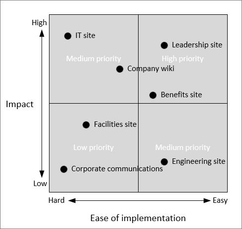

# Plan an intelligent SharePoint intranet

SharePoint offers a wide variety of options and tools to create intranet sites for your organization. Moving your intranet to SharePoint might take a while, particularly if you already have extensive intranet content. In this article, we'll look at how to plan a new SharePoint intranet with a focus on quickly bringing sites online and getting a return on your investment.

We'll cover how to:

- Review your current intranet
- Identify and prioritize your business scenarios for intranet sites
- Identify one key scenario to prototype and pilot
- Launch the pilot and engage with your users

## What's possible with SharePoint?

With SharePoint, any user can create highly functional intranet pages quickly without the need for writing code or other difficult customizations. These sites look great on any device or screen and provide deeply engaging experiences for your users.

If you're currently using SharePoint Server for your intranet, you'll find SharePoint Online to be much easier to work with. Responsive, dynamic pages are easy for anyone to create, and the requirements for IT to build and maintain custom solutions are much less.

As a first step, we recommend that you review the [SharePoint look book](https://aka.ms/sharepointlookbook) to see examples of what's possible with SharePoint. The look book provides a variety of examples of how to include news, events, resources, and personalized content in SharePoint sites that anyone can create and maintain.

Also review the [Guide to the Modern experience in SharePoint](guide-to-sharepoint-modern-experience.md) for an understanding of how the different component parts work together.

For an interactive workshop to learn how to succeed with a SharePoint intranet, look for an [Accelerator workshop](https://resources.techcommunity.microsoft.com/events/intelligent-intranet-accelerator-workshop) in a city near you.

In the following sections, we look at how find the best starting point for your SharePoint intranet and how to prioritize the different intranet solutions that you may need for your organization. Keep these references handy as you work with your stakeholders - they can help you get the most value and best time to value for your intranet solutions.

## Review your existing intranet

Your current intranet may be composed of sites from different business groups, such as HR, IT, Facilities, Engineering, and others. As a first step to planning your new SharePoint intranet, we recommend taking an inventory of your existing sites and meeting with the owners of each to determine their business requirements for new sites. Take stock of where your content is located and how much content you would need to move when creating a new intranet site.

As part of these meetings, you can identify the business needs that are addressed by each existing site as well as any requirements you might have for new sites.

## Identify business scenarios

Work with the intranet site owners in your organization to determine what an ideal intranet site would look like to them:

- What do you want visitors to the site to be able to accomplish?
- What tools or technology do you want them to use to accomplish this?
- How will they know that they're successful?

For example, create a table like this to list out business scenarios that you want to address with intranet sites across your organization:

|**As someone in...**|**I want to...**|**Using...**|**I know this is successful when...**|
|:-------------------|:---------------|:-----------|:------------------------------------|
|HR Benefits|Educate employees about benefits|Announcements and training videos|Help requests are reduced|
|Engineering|Instruct engineers on coding excellence|Streaming events and formal training|Training completed successfully|
|Leadership|Foster positive employee agreement about company strategy|News posts, streaming events, Yammer conversations|Yammer conversations show positive sentiment|

When you and your intranet stakeholders have compiled a list of business scenarios, the next step is to prioritize. While you may ultimately create intranet sites to address all of the identified scenarios, prioritizing which project to do first will help you achieve early success and user engagement as efficiently as possible.

Review each scenario on the list for the following criteria:

- Does it solve a real problem?
- How many people will use it?
- Can it be built in a reasonable time frame?
- What's the return on investment?

Analyze each scenario for its positive impact on your users with respect to the ease of implementation. A high impact site that can be built with a minimum of customization can be an ideal first project.

## Choose a pilot scenario

From the high priority scenarios, identify which ones meet these three key criteria:

- Can you build a prototype quickly (a few days)?
- Is there a committed sponsor?
- Is there a specific audience for a pilot?

Consider plotting your business scenarios on a grid such as that below and review with your intranet stakeholders and IT department to choose the best option to start with.

When you've decided on which solution to build first, work with the business leaders for that area to work out the objectives for the site, who will be responsible for driving success in this area, and the metrics that you'll use to measure success. For example:

|**Objective**|**Business owner**|**Success metric**|
|:------------|:-----------------|:-----------------|
|Broadcast Leadership Q&As live|Alex Wilbur|Live stream and recording views|
|Weekly news post by a senior leader|Megan Bowen|News post views and shares|
|Company business value slides known and used|Adele Vance|Slide downloads and sales team alignment|

When you've listed out the primary objectives for the site, review who the site's users are and their goals:

- Who are the target users of the site?
- What are their goals?
- How do they get their job done today?
- What systems and tools do they use today?
- Who are the champions who will help them transition to the new site or solution?

Once you have compiled this information, create a design brief to help map out the user journey of how you want the site to operate. For example:

|||
|:----|:----|
|Scenario|Leadership site: One-stop site for employees to hear from company leadership, learn the company's goals, and hear the latest news from customer meetings and industry events.|
|Users|All company employees|
|Value|Increase employee awareness and alignment with company strategy and business opportunities.|
|User journey|News post is sent to the company announcing a leadership Q&A meeting. Allan goes to the leadership portal to watch the event live. Allan uses Yammer to ask a question at the meeting. Allan shares the recording link with coworkers.|
|Metrics|Live event views Event recording views Yammer engagement|
|Stretch goals|Continued Yammer engagement Improving employee sentiment (survey)|

## Choose solution components

SharePoint offers a variety of building blocks that you can use to create an intranet:

- **[Communication sites](https://support.office.com/article/94A33429-E580-45C3-A090-5512A8070732)** - Use communication sites to share news, reports, statuses, and other information through a variety of templates and web parts.
- **[Home sites](https://docs.microsoft.com/sharepoint/home-site)** - Create an engaging home for your organization, division, or function.
- **[Hub sites](planning-hub-sites.md)** - Use hub sites to organize related sites and teams and centralize news, search, and content management.
- **[SharePoint news](https://support.office.com/article/C2DCEE50-F5D7-434B-8CB9-A7FEEFD9F165)** - Use the news web part to post important or interesting stories, announcements, people news, status updates, and more that can include graphics and rich formatting.
- **[Yammer](https://docs.microsoft.com/yammer/yammer-landing-page)** - Use Yammer to connect with people across your organization beyond the boundaries of projects, functions, and departments.
- **[Forms](https://docs.microsoft.com/forms-pro)** - Use forms to create custom quizzes, surveys, questionnaires, registrations and more.
- **[Stream](https://docs.microsoft.com/stream)** - Use Stream to deliver live and on-demand meetings, events, and training.

For the scenario that you've decided to build, choose the components that you'll need to use to meet the site's business objectives. We recommend creating a rapid prototype and granting access to your key stakeholders. This provides a substantive framework for further discussions and revisions of the design.

At this stage, we recommend that you involve your help desk so that they are prepared to answer questions once the site rolls out to a larger audience.

For best practices for launching an intranet site, review [Creating and launching a healthy SharePoint portal](portal-health.md).

## Roll out the pilot

When the prototype has evolved to a point where you want to share it more broadly, you can roll it out to a pilot group, or even to the whole organization. User adoption is a critical part of success for a new intranet site. We recommend that you use both a top down and bottom up approach to driving site usage:

- Recruit executive sponsors who can ensure that the intranet project is funded and can help message the importance of the new site to others in the organization.
- Empower champions throughout the organization to evangelize the new site on a grass roots level.

Other things you can do to drive success include:
- Have launch events and communications campaigns
- Provide formal training
- Hold regular office hours where users can ask questions

As the site rolls out and more users engage, watch your success metrics and make adjustments as needed to drive additional engagement and user satisfaction.

When the site is on its way to success, take stock of any lessons learned in the process and proceed on to the next intranet project that you want to undertake.

## Related topics

[SharePoint lookbook](https://aka.ms/sharepointlookbook)

[Intelligent Intranet Envisioning Workshop PowerPoint deck](https://resources.techcommunity.microsoft.com/link/sharepoint-envisioning-workshop-concept/)
