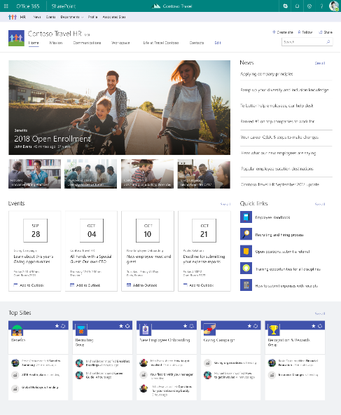

---
title: Planning Navigation for the modern SharePoint experience
ms.author: loreenl
author: loreenla
manager: pamgreen
ms.audience: Admin
ms.topic: article
ms.service: sharepoint-online
search.appverid: MET150
localization_priority: Priority
description: "Learn about how to plan navigation in the SharePoint modern experience"
...

# Planning Navigation for the modern SharePoint experience

The fundamental principles and good practices for site and page navigation are equally applicable to both classic and modern SharePoint architectures. However, your options for *implementing* navigation differs based on the framework for your sites and intranet. For example, the “inherited” navigation experiences available in classic SharePoint site hierarchies (sites with subsites) are not available in the modern experience, but [hub sites](https://support.office.com/article/fe26ae84-14b7-45b6-a6d1-948b3966427f) provide a great way to achieve the cross-site navigation features previously available in managed navigation and site hierarchies in classic SharePoint.

*“When we’re observing customers carrying out tasks on websites we notice certain common patterns. For example, we find that when people arrive at a particular site they start by **navigating about 70% of the time**. When people get stuck navigating they may resort to using site search.”* -- Gerry McGovern, 31 January 2016

No matter which framework you are using, you can use the guidance in this document to help make good decisions for navigation.

This planning guide primarily addresses *site* navigation: the top (communication site and hub site) and left (team site) navigation experiences. However, individual site pages can also provide navigation for site visitors – for example, by presenting visitors with “on page” links to destination pages on the local site and related sites. The principles and good practices for site navigation also apply to “on page” navigation links.

## Why navigation is important

The most effective SharePoint sites (and web sites in general) help visitors find what they need quickly so that they can use the information they find to make decisions, learn about what is going on, access the tools they need, or engage with colleagues to help solve a problem.

Even when search is available, [most visitors start their web experiences by navigating](http://gerrymcgovern.com/search-and-navigation-interconnections/). That pattern persists on internal web sites as well. Planning an effective navigation experience is thus a critical element of designing SharePoint sites. Good navigation experiences present visitors with a complete picture of what is available on the site and, combined with the home page, provide a comprehensive “story” for the site.

The primary difference between “on page” and site navigation is persistence. The links that you see in site navigation persist on every page in the site. The navigation links on individual pages are accessed only when the visitor lands on the page. A benefit to page links is that they can be different from page to page. Both types of links guide your visitors by providing “wayfinding” experiences. The key advantage of site navigation links is that they are always visible in the context of the site. Because site navigation links are persistent, they provide an opportunity to provide significant value for site visitors by providing a way to traverse the site and address their goals: to find and do what they came for.

## Navigation Fundamentals

Planning site navigation involves thinking about:

-   Organizing and labelling

-   Usability and findability

Navigation should always be planned from the perspective of the *user* of information – the visitors to your site. Planning effective navigation involves considering not just the information you want to *present*, but also thinking about the information your readers want or need to *consume*. This is why organizing and labeling your navigation links is so critical usability and findability. If 70% of visitors come to your sites expecting to *browse* for information, the usability of your site depends on creating a great browsing (navigating) experience.

### Organizing

There is no one right way to organize your navigation links. You will make different choices based on the type of site you are creating and your visitors. Organizing concepts might include your:

-   Services

-   Products

-   Activities

-   Audiences (if your visitors can clearly identify the audience to which they belong – such as student or teacher)

-   Focus areas or functions

The default navigation for all SharePoint sites primarily includes *type* of content. For [**communication sites**](https://support.office.com/article/94A33429-E580-45C3-A090-5512A8070732), the default navigation includes Documents, Pages, and Site Contents. These categories are helpful as you are building your site, but they are not typically going to add value to your visitors once your site is ready to launch because the consumer of a communication site typically doesn’t care about the *type* of content – they care about the *purpose* or *subject* of the content. For communication sites, plan to delete the “out of the box” navigation when you are ready to launch and replace it with something that aligns with the guidance provided in the local navigation section of this guide. The default navigation for [**team sites**](https://support.office.com/article/75545757-36c3-46a7-beed-0aaa74f0401e) includes links to the related (and critical) services provided by Office 365 for modern teams – including a link to the shared Site Notebook and the Conversations for the team in Outlook. These represent the typical “services” that teams need to effectively collaborate and might be hard for people to find without the experience provided by the navigation. You may choose to supplement or refine these links for your team sites, but you will also likely find that the default navigation experience is a good starting point and you will be more likely to keep most of these links.

### Labeling

The terms you use for navigation matter – not just because the real estate for navigation is limited – but also because your labels are what guide your visitors to the content. Each label effectively makes a promise: if you click on this link, you will get the information you expect to find. Unfortunately, most labels don’t do that – and as Gerry McGovern says, “[*If most links were married they’d be getting divorced, because they never keep their promises*](http://gerrymcgovern.com/design-navigation-for-clarity-and-fidelity/)*.*”

To ensure that your labels keep their promises, make sure they are:

-   **Specific**. Tell the visitor exactly what they will find when they click the link. If the target for your link includes Policies and Procedures, make sure the label includes both terms.

-   **Comprehensive**. Describe all the content with your collection of labels. You should not plan to link to every single page or document in your navigation, but your navigation should provide a complete picture of the content on your site.

-   **Consistent.** When we have a lot of content on sites, we often need to use a combination category and sub-links on pages. On desktops, hovering the mouse over a category exposes the menu while clicking the category takes you to a “category landing page.” However, hover is not a gesture available on mobile or touch screens so “split” links as shown below can be confusing for site visitors. The top link for Latin America has sub-links. While it is awkward that Latin America has sub-links and the other regions do not, you may find that you need to present navigation where not every top category has sub-links or even where all top links have sub-links. When you have split links, think about the user expectations for the link associated with each category and how it relates to its associated sub-links. Is there a category landing page for Latin America? If so, how much experience will your visitors need to know that there is content only visible if they click on the category link? One option is to make Latin America simply a category *label* (by targeting the URL to an existing page) but another option is to think about providing consistent category and sub-link experiences. Consider creating a category landing page whenever you have sub-links and/or having the category landing page be the first link below the category label. 

-   **Concise**. Keep your labels short and to the point. For example: News, History, Services.

-   **Familiar**. Don’t make up terms in your labels. Keep your readers in mind – if you use an unfamiliar term, your visitors will be confused and unable to find what they need.

-   **Front-loaded**. Make sure that your labels are “scannable.” For example, Company Information is better than Information About our Company.

-   **Clear**. As much as possible, you want your navigation labels to be mutually exclusive – at least for the major categories. It is perfectly fine to have a sub-link show up in multiple categories – especially if visitors might expect to find it in more than one place – but the major categories need to be easily distinguished from one another.

-   **Targeted**. It is generally not a good idea to “tease” people with links to private sites to which they do not have access. Where appropriate, use the audience targeting features for SharePoint to target navigation links to visitors for whom the link will work. (Audience targeting for modern pages and web parts is coming soon. Check the [Office 365 Roadmap](https://products.office.com/en-US/business/office-365-roadmap) *for this and other features that are in development*, rolling out, or launched). Note that there are exceptions to this guideline. For example, you may want to use your navigation to help people discover sites that they may not have access to *today* but could be approved to join. If you do provide links in navigation to private sites, be sure that the owner of the site knows that they may be getting a lot of access requests!

Many sites use labels that tend to break promises – and you should try to avoid them if you can. For example, think twice before you use these labels:

-   **Quick Links (or Useful Links)**. Are the other links slow or *not* useful? Do you really mean “Frequently Needed?”

-   **Frequently Asked Questions**. If you need a label for FAQs, it could be that your content doesn’t address the questions that your visitors want to know. Before you craft a long list of FAQs, think about whether your *content* addresses the key needs of your visitors and if not, consider rewriting your content or breaking it up into pages to make individual topics more discoverable.

-   **Documents**. On team sites, a navigation link to your document library might be appropriate – especially if you only have one library. On communication sites, links to Documents or Manuals are rarely helpful because most of the time, your site visitors don’t care about the *format* of the content. They care about the *subject* or *topic* of the content. Topic or subject is a far better navigational principle than type of content – so it might be better to have a link to a specific topic page where you use web parts to dynamically pull in content of *any* type that is related to that topic. An example of a web part that is useful in this scenario is the [Highlighted Content web part](https://support.office.com/article/e34199b0-ff1a-47fb-8f4d-dbcaed329efd), which allows you to pull in documents based on specific criteria.

### Usability and Findability

The primary reason we care about organizing and labeling is to make our sites useable and our content findable! This is our key goal when we plan navigation. The best way to ensure that your navigation meets these goals is to test it! There are several cost-effective approaches that you can use to ensure that your navigation design is effective, including:

-   Card Sorting (primarily helpful for planning navigation)

-   Tree Testing (helpful for testing suggested navigation paths)

-   Usability Testing (task-based scenarios that are helpful for comprehensive testing of site and “on page” navigation)

These two resources provide a good overview of techniques and tools for testing the usability and findability of your navigational strategy:

-   [Usability Analysis](https://www.nngroup.com/articles/better-usability-tasks)

-   [Overview of Testing Approaches](https://www.nngroup.com/articles/quantitative-user-research-methods)

### Link Targets

Many usability guidelines recommend [limiting the number of new windows that are automatically opened for site visitors](https://www.w3.org/TR/WCAG20-TECHS/G200.html). Most of the time, opening a link in the same window allows site visitors to use the back button when they want to return to your site. When a visitor wants to open a link in a new window, the guidelines recommend that the visitor be allowed to *choose* this outcome (by “right clicking” on the link). An exception to this guideline is the recommendation to always open *documents* in a new window to prevent users from accidentally closing the browser window when they close the document.

By default, navigation links on modern SharePoint sites open as follows:

-   **Link points to a page or site in the same tenant** (same site or another site): Links open in the same tab

-   **Link points to a document (same site or different site)**: Links open in a new tab

-   **Link points to an external (internet) site or document**: Links in a new tab

In classic SharePoint sites with publishing features, you can choose to open navigation links in a new window. This allows you to consider the context for your site visitors and determine whether it might be helpful to open a link in a new window. There is no way to select how navigation links open in modern SharePoint sites. This means that your navigation links will follow most usability guidelines, but you will still want to be especially careful about the *labels* for navigation links to make sure that your visitors know that they are leaving your site context when they click the link. Make sure that the navigation label accurately describes the destination – a place on a completely different site or an application – and if you know that the back button may not work, consider using an alternative way to present the link, such as the text web part where you can open elect to open a link in a new window.

## Navigation in the Flat World

There are three types of navigation to think about for modern SharePoint experiences:

-   Local navigation on an individual site

-   Hub or “family” navigation for groups of related sites

-   Global navigation for the entire collection of sites that comprise your intranet

### Local Navigation

Local navigation is the persistent navigation that visitors see on every page of your site. For team sites, local navigation shows up on the left side of the page in the area referred to as the “quick launch.” For communication sites, local navigation shows up at the top of the page.

In addition to the general guidelines for link labels, consider the following for local navigation:

-   **Local navigation is on every page in your site – so make sure it is relevant**. Think about how visitors might explore your content and use local navigation to support that exploration. For example, a travel site might have the following local navigation links that support visitors who are exploring the travel site from the perspective of “what am I allowed to do?” as well as visitors who are exploring the travel site from the perspective of the travel process – before, during, and after their trip.

    -   Travel Guidelines

        -   Air

        -   Car

        -   Ground Transportation

        -   Hotel

        -   Train

    -   Before You Go

        -   Travel Approval

        -   Booking Service

    -   During Your Trip

        -   Travel Safety

        -   Itinerary Changes

    -   After You Return

        -   Expense Reporting

        -   Trip Reports

-   **Link to pages, not individual documents**. Document links open in a new window – which is helpful if someone wants to close the document after reading – but document links take visitors to a new context – the online viewer for how the document was created (such as Word or PowerPoint). In some cases, this may be the experience you want. But when navigation points to a page with an embedded instead of directly to a document, you have an opportunity to provide *context* for the document and retain the navigational context for the site. Think about the following alternatives if you want to use a navigation link to open to a single document:

    -   Can you re-create the document content as a page instead of a document? Pages are easier to read online and especially for communication sites, where visitors are not editing but just consuming content, presenting content on a page instead of a document can provide a better experience, especially on mobile devices. Documents are great when readers need to download or print – but when all they need to do is read, a short, well-crafted page is a great way to present and maintain information.

    -   Embed the document on a page. When a visitor clicks the link to a page, the site navigation remains visible. The page allows you to provide context for the document and it also and keeps the reader in the context of your site.

-   **Plan for up to three levels of navigation**. Local navigation supports up to three levels and a new mega-menu layout for sites and hub sites is coming soon (check the [Office 365 Roadmap](https://products.office.com/en-US/business/office-365-roadmap) *for this and other features that are in development*, rolling out, or launched). A top link can have a sub-link and a sub-link can have and additional level of links. Links to external sites (not on your tenant) automatically open in a new window. Links to pages and sites in the same tenant or on the same site always open in the same window.

-   **Be comprehensive and progressive**. It’s a good practice to use your top navigation to provide a comprehensive experience for site visitors. Navigation should answer the question, “What can I do on this site?” But, limited real estate on the navigation bar or quick launch means you need to apply the principle of [progressive disclosure](https://www.nngroup.com/articles/progressive-disclosure/). This approach suggests that you group your content into logical categories and provide a limited set of choices for your readers to allow them to explore each content category to learn more. Progressive disclosure applies to all types of navigation and not just top or site navigation. It also applies to page content. For example, you can refer to a term in text (just like the link to the progressive disclosure article in this paragraph) to allow readers who need to know more to read more – but allow readers who know what the term means to continue in the context of the page. Keep in mind: you don’t need to have a link to every bit of content on your site in the navigation – but your readers should be able to get a sense of the entire site by exploring your navigation options. Great navigation experiences help visitors understand:

    -   Where am I?

    -   What can I do here

    -   Where can I go next.?

Plan to optimize the navigation experiences for your visitors by combining navigation and “on page” links to answer these three questions.

### Hub Navigation

The “inherited” navigation experiences available in classic SharePoint site hierarchies (sites with subsites) are not available in the “flat” world of modern SharePoint, where each unit of work or project or team gets its own site collection. Flat architectures are great for governance, but can make it harder to *implement* navigation that connects multiple sites.

[Hub sites](https://support.office.com/article/fe26ae84-14b7-45b6-a6d1-948b3966427f) provide a great way to achieve the cross-site navigation features previously available in managed navigation and site hierarchies in classic SharePoint. One of the important [planning decisions for hub sites](planning-hub-sites.md) is planning the hub navigation.

Hub site navigation is displayed above the local navigation on each site, just below the suite bar.

Hub site navigation is established in the on the site that is declared to be the hub. It is defined by the hub site owner and is shared by all the associated sites. You cannot currently “turn off” hub navigation on an individual site that is associated to a hub, so you will want to carefully think about which sites are reflected in your hub navigation.

There are three special considerations for planning hub site navigation:

1.  A site can be in the shared navigation *and* be associated to the hub.

2.  A site can be associated to a hub and *not* be in the shared navigation.

3.  A site can be in the shared navigation and *not associated to the hub.*

**Scenario 1: Site is in the shared navigation and associated to the hub**

Showcasing sites associated to the hub allows visitors to discover the members of the hub family – and easily navigate among and across the family members. Adding an associated site to the hub navigation presents visitors with an organizational framework for the collection of sites in the hub. The fact that all sites in the hub share a common theme and navigation helps to establish the identity of the hub family both visually and via navigation links. Your hub links can go to sites or content pages or a combination of both – but use the practices described for link labeling to ensure that you are providing clear and consistent experiences.

When you choose to show all associated sites in the hub navigation, think about whether all the people who have access to the hub will *also* have access to each of the sites associated to the hub. For example, if you add links to private sites in the navigation, you are increasing their “discoverability,” which can be a good thing – if the site owners for those private sites are prepared to get access requests. However, you may not *want* to show restricted sites in the navigation if the site owner does not want the site or the content to be discovered. To ensure that your hub site navigation links keep their promises, consider the following options:

-   For links that should not be discoverable to all visitors, target the link so that it only shows up for audiences who have access to the content. (Audience targeting for modern pages and web parts is coming soon. Check the [Office 365 Roadmap](https://products.office.com/en-US/business/office-365-roadmap) *for this and other features that are in development*, rolling out, or launched).

-   For “discoverable” but restricted links, consider adding the word (Restricted) or (Request Access) or (Private) to the label and having a conversation with those site owners to make sure that they are prepared for potentially more frequent access requests.

**Scenario 2: Site is associated to the hub and *not* shown in the shared navigation**

If the use case for your hub is primarily about sharing a common theme or for rolling up content for people who are members of private sites, you may want to associate a site to a hub but not showcase the site in the shared hub navigation. One reason that this might be OK is that the members of the private sites already know about the sites and don’t *need* the hub to provide links to the site. However, these same site members would find it useful to see the news and activity rolled up from their private sites on the hub site (via the Highlighted Content and News web parts). Another reason not to show associated sites is that the owners of one or more private sites do not want the sites to be discovered in the hub navigation or they are not prepared to manage unexpected access requests. For example, you may have extranet sites that you want to be associated to the hub to share the hub theme and so that internal team members can see news and activity on the hub site, but you don’t want to add the extranet sites to the hub navigation because then extranet site members who are not in your organization would see the hub site navigation – which might include links to sites that you don’t want them to see.

**Scenario 3: Site is added to hub navigation but not associated to the hub**

One of the nice features of hub navigation is that it allows you to plan a shared navigation experience for all the sites associated to the hub – including links to frequently needed sites that are *not* part of the hub.

If a site is associated to a hub, it participates in the hub navigation. But you may not want all sites that are related to the hub “family” to be associated to the hub. For example, let’s reconsider the extranet scenario. You might have a hub site for an organizational unit that owns both internal and extranet team sites. You may not want to associate extranet sites to your hub because you may not want your external customers to see the shared navigation for the hub. But at the same time, you may want to add links to the extranet sites to the hub navigation to make it easier for internal visitors to discover these related extranet sites. This presents a convenient way to showcase links to all the extranet sites managed by the business group without having to worry about exposing navigation links to external visitors. When internal visitors navigate to the extranet sites they will no longer see the hub context and theme – but this is the desired outcome.

An individual site can only be associated to one hub site. However, you can increase discovery by adding navigational links to other hubs or other sites in your hub navigation. For example, you could link to all the regional Quality sites from the Global Quality hub even if the regional Quality sites are associated to regional hubs.

To learn how to make navigation changes to sites and hub sites, see [Customize the navigation on your SharePoint site](https://support.office.com/article/3cd61ae7-a9ed-4e1e-bf6d-4655f0bf25ca).

### Global Navigation

Many intranets include top navigation that persists on every site. Global navigation allows you to create an overall navigation story for your intranet that visually connects all the sites, content, and tools your visitors need to get work done. Every organization has a different requirement for what goes in global navigation, but some of the category labels often used include concepts such as:

-   Home

-   About Us

-   News

-   Working Here/Work Resources/Administrative Services/Administration

-   Operations/Operations Services

-   Pay & Benefits

-   Life & Career

-   Locations

-   Policies & Procedures/Tools & Resources/Safety & Security

The goal of global navigation is to support browsing to content but since there is limited real estate available for global navigation links, the top links always need category navigation pages, sub-links or a mega-menu experience to provide enough “information scent” to help visitors navigate their way to the content they need. Since the context for global navigation must be very broad, it is challenging to make the labels both comprehensive and useful. If you plan to implement global navigation, consider using one of the testing methods discussed earlier to make sure that your proposed navigation resonates with users.

Global navigation is on the roadmap for Office 365/SharePoint Online but is not yet available. (Check the [Office 365 Roadmap](https://products.office.com/en-US/business/office-365-roadmap) *for this and other features that are in development*, rolling out, or launched). Until global navigation is available, there are several ways to create a global navigation experience for your modern SharePoint intranet:

-   Create a custom [SharePoint Framework Extension](https://docs.microsoft.com/en-us/sharepoint/dev/spfx/sharepoint-framework-overview) to deliver and apply global navigation to each new site as it is created.

-   Create a “navigation” site (e.g. your intranet “home” site) and use the logo in the suite bar and a Featured Site link on SharePoint Home to make it easy for people to navigate to the “home” site from every destination site in your tenant.

-   Manually add a link to the “home” site in the local navigation in each or key site collections.

-   Use a single hub site for the entire organization. This might be a reasonable short-term strategy for a small organization, but the benefits of hub sites decrease in value if you only have one so this is not a viable solution in most cases.

-   Wait to add global navigation until it is available natively in the product.

## Managing Navigation Expectations

Navigation provides a way to enhance the story of your digital workplace by making it easy for users to browse to the content they need. On the *internet*, we expect to have to search for the content we need. Yet on the *intranet*, visitors *expect* a navigation experience that is carefully curated to help understand and find the content they need.

Curating a navigation experience for intranets and digital workplaces comprised of even just a few hundred sites can be a daunting task – especially your goal (or the goal assigned to you) is to make sure that all content is findable in “three clicks.” Contrary to popular belief, your visitors will not leave your site or give up if they are unable to find what they are looking for in three clicks. More or fewer clicks do not make visitors happier or perceive that the site is faster. What really matters in navigation experiences is “information scent” – whether the label for the link provides an adequate clue about where the “click” will go. It is the quality of the label and whether the label fulfills its promise that has the highest impact on usability. Visitors are willing to click to find information as long as they are confident that with each click, they are headed in the right direction – closer to their goal.

“Information scent” on SharePoint sites can be achieved with **clear, mutually exclusive labels** for links and labels lists and libraries that clearly tell visitors what they will find. You can improve your navigation by spending time testing to make sure that the navigation labels resonate with your visitors and following the guidance for labels recommended in this document. Your navigation outcomes will be most successful if you take the time to understand your visitors, their key “tasks and asks,” and design navigation experiences that keep their promises.

**Principal author: Susan Hanley, MVP LinkedIn: [http://www.linkedin.com/in/susanhanley](http://www.linkedin.com/in/susanhanley) Website: [www.susanhanley.com](http://http://www.susanhanley.com) Blog: [http://www.computerworld.com/blog/essential-sharepoint](http://www.computerworld.com/blog/essential-sharepoint)**
