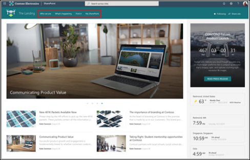
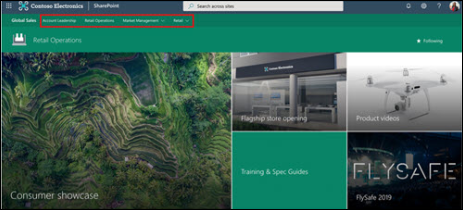
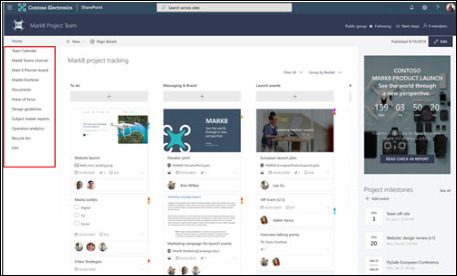
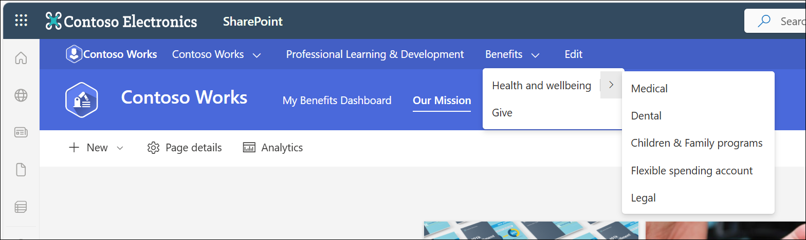
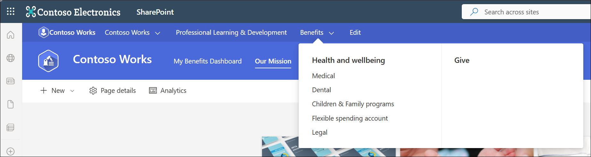

# Planning navigation for the modern SharePoint experience

The fundamental principles and practices for site and page navigation apply to classic and modern SharePoint architectures. However, your options for *implementing* navigation differs based on the framework for your sites and intranet. For example, the default navigation experiences available in classic SharePoint site hierarchies - sites with subsites - are not available in the modern experience. Instead, [hubs](https://support.office.com/article/fe26ae84-14b7-45b6-a6d1-948b3966427f) provide a great way to achieve the cross-site navigation features previously available in managed navigation and site hierarchies in classic SharePoint.

No matter which framework you are using, you can use the guidance in this document to help you create the right navigation for your organization.

This planning guide primarily addresses *site* navigation: the top (communication site and hubs) and left (team site) navigation experiences.

*"When we're observing customers carrying out tasks on websites we notice certain common patterns. For example, we find that when people arrive at a particular site they start by **navigating about 70% of the time**. When people get stuck navigating they may resort to using site search."* -- Gerry McGovern, 31 January 2016

## Why navigation is important

The most effective SharePoint sites help viewers find what they need quickly so that they can use the information they to make decisions, learn about what is going on, access the tools they need, or engage with colleagues to help solve a problem.

Even when search is available, [most viewers start their web experiences by browsing](http://gerrymcgovern.com/search-and-navigation-interconnections/). That pattern persists on internal web sites as well. Good navigation experiences present viewers with a complete picture of what is available on the site and, combined with the home page, provide a comprehensive "story" for the site.

Page navigation and site navigation display differently. The links that you see in site navigation are static on every page in the site. The navigation links on individual pages are accessed only when the viewer lands on the page. A benefit to on-page links is that they can be different from page to page. Both types of navigational links guide your viewers by providing wayfinding experiences. The key advantage of site navigation links is that they are always visible in the context of the site. Because site navigation links are persistent, they provide an opportunity to provide significant value for site viewers as they traverse the site and address their goals: to find and do what they came for. Hub navigation links extend this wayfinding experience to other sites in the hub “family.” This supports navigating to related content not just on the site, but on related sites as well.

## Navigation Fundamentals

Planning site navigation involves thinking about:

-   Organizing and labeling

-   Usability and findability

Navigation should always be planned from the perspective of the *user* of information – the viewers to your site. Planning effective navigation involves considering not just the information you want to *present*, but also thinking about the information your viewers want or need to *consume*. Therefore, organizing and labeling your navigation links is critical for the purposes of usability and findability. If 70% of viewers come to your sites expecting to *browse* for information, the usability of your site depends on creating a great browsing experience.

### Organizing

There is no one right way to organize your navigation links. You will make different choices based on the type of site you are creating and your viewers. Organizing concepts might include:

-   Services

-   Products

-   Activities

-   Audiences (if your viewers can clearly identify the audience to which they belong – such as student or teacher)

-   Expertise areas or functions

The default navigation for all SharePoint sites primarily includes *type* of content. For [**communication sites**](https://support.office.com/article/94A33429-E580-45C3-A090-5512A8070732), the default navigation includes Documents, Pages, and Site Contents. These categories are helpful as you are building your site, but they are not typically going to add value to your viewers once your site is ready to launch. This is because the consumer of a communication site typically doesn't care about the *type* of content – they care about the *purpose* or *subject* of the content. For communication sites, plan to delete the "out of the box" navigation when you are ready to launch and replace it with something that aligns with the guidance provided in the local navigation section of this guide.

The default navigation for [**team sites**](https://support.office.com/article/75545757-36c3-46a7-beed-0aaa74f0401e) includes links to the related services provided by Microsoft 365 for modern teams – including a link to the shared team notebook and the conversations for the team in Outlook. These represent the typical features that teams need to effectively collaborate, and might be hard for people to find without the experience provided by the navigation. You may choose to supplement or refine these links for your team sites, but you will also likely find that the default navigation experience is a good starting point. You may be more likely to keep most of these links than you would with a communication site.

### Labeling

The words you use for navigation matter – not just because the real estate for navigation is limited – but also because your labels are what guide your viewers to the content. Each label makes a promise: if you select this link, you should get the information you expect to find.

To ensure that your labels keep their promises, make sure they are:

-   **Specific**. Tell the viewer exactly what they will find when they select the link. If the target for your link includes Policies and Procedures, make sure the label includes both terms.

-   **Comprehensive**. Describe content with your collection of labels. You should not plan to link to every single page or document in your navigation, but your navigation should provide a complete picture of the content on your site.

-   **Concise**. Keep your labels short and to the point.

-   **Familiar**. Don't make up terms in your labels. Keep your viewers in mind – if you use an unfamiliar term, your viewers will be confused and unable to find what they need.

-   **Front-loaded**. Make sure that your labels are "scannable." For example, *Company Information* is better than *Information About our Company*.

-   **Clear**. As much as possible, you want your navigation labels to be mutually exclusive – at least for the major categories. It is perfectly fine to have a sub-link display in multiple categories – especially if viewers might expect to find it in more than one place – but the major categories need to be easily distinguished from one another.

-   **Targeted**. It’s not a good idea to show people links to private sites that they don’t have access to. Where appropriate, use the [audience targeting](https://support.office.com/article/68113d1b-be99-4d4c-a61c-73b087f48a81) features for SharePoint to target navigation links to viewers for whom the link will work. Note that there are exceptions to this guideline. For example, you may want to use your navigation to help people discover sites that they may not have access to today but could be approved to join. If you do provide links in navigation to private sites, be sure that the owner of the site knows that they may be getting a lot of access requests!

Many sites use labels that tend to break promises – and you should try to avoid them if you can. Think twice before you use these labels:

-   **Quick Links, or Useful Links**. Are the other links slow or *not* useful? Do you really mean "Frequently Needed"?

-   **Frequently Asked Questions**. If you need a label for FAQs, it could be that your content doesn't address the questions that your viewers want to know. Before you craft a long list of FAQs, think about whether your *content* addresses the key needs of your viewers and if not, consider rewriting your content or breaking it up into pages to make individual topics more discoverable.

-   **Documents**. On team sites, a navigation link to your document library might be appropriate – especially if you only have one library. On communication sites, links to Documents or Manuals are rarely helpful because most of the time, your site viewers don't care about the *format* of the content - they care about the *subject* or *topic* of the content. Topic or subject is a far better navigational principle than type of content – so it’s better to have a link to a specific topic page where you use web parts to dynamically pull in content of *any* type that is related to that topic. An example of a web part that is useful in this scenario is the [Highlighted Content web part](https://support.office.com/article/e34199b0-ff1a-47fb-8f4d-dbcaed329efd), which lets you pull in documents based on properties of the content.

### Usability and findability

The key goal when we plan navigation is to make our sites useable and our content findable. The best way to ensure that your navigation meets these goals is to test it. There are several cost-effective approaches that you can use to ensure that your navigation design is effective, including:

-   Card Sorting - primarily helpful for planning navigation.

-   Tree Testing - helpful for testing suggested navigation paths.

-   Usability Testing - task-based scenarios that are helpful for comprehensive testing of site and page navigation.

These two resources provide an overview of techniques and tools for testing the usability and findability of your navigational strategy:

-   [Usability Analysis](https://www.nngroup.com/articles/better-usability-tasks)

-   [Overview of Testing Approaches](https://www.nngroup.com/articles/quantitative-user-research-methods)

### Link targets

Many usability guidelines recommend [limiting the number of new windows that are automatically opened for site viewers](https://www.w3.org/TR/WCAG20-TECHS/G200.html). Most of the time, opening a link in the same window allows site viewers to use the back button when they want to return to your site. When a viewer wants to open a link in a new window, the guidelines recommend that the viewer be allowed to *choose* this outcome by "right clicking" the link. An exception to this guideline is the recommendation to always open *documents* in a new window to prevent users from accidentally closing the browser window when they close the document.

By default, navigation links on modern SharePoint sites open as follows:

-   **Link points to a page or site in the same tenant** (same site or another site): Links open in the same tab.

-   **Link points to a document (same site or different site)**: Links open in a new tab.

-   **Link points to an external (internet) site or document**: Links open in a new tab.

In classic SharePoint sites with publishing features, you can choose to open navigation links in a new window. This allows you to consider the context for your site viewers and determine whether it might be helpful to open a link in a new window. There is no way to select how navigation links open in modern SharePoint sites. This means that your navigation links will follow the default guidelines, but you still need to be especially careful about the *labels* for navigation links to make sure that your viewers know that they are leaving the site when they select the link. Make sure that the navigation label accurately describes the destination – a place on a completely different site or an application – and if you know that the back button may not work, consider using an alternative way to present the link, such as the text web part where you can elect to open a link in a new window.

At the current time, only the [Text web part](https://support.office.com/article/using-web-parts-on-sharepoint-pages-336e8e92-3e2d-4298-ae01-d404bbe751e0) lets you create a hyperlink and choose how the link opens. When you add a hyperlink to text, you have the option to choose to open the link in a new tab.

## Navigation menus in SharePoint

### Menu styles

There are two types of navigation menu styles for SharePoint sites - cascading and mega menu. Team sites only support the cascading menu style but communication sites support both mega menus and cascading menus. Hubs, whether they are team sites or communication sites, add an additional mega menu to the site. Mega menus are not available in on premises sites. Learn about [how to customize the navigation on your SharePoint site](https://support.office.com/article/customize-the-navigation-on-your-sharepoint-site-3cd61ae7-a9ed-4e1e-bf6d-4655f0bf25ca).

### Menu links

There are two types of navigation links: a label and a link. A label is simply a category link – it lets you group related links but is not a link itself. A link requires a hyperlink and presents a “clickable” experience for the user. A label should always have at least one link below.

Both cascading and mega menus support up to three levels of navigation in your menu. The first level represents the tabs you see across the top. The second level is the next level below the tab and the third level is indented or below the second level. Mega menus work best when you are using all three levels of navigation experiences. If you use a mega menu, the second level of links will appear in **bold**. If you only need two levels in your menu, consider using the cascading style.

### Menu experiences

There are two types navigation experiences – targeted and not targeted. With targeted navigation, you can choose who sees navigation links to create more personal navigation experiences. With non-targeted links, all users see the link, even if they don’t have access to the target location. Learn about how to [target navigation links in menus](https://support.microsoft.com/office/target-navigation-news-and-files-to-specific-audiences-33d84cb6-14ed-4e53-a426-74c38ea32293).

### Menu symbols

All types of menu links support some decoration with emojis. Emojis can be used at the beginning or end of a link label to add some visual interest to your links. 

Choose an emoji that relates to the label topic. You can search for emojis at [emojipedia.org](https://emojipedia.org/), or use the Windows key plus a period (.). Copy the emoji and add it to the label when you are editing your navigation.

### Navigation best practices

#### Link to pages, not individual documents

Document links open in a new window, which is helpful if someone wants to close the document after reading, but document links take viewers to a new context. In some cases, this may be the experience you want. But when navigation points to a page with an embedded document instead of directly to a document, you have an opportunity to provide *context* for the document and retain the navigational context for the site. Think about the following alternatives if you want to use a navigation link to open to a single document:

- Can you re-create the document content as a page instead of a document? Pages are easier to read online and provide opportunities to create rich, dynamic experiences for your viewers. Modern pages are easier to read on mobile devices. Documents are great when viewers need to download or print – but when all they need to do is read, a short, well-crafted page is a better way to present and maintain information.

- Embed the document or a link to the document on a page. When a visitor clicks the link to a page, the site navigation remains visible. The page allows you to provide context for the document and it also keeps the viewer in the context of your site.

#### Practice progressive disclosure

Navigation should answer the question, "What can I do on this site or from this location?" But, limited real estate on the navigation bar or quick launch means you need to apply the principle of [progressive disclosure](https://www.nngroup.com/articles/progressive-disclosure/). This approach suggests that you group your content into logical categories and provide a limited set of choices for your viewers to allow them to explore each content category to learn more. 

Progressive disclosure applies to all types of navigation and not just top or site navigation. It also applies to page content. You don't need to have a link to every bit of content on your site or in your portal in the navigation – but your viewers should be able to get a sense of the entire site by exploring your navigation options. Great navigation experiences help viewers understand:

- Where am I?
- What can I do here?
- Where can I go next?

Plan to optimize the navigation experiences for your viewers by combining navigation and page links to answer these three questions.

## Navigation in the flat world

There are three types of navigation to think about for modern SharePoint experiences:

-   Global navigation for the entire collection of sites that comprise your intranet.

-   Hub or "family" navigation for groups of related sites.

-   Local navigation on an individual site.

To learn how to make navigation changes to sites and hubs, see [Customize the navigation on your SharePoint site](https://support.office.com/article/customize-the-navigation-on-your-sharepoint-site-3cd61ae7-a9ed-4e1e-bf6d-4655f0bf25ca?ui=en-US&rs=en-001&ad=US).

### Local navigation

Local navigation is the static navigation that viewers see on every page of your site. For team sites, local navigation shows up on the left side of the page in the area referred to as the "quick launch". For communication sites, local navigation shows up at the top of the page.

Local navigation is on every page in your site – so make sure it is relevant. Think about how viewers might explore your content and use local navigation to support that exploration. For example, a travel site might have the following local navigation links that support viewers who are exploring the travel site from the perspective of "what am I allowed to do?" as well as viewers who are exploring the travel site from the perspective of the travel process – before, during, and after their trip.

    -   Travel Guidelines

        -   Air

        -   Car

        -   Ground Transportation

        -   Hotel

        -   Train

    -   Before You Go

        -   Travel Approval

        -   Booking Service

    -   During Your Trip

        -   Travel Safety

        -   Itinerary Changes

    -   After You Return

        -   Expense Reporting

        -   Trip Reports

### Hub navigation

The default navigation experiences available in classic SharePoint site hierarchies (sites with subsites) are not available in the "flat" world of modern SharePoint, where each unit of work or project or team gets its own site collection. Flat architectures are great for governance but can make it harder to *implement* navigation that connects multiple sites.

[Hubs](https://support.office.com/article/fe26ae84-14b7-45b6-a6d1-948b3966427f) provide a great way to achieve the cross-site navigation features previously available in managed navigation and site hierarchies in classic SharePoint. One of the important [planning decisions for hubs](planning-hub-sites.md) is planning the hub navigation.

Hub navigation appears above the local navigation on each site, just below the suite bar, as shown in the image earlier in this article. Hub navigation is established in the site that is declared to be the hub. It is defined by the hub owner and is shared by all the associated sites.

There are three special considerations for planning hub navigation:

1.  A site can be in the hub navigation *and* be associated to the hub.

2.  A site can be associated to a hub and *not* be in the hub navigation.

3.  A site can be in the hub navigation and *not associated to the hub.*

**Scenario 1: Site is in the hub navigation and associated to the hub**

Showcasing sites associated to the hub allows viewers to discover the sites within the hub family and easily navigate among and across the “family members.” Adding an associated site to the hub navigation displays the organizational framework for the collection of sites in the hub navigation. All sites in the hub share a common theme and navigation helps to establish the identity of the hub family both visually and via viewer interaction. Your hub links can go to sites or content pages or a combination of both – but use the practices described for link labeling to ensure that you are providing clear and consistent experiences.

When you choose to show all associated sites (and associate *hubs*) in the hub navigation, think about whether all the people who have access to the hub will *also* have access to each of the sites associated to the hub. For example, if you add links to private sites in the navigation, you are increasing their "discoverability," which can be a good thing – if the site owners for those private sites are prepared to get access requests. However, you may not *want* to show restricted sites in the navigation if the site owner does not want the site or the content to be discovered. To ensure that your hub navigation links keep their promises, consider the following options:

-   For links that should not be discoverable to all viewers, [target the link](https://support.microsoft.com/office/target-navigation-news-and-files-to-specific-audiences-33d84cb6-14ed-4e53-a426-74c38ea32293) so that it only shows up for audiences who have access to the content.

-   For "discoverable" but restricted links, consider adding the word restricted, or request access, or private to the label. Have a conversation with those site owners to make sure that they are prepared for potentially more frequent access requests. In addition, you could consider adding the “lock” emoji to your private or restricted sites.

**Scenario 2: Site is associated to the hub and *not* shown in the hub navigation**

If the use case for your hub is primarily about sharing a common theme or for rolling up content for people who are members of private sites, you may want to associate a site to a hub but *not* showcase the site in the shared hub navigation. One reason that this might be OK is that the members of the private sites already know about the sites and don't *need* the hub to provide links to the site. However, these same site members would find it useful to see the news and activity rolled up from their private sites on the hub (via the Highlighted Content and News web parts).

Another reason not to show associated sites is that the owners of one or more private sites do not want the sites to be discovered in the hub navigation or they are not prepared to manage unexpected access requests.

**Scenario 3: Site is added to hub navigation but not associated to the hub**

One of the nice features of hub navigation is that it allows you to plan a shared navigation experience for all the sites associated to the hub – including links to frequently needed sites that are *not* part of the hub.

If a site is associated to a hub, it is reflected in the hub navigation. You may not want all sites that are related to the hub "family" to be associated to the hub. For example, consider a scenario when you are collaborating with external partners on a team site. You may not want to associate external sites to your hub because you may not want to display the shared navigation for the hub to external partners. But, you may want to add links to the external sites to the hub navigation to make it easier for internal viewers to discover these related external sites. This presents a convenient way to showcase links to all the external sites managed by the business group without having to worry about exposing navigation links to external viewers. When internal viewers navigate to the external sites, they will no longer see the hub context and theme – but this is the desired outcome.

A site can only be associated to one hub. However, you can increase discovery by adding navigational links to other hubs or other sites in your hub navigation.

### Global navigation

Many intranets include top navigation that persists on every site. Global navigation allows you to create an overall navigation story for your intranet that visually connects all the sites, content, and tools your viewers need to get work done. Every organization has a different requirement for what goes in global navigation, but some of the category labels often used include concepts such as:

-   Home

-   About Us

-   News

-   Working Here/Work Resources/Administrative Services/Administration

-   Operations/Operations Services

-   Pay & Benefits

-   Life & Career

-   Locations

-   Policies & Procedures/Tools & Resources/Safety & Security

The goal of global navigation is to support browsing to content, but since there is limited real estate available for global navigation links, global links generally point to major category navigation pages, sub-links, or a mega menu experience to provide enough "information scent" to help viewers navigate their way to the content they need. Because the context for global navigation must be broad, it is challenging to make the labels both comprehensive and useful. If you plan to implement global navigation, consider using one of the testing methods discussed earlier to make sure that your proposed navigation resonates with users.

Global navigation is not yet available for modern SharePoint intranets. Until it is available, there are several ways to create a global navigation *experience* for your modern SharePoint intranet:

-   Create a custom [SharePoint Framework Extension](/sharepoint/dev/spfx/sharepoint-framework-overview) to deliver and apply global navigation to each new site as it is created.

-   Create a "navigation" site (for example, your intranet "home" site) and use the logo in the suite bar and a Featured Site link on the SharePoint start page to make it easy for people to navigate to the "home" site from every destination site in your tenant.

-   Use a single hub for the entire organization. This might be a reasonable strategy for a small organization, but the benefits of hubs decrease in value if you only have one so this may not work for the long term.

-   Use a single hub for the entire organization. This might be a reasonable short-term strategy for a small organization, but the benefits of hubs decrease in value if you only have one so this is not a viable solution in most cases.

-   Wait to add global navigation until it is available natively in the product.

## Managing navigation expectations

Navigation enhances the story of your digital workplace by making it easy for users to browse the content they need. On the *internet*, we expect to have to search for the content we need. Yet on the *intranet*, viewers *expect* a navigation experience that is carefully curated to help them understand and find the content they need.

Curating a navigation experience for intranets and digital workplaces comprised of even just a few hundred sites can be a daunting task – especially your goal (or the goal assigned to you) is to make sure that all content is findable in "three clicks." Contrary to popular belief, your viewers will not leave your site or give up if they are unable to find what they are looking for in three clicks! More or fewer clicks do not make viewers happier or perceive that the site is faster. What really matters in navigation experiences is "information scent" – whether the label for the link provides an adequate clue about where the "click" will go. It is the *quality* of the label and whether the label fulfills its promise that has the highest impact on usability. Viewers are willing to click to find information if they are confident that with each click, they are headed in the right direction – closer to their goal.

"Information scent" on SharePoint sites can be achieved with **clear, mutually exclusive labels** for links and labels lists and libraries that clearly tell viewers what they will find. You can improve your navigation by spending time testing to make sure that the navigation labels resonate with your viewers and following the guidance for labels recommended in this document. Your navigation outcomes will be most successful if you take the time to understand your viewers, their key "tasks and asks," and design navigation experiences that keep their promises.

**Principal author: Susan Hanley, MVP LinkedIn: [http://www.linkedin.com/in/susanhanley](http://www.linkedin.com/in/susanhanley) Website: [www.susanhanley.com](http://www.susanhanley.com) Blog: [http://www.computerworld.com/blog/essential-sharepoint](http://www.computerworld.com/blog/essential-sharepoint)**
