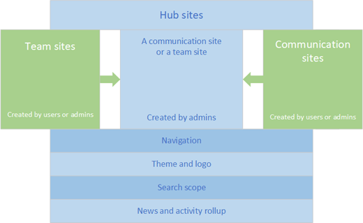

# Planning your SharePoint hub sites

[Hub sites](https://support.office.com/article/fe26ae84-14b7-45b6-a6d1-948b3966427f) help you organize your intranet. Getting the most value from hub sites requires some up-front planning. Read on to find out more about hub sites and how you can plan for them. 
  
## Setting the stage

SharePoint hub sites provide an important building block for your intranet. They are the "connective tissue" you use when organizing families of team sites and communication sites together.
  
One of the key principles of modern intranets based on SharePoint is that each unit of work should get a separate site collection to optimally manage governance and growth over time. Each communication site and Office 365 group-connected team site is created as a site collection that can have its own permissions. A hub site (most commonly created from a communication site) should also be considered its own unit of work that brings together numerous other sites.
  
In the past, many organizations used subsites to create connective tissue for their intranets, using the site collection's shared navigation to connect sites and the hierarchical structure of subsite relationships to nest sites within sites. However, subsites don't give any room for flexibility and change. Since subsites are a physical construct reflected in the URL for content, if you reorganize your business relationships, you will break all the intranet relationships in your content. Subsites can also create challenges when it comes to governance because many features (including policy features like retention and classification) in SharePoint apply to all sites within the site collection, whether you want them to or not. This means that you must frequently enable a feature for the entire site collection, even if it's only applicable to one subsite.
  
What is the one thing that we can guarantee is going to happen in every business? Change! As our organization evolves, you need intranets that make it easy to align experiences with the way you work and that can adapt to the inevitable changes in the way you work. This is a key benefit provided by SharePoint hub sites; they model relationships as links, rather than hierarchy or ownership, so that you can adapt to the changes in the way you work in a dynamic, changing world.
  

  
## Getting started

Before you start making hubs sites, let's recap the three things hub sites give you:
  
- Shared navigation and brand
    
- Roll-up of content and search
    
- A home destination for the hub
    
Now let's think about the information you're trying to share throughout your intranet, and consider the business outcomes you're trying to enable.
  
An intranet can play many roles in an organization. It's an internally facing site, a place to communicate important news, and a collaboration platform. It's also a way to showcase your corporate culture. It can be the foundation of your digital workplace. An intranet lets you tell stories and share information. Empowering employees with a voice on your intranet can provide a way to move to a culture of collaboration that enables your organization to transform and adapt to change.
  
Many successful intranets include the following elements:
  
- **Communication**: For example, a home page that includes news from around the organization to keep employees informed, overall navigation, links to key tools and information, internal marketing promotions, and a place to engage employees around important topics. 
    
- **Content**: A place for the functional parts of the organization, such as Human Resources (HR), Legal, and Information Technology (IT), to offer their services to the rest of the company. For example, the HR part of the intranet could be where employees can find out how many vacation days they have left, whether the company benefits program offers vision or dental coverage, or what training is available for individual roles. The Legal area might be where employees can find a sample Non-Disclosure Agreement they can execute prior to having a conversation with a prospective vendor. 
    
- **Actions and activities**: Links to the time-tracking system or the expense report form and a place where managers can approve expenses or timesheets. 
    
- **Collaboration**: Places where teams can get work done and where role or topic-based communities can share knowledge and leverage expertise across the organization and with external partners in the extended enterprise. 
    
- **Culture**: Stories and places that allow employees to engage or learn, including profiles, communities and clubs, and even images and branding that reflect the organizational structure. Sometimes even the intranet name embodies the culture. For example, an electric utility has an intranet called "The Grid" with messaging and promotions to make sure that "no one works off The Grid." 
    
- **Mobility**: The ability for employees to get work done from any device while they're on the go. 
    
- **Search**: The ability for employees to find content even if they don't know where it lives. 
    
The emphasis for each of these elements can vary based on organizational priorities and to some extent, the digital maturity of the organization. Office 365 provides three main building blocks to help you create your intranet in a way that allows you to configure experiences that align with your business, your employees, and your readiness. Different organizations will use the building blocks in different ways, but the building blocks themselves reflect common patterns that organizations use to get work done:
  
- Team sites (collaboration)
    
- Communication sites (communication)
    
- Hub sites (connection)
    

  
At their core, the three types of building blocks share a common structure. For example, they share the same set of internal web parts. However, there are some fundamental differences in intent, usage expectations, governance (including how they are created), and how and which web parts you might use on each type of site.
  
|||||
|:-----|:-----|:-----|:-----|
||**Team site**   |**Communication site**   |**Hub site**   |
|**Primary business objective**   |**Collaborate**   When you want to create a place where the members of a work group or project team can work together on project deliverables, plan an event, track status, or exchange ideas, you want a team site. Team sites are connected by default to an Office 365 group to deliver a full range of communication and collaboration tools, including Microsoft Teams and Planner.    |**Communicate**   When you want to broadcast a message, tell a story, share content for viewing (but not editing), or showcase services or people, you want a communication site. Communication site owners often want to include an engagement component - for example an "Ask Business Development" area on a site communicating information about business development. This is a great place to connect a Yammer group.    |**Connect**   When you want to create a shared experience for a family of related sites—to discover related content by rolling up site activity and news, organize related sites so that they share a common navigation, and apply a common look and feel.    |
|**Content authors**   |**All members are content authors** who jointly create and edit content.    |**Small number of content authors** and a much larger number of content readers or consumers.    |**Hub site owner** defines the shared experiences for hub navigation and theme. **Hub site members** create content on the hub site as with any other SharePoint site. Owners and members of the sites associated with the parent hub create content on individual sites.    |
|**Governance**   (as allowed for your organization based on the settings in the Security &amp; Compliance center)    |Norms typically **determined by the team**. Practices are aligned in the best way to get work done.    |Policies often **determined by the organization** to ensure consistency of experience and effective management of organizational information.    |Governance **determined by each owner of the associated site based on the type of site and organizational policies**. The best experience for visitors is achieved when everyone has at least read permissions for associated sites (but this is not required).    |
|**Permissions**   |Office 365 group, plus SharePoint groups and permission levels    |SharePoint group    |Same as original site type. Hub sites do not alter an associated site's permissions.    |
|**Created by**   |**Site owner** (unless this has been disabled in your organization) or **admin**.    |**Site owner** (unless this has been disabled in your organization)    |**Global admin** or **SharePoint admin** in Office 365    |
|**Examples**   | Project team working together to complete deliverables and manage tasks     Holiday party planning committee planning the annual get-together     HR performance management team     Executive committee—different leadership groups within the organization     Extranet site to work with Partner A    | Travel team publishing guidelines about corporate travel     Policies and procedures     Micro-site for a new corporate initiative     Resources for the sales team for a product or service    | HR hub that provides a connection and roll up for all HR functions, such as benefits, compensation, performance management, talent acquisition, and a manager portal     Sales hub providing enterprise resources for the Sales organization and connecting regional sales team and communication sites     Location-specific hub that groups the communication and team sites for a specific location (the New York office)    |
   
## What should be a hub site?

Hub sites complement the search experience by helping you discover information in context.
  
One of the biggest challenges with intranet design is figuring out how the intranet navigation should be organized. In the new world where all team and communication sites are peer site collections, information architects must think about creating experiences that will allow intranet users to find what they need in multiple "find" scenarios:
  
- I know it exists, and I know where it is
    
- I know it exists, but I don't know where it is
    
- I don't know if it exists
    
These scenarios are enabled with a combination of navigation, search, and discovery (or serendipity) and should be a factor in how you design and organize your hub sites. One of the important capabilities that hub sites enable is the serendipitous discovery of information because they can surface contextually relevant content from sites you may not follow but are associated with the hub. The SharePoint start page was built to support discovery and search across the entire organization's content, but if you already have a particular context in mind, hub sites can be very helpful in narrowing those experiences down to a handful of related sites.
  
As a starting point in your hub planning, think about hub sites for key functions that your users need to get work done—for example: HR, Finance, Communications or Public Relations, Legal, and IT. These functions may be represented in different organizational departments or business units in large organizations or combined into the role of a few people in smaller organizations.
  
Let's take HR as an example. HR often encompasses the following sub-functions:
  
- Benefits
    
- Pay and compensation
    
- Talent acquisition or recruiting
    
- Performance management
    
- Professional development or training
    
- Manager portal
    
Using the guiding principle of creating a site for each unit of work, you can think about an HR family of sites that could include 6 functional sites for each of these functions plus an HR home that connects the related sites to provide an overall HR experience. This is another way to think about the value of hub sites: they allow you to create an experience that improves information discovery for a specific context (in our example, for employees looking for HR information).
  

  
In the classic intranet model, you might have created an HR site and used subsites to support each HR function. In the new flat world of modern SharePoint sites, the HR family is connected using the HR hub to provide that connective tissue for navigation within the family and to provide an opportunity to serendipitously discover content on a related member of the family when users navigate to the HR home. For example, if you're on the HR hub reading a news announcement about open enrollment because you're in the process of onboarding a new employee, you might be happy to know that a new version of the "Welcome to the Company" onboarding toolkit was just released on the Talent Acquisition site. Likewise, if you're trying to find the HR team's office sharing policy, you'll appreciate being able to limit your search to only the HR-affiliated sites, rather than the entire company.
  
You don't have to have a hub site for every function. However, when a function provides multiple logically different services (as in the HR example), it's a good practice to create a hub site to provide a single starting place for your users. Often, intranet users start their exploration with browsing. Hub sites help combine the benefits of browsing ("I know this is an HR topic") with the benefits of a more narrowly scoped search ("I want to find information about vision benefits, not the company's strategic vision."). Even if the users don't know which sub-function provides a service, they can navigate to the HR hub and then, using the search scope provided by the hub, search (or navigate) within the HR hub to quickly find what they need.
  
Some organizational functions have an enterprise-wide scope but a regional or product execution. For example, think about a Sales department that may have sites for sales regions and sites for location-based offices. This type of function has always presented a challenge to hierarchical intranet content organization using subsites. Do we make the Southeast Sales site a subsite of the Southeast Region site or the Sales site? And, what happens when a state within the southeast region moves; for example, from the southeast region to the northeast region? This type of dynamic organizational movement creates a nightmare for intranet organization if you use subsites, but not with hub sites. Picking a hub may create some angst because an individual site can be associated with only one hub, but keep in mind that news, activity, and highlighted content is based on search, so it's possible to have content from one site appear on multiple hub home pages. A hub will default to only showing content from its own associated sites, but it's easy to configure it to include other related sites as well, even if those sites are associated with different hubs.
  
> [!NOTE]
> Your organization is limited to 2,000 hub sites. You may not need a hub site for every function and it's important to do some planning before you create hubs. 
  
There is no "one size fits all" way to determine how to align sites to a hub in this scenario. Always start by answering these questions:
  
- Who is your audience and what do they need to accomplish?
    
- How do the people who need the information get their work done?
    
Align your hub to create experiences that enable the user first. You may want to think about how people in each work group think about the work they do by aligning regional sites with the  *function*  , since sales content for the northeast is more likely to be organized similarly to sales content for the southeast than it will be for the southeast regional office. But this is very much an "it depends" situation. In some organizations, it will make much more sense to organize all functions around a regional hub than a functional hub. 
With hub sites multi-geo capabilities, you can create a better user experience associating Austria Sales with the Austria hub and not the global Sales hub. In this type of scenario, you can use a link on the Austria sales site to connect it to the global Sales hub and add each regional sales site to the Hub navigation for global sales. 
  
> [!NOTE]
> A site can only associate with a hub family. However, hub families can be connected to one another using links either on the page or in hub navigation. 
  
A good practice is to start with a consistent approach for all functions that have a pattern, such as Sales. If you align region-specific functions to the regional hub, do that for all functions. Either approach is valid, but from a usability perspective, it helps to be consistent.
  
## How should I organize my hub site?

Hub sites provide two primary organizational experiences that you should think about as part of the hub planning process. Though creating a hub site must be done by the global or SharePoint admin in Office 365, planning, managing and organizing the hub site is the responsibility of the hub site owner. The organizing concepts for hubs are:
  
- Association
    
- Navigation
    
### Association

A site becomes part of a hub family by [Associating a SharePoint site with a hub site](https://support.office.com/article/ae0009fd-af04-4d3d-917d-88edb43efc05). When creating a hub site, SharePoint admins should [allow only certain site owners to associate sites with the hub](create-hub-site.md).
  
After a SharePoint admin gives a site owner permission to associate their sites with a hub site, the site owner can then choose to associate the sites with the hub. When they do, the site inherits the hub site theme and shared navigation. Content from their site will roll up to the hub site, and the site will be included in the hub site search scope.
  
Associating with the hub does not automatically add the site to the hub navigation. Hub site owners determine which sites are included in the navigation. They can also configure the News, Sites, and Highlighted content to roll up activity from all associated sites or only selected sites.
  
> [!NOTE]
> Association with a hub does not change the permissions on a site. If you associate a site that has restricted access with a hub, only users who have access to the restricted site will see content rolled up on the hub. Information surfaced on the hub site is security trimmed: if you don't have access to the content, you won't see it. Something you may want to consider is adjusting permissions on the associated sites after you have assembled your hub family. 
  
### Navigation

The hub site owner determines which sites are reflected in the shared navigation, and can also include links to other resources. This navigation appears at the top, below the suite bar. Most of the time, you will want to add associated sites to your hub navigation. That's one of the benefits of the experiences that you can enable with a hub. Your hub navigation can have up to three levels, which affords a lot of opportunity to organize your hub family in a way that helps users discover and find relevant content.
  
However, you may not want to add every associated site to your navigation and you may want to consider adding sites that aren't associated to the navigation. Consider the following as you plan your hub navigation.
  
- **Do you want to add private or restricted access sites to the navigation?** Maybe. For example, HR may want to associate their private team site with the HR hub to make it more convenient for HR team members. But, the HR hub owner may not want to add the private HR team site to the shared navigation for the HR hub because this would make the private HR site more discoverable by everyone in the organization, who will get an access challenge when they click the link to the HR team site. Unless the owner of the HR team site wants to spend a lot of time denying access requests, it might be a good idea to leave the private team site off the navigation for the HR hub. On the other hand, there may be a site that is "semi-private" that you want interested people to discover. For example, you might have a community that wants to restrict membership to people with a specific expertise, but also wants to discover experts across the organization. In this scenario, users might get an access denied/request access message, but the site owner is prepared and wants to grant access to interested people. 
    
    > [!TIP]
    > If you add links to private sites in your hub navigation, add (restricted) or (private) or (external) to the link name to help users understand that they may not have access to the navigation link. 
  
- **Do you want to add sites that are not associated with the hub to the navigation?** Maybe. Since an individual site can only be associated with one hub, adding sites that aren't associated with your hub helps provide a way to connect your hub to related sites. For example, if you choose to associate functions within a region with a regional hub instead of the global function hub, you could add navigation links from the function hub to each of the region sites. For example, if you have a function hub for HR, you could add the regional HR sites (Northeast HR, Southeast HR, and so on) to the navigation of the HR hub to create a comprehensive HR experience. Note that when you do this, the news and activity in the regional HR sites will not show up on the HR hub (but they will show up on the regional hub). And, when you navigate from the HR hub to the regional HR site, you will be on a site that has the regional hub navigation and theme, not the HR navigation and theme. There is nothing inherently wrong or bad about this scenario, but you should be aware of the implications when you plan your hub navigation experiences 
    
    > [!TIP]
    > Don't associate extranet sites with the hub if you don't want extranet users to see the shared navigation. Consider just adding the external sites to the hub navigation so that internal users have quick access to relevant extranet sites. 
  
## Can I make just one hub site for my whole organization?

There is no requirement to have more than one hub for your organization, but you should think about what this means for both organization and information discovery. It might be a way to get started, but it will probably not be where you end up.
  
One thing that you will miss out on if you have only one hub is the ability to easily surface related information in context. For example, if you have a single enterprise hub, it will be harder to surface just HR-related news on the HR site. Even small organizations may find that restricting the context in which users find information is helpful in managing information overload.
  
If you want to get started with a single organizational hub and you also want to be able to provide context for the information users see, you can do it, but it will require a publishing "contract" with content authors. Here are a few ways to achieve that outcome with a single hub:
  
- **Naming conventions**: Add a prefix to news article titles and use a [Highlighted content web part](https://support.office.com/article/E34199B0-FF1A-47FB-8F4D-DBCAED329EFD) to roll up news that, for example, starts with HR on the HR site and Sales on the Sales site or to group news on the hub site. 
    
- **Page metadata**: Map [a custom property to a managed property](manage-search-schema.md) and apply it to pages. Use your custom page metadata in a Highlighted Content web part on a page on any site. This approach gives you increased flexibility in information presentation. 
    
You can probably see that these approaches might be easier to implement with a small publishing group and much harder if content publishing is distributed across the organization. If your organization, like many, has or is driving towards a distributed publishing model, you will want to think about the implications, training, and publishing "contracts" you will need to implement if you start with a single organizational hub.
  
## Know how your audience will consume SharePoint hub sites

Your audience might consume SharePoint hub sites via the SharePoint start page in Office 365—both the sites themselves and how news flows from the hub to the start page. Also, consider SharePoint mobile apps, which could be used to access the hub home page, news, and navigation to associated sites. Consider the value of mobile app notifications. Encourage your users to stay connected on the go with the [SharePoint mobile app](https://products.office.com/SharePoint/mobile-app?wt.mc_id=AID638358_QSG_175660). Make sure that you consider operating systems, screen sizes, resolution, and form factors. All modern sites, pages, news, and lists should work well across all of these, and some will reflow as people consume content on small devices.
  
## Additional important considerations

- **Finding hubs if you have more than one**. Hub sites are an important building block for your intranet. But for most organizations, hub sites are not going to provide the type of global navigation that intranet designers want. Here are some ways you can make your hub sites discoverable: 
    
  - **On the SharePoint start page**. Pin your hub sites to the Featured links area of the SharePoint start page. Encourage all users to "follow" hub sites. 
    
  - **On the SharePoint mobile app**. Hub sites can also be found on the SharePoint mobile app and are even more discoverable if users follow hub sites. 
    
  - **From the organization portal**. If you have an existing organizational intranet or portal, you can link to your hub sites in your existing navigation. 
    
  - **On each hub site**. Consider adding a link to your organizational portal home page on each hub site. Add the link to the organization portal ("home home") to the far right in your hub navigation to keep the primary focus of your hub site on the hub site context. 
    
- **Reaching the right audience for news**. Hub sites help you bring news to the right people at the right time and in the right context. News doesn't flow down to associated sites, just up from the associated site to the hub. If you want the broadest reach for your news, publish it to the hub site. To make hub news more visible, you may want to have two news web parts on your home page: one for new published on the hub home and another that includes news rolled up from associated sites (all or just selected sites). 
    
- **Hub naming conventions**. Think about naming conventions for hub sites to make them more discoverable. Some options include names such as HR Central, HR Hub, HR Portal. Try to choose a consistent naming convention for all hub sites. 
    
- **Getting ready to hub**. Once you have planned your hubs, you can transform an existing site (preferably a communication site) to become a hub site or create a new site communication site and make it a hub site. Then, you can add and configure the web parts and navigation on the hub site to emphasize the hub capabilities. 
    
- **Subsites**. Hub sites solve many or most of the use cases for which you previously used subsites. We recommend using hub sites going forward to organize the sites in your intranet. However, subsites will continue to be supported as a classic feature, and we'll add the new team site template as a subsite option. 
    
Use hub sites when they align with your business outcomes and solve a need for your users. The capabilities of hub sites are evolving, and we're working to implement some of the most requested features as soon as we can, such as the ability to target the navigation links in hub sites to specific groups of people.

## Need more help?

[!INCLUDE[discussionforums.md](includes/discussionforums.md)]
  
**Principal author: Susan Hanley, MVP LinkedIn: [http://www.linkedin.com/in/susanhanley](http://www.linkedin.com/in/susanhanley) Website: [www.susanhanley.com](http://www.susanhanley.com) Blog: [http://www.computerworld.com/blog/essential-sharepoint](http://www.computerworld.com/blog/essential-sharepoint)**

