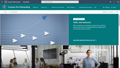
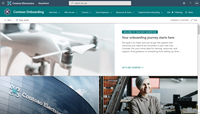
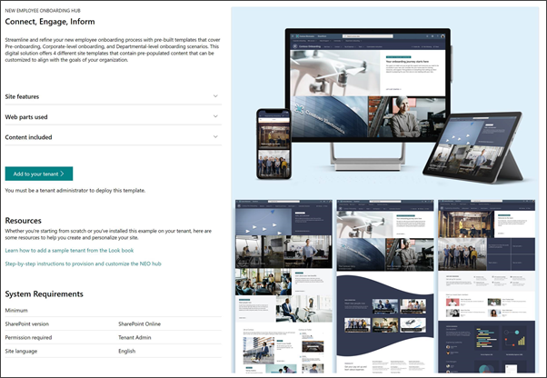
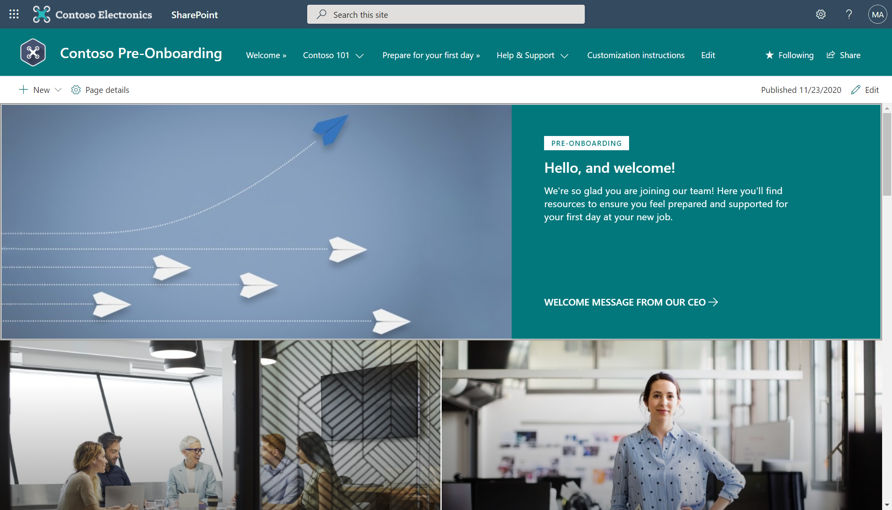
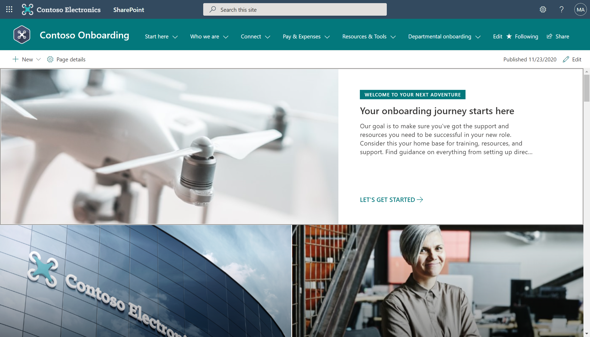
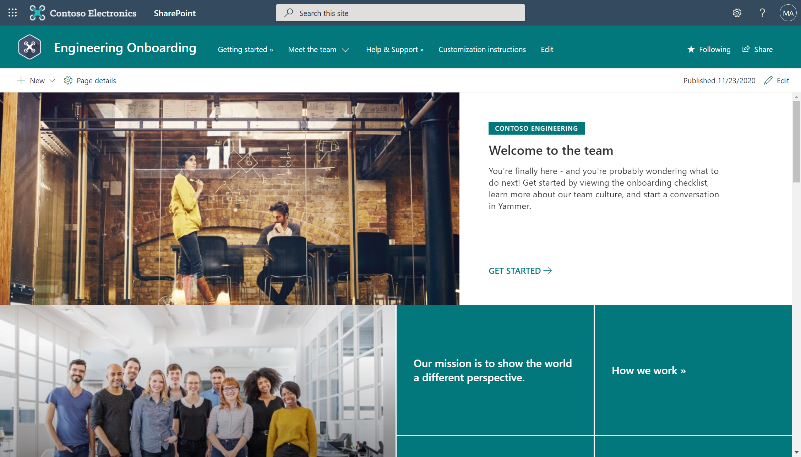

# Overview of the Microsoft New Employee Onboarding sites
There are three (3) new templates for New Employee Onboarding (NEO) to help organizations improve their onboarding process. The NEO sites are designed to deliver a flexible and consistent experience. The NEO sites can be used on their own, or together.

The NEO site(s) helps organizations by: 

- Providing new employees a place to get started
- Connecting new employees to people and culture
- Helping stakeholders easily contribute to new employee onboarding
- Generating data and usage reports that help measure NEO content effectiveness

### Why invest in new employee onboarding sites?
New employee onboarding (NEO) should be a strategic process that integrates new employees into an organization and its culture while providing the knowledge and tools needed to become fully contributing team members. 
NEO processes often fall short for both the new hires and the organization. Only 12% of employees strongly agree their organization does a great job of onboarding new employees. An engaging and well-organized NEO process can make all the difference in helping a new hire navigate through an exciting – but stressful -  career journey, and it can have major organizational benefits. 

**A strategically planned NEO experience can:**

**Improve new hire performance and time to productivity** -
Organizations with a standard onboarding process report 50% greater new-hire productivity.*

**Improve new employee retention** -
Based on our research, 69% of employees are more likely to stay with a company for three years if they had a great onboarding experience. Employees who have a negative onboarding experience are twice as likely to look for new opportunities.**    

### The NEO experience process:

| Provide new employees a place to get started     | Connect new employees to people and culture     | Help stakeholders easily contribute to new employee onboarding  | Measure effectiveness of new employee onboarding
| :------------------- | :------------------- |:----------------|
| Sense of place       | Pre-onboarding       | Departmental and team onboarding |  Value realization
| Onboarding journey   | Social connections and live events  | Easy to create and maintain compelling content experiences     | Example model for KPIs

### NEO site template features:

- **A fully configured and customizable set of new hire sites built on SharePoint communication sites:** NEO sites include: the site, information architecture, design, and pre-populated content and web parts. There are three NEO sites available that must be provisioned separately and can be customized or added to your organization’s new hire content. 
- **Onboarding journey:** Onboarding can be an overwhelming experience for new hires with everything the new hire is typically expected to do and learn in a short period of time. Avoid overwhelming your new employees by providing them a curated onboarding journey that paces the new hire through a configurable activity list of administrative, technology, culture, training, and connection-related to-do’s. The onboarding journey comes with a pre-configured list of new employee onboarding activities for you to customize for your processes. 
- **Sample site pages:** To inspire and provide design templates for arranging your content, the NEO site includes sample inner site pages. Use these site pages as templates for your content. 
- **Easy provisioning:** Provision NEO sites from the SharePoint look book with just a few steps.
- **Mobile ready:** NEO sites can be easily accessed on a mobile device when you [get the SharePoint mobile app](https://www.microsoft.com/microsoft-365/sharepoint/mobile-app?wt.mc_id=AID686708_QSG_228389&ocid=AID686708_QSG_228389&rtc=1).

### NEO site template options: 
New employee onboarding involves multiple levels within an organization, including pre-onboarding, corporate onboarding, and departmental onboarding. Each onboarding level provides its own unique value, contributing to a comprehensive onboarding experience each new employee should experience. 

Research has shown Pre-onboarding new hires, after they sign their acceptance letter but before they officially join the company, can lead to higher performance and better retention rates. To deliver a flexible and consistent onboarding experience, NEO sites consist of three different SharePoint site templates, that are designed to work alone or as one cohesive and familiar experience for new hires.

| Pre-onboarding site  | Corporate onboarding site  | Departmental onboarding site |
| :-------------------: | :-------------------: |:----------------:|
| | | |
| Share the Pre-onboarding site with new hires as soon as the job offer has been accepted | Share the Corporate onboarding site with new hires on their first day| Managers and onboarding buddies should share their respective Departmental onboarding site |

 

1.	**Pre-Onboarding site:** A site for new hires, who have yet to officially join the company, to learn more about the company they have joined and to get ready for their official start date. External guest access can be used for providing pre-start hires, with no corporate credentials, access to the Pre-onboarding site only. 
2.	**Corporate onboarding site:** A place for new hires to visit to get the information and connections they need to successfully onboard to the organization. 
3.	**Departmental onboarding site:** A place for new hires to visit to learn more about the department they are joining, its people, culture, and priorities. The Departmental onboarding site can be associated to an existing departmental hub.

> [!NOTE]
> To deliver a flexible and consistent new hire onboarding experience the NEO sites consists of **three different SharePoint site templates**, that are designed to work alone or as one cohesive and familiar experience for new hires. Sites must be provisioned individually, and then can be configured to [create a hub](https://docs.microsoft.com/sharepoint/create-hub-site) or [add a site to an existing hub](https://support.microsoft.com/office/associate-a-sharepoint-site-with-a-hub-site-ae0009fd-af04-4d3d-917d-88edb43efc05#:~:text=Associate%20a%20SharePoint%20site%20with%20a%20hub%20site.,to%20your%20site.%20You%20can%20...%20More%20items).

## Step 1: Provision NEO sites
The New Employee Onboarding (NEO) sites can be provisioned from the [SharePoint look book](https://lookbook.microsoft.com/). With the SharePoint look book, a **site collection administrator** can start the provisioning process with a few steps. Each site takes about 20 minutes to provision. Before starting the provisioning process, make sure you have met the prerequisites for provisioning.

### Prerequisites
To successfully provision the NEO sites via the SharePoint look book, the person doing the provisioning must be a site collection admin of the tenant where ta NEO site(s) will be provisioned. If you have never provisioned a template from the Look book, [review overview guidance](https://docs.microsoft.com/sharepoint/add-sample-site). 

### Provision the NEO sites

1.	Go to the [NEO sites solution page](https://provisioning.sharepointpnp.com/details/3df8bd55-b872-4c9d-88e3-6b2f05344239).

  - Provision the Pre-onboarding site (will link to specific look book page)
  - Provision the Corporate onboarding site (will link to specific look book page)
  - Provision the Department onboarding site (will link to specific look book page)

1.	Navigate to the site you want to provision and select **Add to your tenant**. If you are not signed into to your tenant, the SharePoint look book will ask for your site collection admin credentials.

1.	From the permissions requested dialog box, select **Consent on behalf of your organization** and then select **Accept**.

    > [!IMPORTANT]
    > To deliverThe provisioning service requires these permissions to provision the site template. There is no overall impact on your tenant and these permissions are explicitly used for the purpose of the solution installation. You must accept these permissions to proceed with the installation.

1.	Complete the fields on the provisioning information page as appropriate for your installation. At a minimum, enter the email address where you wish to get notifications about the provisioning process and the URL prefix for your site to be provisioned to.

1.	Select **Provision** when ready to install the NEO sites into your tenant environment. The provisioning process will take up to 20 minutes for each site. You will be notified via email (to the notification email address you entered on the Provisioning page) when the site is ready for access.

> [!NOTE]
> Have provisioning questions? Need to report an issue? Post your questions and comments about the provisioning of the NEO sites to the SharePoint [provisioning service forum](https://github.com/SharePoint/sp-provisioning-service/issues).

### Add owners to all sites
As the site collection admin, you may not be the person customizing the sites, so you'll need to assign a few site owners to the sites. Owners have administrative privileges on the site so they can modify site pages, content, and branding. 

1. Select **Share** in the right-hand corner of the site.
2. Add users, Office 365 Groups, or security groups to give them access to the site.
3. Assign users as a **Site owner** to allow permission to customize the site.
5. Include the site URL in the Share message, and then select **Share**.

## Step 2: Customize the onboarding experience 
The New Employee Onboarding (NEO) sites consists of three SharePoint site templates that can be customized to fit the needs of your users and organization. Many of the core pages are already built and pre-populated with content. Review content on sites and pages, then plan on customizing content, images, branding, web parts, and pages.   

Before you customize NEO site content, ensure you understand the needs of your users and the business objectives of your organization. New hires will need different kinds of support and resources depending on the onboarding phase and culture of your organization. Begin by signing into your account and reviewing pre-populated content. Then, customize content and prepare to share the site with new hires. 

It’s important to make sure the right content is available to users at the right time. It’s also important to make new employees feel welcome before their first day. Organizations with a standardized onboarding process report 50% greater new-hire productivity. Alternatively, employees who have a negative onboarding experience are twice as likely to look for new opportunities shortly after starting a new job. 

### NEO site options:

| Pre-onboarding site  | Corporate onboarding site  | Departmental onboarding site          |
| :------------------: | :------------------: |:---------------:|
|   |   |   |
| Share the Pre-onboarding site with new hires as soon as the job offer has been accepted | Share the Corporate onboarding site with new hires on their first day  | Managers and onboarding buddies should share their respective Departmental onboarding site   |
|   |   |        |

> [!NOTE]
> There are three NEO site templates that can be used alone or all together. Check with your site collection administrator to confirm which NEO sites were provisioned and are available for customizations.

 
1.	**Pre-Onboarding site:** A site for new hires, who have yet to officially join the company, to learn more about the company they have joined and to get ready for their official start date. External guest access can be used for pre-start hires who don't already have corporate credentials to give them access to the Pre-onboarding site only. 

> [!IMPORTANT]
> Enable external sharing for the Pre-onboarding site. The Pre-onboarding site is intended to be shared with new hires as soon as they sign their offer letter, but before they start their first day at work. Therefore, this site needs to be shared with external users. External sharing is off by default for SharePoint communication sites. In order for site owners to share externally, [turn on external sharing](https://docs.microsoft.com/sharepoint/change-external-sharing-site?branch=hokavian-neo-sites) for the Pre-onboarding site.  

2.	**Corporate onboarding site:** A place for new hires to visit to get the information and connections they need to successfully onboard to the organization. 

3.	**Departmental onboarding site:** A place for new hires to visit to learn more about the department they are joining, its people, culture, and priorities. Consider associating departmental onboarding sites with existing department portals if you have them.

### Get started - Sign into your Microsoft 365 account 

> [!NOTE]
> You need to be a site owner to customize and share the NEO sites. Work with your SharePoint administrator if you don’t already have access.

1.	Open your web browser and navigate to [office.com](https://www.office.com) or your organization’s sign in location.

2.	**Sign in** with your username and password.

3.	Navigate to the location of the site using the URL supplied by your site collection admin, or select SharePoint from the Microsoft 365 home page, and then select the site.

### Explore and review pre-populated content

 To deliver a flexible and consistent new hire onboarding experience the NEO sites consists of three different SharePoint site templates, that are designed to work alone or as one cohesive and familiar experience for new hires. Check with your site collection administrator to confirm which NEO sites were provisioned and are available for customizations. 

- Review content in the [Pre-onboarding site](https://review.docs.microsoft.com/SharePoint/provision-neo-hub?branch=neo-overview#pre-onboarding-site)
- Review content in the [Corporate onboarding site](https://review.docs.microsoft.com/SharePoint/provision-neo-hub?branch=neo-overview#corporate-new-hire-site)
- Review content in the [Department onboarding site](https://review.docs.microsoft.com/SharePoint/provision-neo-hub?branch=neo-overview#departmental-onboarding)

> [!NOTE]
> The NEO sites comes with many pre-built pages that can be identified in the site navigation with this symbol ">>." Determine which pages and content to keep, edit, or delete based on the needs of your organization. 

#### Pre-Onboarding site:

The pre-onboarding site is where a new hire starts their onboarding journey. This site is for new hires who have accepted their job offer but have not officially joined the company yet. In this stage, new hires will be interested in learning more about the company, how to get ready for their official start date, and who to go to for questions. 
 
##### Pre-populated site content:
- **Home page** – The home page is the first site your user will see after they agree to accept the job. Use this landing page as an opportunity to highlight significant concepts and get new employees excited about starting their new job. Provide content for topics like organization leaders, values, communities of interest, benefits, and career planning resources. 

  > [!IMPORTANT]
  > Plan to connect social media accounts to the [Hero web part](https://support.microsoft.com/office/use-the-hero-web-part-d57f449b-19a0-4b0d-8ce3-be5866430645) and the [Twitter web part](https://support.microsoft.com/office/use-the-twitter-web-part-15db6b3b-d167-41dd-9875-2af64b44d820).

- **Welcome** – Give new hires a warm welcome and place to start understanding onboarding tasks and how to prepare for their first day. This is a good opportunity to include a video message from leadership. Use the [YouTube web part](https://support.microsoft.com/office/use-the-youtube-web-part-c14fa2c1-71dc-4e52-94b6-b4876742382f), or [Embed web part](https://support.microsoft.com/office/add-content-to-your-page-using-the-embed-web-part-721f3b2f-437f-45ef-ac4e-df29dba74de8) to display the video.
- **Contoso 101** – Provide high-level information about the organization that engages and excites. Share more about leadership and values in Our leadership team and Our values pages.
- **Prepare for your first day** – Ensure new hires feel prepared and supported on their first day by providing details on what to bring and where to go. 
- **Help & Support** – Highlight where to go for support and customize questions and answers for the FAQ page.

#### Corporate onboarding site:

The corporate onboarding site is the landing place for the new employee onboarding experience and is designed to provide a high-level view of organizational goals, leadership, team structure, and resources. In this phase, users are looking for guidance, support, and clarity. Use this site to outline onboarding details and expectations during the first months of onboarding. Ensure users have access to support channels like [Yammer](https://support.microsoft.com/en-us/office/use-a-yammer-web-part-in-sharepoint-online-a53cfa0c-3d09-42c8-a286-1038a81c59da), write FAQs relevant to your organization, and customize the [onboarding checklist](https://support.microsoft.com/office/introduction-to-lists-0a1c3ace-def0-44af-b225-cfa8d92c52d7) to include the activities you want all new hires to do in their first 30, 60, 90 days.

 
##### Pre-populated site contents:
- **Home page** – Provide a high-level view of significant concepts that will be relevant to new users. This page is a great location to help new employees build their network and learn from more experienced and knowledgeable employees with [Microsoft Teams live events](https://docs.microsoft.com/microsoftteams/teams-live-events/what-are-teams-live-events#:~:text=Microsoft%20365%20live%20events%20bring%20live%20video%20streaming,community%20resides%2C%20using%20Microsoft%20Stream%2C%20Teams%2C%20or%20Yammer.)
- **Start here** – Specify what new hires should do in their first 30, 60, and 90 days of onboarding by creating an onboarding process in on the Start your journey here page. The new hire checklist found in this section comes pre-populated with a set of generic onboarding activities. Customize list content to meet your needs. [Learn more about working with SharePoint lists](https://support.microsoft.com/office/introduction-to-lists-0a1c3ace-def0-44af-b225-cfa8d92c52d7).
- **Who we are** – Introduce users to more detail about the organization in the Our story, Our leadership, Our teams pages. Customize these pages and the Office locations page for your organization. Or, link to an existing leadership page instead.
- **Help & Support** - Highlight where to go for support and customize questions and answers for the FAQ page.
- **Community** – Help new hires start building community right away and make sure new hires are aware of Employee resource groups and other connection channels.
- **Departmental onboarding** – Provide an entry point to departmental-level information from the site navigation where users can access departmental onboarding sites. Consider provisioning the Department site template. 

#### Departmental onboarding site:

Here, users need to learn about departmental leadership, culture, goals, and resources. Use the departmental onboarding site to provide access to communication channels, training guides, and events relevant to new hires. Consider associating departmental onboarding sites with existing department portals if you have them.
 

##### Pre-populated site contents:
- **Home page** - Provide a high-level view of significant concepts that will be relevant to new hires.
- **Getting started** – Help users quickly understand onboarding tasks, departmental procedures, and anything else that will help new hires be successful. 
- **Meet the team** – Introduce new hires to people, the organization structure and goals on the Leadership, The organization, and Our priorities pages. Edit the [Call to Action web part](https://support.microsoft.com/office/use-the-call-to-action-web-part-e9917310-7543-4fc4-8f3f-d78e46074c00) to include links and images. Or, link to an existing team page instead.
- **Help and support** - Highlight where to go for support and consider creating a FAQ section.

**Next steps:** Customize place-holder content, edit the site navigation, add pages as needed, and hook up social media accounts in web parts.

### Customize the content and look of your NEO sites 
Now that you’ve reviewed the pre-built pages and pre-populated content, you are ready to customize the NEO experience for your organization. 

#### Navigation

Site navigation is important because it helps users immediately understand what can be accomplished on a given site. The most effective SharePoint sites help viewers find what they need quickly so that they can use the information to make decisions, learn about what is going on, access the tools they need, or engage with colleagues to help solve a problem. Edit site navigation for all NEO site templates to meet the needs of your audience and organization. [Learn how to edit site navigation](https://support.microsoft.com/office/customize-the-navigation-on-your-sharepoint-site-3cd61ae7-a9ed-4e1e-bf6d-4655f0bf25ca). 

 
#### Web parts
Customize web parts with images, labels, links, and content that aligns with your organization’s mission. Keep images and descriptions simple and easy to understand for your new-hire audience.

- **Hero web part** - Bring focus and visual interest to your page with the [Hero web part](https://support.microsoft.com/office/use-the-hero-web-part-d57f449b-19a0-4b0d-8ce3-be5866430645). You can display up to five items in the Hero web part and use compelling images, text, and links to draw attention to each.
- **Text web part** - Use the [Text web part](https://support.microsoft.com/office/add-text-and-tables-to-your-page-with-the-text-web-part-729c0aa1-bc0d-41e3-9cde-c60533f2c801) to add paragraphs to your page. Formatting options like styles, bullets, indentations, highlighting, and links are available.
- **Image web part** – Use the [Image web part](https://support.microsoft.com/office/use-the-image-web-part-a63b335b-ad0a-4954-a65d-33c6af68beb2) to add an image to a page.
- **Quick links web part** – Organize and display links to other resources with the [Quick links web part](https://support.microsoft.com/office/use-the-quick-links-web-part-e1df7561-209d-4362-96d4-469f85ab2a82).
- **People web part** – Use the [People web part](https://support.microsoft.com/office/show-people-profiles-on-your-page-with-the-people-web-part-7e52c5f6-2d72-48fa-a9d3-d2750765fa05) to display profile photos, contact information, and organizational information for people at work.
- **Twitter web part** - Use the [Twitter web part](https://support.microsoft.com/office/use-the-twitter-web-part-15db6b3b-d167-41dd-9875-2af64b44d820) to highlight topics and conversations on SharePoint pages.
- **YouTube web part** - Use the [YouTube web part](https://support.microsoft.com/office/use-the-youtube-web-part-c14fa2c1-71dc-4e52-94b6-b4876742382f) to embed YouTube videos right on your page.

#### Site theme and branding
Edit the look of your SharePoint sites to align with your organization's brand. Customize the site display name, logo, theme, header layout, navigation style, and more in the [Change the look panel](https://support.microsoft.com/office/customize-your-sharepoint-site-320b43e5-b047-4fda-8381-f61e8ac7f59b).

#### Hub site settings

SharePoint hub sites help connect and organize sites based on project, department, division, region, etc. making it easier to:

- Discover related content such as news and other site activities
- Apply common navigation, branding, and site structure across associated sites
- Search across all associated sites. 

Considering associating the departmental onboarding site to an existing corporate onboarding site or departmental hub. Learn how [hub site associations](https://support.microsoft.com/office/associate-a-sharepoint-site-with-a-hub-site-ae0009fd-af04-4d3d-917d-88edb43efc05) work and how to manage hub settings for your organization. Learn more about [SharePoint hub sites](https://support.microsoft.com/office/what-is-a-sharepoint-hub-site-fe26ae84-14b7-45b6-a6d1-948b3966427f).

#### More customization resources: 
- Add a [page to a SharePoint site](https://support.microsoft.com/office/add-a-page-to-a-communication-site-ce16986a-25ec-4907-b820-44d01ae8afb5)
- How to use [web parts on SharePoint pages](https://support.microsoft.com/office/using-web-parts-on-sharepoint-pages-336e8e92-3e2d-4298-ae01-d404bbe751e0)
- Use the [Events web part](https://support.microsoft.com/office/use-the-events-web-part-5fe4da93-5fa9-4695-b1ee-b0ae4c981909)
- Use the [News web part](https://support.microsoft.com/office/use-the-news-web-part-on-a-sharepoint-page-c2dcee50-f5d7-434b-8cb9-a7feefd9f165)

## Step 3: Share the NEO sites with end users

After customizing content, get ready to share the new onboarding experience with new hires. Different permissions will apply to the Pre-onboarding site since users will be external guests. Once new hires start working, use internal permissions sharing instructions to give access to the corporate onboarding site. 

### Share the Pre-onboarding site 

> [!NOTE]
> If you are unable to add visitors (external users, also referred to as guests) to the pre-boarding site, work with your SharePoint administrator to [turn on external sharing for a SharePoint site](https://docs.microsoft.com/sharepoint/change-external-sharing-site). 

As a site owner, you can give external people access to the site by adding them as a **visitor**.

1. Select **Share site** from the right-hand corner.
2. In the Share site pane, enter the names of people to add them to the site. The permission level will be ready only.
4. Enter an optional message to send to the person, or clear the Send email box if you don't want to send an email.
5. Select **Share.**

### Share the Corporate and Departmental onboarding sites

1.	Select **Share site** from the right-hand corner.
2.	In the **Share site** pane, enter the names of people or groups to add them to the site, or enter "Everyone except external users" to share the site with everyone in your organization.  
3.	Change the permission level (Read, Edit, or Full control) as needed.
4.	Enter an optional message to send to the person or clear the Send email box if you don't want to send an email.
5.	Select **Share**.

## Step 4: Measure the impact of your NEO sites

### Define NEO success metrics

Define site success metrics to measure and optimize your organization’s onboarding process. This is an example of possible metrics for a new employee onboarding site experience in the form of an onboarding hub:

| Objective      | Business owner   | KPI measure | Data source   | KPI formula    | KPI baseline    | KPI target   |
| :------------------- | :------------------- |:----------------|:------------------- | :------------------- |:----------------| :----------------|
| Help onboard new employees more effectively   | Diego Siciliani   | New employee satisfaction  |  Survey data  |  Average score of new employee satisfaction with NEO Hub   |  N/A   | 4.25  
| Help onboard new employees more effectively   | Diego Siciliani   | NEO hub usage  |  Site usage report  |  Number of unique viewers and visits   |  N/A   | 500 unique viewers/month and 1,500 views/month
| Increase new employee retention  | Alexandre Levesque  | New employee retention  |  HR system retention data  |  % of new employee cohort that remains with the company after one year   |  75%   | 90%
| Improve new employee engagement  | Diego Siciliani    | New employee engagement score |  Survey data  |  Average score of new employee engagement question  |  3.75   | 4.25

### Use site usage data

As a SharePoint site owner, you can view site usage data that shows you how users are interacting with your site. For example, you can see the number of people who have visited the site, how many times people have visited the site, and a list of files that have received the most views. Site owners should utilize SharePoint’s built-in site usage reporting capabilities to measure the impact of the NEO sites and hub. [Learn how to view usage analytics for your site](https://support.microsoft.com/office/view-usage-data-for-your-sharepoint-site-2fa8ddc2-c4b3-4268-8d26-a772dc55779e).

**Example of site usage data:**

## Step 5: Manage and maintain your NEO sites

NEO sites should present the most up to date content your organization has to offer, so you’ll need to commit to maintaining relevant content throughout the experience. Develop a plan to audit content and refresh web parts as needed to ensure contact information, FAQs, the onboarding checklist, and People web parts are up to date. Learn more about [managing communication sites](https://support.microsoft.com/office/manage-your-sharepoint-communication-site-21761aac-f7f7-4499-b0ca-cf283477c32f). 

- Train site owners and authors. Make sure all site owners and authors have appropriate training and access to [maintain the site](https://support.microsoft.com/office/manage-your-sharepoint-communication-site-21761aac-f7f7-4499-b0ca-cf283477c32f).
- Update content in web parts. Keep web parts like the People web part updated to ensure you are leveraging the full value of the NEO sites.
- Review previously established metrics after the launch. Use insights from [site analytics](https://support.microsoft.com/office/view-usage-data-for-your-sharepoint-site-2fa8ddc2-c4b3-4268-8d26-a772dc55779e) to promote content on the home page, update navigation, or re-write content for clarity.
- Establish a schedule to audit content. Plan when site owners should audit content in advance to make sure your sites are always up to date.
- Periodically review your site settings. Make [changes to the settings](https://support.microsoft.com/office/manage-your-sharepoint-site-settings-8376034d-d0c7-446e-9178-6ab51c58df42?ui=en-us&rs=en-us&ad=us), site information, and permissions for the site as needed.

## NEO site FAQs

**Question**: What are the requirements for installing the New Employee Onboarding (NEO) sites into my tenant environment?
 

**Answer**:
- SharePoint and communication sites enabled.
- The individual that will be provisioning CLO365 must be the site collection administrator of the target tenant for install.

**Question**: How long will it take to install the site in our tenant environment?
 

**Answer**: Based on our testing of the installation, it should take less than 15 minutes. This does not include time required to customize the site to your requirements.

**Question**: Where can I ask questions or report an issue with the SharePoint provisioning service? 
 

**Answer**:Post your questions and comments about the provisioning of the NEO sites to the SharePoint [provisioning service forum](https://github.com/SharePoint/sp-provisioning-service/issues).

**Question**: Where can I share feedback for ideas on how to improve the SharePoint site experience? 
 

**Answer**:Post your ideas and comments about SharePoint sites in the [Site and Collaboration User Voice Forum](https://sharepoint.uservoice.com/forums/329214-sites-and-collaboration)

**Question**: Where can I ask questions or report an issue with the SharePoint provisioning service? 
 

**Answer**:Post your questions and comments about the provisioning of the NEO sites to the SharePoint [provisioning service forum](https://sharepoint.uservoice.com/forums/329214-sites-and-collaboration?category_id=144408).

**Sources**:

  - Gallup, State of the American Workplace, 2017*
  - SHRM, Don't Underestimate the Importance of Good Onboarding, 2017**
  - Source: Digitate, Super CIO: What the CIO sees—that other people don’t, 2018
