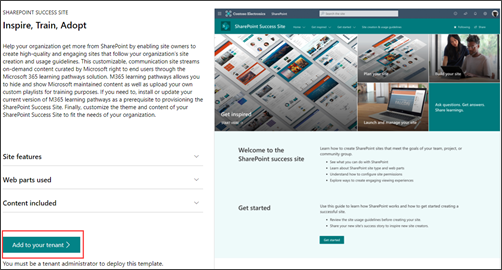
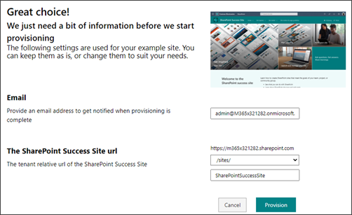
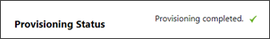

# Provision the SharePoint Success Site from the look book

Once you confirm the person provisioning *and* the tenant being provisioned meet the following [prerequisites](https://docs.microsoft.com/sharepoint/provision-sss#meet-the-prerequisites), you are ready to provision:

- You are using Global admin credentials
- Your tenant has the App Catalog installed
- You are an Administrator of the App Catalog
- Your tenant has version 4.0 or higher of the M365 learning pathways provisioned

## Start provisioning from the look book
If you already have M365 learning Pathways version 4.0 *or higher* provisioned to your tenant, you can provision the SharePoint Success Site from the look book. If you aren't sure what version of M365 learning pathways is installed in your tenant, review the [prerequisites](https://docs.microsoft.com/sharepoint/provision-sss#meet-the-prerequisites) and then provision the SharePoint Success Site. 

1. Go to the [look book](https://provisioning-test.sharepointpnp.com/details/0b860749-56a0-4c4c-992c-536d56d9accf) and select **Add to your tenant**.

   

2. Fill out the email and URL address sections and select **Provision**.

   

3.	Select **Confirm**.

4.	When provisioning is complete, you’ll see the following message:

    

5.	Next, navigate to your tenant's Learning Pathways site.

6.	Select **Home > Learning Pathways Administration**.

    

7.	Select the ellipse **(…)**, then select **Add to Content Pack**.

8.	Select **SharePoint Success Site**.

    

9.	You will see the SharePoint look book site appear in a new tab. You can close this tab and select the **CustomLearning Administration tab**.

    

10.	Select **Complete** as shown in the following image:

    

    > [!IMPORTANT]
    > Make sure to select **Complete** to complete the provisioning process.

11.	To confirm the SharePoint Success Site has been successfully provisioned, navigate to the site and select **Get Started > Plan your site**. You should see the web part on the page as shown in the following image:

12. Next, follow the steps below to add Site owners to the M365 learning pathways administration page and the SharePoint Success Site to grant access to others for site and content [customizations](https://docs.microsoft.com/sharepoint/customize-sss). 

## Add Site owners 
Assign a few Site owners to grant administrative privileges to customize the site and training content. In order to hide, show, or enable playlists, users will need Site owner or Site member permissions to the M365 learning pathways site. In order to edit the look, navigation, and site content, users will need Site owner or Site member permissions to the SharePoint Success Site. 

**Add Site owners or members to both sites**

1. From the site select **Settings**, then select **Site permissions**.
2. Select **Advanced Permission Settings**.
3. Select **Site owners** or **Site members**
4. Select **New > Add users to this group**, and then add the people you want to be Site owners or Site members.
5. Include a link to **Explore the site** in the sharing message, and then select **Share**.

### Site provisioning help

- Reference [troubleshooting](https://docs.microsoft.com/office365/customlearning/feedback) for provisioning help
- See M365 learning pathways [FAQs](https://docs.microsoft.com/office365/customlearning/faq)
- Share your [feedback](https://github.com/pnp/custom-learning-office-365/issues) with us

 

### Next steps - customize the SharePoint Success Site

[Customize](https://docs.microsoft.com/sharepoint/customize-sss) playlist content and the look and feel of your SharePoint Success Site to meet the needs of your organization.

 

### Frequently asked questions

**Question: Can I provision from the M365 learning pathways admin page?**
 
Answer: Yes, follow the guidance on how to [provision from the M365 learning pathways admin page](https://docs.microsoft.com/sharepoint/provision-sss#provision-the-sharepoint-success-site-1).
 

**Question: Who has permission to provision the SharePoint Success Site?**
 
Answer: The Global admin (formerly called the Tenant admin) are required.
 

**Question: Who has permission to customize the site template?**
 
Answer: The Global admin (formerly called the Tenant admin,) or Site owner permissions.
 

**Question: Who can create custom playlists and hide or show content in M365 learning pathways?**
 
Answer: The Site collection administrator and Site owner permissions of M365 learning pathways.
 

**Question: Who has permissions to use the SharePoint Success Site as a user?**
 
Answer: Microsoft 365 user permissions or SharePoint Site visitor permissions or higher.

