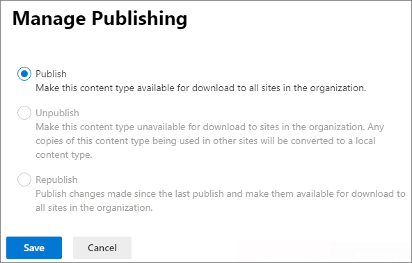

# Publish a content type

You can publish, unpublish, or republish content types centrally from the SharePoint admin center.

**To publish, republish, or unpublish a content type**

1. Go to the SharePoint admin center.

2. Under **Content services**, select **Content type gallery**.

3. On the **Content type gallery** page, under the **Site content type** column, select the name of the site content type for which you want to manage updates. That site content type page appears.

4. In the menu bar, select **Publish**. The **Manage Publishing** panel appears.

    

5. On the **Manage Publishing** page, do one of the following:

    - To make this content type available for download to all sites in the organization, select **Publish**.
    - To publish updates to this content type, select **Republish**.

    - To make this content type unavailable for download to sites in the organization, select **Unpublish**. Any copies of this content type being used in other sites will be converted to a local content type.

6. Select **Save**.

## Related topics

[Publish a content type from a content publishing hub](https://support.microsoft.com/office/58081155-118d-4e7a-9cc5-d43b5dbb7d02)

[Introduction to content types and content type publishing](https://support.microsoft.com/office/e1277a2e-a1e8-4473-9126-91a0647766e5)
