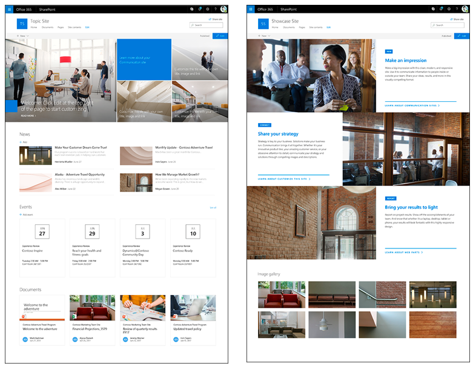
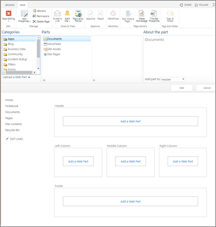
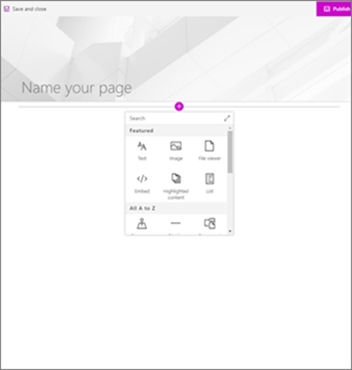
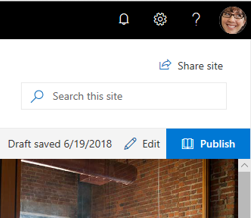
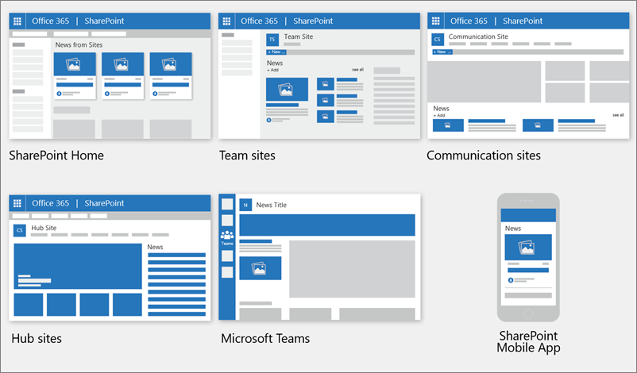

# Moving from Publishing sites to Communication sites

Being able to communicate broadly using attractive sites and pages is a key feature of organization intranets. For example, you might have an HR department home page that serves up important communication to hundreds or thousands of employees.

In the modern experience, Communication sites fulfill the same purpose as traditional publishing sites: to communicate broadly to a large audience while maintaining a level of control on the creation side. Communication sites support most of the same scenarios as publishing sites, and more capabilities are coming soon. Best of all, Communication sites are easier to build and maintain, and include new features such as a modern authoring canvas. They allow you to share news, reports, statuses, and other information in a visually compelling format. To sum up: you can quickly create beautiful pages that look great on mobile devices and that are accessible by default - all without heavy developer investment. You can get inspired with some great examples in the [SharePoint Lookbook](https://sharepointlookbook.azurewebsites.net/).

Traditionally, sites and pages like this have been designed and built using the publishing features of SharePoint – either team sites with publishing enabled, or fully structured publishing sites. You could specify page layouts, design pages, and set up content approval workflows. Publishing features allowed for a tight level of control by a small number of people while allowing broad communication to many people. But with traditional design and deployment of publishing sites, developer involvement is usually required for customization of site functionality, navigation elements, and included investment in master pages, CSS, JavaScript, and web parts. Additionally, traditional site types designed for a PC browser may not work well or look attractive on mobile devices, and design and development efforts are needed to provide proper interaction with tools like screen readers or high-contrast color schemes. With all this, it commonly takes more time and resourcing to build, test and deploy when using the classic publishing infrastructure.

So, how you do move from publishing sites to communication sites? First, know that you don't have to change all of your site collections and sites at once. If you have a very large collection of publishing sites, you can gradually begin using modern sites, pages, and web parts. For example, you can start with creating one or more new Communication sites as home pages for existing sites. If you have several departments in your organization, you can create modern sites and implement modern features one department at a time. You can choose a strategy that works best for the size and scale for your organization. To help with determining your strategy, you can use the SharePoint Modernization scanner tool to find out which classic publishing features are used in your organization or in a subset of site collections. Find this tool and more information about it in [Modernize classic publishing portals.](/sharepoint/dev/transform/modernize-publishing-portal)

When you are ready to begin creating new Communication sites and using modern features, here are some areas to consider:

-   [Structure and navigation](#structure-and-navigation)

-   [Branding and site design](#branding-and-site-design)

-   [Pages](#pages)

-   [Web parts](#web-parts)

-   [Sharing news](#sharing-news)

-   [Permissions and sharing](#users-and-permissions)

-   [Audience targeting](#audience-targeting)

## Structure and navigation

Let’s say your organization has a publishing site for Human Resources, with subsites for Benefits, Policies, Training, and Careers. It might be organized like this:

Where Human Resources is your site collection that includes four subsites for Benefits, Policies, Training, and Careers.

In the modern experience, you can use a Hub site to mimic the same structure while carrying design elements across related sites:

This structure is no longer hierarchical in the technical sense. Instead, it is a flat structure where each site is connected. In this scenario, each site can be a Communication site. But you can also include team sites for collaboration within the hub, while limiting their availability to the entire organization. With a hub site, you can:

-   Apply common navigation and branding across associated sites.

-   Search across all associated sites.

-   Aggregate news content across all sites.

The best part about hub sites is that they are so flexible. As your organization changes, your intranet organization can change just as quickly, just by associating or disassociating a site.

To learn more about planning hub sites, see [Planning your SharePoint hub sites.](/sharepoint/planning-hub-sites) To create a hub site, see [Create a hub site](/sharepoint/create-hub-site). To learn more about navigation options and planning, see [Planning navigation for modern SharePoint](plan-navigation-modern-experience.md).

## Branding and site design

In the modern SharePoint Online experience, it is easier to [*change the look*](https://support.office.com/article/Change-the-look-of-your-SharePoint-site-06bbadc3-6b04-4a60-9d14-894f6a170818) and feel of your sites to match your company or organizational brand. You can customize the logo, colors, navigation, header, and footer – often without writing a single line of code. Branding can be applied at the site level, to a group of sites, or to all sites within your organization. SharePoint Online includes an updated set of default site themes and site designs (or templates) that are responsive and look great on any device. With site themes, you can customize your site’s logo and colors to match your brand.

Coming soon are multiple options for headers and footers on Communication sites, and options for navigation such as a mega menu. Check the [Office 365 Roadmap](https://products.office.com/en-US/business/office-365-roadmap) for these and other features that are in development, rolling out, or launched.
To learn more about branding options, see [Branding your SharePoint Online site](branding-sharepoint-online-sites-modern-experience.md). To learn more about planning navigation, see [Planning navigation for modern SharePoint](plan-navigation-modern-experience.md).

### Classic site templates and modern site designs

[*SharePoint Online handles branding differently*](/sharepoint/dev/transform/modernize-branding) for classic site templates like the publishing site. Instead of a site template, Communication sites have three out-of-the-box layout designs: Topic and Showcase, and one open layout: Blank.

When you [create a Communication site in SharePoint Online](https://support.office.com/article/7fb44b20-a72f-4d2c-9173-fc8f59ba50eb), you can start with a blank site or choose one of the other site designs, each of which comes with a default set of [web parts](https://support.office.com/article/336e8e92-3e2d-4298-ae01-d404bbe751e0). The options available are:

-   **Topic** to share information such as news, events, and other content. It includes a [Hero web part](https://support.office.com/article/d57f449b-19a0-4b0d-8ce3-be5866430645), to highlight and link to important content; a [News web part](https://support.office.com/article/c2dcee50-f5d7-434b-8cb9-a7feefd9f165), to distribute announcements, reports, status, and more; an [Events web part](https://support.office.com/article/5fe4da93-5fa9-4695-b1ee-b0ae4c981909) based on a calendar list; and a [Highlighted content](https://support.office.com/article/e34199b0-ff1a-47fb-8f4d-dbcaed329efd) web part to dynamically show documents based on your criteria.

-   **Showcase** to use photos or images to showcase a product, team, or event. This is a highly visual design that includes a [Hero web part](https://support.office.com/article/d57f449b-19a0-4b0d-8ce3-be5866430645) with large imagery in a layered structure, and an [Image gallery](https://support.office.com/article/bbcbe560-14a7-4369-8ef5-3255845e3bfd) that can be shown in several different layouts, such as a tiled layout or carousel layout.

-   **Blank** to create your own design.

> 

If you want more customized branding and theming applied to each new site, you can use site designs with site scripts to provide custom configurations to apply when new sites are created. They can be used each time a new site is created to apply a consistent set of actions. Common site design actions typically affect the site itself, such as setting the theme or logo, creating lists, or configuration navigation. You can find more information on how to use site designs and scripts at [SharePoint site design and site script overview](/sharepoint/dev/declarative-customization/site-design-overview).

## Pages

Master pages and page layouts are components of a publishing site. Page layouts and master pages work together to create the layout for a traditional SharePoint web page. Modern Communication sites do not utilize master pages or page layouts, but do provide a greater level of flexibility for site owners and page authors.

In the classic experience, you may have created web part pages based on page layouts. Page layouts can be locked down to control what is authored on a page. However, they are inflexible in that pages based on page layouts are confined to the layout and options provided by the page layout.

Modern pages provide a fast, easy way to build responsive pages using the functionality of modern web parts. Pages are similar to classic web part pages and publishing pages, but are less structured and easier to create.  And, each page’s layout is flexible in that it can be changed anytime.

*Classic web part page*:

*Modern web part page*:

Pages are made up of a title area and sections. Sections can include a full-width column for full-bleed images or hero web parts, or up to three regular columns. You can add a variety of web parts to the page, and easily move them around on the page to get the look you want. Check out this short video to see how to create, layout, and publish a page:

> [!VIDEO https://videoplayercdn.osi.office.net/hub/?csid=ux-cms-en-us-msoffice&uuid=RE2ZpSP&AutoPlayVideo=false]

**Publishing** On a classic publishing site, commands for Publish and Check in/Check out are available on the ribbon. In the modern experience, it is even easier for authors to discover how to edit and make their content visible with buttons to Edit, Save, and Publish right on the page. When a modern page is in edit mode, it is automatically checked out to the person who is editing. When a page is saved or published, it is automatically checked in. If someone has a page open for editing but hasn’t made any changes to it for at least 5 minutes, it is automatically saved and taken out of Edit mode so that others can access and edit the page.

To learn more about how to create and edit pages, see [Add a page to a site](https://support.office.com/article/b3d46deb-27a6-4b1e-87b8-df851e503dec).

### Content approval for pages

Content approval ensures that edits to pages meet company policies or standards. Classic publishing allows for content approval on pages using out-of-the-box workflows. Modern pages also provide for content approval, and once it is enabled, users need only to press a Submit button on the page to start the approval flow. The recommended way to do this is to use the built-in Microsoft Flow commands. Learn more at [Page approval flow](https://support.office.com/article/a8b2e689-d4a1-4639-8028-333c0ece30d9).

### Scheduling

Scheduling content to “go live” at specific times is a feature of classic publishing sites. This capability is coming soon to the modern experience. Check the [Office 365 Roadmap](https://products.office.com/business/office-365-roadmap) for this and other features that are in development, rolling out, or launched.

**Moving from classic to modern pages** At this time, there is not a way to change a classic page into a modern page without using a [multi-step code solution,](/sharepoint/dev/transform/modernize-userinterface-site-pages) which may work well for IT Admins and developers. If you are neither of those, we recommend you gradually start planning for and creating modern pages as needed.

If you are using a classic publishing site, you should know that it is possible to create modern pages in a classic publishing site, but there is not an automated way to move from a publishing site to a communication site. To move to a communication site, we recommend you begin creating modern pages in a new communication site rather than in a classic publishing site.

### Wiki pages

Wiki pages are a content type available in publishing sites, but they are not available in Communication sites. However, you can create modern pages using the [Text web part](https://support.office.com/article/729c0aa1-bc0d-41e3-9cde-c60533f2c801) to cover many of the same scenarios as Wiki pages. Note that Wiki syntax is not available in a Text web part.

## Web parts

Modern pages use modern web parts. Modern web parts are designed to be easier to use, faster, and look great. It is important to note that, for security reasons, modern out-of-the-box web parts do not allow for the insertion of custom code including JavaScript.

Important: Classic web parts cannot be used on modern pages and modern out-of-the-box web parts cannot be used on classic pages. Developers may create custom modern web parts that may work on both classic and modern pages. Additionally, there is not a 1:1 mapping of classic to modern web parts, but there are web parts that have similar purposes.

To learn about all of the modern web parts, see [Using web parts on SharePoint Online pages](https://support.office.com/article/336e8e92-3e2d-4298-ae01-d404bbe751e0). To learn about modern web parts that have similar purposes to classic web parts, see [Classic and modern web part experiences](https://support.office.com/article/3fdae6c3-8fc1-49ab-8708-8c104b882e64).

For developers, the [SharePoint Framework](/sharepoint/dev/spfx/sharepoint-framework-overview) allows for the building of custom modern web parts that appear alongside out-of-the-box web parts in the web part toolbox. The SharePoint Framework also allows for custom extensions, the [use of the Microsoft Graph API](/sharepoint/dev/spfx/use-aad-tutorial), as well as [secure access to third party solutions and API’s secured by Azure Active Directory](/sharepoint/dev/spfx/use-aadhttpclient). Developers are encouraged to consult the [SharePoint starter kit](https://github.com/SharePoint/sp-starter-kit), where you'll find a fully built sample solution that includes numerous web parts, extensions, and other components that you can use as an example and inspiration for your own customizations. Additionally, you can find design guidance and standards for web parts at [Designing great SharePoint experiences](/sharepoint/dev/design/design-guidance-overview).

### Web parts unique to publishing sites

Publishing sites include a variety of web parts that enable authors to insert video, rich text, forms, and dynamic content onto a site page. Three web parts that have been unique to publishing sites are the Content Query web part to show dynamic content; and the Summary links web part and the Table of contents web part to display links to important content. The following are a selection of modern web parts that help fulfill the same purposes as these web parts.

**Content query web part**: The [Highlighted content](https://support.office.com/article/e34199b0-ff1a-47fb-8f4d-dbcaed329efd) web part serves a similar purpose as the Content Query web part. It dynamically displays content from a document library, a site, a site collection, or multiple sites. With the Highlighted content web part, many of the advanced and confusing search/query options of the Content Query web part have been replaced with streamlined query options. However, unlike its classic counterparts, custom display templates are not allowed.

**Summary links, Table of contents**: There is not a 1:1 mapping of these web parts to modern web parts. However, there are several modern web parts that can fulfill the same purpose, which is to help your users navigate from a page level to important content. These are:

> [Quick links](https://support.office.com/article/e1df7561-209d-4362-96d4-469f85ab2a82)
>
> With Quick links, you can add links to a page and set display options like a carousel format called filmstrip, list, or a smaller compact format. Each of the links in the compact format can be arranged and displayed with or without images. It is currently not possible to populate Quick links based on a SharePoint list.
>
> [Link](https://support.office.com/article/19c37587-118a-4813-b25a-192f3bd829d9)
>
> The Link web part shows one complete URL link, and adds the ability to show or hide a preview pane with the link target. 
>
> [Hero web part](https://support.office.com/article/D57F449B-19A0-4B0D-8CE3-BE5866430645)
>
> The Hero web part is, by default, included on both the Topic and Showcase communication site templates. It is an attractive way to bring focus and visual interest to your page. You can display up to five items in the Hero web part and use compelling images, text, and links to draw attention to each.
>
> [Text web part](https://support.office.com/article/729c0aa1-bc0d-41e3-9cde-c60533f2c801)
>
> In the Text web part, you can add links within your content using the toolbar. Additionally, with the Text web part you can create a link that opens in a new tab.

To learn more about modern web parts that have similar purposes to classic web parts, see [Classic and modern web part experiences](https://support.office.com/article/3fdae6c3-8fc1-49ab-8708-8c104b882e64).

## Sharing news

Newly available in the modern experience, the News feature is an effective distribution system created to deliver relevant content across your organization.

Built on modern pages and web parts, you can tell stories with rich, attractive content that can be dynamically shown on the SharePoint start page, on team sites, communication sites, hub sites, and even on the SharePoint mobile app. You can also choose to show News in a Teams channel.

### Where news can be distributed

News posts can be created from the SharePoint start page, from a team site or communication site, and from pages that have the News web part on them already. You can customize sources and layouts of news, and soon you’ll be able to organize and order news posts as well as target specific audiences for news.
To learn more about how to create and share News, see [Create and share news on your SharePoint sites](https://support.office.com/article/create-and-share-news-on-your-sharepoint-sites-495f8f1a-3bef-4045-b33a-55e5abe7aed7).

## Users and permissions

You probably don’t want a large group of people having the ability to make changes to your site that communicates information to a whole department or organization. Publishing portal sites included roles such as Approvers and Designers. Communication sites present a simplified experience, so not all of these roles are present by default. While you could set up roles like these manually, we recommend you use the new sharing interface, which also can provide you with needed controls.

To help you limit who has permissions to change the site, communication sites are not group-enabled like modern team sites are. This means that a Communication site is not automatically connected to a group of people with edit permissions. However, you can give specific people permission to make changes to your communication sites by selecting **Site permissions** under **Settings** and then **Share a site**. You can use Advanced permissions to give even more granular permissions if needed. For more in-depth information on the differences between classic and modern permissions, see [Permissions and Sharing in the SharePoint modern experience](sharing-permissions-modern-experience.md).

You can also share a communication site externally if needed, but at the moment this capability requires use of PowerShell. A good resource to use is [SharePoint Online Communication sites: How to share with external users.](https://eschrader.com/2018/02/28/sharepoint-online-communication-site-how-to-share-with-external-users/)

## Audience targeting

In the classic experience, many types of content can be targeted to appear only to people who are members of a particular group or audience. This capability is available in the modern experience with modern Pages, the News web part, and the Highlighted content web parts. For example, if you have two departments within your organization that have different policies, you can choose to show a News post about a policy to just the people in the department that the policy applies to. To learn how to enable audience targeting, see [Target content to specific audiences](https://support.office.com/en-us/article/Target-content-to-specific-audiences-33D84CB6-14ED-4E53-A426-74C38EA32293).
