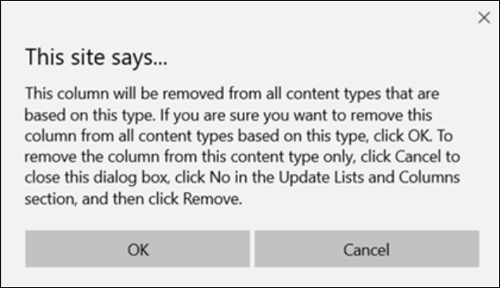
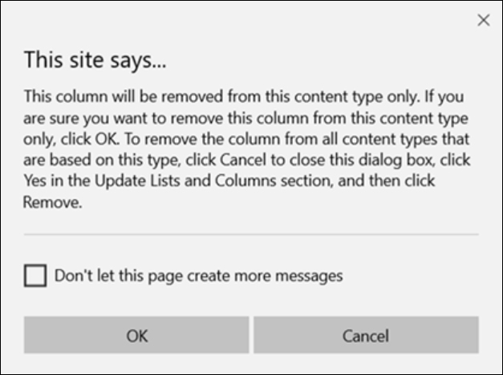
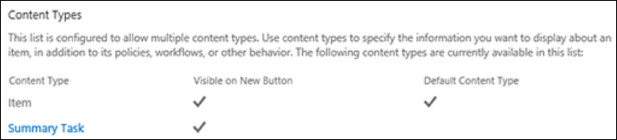
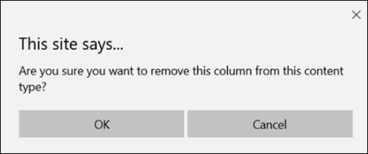

# Remove columns from a content type

Content types are a way of grouping information about list items or documents that you want to capture using columns. Columns can be added and removed from content types as necessary. However, they require administrator permissions to create or delete.

To learn more about adding columns to content types at the site, library, or list level, see [Add columns to a content type](https://support.microsoft.com/office/add-columns-to-a-content-type-1806e29e-8bcd-4058-b0e7-3aac40a3ae9a). For more info about adding content types, see [Create or customize a site content type](https://support.microsoft.com/office/create-or-customize-a-site-content-type-27eb6551-9867-4201-a819-620c5658a60f) and [Add a content type to a list or library](https://support.microsoft.com/office/add-a-content-type-to-a-list-or-library-917366ae-f7a2-47ad-87a5-9689a1884e60).

To remove a column from a content type, follow these steps:

> [!WARNING]
> If the content types that appear are not hyperlinks or cannot be selected, it means that the site inherits its content types from a different site. To remove a column to the content type, you must change it on the other site.

## Remove a column from a site content type

1. Go to the site where you want to change a site content type by adding a column.

2. Select **Settings** , and then select **Site Settings**. (If you don't see the **Site Settings** option, select **Site Contents**, and then select **Site Settings**.)

3. Under **Web Designer Galleries**, select **Site content types**.

4. Select the name of the content type that you want to remove a column from.

5. Under **Columns**, select the column name you want to remove. 

6. In the **Update List and Site Content Types** section, under **Update all content types inheriting from this type?**, if you want to update all content types that inherit from this site content type, select **Yes**. If you don't want to update the content types that inherit from this site, select **No**.

7. At the bottom right, select **Remove**.

If you previously selected **Yes**, the following prompt appears:

If you previously selected **No**, the following prompt appears:

8. To confirm the removal, select **OK**.

## Remove a column from a list or library content type

1. Go to the list or library where you want to change the column order.

2. Do one of the following:

    - If you're working in a list, select the **List** tab, and then select **List Settings**.
    
    

    - If you're working in a library, select the **Library** tab, and then select **Library Settings**.
    
    

3. Under **Content Types**, select the name of the content type that you want to remove a column from.

4. On the **Change Content Type Column** page, under **Columns**, select the column name you want to remove.

5. Select **Remove**.

6. To confirm the column removal, select **OK**.

