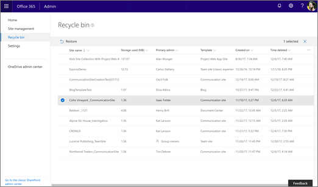

# Restore deleted sites

Deleted sites are retained for 93 days. After 93 days, sites and all their content and settings are permanently deleted, including lists, libraries, pages, and any subsites.
  
> [!NOTE]
> If you need to retain content for a minimum period of time to comply with industry regulations or internal policies, you can create a retention policy to keep a copy of it in the Preservation Hold library. For info, see [Overview of retention policies](/office365/securitycompliance/retention-policies).  For info about restoring items within a site, see [Restore items in the Recycle Bin of a SharePoint site](https://support.office.com/article/6df466b6-55f2-4898-8d6e-c0dff851a0be).  For info about restoring deleted sites in SharePoint Server, see [Restore deleted site collections using Microsoft Powershell](/powershell/module/sharepoint-server/restore-spdeletedsite). 
  
 
## Restore a deleted site in the new SharePoint admin center

In the new SharePoint admin center, you can delete and restore all the new types of sites. You can do this even as a SharePoint admin - you don't need to be a global admin.

1. Go to the [Deleted sites page of the new SharePoint admin center](https://admin.microsoft.com/sharepoint?page=recycleBin&modern=true) and sign in with an account that has [admin permissions](/sharepoint/sharepoint-admin-role) for your organization.

>[!NOTE]
>If you have Office 365 Germany, [sign in to the Microsoft 365 admin center](https://go.microsoft.com/fwlink/p/?linkid=848041), then browse to the SharePoint admin center and open the Deleted sites page.  If you have Office 365 operated by 21Vianet (China), [sign in to the Microsoft 365 admin center](https://go.microsoft.com/fwlink/p/?linkid=850627), then browse to the SharePoint admin center and open the Deleted sites page.
 

>[!NOTE]
>You can sort and filter deleted sites the same way you sort and filter sites on the Active sites page. You can also sort and filter deleted sites by Time deleted.
    
2. Select the site you want to restore.

3. Select **Restore**. (If you don't see the Restore button, make sure only one site is selected. The button won't appear if multiple sites are selected.)
 
> [!NOTE]
> Restoring a site that belongs to a Microsoft 365 group restores the Microsoft 365 group and all its resources. Note that the other group resources are retained for only 30 days, whereas the site is retained for 93. If the other group resources have been deleted, you can use the PowerShell command [Remove-SPODeletedSite](/powershell/module/sharepoint-online/remove-spodeletedsite) to permanently delete the site.  For info about permanently deleting sites from the Deleted sites page, see [Permanently delete a deleted site](delete-site-collection.md#permanently-delete-a-site).
  
  
## See also

[Restore deleted items from the site collection recycle bin](https://support.office.com/article/5fa924ee-16d7-487b-9a0a-021b9062d14b)
