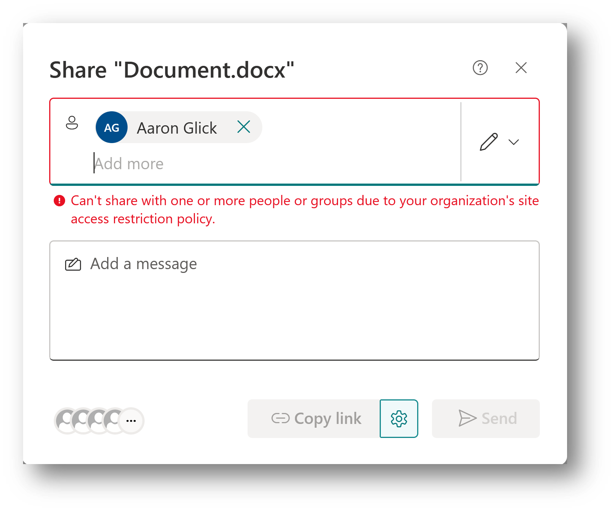
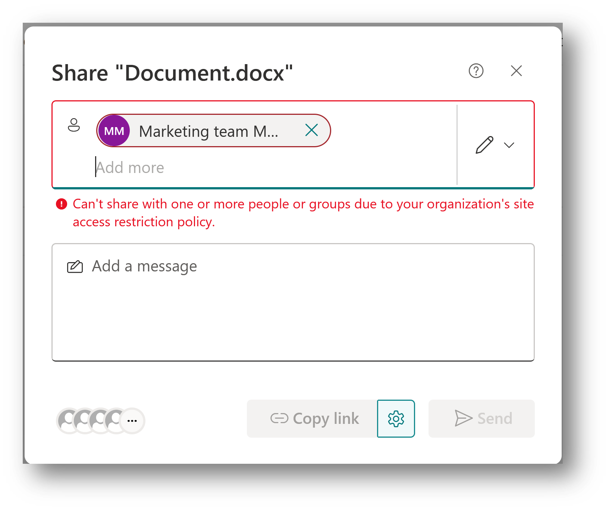
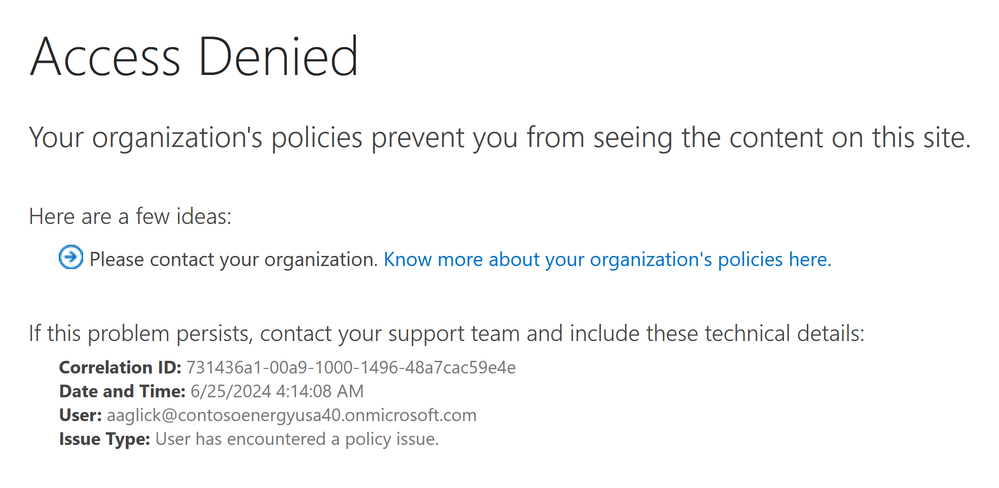

# Restrict SharePoint site access with Microsoft 365 groups and Entra security groups

[!INCLUDE[Advanced Management](includes/advanced-management.md)]

You can restrict access to SharePoint sites and content to users in a specific group by using a site access restriction policy. Users not in the specified group can't access the site or its content, even if they had prior permissions or a shared link. This policy can be used with Microsoft 365 group-connected, Teams-connected, and non-group connected sites.

Site access restriction policies are applied when a user attempts to open a site or access a file. Users with direct permissions to the file can still view files in search results. However, they can't access the files if they're not part of the specified group.

Restricting site access via group membership can minimize the risk of oversharing content. For insights into data sharing, see [Data access governance reports](data-access-governance-reports.md).

## Prerequisites

The site access restriction policy requires [Microsoft SharePoint Premium - SharePoint Advanced Management](advanced-management.md).

## Enable site-level access restriction for your organization

You must enable site-level access restriction for your organization before you can configure it for individual sites.

To enable site-level access restriction for your organization in SharePoint admin center:

1. Expand **Policies** and select **Access control**.
2. Select **Site-level access restriction**.
3. Select **Allow access restriction** and then select **Save**.

   :::image type="content" source="media/rac-spac/1-RAC-SPAC-dashboard-feb-2024.png" alt-text="screenshot of site access restriction in sharepoint admin center dashboard." lightbox="media/rac-spac/1-RAC-SPAC-dashboard-feb-2024.png":::

To enable site-level access restriction for your organization using PowerShell, run the following command:

```Powershell
Set-SPOTenant -EnableRestrictedAccessControl $true
```

It might take up to one hour for command to take effect

> [!NOTE]
> For Microsoft 365 Multi-Geo users, run this command separately for each desired geo-location.

## Restrict access to group-connected sites (Microsoft 365 Groups and Teams)

Site access restriction policy for group-connected sites restricts SharePoint site access to members of the Microsoft 365 group or team associated with the site.

To manage site access restriction for a group-connected site in SharePoint admin center

1. In SharePoint admin center, expand **Sites** and select **Active sites**.
1. Select the site you want to manage and the site details panel appears.
1. In the **Settings** tab, select **Edit** in the **Restricted site access** section.
1. Select the **Restrict access to this site** box and select **Save**.

To manage site access restriction for group-connected sites using PowerShell, use the following commands:

| Action  | PowerShell command |
|---------|---------|
|Enable site access restriction for group-connected site    |`Set-SPOSite -Identity <siteurl> -RestrictedAccessControl $true`|
|View site access restriction for group-connected site |`Get-SPOSite -Identity <siteurl> -Select RestrictedAccessControl`|
|Disable site access restriction for group-connected site |`Set-SPOSite -Identity <siteurl> -RestrictedAccessControl $false`|

> [!NOTE]
> Once the policy is enabled for a site, the site owner can view the details of how the site access restriction policy affects the site.

For group-connected sites, the policy status and the configured control group details are displayed on the **Site Information** and **Permissions** panels.

:::image type="content" source="media/rac-spac/3-rac-site-information-page.png" alt-text="screenshot of site information page for restricted access control.":::

:::image type="content" source="media/rac-spac/4-rac-site-permissions-page.png" alt-text="screenshot of site permissions page for restricted access control.":::

## Restrict site access to non-group connected sites

You can restrict access to non-group connected sites by specifying [Entra security groups](/azure/active-directory/fundamentals/how-to-manage-groups) or Microsoft 365 groups that contain the people who should be allowed access to the site. You can configure up to 10 Entra security groups or Microsoft 365 groups. Once the policy is applied, users in the specified group who have site access permissions are granted access to the site and its content. You can use [dynamic security groups](/azure/active-directory/enterprise-users/groups-create-rule) if you want to base group membership on user properties.

To manage site access to a non-group connected site:

1. In SharePoint admin center, expand **Sites** and select **Active sites**.
1. Select the site you want to manage and the site details panel appears.
1. In **Settings** tab, select **Edit** in the **Restricted site access** section.
1. Select the **Restrict SharePoint site access to only users in specified groups** check box.
1. Add or remove your security groups or Microsoft 365 groups and select **Save**.

   In order for site access restriction to be applied to the site, you must add at least one group to the site access restriction policy.

    :::image type="content" source="media/rac-spac/non-group-connected-sites/restricted-access-control-non-group-connected-site-page.png" alt-text="screenshot showing site access restriction security groups being added to non-group connected sites." lightbox="media/rac-spac/non-group-connected-sites/restricted-access-control-non-group-connected-site-page.png":::

To manage site access restriction for non-group connected sites using PowerShell, use the following commands:

| Action  | PowerShell command |
|---------|---------|
|Enable site access restriction     |`Set-SPOSite -Identity <siteurl> -RestrictedAccessControl $true`|
|Add group |`Set-SPOSite -Identity <siteurl> -AddRestrictedAccessControlGroups <comma separated group GUIDS>`         |
|Edit group     |`Set-SPOSite -Identity <siteurl> -RestrictedAccessControlGroups <comma separated group GUIDS>`         |
|View group     |`Get-SPOSite -Identity <siteurl> Select RestrictedAccessControl, RestrictedAccessControlGroups`         |
|Remove group     |`Set-SPOSite -Identity <siteurl> -RemoveRestrictedAccessControlGroups <comma separated group GUIDS>`         |  
|Reset site access restriction  |`Set-SPOSite -Identity <siteurl> -ClearRestrictedAccessControl`         |

After enabling the policy for communication sites, the policy status and all configured control groups are displayed for site owners on the **Site access** panel in addition to the **Site Information** and **Permissions** panels.

:::image type="content" source="media/rac-spac/5-rac-site-access-page.png" alt-text="screenshot of site access panel for restricted access control.":::

## Shared and private channel sites

Shared and private channel sites [are separate from the Microsoft 365 group-connected site that standard channels use](teams-connected-sites.md). Because shared and private channel sites aren't connected to the Microsoft 365 group, site access restriction policies applied to the team don't affect them. You must enable site access restriction for each shared or private channel site separately as non-group connected sites.

For shared channel sites, only internal users in the resource tenant are subject to site access restriction. External channel participants are excluded from site access restriction policy and only evaluated per the site's existing site permissions.

> [!IMPORTANT]
> Adding people to the security group or Microsoft 365 group won't give users access to the channel in Teams. It is recommended to add or remove the same users of the teams channel in Teams and the security group or Microsoft 365 group so users have access to both Teams and SharePoint.

## Sharing of sites with Restricted site access policy

Sharing of SharePoint sites and its content can be blocked with users and groups who are not allowed as per the Restricted access control policy. 

The sharing control functionality is disabled by default. To enable it, run the following PowerShell command in SharePoint Online Management Shell as an Administrator: 

```powershell
Set-SPOTenant -AllowSharingOutsideRestrictedAccessControlGroups $false 
```

### Sharing with users

Sharing is only allowed with users who are part of restricted access control groups. Sharing will be blocked with anyone outside of the restricted access control groups as shown below:



### Sharing with groups

Sharing is allowed with Microsoft Entra Security or M365 groups which are part of the restricted access control groups list. Thus, sharing with all other groups including Everyone except external users or SharePoint groups won’t be allowed.



> [!NOTE]
> At present, sharing of a site and its content will not be allowed for the nested security groups that are part of the restricted access control groups. This support will be added in the next release iteration. 

## Configure learn more link for access denial error page

Configure your learn more link to inform users who were denied access to a SharePoint site due to the restricted site access control policy. With this customizable error link, you can provide more information and guidance to your users.

> [!NOTE]
> The learn more link is a tenant-level setting that applies to all sites that have restricted access control policy enabled.  

To configure the link, run the following command in SharePoint PowerShell:

```powershell
Set-SPOTenant -RestrictedAccessControlForSitesErrorHelpLink “<Learn more URL>” 
```

To fetch the value of the link, run the following command:

```powershell
Get-SPOTenant | select RestrictedAccessControlForSitesErrorHelpLink 
```

The configured learn more link is launched when the user selects the **Know more about your organization’s policies here** link.



## Restricted site access policy insights

As an IT administrator, you can view the following reports to gain more insight about SharePoint sites protected with restricted site access policy:

- Sites protected by restricted site access policy (RACProtectedSites)
- Details of access denials due to restricted site access (ActionsBlockedByPolicy)

> [!NOTE]
> It can take a few hours to generate each report.

### Sites protected by restricted site access policy report

You can run the following commands in SharePoint PowerShell to generate, view, and download the reports:

| Action  | PowerShell command | Description |
|---------|---------|---------|
|Generate report     |`Start-SPORestrictedAccessForSitesInsights -RACProtectedSites`| Generates a list of sites protected by restricted site access policy|
|View report |`Get-SPORestrictedAccessForSitesInsights -RACProtectedSites -ReportId <Report GUID>`| The report shows the top 100 sites with the highest page views that are protected by the policy.|
|Download report   |`Get-SPORestrictedAccessForSitesInsights -RACProtectedSites -ReportId <Report GUID> -Action Download`| This command must be run as an administrator. The downloaded report is located on the path where the command was run.|
|Percentage of site protected with restricted site access report|`Get-SPORestrictedAccessForSitesInsights -RACProtectedSites -ReportId <Report GUID> -InsightsSummary`|This report shows the percentage of sites that are protected by the policy out of the total number of sites|

### Access denials due to restricted site access policy

You can run the following commands to create, fetch, and view report for access denials due to restricted site access reports:

| Action  | PowerShell command | Description |
|---------|---------|---------|
|Create access denials report    |`Start-SPORestrictedAccessForSitesInsights -ActionsBlockedByPolicy`| Creates a new report for fetching access denial details|
|Fetch access denials report status |`Get-SPORestrictedAccessForSitesInsights -ActionsBlockedByPolicy`| Fetches the status of the generated report.|
|Latest access denials in the past 28 days|`Get-SPORestrictedAccessForSitesInsights -ActionsBlockedByPolicy -ReportId <Report ID> -Content AllDenials`| Gets a list of the most recent 100 access denials that occurred in the past 28 days|
|View list of top users who were denied access| `Get-SPORestrictedAccessForSitesInsights -ActionsBlockedByPolicy -ReportId <Report ID> -Content TopUsers`|Gets a list of the top 100 users who received the most access denials|
|View list of top sites that received the most access denials|`Get-SPORestrictedAccessForSitesInsights -ActionsBlockedByPolicy -ReportId <Report ID> -Content TopSites`| Gets a list of the top 100 sites that had the most access denials|
|Distribution of access denials across different types of sites|`Get-SPORestrictedAccessForSitesInsights -ActionsBlockedByPolicy -ReportId <Report ID> -Content SiteDistribution`|Shows the distribution of access denials across different types of sites|

> [!NOTE]
> To view up to 10,000 denials, you must download the reports. Run the download command as an administrator and the downloaded reports will be located on the path from where command was run.

## Auditing

[Audit events](/office/office-365-management-api/office-365-management-activity-api-schema) are available in the Purview compliance portal to help you monitor site access restriction activities. Audit events are logged for the following activities:

- Applying site access restriction for site
- Removing site access restriction for site
- Changing site access restriction groups for site

## Related articles

[Conditional access policy for SharePoint sites and OneDrive](authentication-context-example.md)

[Data Access Governance reports](data-access-governance-reports.md)
