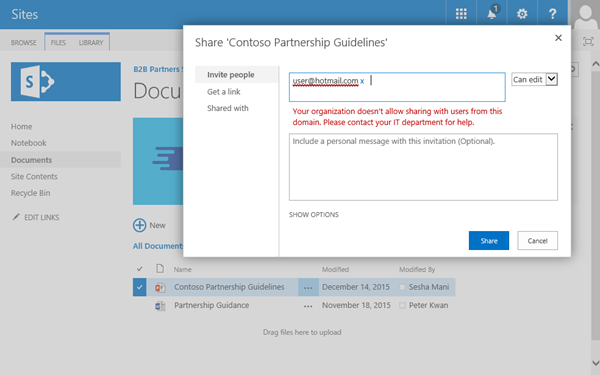
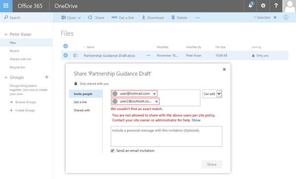
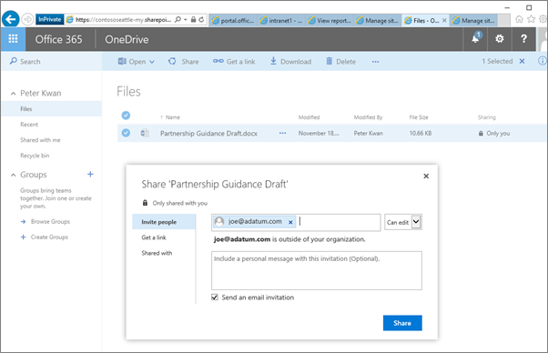

# Restrict sharing of SharePoint and OneDrive content by domain

If you want to restrict sharing with other organizations (either at the organization level or site level), you can limit sharing by domain. 
  
## Limiting domains

You can limit domains by allowing only the domains you specify or by allowing all domains except those you block. 
  
 **To limit domains at the organization level**
  
1. Sign in to https://admin.microsoft.com as a global or SharePoint admin. (If you see a message that you don't have permission to access the page, you don't have Office 365 administrator permissions in your organization.)
    
    > [!NOTE]
    > If you have Office 365 Germany, sign in at https://portal.office.de. If you have Office 365 operated by 21Vianet (China), sign in at https://login.partner.microsoftonline.cn/. Then select the Admin tile to open the admin center.  

2. In the left pane, under **Admin centers**, select **SharePoint**. (You might need to select **Show all** to see the list of admin centers.) 

4. In the left pane, select **Sharing**. 
    
5. Under **Advanced settings for external sharing**, select the **Limit external sharing by domain** check box, and then select **Add domains**. 
    
6. Select **Allow only specific domains** to create an allow list (most restrictive) or **Block specific domains** to block only the domains you specify. 
    
7. List the domains (maximum of 1000) in the box provided, using the format  *domain.com.* If listing more than one domain, enter each domain on a new line. 
    
    > [!NOTE]
    > Wildcards are not supported for domain entries. 
  
You can also configure the organization-wide setting by using the [Set-SPOTenant](https://docs.microsoft.com/en-us/powershell/module/sharepoint-online/Set-SPOTenant) PowerShell cmdlet. 
  
You can also limit domains at the site collection level. Note the following considerations:
  
- In the case of conflicts, the organization-wide configuration takes precedence over the site collection configuration.
    
- If an organization-wide allow list is configured, then you can only configure an allow list at the site collection level. The site collection allow list must be a subset of the organization's allow list.
    
- If an organization-wide deny list is configured, then you can configure either an allow list or a deny list at the site collection level.
    
- For individual OneDrive for Business site collections, you can only configure this setting by using the [Set-SPOSite](https://docs.microsoft.com/en-us/powershell/module/sharepoint-online/Set-SPOSite) Windows PowerShell cmdlet. 
    
 **To limit domains for a classic site collection**
  
1. Sign in to https://admin.microsoft.com as a global or SharePoint admin. (If you see a message that you don't have permission to access the page, you don't have Office 365 administrator permissions in your organization.)
    
    > [!NOTE]
    > If you have Office 365 Germany, sign in at https://portal.office.de. If you have Office 365 operated by 21Vianet (China), sign in at https://login.partner.microsoftonline.cn/. Then select the Admin tile to open the admin center.  
    
2. In the left pane, under **Admin centers**, select **SharePoint**. (You might need to select **Show all** to see the list of admin centers.)
 
3. Select **Classic features**.

4. Select **More classic features**.
    
3. Under **Classic site collections page**, and then select **Open**.
 
5. Select a site collection, and then select **Sharing**.
    
6. Under **Site collection additional settings**, select the **Limit external sharing using domain** check box. 
    
7. From the drop-down list, choose either **Don't allow sharing with users from these blocked domains** to deny access to targeted domains or **Allow sharing only with users from these domains** to limit access to only to the domains you list. 
    
8. List the domains (maximum of 100) in the box provided, using the format  *domain.com.* If listing more than one domain, separate each domain with a space or a carriage return. 
    
    > [!NOTE]
    > Wildcards are not supported for domain entries. 
  
> [!NOTE]
> To configure the site collection setting for site collections that do not appear in this list (such as Group-connected sites or individual OneDrive for Business site collections), you must use the [Set-SPOSite](https://go.microsoft.com/fwlink/?linkid=2003901) PowerShell cmdlet. 
  
## Sharing experience

After you limit sharing by domain, here's what you'll see when you share a document:
  
- **Sharing content with email domains that are not allowed.** If you attempt to share content with a guest whose email address domain isn't allowed, an error message will display and sharing will not be allowed.

    (If the user is already in your directory, you won't see the error, but they will be blocked if they attempt to access the site.)
    
    

- **Sharing OneDrive files with guests on domains that aren't allowed.** If a users tries to share a OneDrive file with a guest whose email domain isn't allowed, an error message will display and sharing will not be allowed.

    
  
- **Sharing content with email domains that are allowed.** Users will be able to successfully share the content with the guest. A tooltip will appear to let them know that the guest is outside of their organization. 
    
    
  
## User auditing and lifecycle management

As with any extranet sharing scenario it's important to consider the lifecycle of your guest users, how to audit their activity, and eventually how to archive the site. See [Planning SharePoint Online business-to-business (B2B) extranet sites](plan-b2b-extranet-sites.md) for more information. 
  
## See also

[External sharing overview](external-sharing-overview.md)
  
[Extranet for Partners with Office 365](create-b2b-extranet.md)
  
[Set-SPOTenant](https://go.microsoft.com/fwlink/?linkid=2003900)

