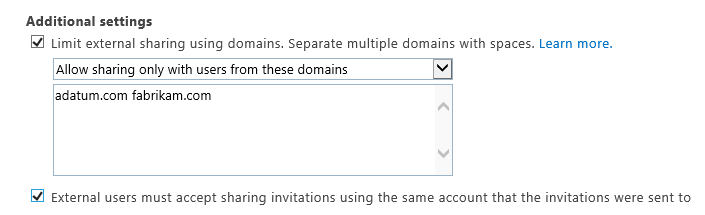

# Restricted domains sharing in SharePoint Online and OneDrive for Business

With SharePoint Online you can share a site with users from specific domains by using the restricted domains setting. This is useful for a business-to-business extranet scenario where you want to limit sharing with a particular business partner.
  
## Restricting domains

Administrators can configure external sharing by using either the domain allow list or deny list. This can be done at the tenant level or the site collection level. Administrators can limit sharing invitations to a limited number of email domains by listing them in the allow list or opt to use the deny list, listing email domains to which users are prohibited from sending invitations.
  
Tenant-level settings affect all SharePoint Online site collections, including the OneDrive for Business site collection.
  
 **To restrict domains in external sharing in SharePoint Online and OneDrive for Business at the tenant level**
  
1. Sign in to Office 365 as a global admin or SharePoint admin.
    
2. Select the app launcher icon  in the upper-left and choose **Admin** to open the Office 365 admin center. (If you don't see the Admin tile, you don't have Office 365 administrator permissions in your organization.) 
    
3. In the left pane, choose **Admin centers** \> **SharePoint**.
    
4. Select the **sharing** tab. 
    
5. Under **Additional settings**, select the **Limit external sharing using domains** check box. 
    
6. From the drop-down list, choose either **Don't allow sharing with users from these blocked domains** to deny access to targeted domains or **Allow sharing only with users from these domains** to limit access to only to the domains you list. 
    
7. List the domains (maximum of 1000) in the box provided, using the format  *domain.com.*  . If listing more than one domain, separate each domain with a space or a carriage return. 
    
    
  
    > [!NOTE]
    > Wildcards are not supported for domain entries. 
  
You can also configure the tenant-level setting by using the [Set-SPOTenant](https://go.microsoft.com/fwlink/?linkid=2003900) Windows PowerShell cmdlet. 
  
You can also use restricted domains at the site collection level. Note the following considerations:
  
- In the case of conflicts, the tenant-level configuration takes precedence over the site collection configuration.
    
- If a tenant-level allow list is configured, then you can only configure an allow list at the site collection level. The site collection allow list must be a subset of the tenant allow list.
    
- If a tenant-level deny list is configured, then you can configure either an allow list or a deny list at the site collection level.
    
- For individual OneDrive for Business site collections, you can only configure this setting by using the [Set-SPOSite](https://go.microsoft.com/fwlink/?linkid=2003901) Windows PowerShell cmdlet. 
    
 **To restrict domains in external sharing in SharePoint Online at the site collection level**
  
1. Sign in to Office 365 as a global admin or SharePoint admin.
    
2. Select the app launcher icon  in the upper-left and choose **Admin** to open the Office 365 admin center. (If you don't see the Admin tile, you don't have Office 365 administrator permissions in your organization.) 
    
3. In the left pane, choose **Admin centers** \> **SharePoint**.
    
4. Select the **site collections** tab. 
    
5. Select a site collection, and then click **Sharing**.
    
6. Under **Site collection additional settings**, select the **Limit external sharing using domain** check box. 
    
7. From the drop-down list, choose either **Don't allow sharing with users from these blocked domains** to deny access to targeted domains or **Allow sharing only with users from these domains** to limit access to only to the domains you list. 
    
8. List the domains (maximum of 60) in the box provided, using the format  *domain.com.*  . If listing more than one domain, separate each domain with a space or a carriage return. 
    
    > [!NOTE]
    > Wildcards are not supported for domain entries. 
  
> [!NOTE]
> To configure the site collection setting for site collections that do not appear in this list (such as Group-connected sites or individual OneDrive for Business site collections), you must use the [Set-SPOSite](https://go.microsoft.com/fwlink/?linkid=2003901)Windows PowerShell cmdlet. 
  
## Sharing experience

After you have configured the restricted domains sharing feature, here's what you'll see when you share a document:
  
- **Sharing content with email domains that are not allowed.** If you attempt to share content with an external user whose email address domain violates your restricted domains settings, an error message will display and sharing will not be allowed: 
    
- **Sharing OneDrive for Business files to email domains that are not allowed.** If you try to share a OneDrive for Business file with an external user whose email domain is not allowed as a result of your restricted domains configuration, an error message will display and sharing will not be allowed: 
    
    
  
- **Sharing content with email domains that are allowed.** If your end user is attempting to share content with an external user who has an email address domain that is allowed, they will be able to successfully share the content with that external user. A tool tip lets you know that the user is outside of their organization. 
    
    
  
## User auditing and lifecycle management

As with any extranet sharing scenario it's important to consider the lifecycle of your guest users, how to audit their activity, and eventually how to archive the site. See [Planning SharePoint Online business-to-business (B2B) extranet sites](plan-b2b-extranet-sites.md) for more information. 
  
## See also

[Manage external sharing for your SharePoint Online environment](external-sharing-overview.md)
  
[Extranet for Partners with Office 365](create-b2b-extranet.md)
  
[Set-SPOTenant](https://go.microsoft.com/fwlink/?linkid=2003900)

