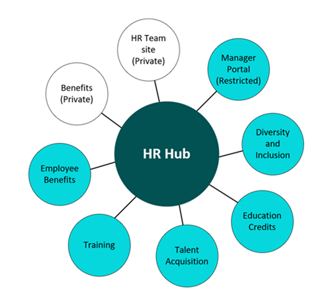

# Restricted SharePoint Search

> [!IMPORTANT]
> Restricted SharePoint Search is designed for customers of Microsoft 365 Copilot.  

## What is Restricted SharePoint Search?

Restricted SharePoint Search is a setting that helps you as a [SharePoint Administrator](/sharepoint/sharepoint-admin-role) or [above](/microsoft-365/admin/add-users/about-admin-roles) in Microsoft 365 to maintain a list of SharePoint sites ("allowed list") that you have checked  the permissions and applied data governance for. The allowed list defines which SharePoint sites can participate in organization-wide search and Copilot experiences. By default, the Restricted SharePoint Search setting is turned off and the allowed list is empty. 

Restricted SharePoint Search allows you to restrict both organization-wide search and Copilot experiences to a curated set of SharePoint sites of your choice. Additionally, whether you have enabled Restricted SharePoint Search, users in your organization are still able to interact with files and content they own or that they have previously accessed in Copilot.  

## Why should you use Restricted SharePoint Search?

Restricted SharePoint Search gives you time to review and audit site permissions. We provide Restricted SharePoint Search to help you maintain momentum with your Copilot deployment while you're implementing comprehensive data security with [SharePoint Advanced Management](/sharepoint/advanced-management), and [Microsoft Purview](/purview/ai-microsoft-purview). Combined, these solutions offer a complete solution for data discovery, protection, and governance, ensuring a secure and managed data lifecycle.

Restricted SharePoint Search addresses oversharing concerns by allowing organizations to:

- Prevent sites from showing up in organization-wide search results and Copilot experiences until your admins or site owners can check the permissions on the site content;
- Honor existing site permissions, and let site owners manage individual site permissions.

If Restricted SharePoint Search is enabled, the customer's experience is impacted in the following ways:

- Search results are limited to sites on the allowed list, users’ frequently visited sites, sites that users already have permissions to, and users’ recently accessed files.  Turning on this feature impacts the overall search experience, even for non-Copilot users.
- Copilot has less information available to reference, which may impact its ability to provide accurate and comprehensive responses.

Remember, whether you have enabled Restricted SharePoint Search, users in your organization are always able to interact with files and content they own or that they have previously accessed in Copilot    .  

## How does Restricted SharePoint Search work?

As a [SharePoint Administrator](/sharepoint/sharepoint-admin-role) or [above](/microsoft-365/admin/add-users/about-admin-roles) in Microsoft 365, you're able to:

- Check the current status of Restricted SharePoint Search (enabled or disabled)
- Enable or disable Restricted SharePoint Search
- [Curate the allowed list](restricted-sharepoint-search-allowed-list.md) by identifying the top 100 widely used sites
- Add or remove sites from the allowed list by providing the site URL
- Get the full list of sites in the allowed list

Restricted SharePoint Search is off by default. If you decide to enable it,  Copilot and non-Copilot users are able to find and use content from:

- An allowed list of curated SharePoint sites set up by admins (with *up to 100 SharePoint sites*), honoring sites’ existing permissions.
- Users’ OneDrive files, chats, emails, calendars they have access to.
- Files from their frequently visited SharePoint sites.
- Files that were shared directly with the users.
- Files that the users viewed, edited, or created.

> [!NOTE]
> - The limit of up to 100 SharePoint sites includes Hub sites, but not their associated sites.   When you enable Hub sites, the associated sites of a Hub site are included in the allowed-list  but do not count towards the 100-site limit. This approach allows for greater flexibility while still adhering to the existing constraints. When you are picking Hub sites, make sure all the associated sites have proper permissions.
> - The total number of files included from the last three bullet points (frequently visited sites, files shared directly with the user, and files the users viewed, edited, or created) is limited to the last 2,000 entities.

The following diagram shows an example of an HR Hub site with eight associated sites:
 All eight associated sites plus the HR Hub site are counted as one site in the allowed-list.

Let's consider Alex Wilber, a marketing specialist at Contoso Electronics. Before the organization uses Restricted SharePoint Search, Alex can see not only his own personal contents, like his OneDrive files, chats, emails, contents that he owns or visited, but also content from some sites that haven't undergone access permission review or Access Control Lists (ACL) hygiene, and doesn't have data governance applied. For example, Contoso Electronics has a budgeting site with important business information. Most people don't know about this site, so the site owner hasn't set up proper permissions and hasn't followed correct data governance process. The site might be open to some users who aren't allowed to see it, such as Alex. When Alex asks Copilot for some budgeting information, Copilot gets information from the budgeting site.

The IT admin at Contoso Electronics uses Restricted SharePoint Search to limit what sites can be searched through the allowed list. They check SPAC and SPAC DAG reports and decide to exclude this budgeting site from the allowed list. After RSS is turned on, Alex can still access things that he owns or has recently visited, or that are directly shared with him, but he can’t access any other sites, unless the site is in the allowed list and he has permission to it. When Alex asks Copilot the same question about budgeting now, Copilot won’t show them any information from that site.

> [!NOTE]
> Site scoped searches aren’t affected by this control. This control impacts [modern search](/microsoftsearch/get-started-search-in-sharepoint-online) and copilot experiences.

## Frequently asked questions

### Can I use RSS for creating a "deny list" instead?

No, this capability isn't part of Restricted SharePoint Search. However, SharePoint Advanced Management offers a similar feature called [Restricted Access Control for SharePoint sites](/sharepoint/restricted-access-control). If your customer isn't ready to use SharePoint Advanced Management, then they can alternatively evaluate to disable the following setting in SharePoint. To learn more information, review [Allow this site to appear in Search results](/sharepoint/make-site-content-searchable#show-content-on-a-site-in-search-results).

> [!NOTE]
> When you turn off “Allow this site to appear in Search results”, you block the site content from showing up in both the organization-wide search and the site specific search.  

### Does Restricted SharePoint Search impact other services that don't depend on SharePoint? For example, Exchange, To-do, Planner, Loop, etc.?

Yes, any product where Enterprise Search is enabled and could have SharePoint content and/or files as search results will be impacted.

### Does Restricted SharePoint Search impact other features based on the Microsoft Index? For example, Purview or SharePoint Advanced Management features?

No, Restricted SharePoint Search won't affect any other features 
based on the Microsoft Index.

### After enabling RSS how long does it take to take place?

RSS will go into effect within an hour after it's enabled.

### If I give the URL of a hub site, will it also include all of the child sites or sites associated hub sites with it? Do these other sites count towards the 100 sites in the allowed lists?

Only the hub site (the URL in the Allowed list) is included in the 100. The sub sites under the hub site aren't counted against the 100 limit but RSS is effective on the sub sites.

## What to do next?

After setting up Restricted SharePoint Search and enabling Microsoft 365 Copilot for your organization, you should evaluate the SharePoint sites [activities](/microsoft-365/admin/activity-reports/sharepoint-activity) and [usage](/microsoft-365/admin/activity-reports/sharepoint-site-usage) to adjust the allowed list. You can use [Microsoft SharePoint Admin Center](/sharepoint/advanced-management) and [Microsoft Purview](/purview/ai-microsoft-purview) to gradually increase the scope of search and Copilot experience for your organization. Restricted SharePoint Search honors existing site permissions, so you can work with site owners and admins to add [advanced access policies](/sharepoint/advanced-management#advanced-access-policies-for-secure-content-collaboration) and [advanced site content lifecycle management](/sharepoint/advanced-management#advanced-sites-content-lifecycle-management) for specific users and groups through Microsoft SharePoint Advanced Management. Moreover, Microsoft Purview enhances your organization’s data security and compliance for Copilot.
