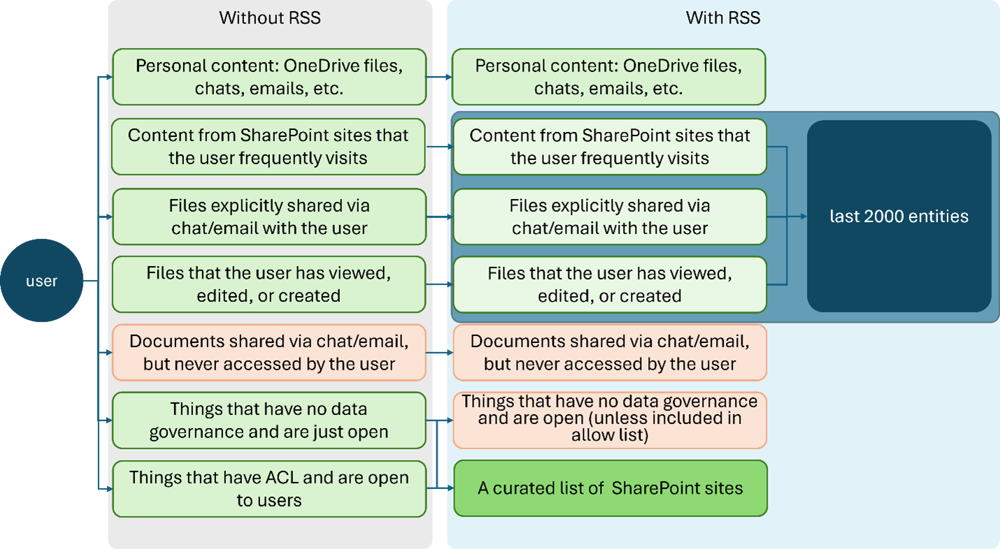

# Restricted SharePoint Search

> [!IMPORTANT]
> Restricted SharePoint Search is designed for customers of Copilot for Microsoft 365.  

## What is Restricted SharePoint Search?

Restricted SharePoint Search is a setting that helps you as Global and SharePoint administrator to maintain a list of SharePoint sites ("allowed list") that you have checked  the permissions and applied data governance for. The allowed list defines which SharePoint sites can participate in organization-wide search and Copilot experiences. By default, the Restricted SharePoint Search setting is turned off and the allowed list is empty. This feature is currently available as Public Preview for customers who have Microsoft 365 and Copilot licenses.

Restricted SharePoint Search allows you to restrict both organization-wide Search and Copilot experiences to a curated set of SharePoint sites of your choice. Additionally, whether you have enabled Restricted SharePoint Search, users in your organization are still able to interact with files and content they own or that they have previously accessed in Copilot.  

## Why should you use Restricted SharePoint Search?

Restricted SharePoint Search gives you time to review and audit site permissions. We provide Restricted SharePoint Search to help you maintain momentum with your Copilot deployment while you're implementing comprehensive data security with [SharePoint Advanced Management](/sharepoint/advanced-management), and [Microsoft Purview](/purview/ai-microsoft-purview). Combined, these solutions offer a complete solution for data discovery, protection, and governance, ensuring a secure and managed data lifecycle.

Restricted SharePoint Search addresses oversharing concerns by allowing organizations to:
• Prevent sites from showing up in organization-wide search results and Copilot experiences until your admins or site owners can check the permissions on the site content;
• Honor existing site permissions, and let site owners manage individual site permissions.

If Restricted SharePoint Search is enabled, the customer's experience is impacted in the following ways:
• Search results are limited to sites on the allowed list, users’ frequently visited sites, sites that users already have permissions to, and users’ recently accessed files.  Turning on this feature impacts the overall search experience, even for non-Copilot users.
• Copilot has less information available to reference, which may impact its ability to provide accurate and comprehensive responses.

Remember, whether you have enabled Restricted SharePoint Search, users in your organization are always able to interact with files and content they own or that they have previously accessed in Copilot    .  

## How does Restricted SharePoint Search work?

As the Global/Tenant and SharePoint administrator, you're able to:
• Check the current status of Restricted SharePoint Search (enabled or disabled)
• Enable or disable Restricted SharePoint Search
• [Curate the allowed list](restricted-sharepoint-search-allowed-list.md) by identifying the top 100 widely used sites
• Add or remove sites from the allowed list by providing the site URL
• Get the full list of sites in the allowed list

Restricted SharePoint Search is off by default. If you decide to enable it,  Copilot and non-Copilot users are able to find and use content from:
• An allowed list of curated SharePoint sites set up by admins (with *up to 100 SharePoint sites*), honoring sites’ existing permissions.
• Content from their frequently visited SharePoint sites.
• Users’ OneDrive files, chats, emails, calendars they have access to.
• Files that were shared directly with the users.
• Files that the users viewed, edited, or created.

> [!NOTE]
> The limit of up to 100 SharePoint sites includes Hub sites, but not their sub-sites.   When you enable Hub sites, the sub-sites under a Hub site are included in the allowed-list  but do not count towards the 100-site limit. This approach allows for greater flexibility while still adhering to the existing constraints  . When you are picking Hub sites, make sure all the child sites have proper permissions.

The following diagram shows an example of an HR Hub site with eight sub-sites:

Among these eight sub-sites:
• Five sub-sites Diversity and Inclusion, Education Credits, Talent Acquisition, Training, and Employee Benefits inherit the HR Hub site permission settings. These five sites have the same permissions to the HR Hub site has.
• Two (HR Team site and Benefits site) are private Teams channel sites. Their corresponding Teams channel owners are sites owners in SharePoint and channel members are site members.
• One (Manager Portal) is restricted. Users not in a specified group can't access this site or its content, even if they have permissions to the HR Hub site.

The following diagram explains the differences of users’ access to files during organization wide search and their Copilot experiences, before and after Restricted SharePoint Search is set up:

Imagine Alex Willer, a marketing specialist at Contoso Electronics. Before Contoso Electronics apply Restricted SharePoint Search, when Alex uses organization-wide search or Copilot, he can access not only Alex’ personal contents, such as his OneDrive files, chats, emails, contents that Alex own or visited, but also content from sites that are exposed to everyone in the organization.For example, Contoso Electronics has a budgeting site with important business information. People usually don’t know this site exist, so site owner hasn’t applied proper permissions. The site is open for everyone in the organization. When Alex asks a question to Copilot for some budgeting information, Copilot pulls information from the budgeting site.

When the IT admin at Contoso Electronics applies Restricted SharePoint Searches, they review SPAC and SPAC DAG reports and decide not to include this budgeting site in the allowed list. After the RSS allowed list is enabled, Alex can still access things that he owns or recently visited, or directly shared with him, but he can’t access sites that are open to everyone anymore, unless the site is included in the allowed list and he has permission to it. When Alex asks Copilot the same question about budgeting now, Copilot won't’ give them information from that site.

> [!NOTE]
> Site scoped searches aren’t affected by this control. This control impacts [modern search](/microsoftsearch/get-started-search-in-sharepoint-online) and copilot experiences.

## Frequently asked questions

### Can I use RSS for creating a "deny list" instead?

No, this capability isn't part of Restricted SharePoint Search. However, SharePoint Advanced Management offers a similar feature called [Restricted Access Control for SharePoint sites](/sharepoint/restricted-access-control). If your customer isn't ready to use SharePoint Advanced Management, then they can alternatively evaluate to disable the following setting in SharePoint. To learn more information, review [Allow this site to appear in Search results](/sharepoint/make-site-content-searchable#show-content-on-a-site-in-search-results).

### Does Restricted SharePoint Search impact other services that don't depend on SharePoint? For example, Exchange, To-do, Planner, Loop, etc.?

Yes, any product where Enterprise Search is enabled will be impacted. These products include: Exchange, Teams, OneDrive, Microsoft Search in Office and Microsoft Search in Bing.

### After enabling RSS how long does it take to take place?

RSS will go into effect within an hour after it's enabled.

### If I give the URL of a hub site, will it also include all of the child sites or sites associated hub sites with it? Do these other sites count towards the 100 sites in the allowed lists?

Only the hub site (the URL in the Allowed list) is included in the 100. The sub sites under the hub site aren't part of the 100.  

## What to do next?

After setting up Restricted SharePoint Search and enabling Microsoft Copilot for Microsoft 365 for your organization, you should evaluate the SharePoint sites [activities](/microsoft-365/admin/activity-reports/sharepoint-activity) and [usage](/microsoft-365/admin/activity-reports/sharepoint-site-usage) to adjust the allowed list. You can use [Microsoft SharePoint Admin Center](/sharepoint/advanced-management) and [Microsoft Purview](/purview/ai-microsoft-purview) to gradually increase the scope of search and Copilot experience for your organization. Restricted SharePoint Search honors existing site permissions, so you can work with site owners and admins to add [advanced access policies](/sharepoint/advanced-management#advanced-access-policies-for-secure-content-collaboration) and [advanced site content lifecycle management](/sharepoint/advanced-management#advanced-sites-content-lifecycle-management) for specific users and groups through Microsoft SharePoint Advanced Management. Moreover, Microsoft Purview enhances your organization’s data security and compliance for Copilot.
