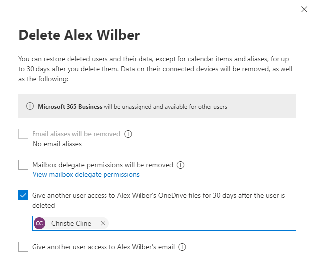

# OneDrive retention and deletion

This article describes how you can manage a user's OneDrive when you delete the user's Microsoft 365 account for your organization, and what steps happen automatically.
  
## Deleting a user from the Microsoft 365 admin center

When you delete a user from the Active users page in the Microsoft 365 admin center, you can choose what you want to do with the user's product licenses, email, and OneDrive. For more info, see [Delete a user from your organization](/office365/admin/add-users/delete-a-user).

If you give another user access to the OneDrive, that user will have 30 days by default to access and download the files they want to keep. (To change the retention time, see [Set the OneDrive retention for deleted users](set-retention.md).) They'll receive an email with a link to these instructions for accessing the deleted user's OneDrive: [Copy files from another user's OneDrive](https://support.office.com/article/7eb33f7d-6540-488f-afaf-56043828e47b.aspx).
  
## Configure automatic access delegation

By default, when a user is deleted, the user's manager is automatically given access to the user's OneDrive. Follow these steps to confirm that this automatic access delegation is enabled for your organization, and to set a secondary owner in case a user doesn't have a specified manager. If access delegation is disabled or a manager or secondary owner isn't set for a user, no one will have automatic access when the user is deleted or be warned that the OneDrive will be deleted.
  
1. Go to <a href="https://go.microsoft.com/fwlink/?linkid=2185077" target="_blank">More features in the new SharePoint admin center</a>, and sign in with an account that has [admin permissions](/sharepoint/sharepoint-admin-role) for your organization.

    >[!Note]
    >If you have Office 365 operated by 21Vianet (China), [sign in to the Microsoft 365 admin center](https://go.microsoft.com/fwlink/p/?linkid=850627), then browse to the SharePoint admin center and open the More features page.

2. Under **User profiles**, select **Open**.

3. Under **My Site Settings**, select **Setup My Sites**.

4. Next to **My Site Cleanup**, make sure **Enable access delegation** is selected.

5. We recommend that you also specify a secondary owner account in the **My Site Cleanup** section. This account will be the appointed owner of the OneDrive if the user's manager isn't set in Microsoft Entra ID. Email notifications will also be sent to the secondary owner account when the value is populated.

6. Select **OK**.
  
## The OneDrive deletion process

The OneDrive retention period for cleanup of OneDrive begins when a user account is deleted from Microsoft Entra ID. No other action will cause the cleanup process to occur, including blocking the user from signing in or removing the user's license. For info about removing a user's license, see [Remove licenses from users in Microsoft 365 for business](/office365/admin/subscriptions-and-billing/remove-licenses-from-users).

The OneDrive deletion process works as follows:

1. A user is deleted from the Microsoft 365 admin center or is removed through Active Directory synchronization.

2. The account deletion is synchronized to SharePoint.

3. The OneDrive Clean Up Job runs, and the OneDrive is marked for deletion. The deleted user will appear in the Microsoft 365 admin center for 30 days. The default retention period for OneDrive is also 30 days, but you can change this in the <a href="https://go.microsoft.com/fwlink/?linkid=2185219" target="_blank">SharePoint admin center</a> (see [Set the OneDrive retention for deleted users](set-retention.md)) or by using the PowerShell cmdlet `Set-SPOTenant -OrphanedPersonalSitesRetentionPeriod <int32>`. For more information about using this cmdlet, see [Set-SPOTenant](/powershell/module/sharepoint-online/set-spotenant).

4. If a manager is specified for the deleted user, the manager will receive an email telling them they have access to the OneDrive, and that the OneDrive will be deleted at the end of the OneDrive retention period. For info about specifying a user's manager in the Microsoft Entra admin center, see [Add or update a user's profile information](/azure/active-directory/fundamentals/active-directory-users-profile-azure-portal).

    If a manager isn't specified for the user account, but a secondary owner was entered in the <a href="https://go.microsoft.com/fwlink/?linkid=2185219" target="_blank">SharePoint admin center</a>, the secondary owner will receive an email telling them they have access to the OneDrive, and that the OneDrive will be deleted at the end of the retention period.

5. Seven days before the OneDrive retention period expires, a second email will be sent to the manager or secondary owner as a reminder that the OneDrive will be deleted in seven days.

6. After seven days, the OneDrive for the deleted user is moved to the site collection recycle bin, where it is kept for 93 days. During this time, users will no longer be able to access any shared content in the OneDrive. To restore the OneDrive, you need to use PowerShell. For info, see [Restore a deleted OneDrive](restore-deleted-onedrive.md).

    > [!NOTE]
    > The Recycle Bin is not indexed and therefore searches do not find content there. This means that an eDiscovery hold can't locate any content in the Recycle Bin in order to hold it. 
  
Microsoft 365 retention settings from [retention policies and retention labels](/microsoft-365/compliance/retention) always take precedence to the standard OneDrive deletion process, so content included for OneDrive retention could be deleted before 30 days or retained for longer than the OneDrive retention period. Likewise, if a OneDrive is put on hold as part of an eDiscovery case, managers and secondary owners will be sent email about the pending OneDrive deletion, but the OneDrive won't be deleted until the hold is removed.  
