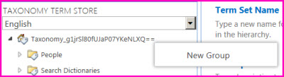

# Set up a new group for term sets

In the Term Store Management Tool, a group is a set of term sets that all share common security requirements. Only users who are designated as Contributors to a specific group can manage term sets that belong to the group or create new term sets within it. Organizations should create unique groups for term sets that will have unique access or security needs. For information about how to create a term set, see [Set up a new term set](set-up-a-new-term-set.md). 
  
> [!IMPORTANT]
>  To create a new term set group, you must be a Term Store Administrator 
  

  
To set up a new group for term sets, follow these steps
  
1. [Open the Term Store management tool ](set-up-a-new-group-for-term-sets.md#__toc327965089).
    
2. In the tree view pane, select the taxonomy. Then point to it, select the arrow that appears, and then select **New Group**.
    
3. Type a name for your new group, and then press ENTER.
    
4. In the **Properties** pane, type a description for the group. 
    
5. In the **Group Managers** box, type the names of the people that you want to add. You can also select the **Browse** button to find and add users. 
    
6. In the **Contributors** box, type the names of people that you want to add. You can also select the **Browse** button to find and add users. 
    
7. Select **Save**.
    
> [!NOTE]
>  To delete a group, point to the group, select the arrow that appears, and then select **Delete Group**. Only empty groups can be deleted. 
  
## Open the Term Store management tool

To open the Term Store management tool, select the SharePoint environment that you use, and then follow the steps.
  
 **In SharePoint Online**
  
1. Sign in to Office 365 as a global admin or SharePoint admin.
    
2. Select the app launcher icon  in the upper-left and choose **Admin** to open the Office 365 admin center. (If you don't see the Admin tile, you don't have Office 365 administrator permissions in your organization.) 
    
3. Select **Term Store**.
    
 **In SharePoint Server**
  
1. From the site collection Home page, select **Site Contents**
    
2. On the **Site Contents** page, select **Settings**.
    
3. On the **Site Settings** page, in the **Site Administration** group, select **Term store management**.
    
After you open the Term Store management tool, you can create a group for term sets.
  

