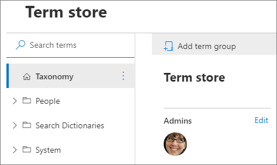

# Set up a new group for term sets

A term group is a set of term sets that all share common security requirements. Only users who are designated as contributors to a specific group can manage term sets that belong to the group or create new term sets within it. Organizations should create unique groups for term sets that will have unique access or security needs. For information about how to create a term set, see [Set up a new term set](set-up-new-term-set.md). 
  
> [!IMPORTANT]
>  To create a new term set group, you must be a term store admin. 
  
To set up a new group for term sets, follow these steps.
   
1. In the SharePoint admin center, under **Content services**, click **Term store**.
    
2. In the right pane, click **Add term group**.

        

3. Enter a name for your new group, and then press ENTER.
    
4. To edit the Term group **name** and **description**, select **Edit** next to the group name. The **Edit name and description** panel appears. Enter a description to help users understand the purpose of this term group. Select **Save**. 
    
5. To edit the group managers or contributors, select **Edit** next to **Group managers**. The **Edit admins** panel appears. Enter the names or email addresses of the people you want to add, assign them to a role, and then click **Save**.
  
7. To copy the unique identifier for this term group, select **Copy**.
