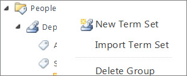

# Set up a new term set

To set up a new term set, you must access the Term Store management tool, and then use the tool to specify the term set properties.
  

  
> [!IMPORTANT]
>  To add a term set in the Term Store management tool, you must be a Group Manager or a Term Store Administrator. 
  
To set up a new term set, follow these steps.
  
1. [Open the Term Store management tool](open-term-store-management-tool.md).
    
2. In the tree-view navigation pane, expand the groups to find the group to which you want to add a term set.
    
3. Point to the term set where you want to add a term, select the arrow that appears, and then select **New Term Set**.
    
4. Type the name that you want to use as the default label for your term in the newly created term in the tree view.
    
5. In the **Properties** pane of the Term Store Management tool, select the **General** tab and then specify the following information about the new term set: 
    
1. **Term Set Name**Type a name for your term set. This field should already be populated with the name of the column, but you can update it or change it.
    
2. **Description**Type a description that will help users understand how they should use these terms.
    
3. **Owner**If you want the owner of the term set to be someone other than you, you can change the Owner to another person or group. You can enter only one item.
    
4. **Contact**Type an e-mail address if you want site users to be able to provide feedback on the term set.
    
5. **Stakeholders**Add the names of users or groups that should be notified before major changes are made to the term set.
    
6. **Submission Policy**Specify whether you want the term set to be **Closed** or **Open**. 
    
7. **Available for Tagging**Select the check box to make the terms in the term set available for tagging. If you clear the check box, then this term set won't be visible to most users. If the term set is still in development, or is not otherwise ready for use, you might want to clear the check box.
    
6. Select the **Intended Use** tab, and then specify the following settings: 
    
1. **Available for Tagging**Check this box to make this term set available for users to choose for tagging 
    
2. **Use this Term Set for Site Navigation**Check this box to enable this term set to be used for managed navigation. 
    
7. Select the **Custom Sort** tab, and then select the sort order that you prefer. 
    
8. Select the tab to specify any additional data about the term set.
    
9. Select **Save** to save your property updates. 
    
To learn how to add a term to the new term set, see [Create and manage terms in a term set](create-and-manage-terms.md).
  
 
  

