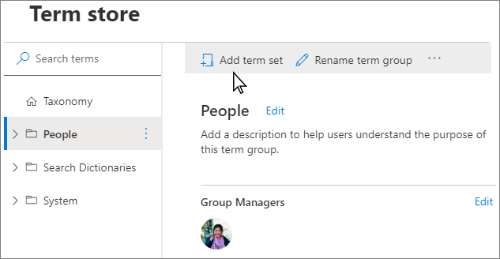

# Set up a new term set

To add a term set, you must be a contributor, group manager or a term store admin.

To set up a new term set
  
1. In the SharePoint admin center, under **Content services**, click **Term store**.
    
2. In the tree-view navigation pane, expand the groups to select the group to which you want to add a term set.
    
3. Click **Add term set**.

    .
    
4. Type a name for the term set and press ENTER.
 
**General tab** 
    
1. On the **General** tab, for **Owner**, select **Edit**. The **Edit Properties** panel appears. Specify the following information about who owns and maintains this term set: 
    
    - **Term Set owner**: If you want the owner of the term set to be someone other than you, enter the person, group, or email address for who will maintain this term set.
    
    - **Stakeholders**: Add the names of users, groups, or email addresses that should be notified before major changes are made to the term set.
    
    - **Contact**: If you want site users to be able to provide feedback on the term set, enter an email address.
    
2. Click **Save**.

**Usage settings tab**

To configure the term submission policy

1. On the **Usage settings** tab, for **Submission policy**, select **Edit**. The **Edit submission policy** panel appears.
    
2. Specify whether you want the term set to be **Closed** or **Open**. If you select **Closed**, only people with contribute permissions can add terms to this term set. If you select **Open**, users can add terms from a tagging application.

3. Click **Save**.

To configure the tagging policy
   
1. Under the **Usage settings** tab, for **Available for tagging**, select **Edit**. The **Available for tagging** panel appears.

2. Select the **Enable** check box to make the terms in the term set available for tagging. If you clear the **Enable** check box, this term set won't be visible to most users. If the term set is still in development, or is not otherwise ready for use, you might want to clear the **Enable** check box.

3. Select **Save**.

**Usage navigation tab**

Enabling site navigation means you can use the terms in this term set for site navigation links with friendly URLs and dynamic content. Enabling faceted navigation means users can use refiners based on managed metadata from the search index to quickly browse to specific content

1. Under the **Usage Navigation** tab, for **Use term set for site navigation**, select **Edit**. The **Edit Properties** panel appears.

2. Click the **Enable** check boxes to use this term set for site or faceted navigation.

3. Click **Save.**

Enabling either using the term set for site or faceted navigation enables options to set a custom target page and a custom catalog item page.

You can choose a custom target page if you want to display a specific page. Custom target pages that you set for individual terms will override this setting.

To set a custom target page

1. For **Custom target page**, select **Edit**. The **Edit term set target page** panel appears.
2. Move the toggle switch to enable **Use a custom target page**. 
3. Click **Select**, and then select **Save**. The target page appears when users navigate to a friendly URL in this term set. 

If terms in this term set are used as catalog categories, you can select the page used to render catalog data for items under those categories.

To set a custom catalog item page

1. For **Custom catalog item page**, select **Edit**. The **Edit term set catalog item page** panel appears.
2. Move the toggle switch to enable **Use a custom catalog item page**.
3. Click **Select** and then select **Save**.

**Advanced tab**

You can use machine translation to translate your terms, or you can export and import XLIFF files. You must repeat the translation each time you update the term set.

To configure translations

1. Under the **Advanced** tab, for **Translation**, select **Manage**. The **Translation** panel appears.
2. To use machine translation to translate this term set into the working languages for the term store, select **Start**. The **Machine translation** panel appears.
3. For the terms you want to translate, select either **All terms**, or **Only the terms updated since the last translation**.
4. From both the **Translate from** and **Translate to** dropdowns, select a language.
5. Click **Translate.**

You can use custom properties to store additional data about a term set.

To edit custom properties

1. For **Custom properties**, select **Edit**. The **Edit Custom properties** panel appears. 
2. Enter a **Property name** and **Value**, and then select **Add**.\
3. Click **Save.**
    
    
To learn how to add a term to the new term set, see [Create and manage terms in a term set](create-and-manage-terms.md).
  
