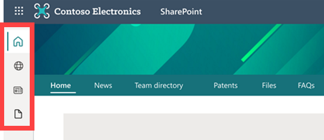
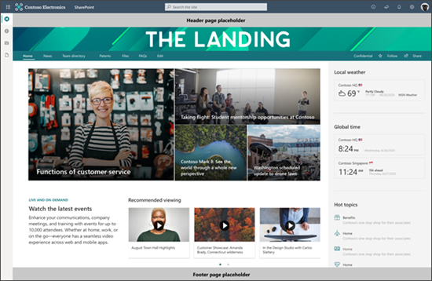

# Introduction to the SharePoint app bar

Help users find important content and resources no matter where they are in SharePoint. The SharePoint app bar is designed to improve the global way finding experience while dynamically displaying personalized sites, news, and files. The app bar can be accessed on the left-hand side anywhere in SharePoint.

## The SharePoint app bar experience
The SharePoint app bar brings together intranet resources and personalized content like sites, news, and files. Enable global navigation to allow users to easily navigate to important intranet resources anywhere in SharePoint. Customize global navigation details and [Microsoft Graph](https://docs.microsoft.com/graph/overview) will do the rest of the work by dynamically displaying and updating personalized content for sites, news, and files.

>[!NOTE]
> - Global navigation is the only app bar tab that can be customized. 
> -	When global navigation is disabled or not configured, the home icon links to the SharePoint start page.
> -	Specific SharePoint app bar tabs cannot be disabled. 
> -	The SharePoint app bar cannot be disabled on specific sites. 
> -	The SharePoint app bar is not available on classic SharePoint sites today, however soon administrators will be able to add it to classic sites manually. 
> -	The SharePoint app bar may impact current page customizations specifically those that appear on the left side. 
> -	Personalized content in the SharePoint app bar is enabled by Microsoft Graph.
> -	When Microsoft Graph is disabled, the news and sites experience will be degraded.
> -	The SharePoint app bar can be temporarily disabled between today and when it becomes available to all customers to give customers more time to prepare for this change. Temporarily disabling the ap bar will delay the roll out of this feature in your organization until October 31, 2021.

The SharePoint app bar is a significant change to the user experience and your organization's [intranet information architecture](https://docs.microsoft.com/sharepoint/information-architecture-modern-experience). To ensure a seamless experience, we've created specific guidance on how to design current navigation to compliment the new global navigation feature. We have also created [end-user guidance](https://support.microsoft.com/office/use-the-sharepoint-app-bar-b2ab82d5-9af7-445e-ad24-236c5a86b5f8?ui=en-US&rs=en-US&ad=US) to help onboard the rest of your organization.   

## Customize global navigation in the app bar
Global navigation can be enabled and customized in the SharePoint app bar. Customize the global navigation logo, title, and source depending on your users’ and organization’s needs. If you choose to keep global navigation disabled, the home icon will link to the SharePoint start page.

>[!NOTE]
> -	When global navigation is disabled, the home icon will link to the SharePoint start page.
> -	Customizing global navigation requires a [home site](https://docs.microsoft.com/sharepoint/home-site).
> -	Site owner permissions (or higher) to the home site are required to enable global navigation.
> -	Users need read access (or higher) to the home site to view the global navigation links. 
> -	[Audience targeting](https://support.microsoft.com/office/target-content-to-a-specific-audience-on-a-sharepoint-site-68113d1b-be99-4d4c-a61c-73b087f48a81?ui=en-US&rs=en-US&ad=US) can be applied to menu links in global navigation.
> -	Implementing global navigation may take up to 24 hours for the changes to take effect for users.

### Get started customizing the global navigation tab
1.	Set up a [home site](https://docs.microsoft.com/sharepoint/home-site) if your organization doesn’t already have one and make sure to [share the home site](https://support.microsoft.com/office/share-a-site-958771a8-d041-4eb8-b51c-afea2eae3658) with everyone in your tenant to ensure all users can access the global navigation links. 
2.	Navigate to your organization’s home site. 
3.	Select **Settings** and then select **Global navigation settings**.

&nbsp;&nbsp;&nbsp;&nbsp;&nbsp;

>[!NOTE]
> -	If you do not see **Global navigation** in the **Settings** pane on the home site, you may not have site owner permissions (or higher) to the home site.

4.	Switch the **Enable global navigation** toggle to **On**.

&nbsp;&nbsp;&nbsp;&nbsp;&nbsp;

5.	Next, add the **Logo** for global navigation that will be recognizable to users to replace the home icon in the app bar. No action is needed if you choose to keep the default home icon. 
 
 
Global navigation logo specifications:
   - The logo size should be 20x20 pixels
   - PNG file type
   - Transparent background recommended 

6.	Then, enter a **Title** that will be displayed at the top of the global navigation pane.

&nbsp;&nbsp;&nbsp;&nbsp;&nbsp;

7.	Finally, determine the **Navigation source**. Learn more about selecting a source.
8.	Make edits to the selected global navigation source if needed by selecting **Edit global navigation**. Select **Save** when you are done. Updates to global navigation may take several minutes before they appear.

&nbsp;&nbsp;&nbsp;&nbsp;&nbsp;&nbsp;&nbsp;

>[!NOTE] 
> -	The global navigation source can be edited at any time by site owners or admins of the home site.
> -	The site and global navigation [links and labels](https://support.microsoft.com/office/customize-the-navigation-on-your-sharepoint-site-3cd61ae7-a9ed-4e1e-bf6d-4655f0bf25ca) can be edited at any time by editors of the home site.
> -	Implementing global navigation may take up to 24 hours for the changes to take effect.

### Determine the global navigation source depending on your home site’s configuration:
If you haven’t set up your [home site](https://docs.microsoft.com/sharepoint/home-site), do that first and if you are setting up a home site specifically to implement global navigation, review this guidance.

#### For home sites that are a hub, you have two source options:

- Select the site navigation source to display the home site’s navigation.
- Select the Hub or global navigation source to display the home site’s hub navigation.

>[!NOTE] 
> When you apply the extended header layout to the site, you will no longer see the hub navigation.

#### For home sites that are not a hub, you have two source options:

- Select the site navigation source to display the home site navigation.
- Create a secondary set of navigation notes specifically for the global navigation panel by selecting **Hub or global navigation**. Then, select **Edit global navigation** to create the new global navigation menu. Select **Save** when you are done.

>[!NOTE]
> For home sites that are not a [hub site](https://support.microsoft.com/office/what-is-a-sharepoint-hub-site-fe26ae84-14b7-45b6-a6d1-948b3966427f) and choose to create a secondary set of navigational nodes for the global navigation pane - if you decide to make your home site a hub in the future, the new hub site navigation will inherit the current navigational nodes for global navigation and can be [edited at any time](https://support.microsoft.com/office/customize-the-navigation-on-your-sharepoint-site-3cd61ae7-a9ed-4e1e-bf6d-4655f0bf25ca). 

## See all the different ways you can set up global navigation
Depending on the content you want to make available in the global navigation, you can configure your home site navigation and global navigation in three different ways.

### Display the home site’s navigation in global navigation
Display hub and site navigation on the home page, and the home site navigation in the global navigation panel.
1.	Navigate to the home site’s **Settings** and then **Global navigation**.
2.	**Enable** global navigation, enter a **Title**, and then select **Home site navigation** as the source.
3.	Select **Save**. Changes may take a few minutes to reflect.

### Display the home site’s hub navigation in global navigation
Display hub and site navigation on the home page, and the hub navigation in the global navigation panel. 
1.	Navigate to the home site’s **Settings** and then **Global navigation***.
2.	**Enable** global navigation, enter a **Title**, and then select **Hub or global navigation** as the source.
3.	Select **Save**. Changes may take a few minutes to reflect.

### Hide the site navigation and display it in the global navigation
Display just the hub navigation on the home page, and the site navigation in the global navigation panel. 
1.	Start by hiding the site navigation using one of two methods:
 

- Go to **Setting** then **Change the look**, then **Navigation** and toggle the **Display site navigation** to **Hide**
- Go to **Setting**, then **Change the look**, then **Header** and choose **Extended**

2.	Then, navigate to the home site’s **Settings** and then **Global navigation**.
3.	**Enable** global navigation, enter a **Title**, and then select **Home site navigation** as the source.
4.	Select **Save**. Changes may take a few minutes to reflect.

## Set up a home site for the first time
A [home site](https://docs.microsoft.com/sharepoint/home-site) is a SharePoint communication site that you create and set as the top landing page for all users in your intranet. It brings together news, events, embedded video and conversations, and other resources to deliver an engaging experience that reflects your organization's voice, priorities, and brand. It is recommended that you set up a home site for your organization to take full advantage of SharePoint’s communication and collaboration features and is required to enable and customize global navigation in the SharePoint app bar. 

### Set up a home site just for global navigation
If you are creating a [home site](https://docs.microsoft.com/sharepoint/home-site) for the main purpose of setting up global navigation, you can simplify the steps recommended to plan and launch a home site. Learn more about planning navigation in SharePoint and apply information architecture principals to your new home site’s navigational design. 

>[!NOTE]
> -	Only one communication site can be set as the home site.
> -	The first time you set up a home site, it might take up to several minutes for the changes to take effect.
> -	Global admin credentials are required to use the SharePoint Online Management Shell tool that is required to transform a communication site into a home site.

1.	Start by creating a [SharePoint communication site](https://support.microsoft.com/office/create-a-communication-site-in-sharepoint-7fb44b20-a72f-4d2c-9173-fc8f59ba50eb).
2.	[Customize the communication site navigation](https://support.microsoft.com/office/customize-the-navigation-on-your-sharepoint-site-3cd61ae7-a9ed-4e1e-bf6d-4655f0bf25ca) to reflect the view you’d like to see in the global navigation pane. You can make edits to the navigation source and individual labels and links at any time.
3.	[Set this communication](https://docs.microsoft.com/sharepoint/home-site#set-a-site-as-your-home-site) site as a home site using SharePoint Online Management Shell tool.
4.	[Share the home site with users](https://support.microsoft.com/office/share-a-site-958771a8-d041-4eb8-b51c-afea2eae3658?ui=en-us&rs=en-us&ad=us#:~:text=Share%20a%20site%201%20Communication%20sites.%20Select%20Share,external%20users%22%20to%20share%20the%20...%20See%20More.) so they can access the global navigation links. 
5.	On the home site, select **Settings** and then **Global navigation** to **enable** and customize.
6.	For the global navigation source, select **Home site navigation** to display the home site navigation that you created in the global navigation panel. Then select **Save**.

## Understand how the app bar may impact page customizations

The SharePoint app bar may impact current page customizations, specifically those positioned to the left of your page. 
For organization using [page placeholders](https://docs.microsoft.com/sharepoint/dev/spfx/extensions/get-started/using-page-placeholder-with-extensions), the SharePoint app bar will cover parts of both the header and footer page placeholder. In the following image, the place holder footprint is in red:

## Modernize classic SharePoint sites to display the SharePoint app bar
The SharePoint app bar will only appear in [modern SharePoint sites](https://docs.microsoft.com/sharepoint/dev/transform/modernize-classic-sites) and [pages](https://docs.microsoft.com/sharepoint/dev/transform/modernize-userinterface-site-pages). 
We highly recommend modernizing classic sites not only to display the SharePoint app bar but for a more consistent user experience. Learn more about how to modernize classic SharePoint sites and  pages using the open-source [SharePoint PnP Page Transformation solution](https://docs.microsoft.com/sharepoint/dev/transform/modernize-userinterface-site-pages).
 

More guidance on how to display the SharePoint app bar on a classic site will be available soon. 

## Teach end users about this feature
Help end users understand [how the new SharePoint app bar works](https://support.microsoft.com/office/use-the-sharepoint-app-bar-b2ab82d5-9af7-445e-ad24-236c5a86b5f8?ui=en-US&rs=en-US&ad=US). 

## Temporarily disable the SharePoint app bar
You can temporarily disable the SharePoint app bar in your tenant to prepare for this change or control its rollout to users. The tool that disables the app bar will be available until October 31, 2021. Updates and more information about temporarily disabling the SharePoint app bar will be shared in future MC posts.
 
 
Temporarily disable the SharePoint app bar:

1.	Download the latest version of [PowerShell](https://docs.microsoft.com/powershell/sharepoint/sharepoint-online/connect-sharepoint-online?view=sharepoint-ps).
2.	Run the following command exactly as it appears: 

&nbsp;&nbsp;&nbsp;&nbsp;&nbsp;`Set-SPOTemporarilyDisableAppBar $true`

3.	If you need to confirm if the app bar has been disabled or enabled, check the app bar status by running the following:  

&nbsp;&nbsp;&nbsp;&nbsp;&nbsp;`Get-SPOTemporarilyDisableAppBar`

>[!NOTE] 
> -	It can take up to an hour for the app bar to be removed on a tenant where the app bar is already showing up. 
> -	Running the command without the $false or $true value will cause it to fail.
> -	You must be using the latest version of [PowerShell](https://docs.microsoft.com/powershell/sharepoint/sharepoint-online/connect-sharepoint-online?view=sharepoint-ps).

### Enable the SharePoint app bar:
1.	Once you’re ready to display the SharePoint app bar, run the following command: 

&nbsp;&nbsp;&nbsp;&nbsp;&nbsp;`Set-SPOTemporarilyDisableAppBar $false`

   >[!NOTE]  
   > - It can take up to an hour for the app bar to be removed on a tenant where the app bar is already showing up. 

2.	If you need to confirm if the app bar has been disabled or enabled, check the app bar status by running the following:  

&nbsp;&nbsp;&nbsp;&nbsp;&nbsp;`Get-SPOTemporarilyDisableAppBar`

### Resources

- Learn more about [home sites](https://docs.microsoft.com/sharepoint/home-site)
- Learn more about [planning](https://docs.microsoft.com/sharepoint/planning-hub-sites) and [creating hub sites](https://docs.microsoft.com/sharepoint/create-hub-site)
- Learn more about [navigation and information architecture in SharePoint](https://docs.microsoft.com/sharepoint/information-architecture-modern-experience)
- Learn more about [sharing and permissions in SharePoint](https://docs.microsoft.com/sharepoint/modern-experience-sharing-permissions)

