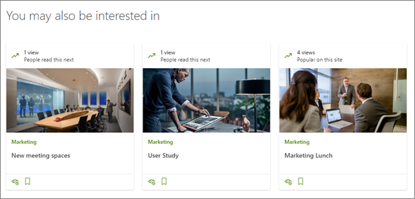
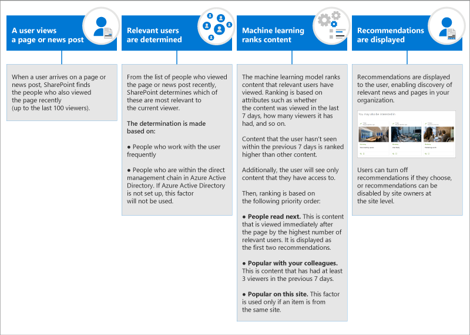

# How SharePoint page recommendations work
SharePoint recommendations on modern pages help you and your users discover pages and news in your organization. At the bottom of news posts and pages, you'll see recommendations especially for you or your users. Recommendations show below the heading **You may also be interested in**.

Recommendations are shown on all newly-created pages and news posts by default.

## How are recommendations determined for each user?
The recommendations that users see on their pages are based on what their colleagues have read next; what is popular with their colleagues; and what is popular on the site. Only pages and posts that users have access to are shown.

Here is a diagram that shows how recommendations are determined in more detail (scroll down for a text version of this diagram):

## How to disable recommendations
To learn how to disable at the page and site level, see [SharePoint page recommendations](https://support.office.com/article/sharepoint-page-recommendations-12bf4c4e-3452-4575-afd4-ef7536b027fa/).

In the article linked above, you'll learn the three different ways to hide or disable recommendations:

-   Users can hide individual recommendations  

-   Page authors can turn off recommendations for the pages they create

-   Site owners can disable recommendations at the site level

Recommendations can't be disabled for an entire tenant.

## How are recommendations determined for each user?

This is a text version of the diagram above.

**A user views a page or news post**
When a user arrives on a page or news post, SharePoint finds the people who also viewed the page recently (up to the last 100 viewers).

**Relevant users are determined**
From the list of people who viewed the page or news post recently, SharePoint determines which of these are most relevant to the current viewer. The determination is made based on:
-   People who work with the user frequently
-   People who are within the direct management chain in Azure Active Directory. If Azure Active Directory is not set up, this factor will not be used.

**Machine learning ranks content**

The machine learning model ranks content that relevant users have consumed according to a variety of attributes, such as whether the content was viewed in the last 7 days, how many viewers it has had, and so on. 
Content that the user hasn’t seen within the previous 7 days is ranked higher than other content. 
Additionally, the user will see only content that they have access to
Then, ranking is based on the following priority order:

**People read next**. This is content that is viewed immediately after the page by the highest number of relevant users. It is displayed as the first two recommendations.

**Popular with your colleagues**. This is content that has had at least 3 viewers in the previous 7 days.

**Popular on this site**. This factor is used only if an item is from the same site.
