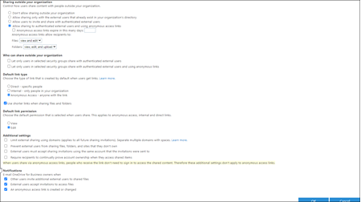
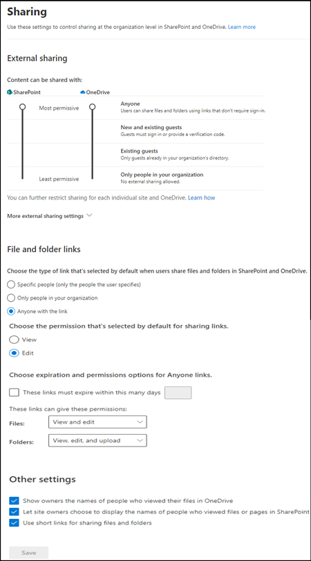

# Find sharing in the new SharePoint admin center

This article covers all the sharing features on the classic sharing page and where you can find them in the new SharePoint admin center.

## Share settings

|**Classic**|**New**|
|:-----|:-----|
|||

|**Classic**|**New**|
|:-----|:-----|
|**Sharing outside your organization**    |**External sharing**    Content can be shared with: **SharePoint** and **OneDrive**|
|   Don't allow sharing outside your organization   Allow sharing only with the external users that already exist in your organization's directory   Allow users to invite and share with authenticated external users   Allow sharing to authenticated external users and using anonymous access links   Anonymous access links expire in this many days: |More external sharing settings    Limit external sharing by domain   Allow only users in specific security groups to share externally   Guests must sign in using the same account to which sharing invitations are sent    Allow guests to share items they don't own   People who use a verification code must reauthenticate after this many days |
|**Sharing outside your organization**    Anonymous access links allow recipients to:   Files   Folders   **Who can share outside your organization**   Let only users in selected security groups share with authenticated external users   let only users in selected security groups share with authenticated external users and using anonymous links   **Default link type**   Direct   Internal - only people in your organization   Anonymous Access - anyone with the link   **Default link permission**   View   Edit   |**File and folder links**    **Choose the type of link that's selected by default when users share files and folders in SharePoint and OneDrive.**   Specific people (only the people the user specifies)   Only people in your organization   Anyone with the link   **Choose the permission that's selected by default for sharing links.**   View   Edit   **Choose expiration and permissions options for Anyone links.**   These links must expire within this many days   These links can give these permissions:   Files:   Folders: |
|**Additional settings**   Limit external sharing using domains (applies to al future sharing invitations). Separate multiple domains with spaces.   Prevent external users from sharing files, folders, and sites hat they don't own   External users must accept sharing invitations using the same account that the invitations were sent to   Require recipients to continually prove account ownership when they access shared items   |**Other settings**    Show owners the names of people who viewed their files in OneDrive   Let site owners choose to display the names of people who viewed files or pages in SharePoint   Use short links for sharing files and folders  |
|**Notifications**  Other users invite additional external users to shared files   External users accept invitations to access files   An anonymous access link is created or changed   |   |
 
