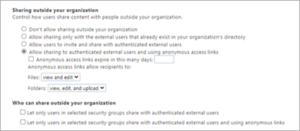
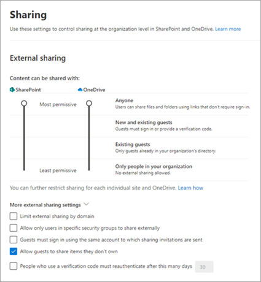
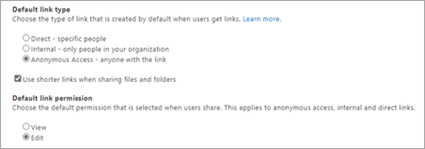
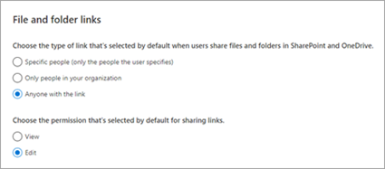
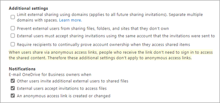

# Find sharing settings in the new SharePoint admin center

This article covers all the features on the sharing page of the classic SharePoint admin center and where you can find them in the new SharePoint admin center.

## Sharing outside your organization

|**Classic**|**New**|
|:-----|:-----|
|||

|**Classic**|**New**|
|:-----|:-----|
|Don't allow sharing outside your organization   Allow sharing only with the external users that already exist in your organization's directory   Allow users to invite and share with authenticated external users   Allow sharing to authenticated external users and using anonymous access links|**External sharing, SharePoint slider** Only people in your organization Existing guests New and existing guests Anyone|
|Anonymous access links expire in this many days: |**File and folder links**, under **Choose expiration and permissions options for Anyone links.**  These links must expire within this many days|
|Anonymous access links allow recipients to:   Files   Folders   |  **File and folder links**, under **Choose expiration and permissions options for Anyone links.**  These links can give these permissions:
|Let only users in selected security groups share with authenticated external users   Let only users in selected security groups share with authenticated external users and using anonymous links  |**More external sharing settings**    Allow only users in specific security groups to share externally   In the Manage security groups panel, under **Can share with**, select **Anyone** or **Authenticated guests only**. |

## Default links

|**Classic**|**New**|
|:-----|:-----|
|||

|**Classic**|**New**|
|:-----|:-----|
|**Default link type**   Direct - specific people   Internal - only people in your organization   Anonymous Access - anyone with the link |**File and folder links**    **Choose the type of link that's selected by default when users share files and folders in SharePoint and OneDrive.**   Specific people (only the people the user specifies)   Only people in your organization   Anyone with the link  |
|Use shorter links when sharing files and folders | **Other settings** Use short links for sharing files and folders |
|**Default link permission**   View   Edit   |**Choose the permission that's selected by default for sharing links.**   View   Edit  |

## Additional settings

|**Classic**|**New**|
|:-----|:-----|
|||

|**Classic**|**New**|
|:-----|:-----|
|Limit external sharing using domains  |**External sharing**, **More external sharing settings** Limit external sharing by domain|
|Prevent external users from sharing files, folders, and sites that they don't own |**External sharing**, **More external sharing settings** Allow guests to share items they don't own|
|External users must accept sharing invitations using the same account that the invitations were sent to |**External sharing**, **More external sharing settings** Guests must sign in using the same account to which sharing invitations are sent|
|Require recipients to continually prove account ownership when they access shared items |**External sharing**, **More external sharing settings** People who use a verification code must reauthenticate after this many days|
|**Notifications**  E-mail OneDrive for Business owners when  Other users invite additional external users to shared files External users accept invitations to access files   An anonymous access link is created or changed||

 
