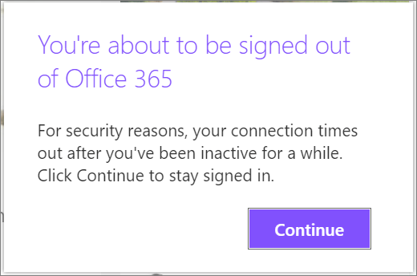
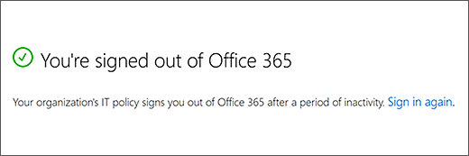
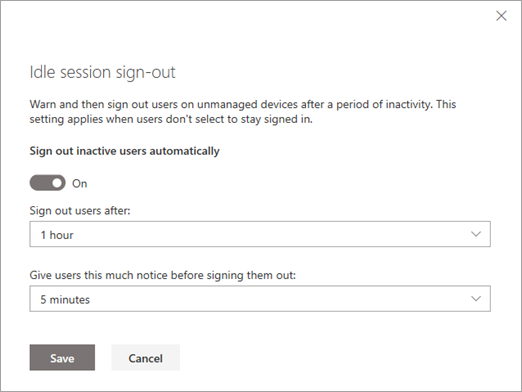

# Sign out inactive users

This article is for global and SharePoint admins in Office 365 who want to control user access to SharePoint and OneDrive data on unmanaged devices. Idle session sign-out lets you specify a time at which users are warned and subsequently signed out of Office 365 after a period of browser inactivity in SharePoint and OneDrive. 
  
> [!NOTE]
> Idle session sign-out applies to the entire organization and can't be set for specific sites or users. 
  
Idle session sign-out is one of a number of policies you can use with SharePoint and OneDrive to balance security and user productivity and help keep your data safe regardless where users access the data, what device they're working on, and how secure their network connection is. For more ways to control access in SharePoint and OneDrive, see [How SharePoint and OneDrive safeguard your data in the cloud](safeguarding-your-data.md).
  
## The idle session sign-out experience

When a user is inactive in SharePoint and OneDrive for a period of time you specify, they'll see this message:
  

  
> [!NOTE]
> Activity is counted as requests sent to SharePoint, such as clicks.  Moving the mouse and scrolling are not counted as activity.
  
If they don't click **Continue**, they'll be automatically signed out and will see this screen:
  

  
> [!NOTE]
> If a user is active in another Office 365 service (such as Outlook), but inactive in SharePoint and OneDrive, they'll be signed out across Office 365. If a user has multiple tabs to OneDrive and SharePoint sites open at the same time, they won't be signed out unless they are inactive on all the sites. > Users won't be signed out if they selected to stay signed in when they signed in. For info about hiding this option, see [Add company branding to your sign-in page in Azure AD](https://go.microsoft.com/fwlink/?linkid=2003520). Users won't be signed out on a managed device (one that is compliant or joined to a domain), unless they're using inPrivate mode or a browser other than Edge or Internet Explorer. If they use Google Chrome, you need to use an extension to pass the device state claim. For more info about device state claims, see [Azure AD conditional access settings](https://go.microsoft.com/fwlink/?linkid=2003424). 
  
## Specify idle session sign-out settings in the new SharePoint admin center

1. Go to the [Access control page of the new SharePoint admin center](https://admin.microsoft.com/sharepoint?page=accessControl&modern=true), and sign in with an account that has [admin permissions](/sharepoint/sharepoint-admin-role) for your organization.

>[!NOTE]
>If you have Office 365 Germany, [sign in to the Microsoft 365 admin center](https://go.microsoft.com/fwlink/p/?linkid=848041), then browse to the SharePoint admin center and open the Access control page. <br>If you have Office 365 operated by 21Vianet (China), [sign in to the Microsoft 365 admin center](https://go.microsoft.com/fwlink/p/?linkid=850627), then browse to the SharePoint admin center and open the Access control page.

2. Select **Idle session sign-out**.

    

3. Turn on **Sign out inactive users automatically**, and then select when you want to sign out users and how much notice you want to give them before signing them out.

4. Select **Save**.

## Specify idle session sign-out settings by using PowerShell
  
1. [Download the latest SharePoint Online Management Shell](https://go.microsoft.com/fwlink/p/?LinkId=255251).
    
2. Connect to SharePoint Online as a [global admin or SharePoint admin](/sharepoint/sharepoint-admin-role) in Office 365. To learn how, see [Getting started with SharePoint Online Management Shell](/powershell/sharepoint/sharepoint-online/connect-sharepoint-online).
    
3. At the SharePoint Online Management Shell command prompt, run the following command:
    
  ```PowerShell
  Set-SPOBrowserIdleSignOut -Enabled $true -WarnAfter (New-TimeSpan -Seconds 2700) -SignOutAfter (New-TimeSpan -Seconds 3600) 
  ```

   Where:
    
  - -Enabled specifies whether idle session sign-out is enabled or disabled by using $true or $false.
    
  - -WarnAfter specifies the amount of after which a user is notified that they will be signed out after a period of inactivity as a New-TimeSpan which can be configured in seconds, minutes, or hours. 
    
  - -SignOutAfter specifies the amount of time after which is a user is signed out of Office 365 if they do not respond to the -WarnAfter prompt.
    
> [!NOTE]
> You must specify values for both WarnAfter and SignOutAfter. The SignOutAfter must be greater than the WarnAfter value. <br>It takes about 15 minutes for the policy to take effect across your organization. The policy doesn't affect existing sessions. To view the idle session sign-out values you've set, use the Get-SPOBrowserIdleSignOut cmdlet.<br>For info about Office 365 session lengths (regardless of activity), see [Session timeouts for Office 365](/office365/enterprise/session-timeouts). 
