# Find site collection features in the new SharePoint admin center

This article covers all the features on the classic site collections page and where you can find them in the new SharePoint admin center.

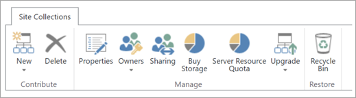

## Create a new private site collection

|**Classic**|**New**|
|:-----|:-----|
|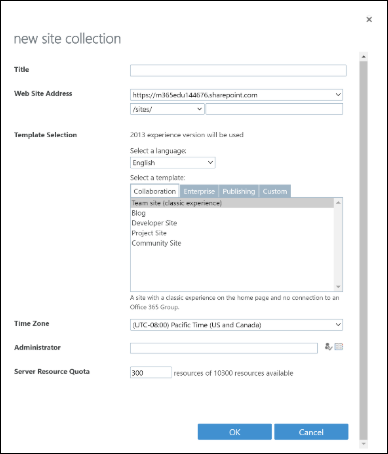|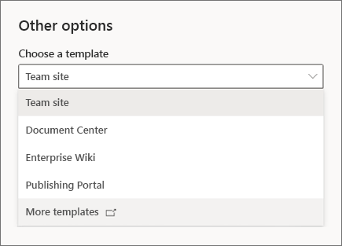  From the [Active sites page](https://admin.microsoft.com/sharepoint?page=siteManagement&modern=true), select **Create**. To create a classic site, select **Other options**. |

|**Classic**|**New**|
|:-----|:-----|
|Title    |Site name    |
|Change the URL path to /sites/ or /teams/   |Site address boxes appear after you begin entering a site name.    |
|Web Site Address    |Site address boxes appear after you begin entering a site name. The name is entered by default as the address. To change it, select the Edit icon.     |
|Select a language     |Select a language     |
|Select a template:  Community: Team site (classic experience), Blog, Developer site, Project Site, Community Site Enterprise: Document Center, eDiscovery Center, Records Center, Team Site – SharePoint Online configuration, Business Intelligence Center, Compliance Policy Center, My Site Host, Community Portal, Basic Search Center, Visio Process Repository Publishing: Publishing Portal, Enterprise Wiki, Product Catalog  Custom:\<Select template later…> |In the **Choose a template** box, you can select **Document Center**, **Enterprise Wiki**, or **Publishing Portal**. To select the others, select **More templates**. This opens the classic **Create Site Collection** window.   |
|Time Zone   |Expand **Advanced settings** and select **Time zone**.   |
|Administrator   |Primary Administrator   |
|Server Resource Quota   |This setting has not had any effect for more than a year.   |
|Private Site Collection with Project Web App   |Create a site and then use the [PowerShell cmdlet Set-SPOSite -EnablePWA](/powershell/module/sharepoint-online/set-sposite) to add or remove Project Web App.  |

## Delete

On the [Active sites page](https://admin.microsoft.com/sharepoint?page=siteManagement&modern=true), select the site, and on the command bar, select **Delete**. As with the classic SharePoint admin center, you can’t delete the root site. To use a different top-level site in your organization, [replace your root site](https://docs.microsoft.com/sharepoint/modern-root-site).

## Properties

|**Classic**|**New**|
|:-----|:-----|
|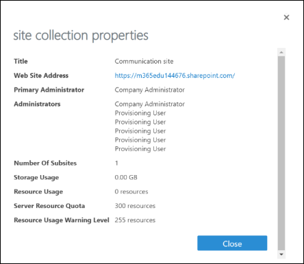 |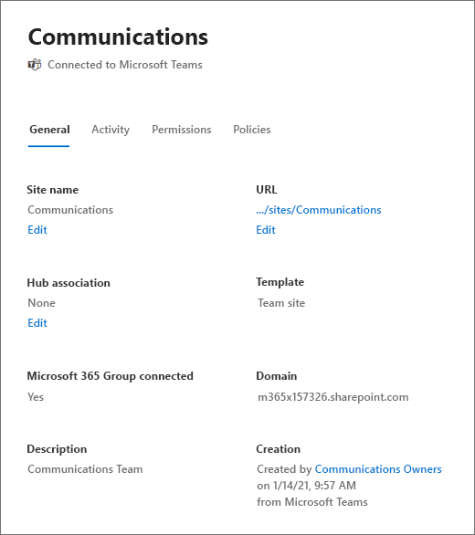  The columns on the [Active sites page](https://admin.microsoft.com/sharepoint?page=siteManagement&modern=true) show most of this information, so you don't even need to select a site to see details. To see the properties for an individual site, select anywhere in the site row, except in the URL column.|

|**Classic**|**New**|
|:-----|:-----|
|Title    |Site name column    |
|Complete Web Site Address link   |URL column shows the path after the domain. You can copy the link to save the full URL to the Clipboard.   |
|Primary Administrator   |Primary admin column.   |
|Other Administrators    |For any sites that aren’t connected to an Office 365 group, select the site, and on the command bar, select **Permissions**, and then select **Manage admins**. (For group-connected sites, you have options for managing group owners and additional admins.)   |
|Number of subsites   |Not available   |
|Storage Usage   |Storage used (GB) column.   |
|Resource Usage, Server Resource Quota, Resource Usage Warning Level   |These settings have not been in use for more than a year.   |

## Owners

|**Classic**|**New**|
|:-----|:-----|
|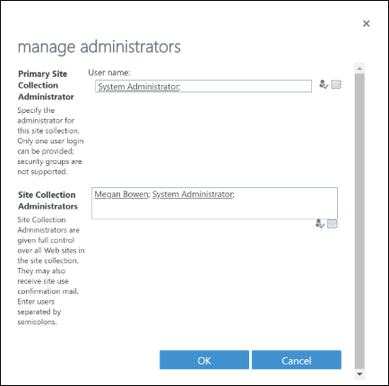 |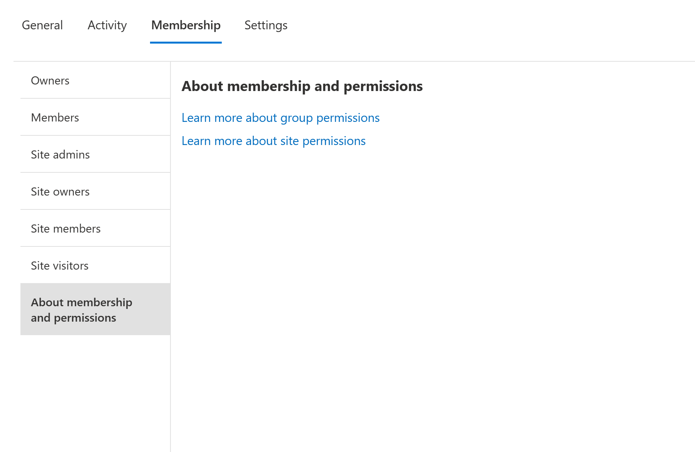  For any sites that aren’t connected to an Microsoft 365 group, on the [Active sites page](https://admin.microsoft.com/sharepoint?page=siteManagement&modern=true), select the site, and on the command bar, select **Permissions**, and then select **Manage admins**.|

|**Classic**|**New**|
|:-----|:-----|
|Primary Site Collection Administrator   |Switch the role of an existing admin to Primary Admin, or add an admin and then switch them to Primary admin.   |
|Site Collection Administrators   |Use the Add an admin box to add an admin and the Remove button to remove an admin.   |
|Add Support Partner   |This is available in PowerShell only. Go to the Site Permissions page for a site where you’ve added the support partner. Copy the encoded string for the partner, and to add it to other sites, use the [PowerShell cmdlet Set-SPOUser](/powershell/module/sharepoint-online/set-spouser?view=sharepoint-ps).   |

## Site collection-level sharing

|**Classic**|**New**|
|:-----|:-----|
|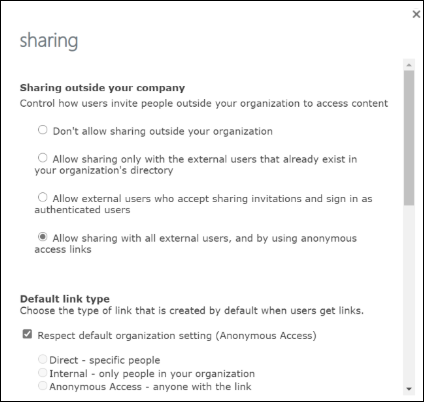 |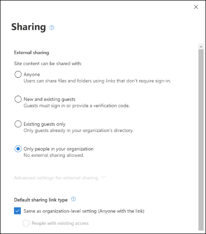 On the [Active sites page](https://admin.microsoft.com/sharepoint?page=siteManagement&modern=true), select the site, and on the command bar, select **Sharing**.|

|**Classic**|**New**|
|:-----|:-----|
|Sharing outside your company    |External sharing   - “Don’t allow sharing outside your organization” is the same as “Only people in your organization.”   - “Allow sharing only with the external users that already exist in your organization’s directory” is the same as “Existing guests only.”   - “Allow external users who accept sharing invitations and sign in as authenticated users” is the same as “New and existing guests.”   - “Allow sharing with all external users, and by using anonymous access links” is the same as “Anyone.”  |
|Default link type   |Default sharing link type   - “Respect default organization setting” is the same as “Same as organization-level setting.”    - “Direct” is the same as “Specific people.”   - “Internal” is the same as “Only people in your organization.”   - “Anonymous Access” is the same as “Anyone with the link.”  |
|Default link permission   |“Respect default organization setting” is the same as “Same as organization-level setting.” Both the classic and new admin centers have View and Edit options.   |
|Limit external sharing by domain  |Under **Advanced settings for external sharing**, select **Limit sharing by domain**.  |
|Turn off sharing for all non-owners on all sites in the site collection  |This is available in PowerShell only. Use the cmdlet [Set-SPOSite](/powershell/module/sharepoint-online/set-sposite) -DisableSharingForNonOwners  |

## Storage quota

These options appear if you use manual site storage limits in your organization. 

|**Classic**|**New**|
|:-----|:-----|
|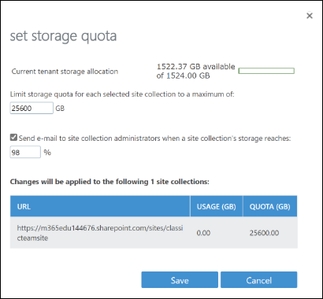|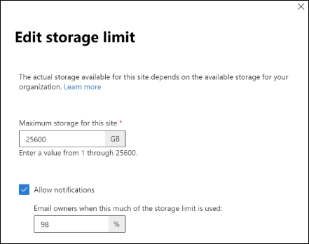  On the [Active sites page](https://admin.microsoft.com/sharepoint?page=siteManagement&modern=true), select a site, and on the command bar, select **Storage**.|

|**Classic**|**New**|
|:-----|:-----|
|Limit storage quota for each selected site collection to a maximum of     |Maximum storage for this site  |
|Send e-mail to site collection administrators when a site collection’s storage reaches   |Allow notifications   |

## Buy storage

In the Microsoft 365 admin center, go to the [Purchase services page](https://go.microsoft.com/fwlink/p/?linkid=868433).

## Server resource quota

These settings have not had any effect for more than a year. 

## Upgrade settings and notifications

These features have not been in use for more than a year.

## Project Web App

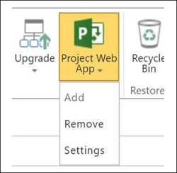

|**Classic**|**New**|
|:-----|:-----|
|Add or remove  | These commands are available in PowerShell only. Use the cmdlet [Set-SPOSite](/powershell/module/sharepoint-online/set-sposite) -EnablePWA |
|Settings (SharePoint Permission Mode or Project Permission Mode) and Project Web App Size  | To change the permission mode, go to the site as the Project Web App Administrator and follow the steps in [Change permission management in Project Online](/projectonline/change-permission-management-in-project-online). You shouldn't need to worry about running out of Project Web App space.  |

## Recycle bin

|**Classic**|**New**|
|:-----|:-----|
|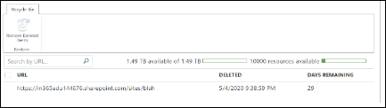 |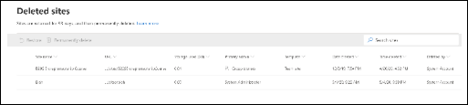  In the new SharePoint admin center, go to the [Deleted sites page](https://admin.microsoft.com/sharepoint?page=recycleBin&modern=true).|

|**Classic**|**New**|
|:-----|:-----|
|Restore Deleted Items   |Select the site, and on the command bar, select **Restore**.   |
|Deleted (date)    |Time deleted column.   |
|Days remaining   |This is incorrect in the classic admin center. To calculate this in the new SharePoint admin center, use the Time deleted column.  |

## Search by URL

On the [Active sites page](https://admin.microsoft.com/sharepoint?page=siteManagement&modern=true), use the Search box. As with the classic SharePoint admin center, you can also sort by URL.

## Available storage and storage limit bar

The upper-right corner of the [Active sites page](https://admin.microsoft.com/sharepoint?page=siteManagement&modern=true) shows the storage used (in GB) and storage limit for your organization.

## Available resources bar

Server resource quota and availability have not been in effect for more than a year. 

## Project Web App instances available

This information is no longer displayed because you shouldn't need to worry about running out of Project Web App instances.

## Site list

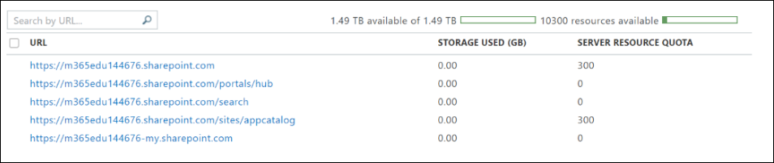

Most of the sites listed in the classic SharePoint admin center are included on the [Active sites page](https://admin.microsoft.com/sharepoint?page=siteManagement&modern=true). A few are hidden because they are system sites that you shouldn’t need to change. The [Active sites page](https://admin.microsoft.com/sharepoint?page=siteManagement&modern=true) contains all the new team sites and communication sites that don’t appear in the classic SharePoint admin center. To see the site list as it in the way it appeared in the classic SharePoint admin center, from the **View** menu, select **Classic sites**.  

In both the classic and new admin centers, you can select multiple sites and bulk edit the sharing or storage settings, or delete the sites.  

In the classic site list, locked sites appear with an icon. In the new SharePoint admin center, to see if a site is locked, select the site to open the details panel, and at the top, **This site is locked** appears. 

If you use manual storage limits, the Storage limit and Percent used columns appear. In the new SharePoint admin center, on the [Active sites page](https://admin.microsoft.com/sharepoint?page=siteManagement&modern=true), the Storage limit and Storage used columns appear. The Storage used column isn’t color coded. The Storage limit column can be sorted by size. 

