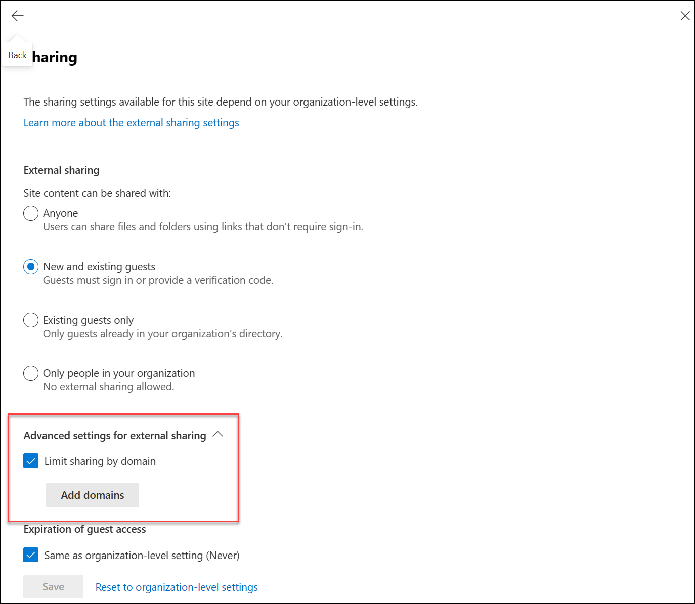

# Find site collection features in the new SharePoint admin center

This article covers all the features on the classic site collections page and where you can find them in the new <a href="https://go.microsoft.com/fwlink/?linkid=2185219" target="_blank">SharePoint admin center</a>.

> [!IMPORTANT]
> The classic site collections page has been removed. This article shows the features that were present on the classic site collections page and where to find them in the new SharePoint admin center.

## New (create a new private site collection)

To create a site collection in the new SharePoint admin center, go to <a href="https://go.microsoft.com/fwlink/?linkid=2185220" target="_blank">**Active sites**</a>, and then select **Create** on the command bar. To create a classic site, select **Browse more sites**.

 

|Classic|New|
|:-----|:-----|
|||

|Classic|New|
|:-----|:-----|
|Title|Site name|
|Change the URL path to /sites/ or /teams/|Site address boxes appear after you begin entering a site name.|
|Web Site Address|Site address boxes appear after you begin entering a site name. The name is entered by default as the address. To change it, select the Edit icon.|
|Select a language|Select a language|
|Select a template:  **Collaboration**: Team site (classic experience), Developer site, Project Site, Community Site **Enterprise**: Document Center, eDiscovery Center, Records Center, Team Site – SharePoint Online configuration, Business Intelligence Center, Compliance Policy Center, Enterprise Search Center, My Site Host, Community Portal, Basic Search Center, Visio Process Repository **Publishing**: Publishing Portal, Enterprise Wiki  **Custom**: \<Select template later...>|In the **Choose a template** box, you can select **Document Center**, **Enterprise Wiki**, or **Publishing Portal**. To select the others, select **More templates**. This opens the classic Create Site Collection window.|
|Time Zone|Expand **Advanced settings** and select **Time zone**.|
|Administrator|Primary Administrator|
|Storage Quota|Assign storage quota for the site.|
|Server Resource Quota|This setting has had no effect for more than a year.|

## Delete

On the <a href="https://go.microsoft.com/fwlink/?linkid=2185220" target="_blank">**Active sites** page</a>, select the site, and on the command bar, select **Delete**. As with the classic SharePoint admin center, you can't delete the root (top-level) site. To swap this site with a different site, see [Replace your root site](./modern-root-site.md).

## Properties

The columns on the <a href="https://go.microsoft.com/fwlink/?linkid=2185220" target="_blank">**Active sites** page</a> show most of this information, so you don't even need to select a site to see details. To see the properties for an individual site, select anywhere in the site row to open the details panel, except in the URL column.

## Site membership

To change the site membership, such as site admins, site owners, site members, and site visitors, for any site that isn't connected to a Microsoft 365 group, go to the <a href="https://go.microsoft.com/fwlink/?linkid=2185220" target="_blank">**Active sites** page</a>, select the site, select **Membership** on the command bar to open the details panel from where you can edit the membership information.

[Manage admins](media/manage-admins.png)

### Site admins

Select **Site admins** then select **Add site admins** to add a site admin. To remove a site admin, check the box in front of their name, then select **Remove as site admin**.

#### Assign the primary site admin

Each site has one primary admin. You can assign the primary site admin by selecting an existing admin, then select **Make primary site admin**.

> [!NOTE]
> You can't remove a primary admin. To remove a primary admin, you can first assign the primary admin role to another existing admin, then come back to remove the current admin.

## Sharing

To change sharing settings for a site, go to the <a href="https://go.microsoft.com/fwlink/?linkid=2185220" target="_blank">**Active sites** page</a>, select the site, and select **Sharing** on the command bar.

### Limit external sharing by domain

On the [**Active sites page** of SharePoint admin center](https://go.microsoft.com/fwlink/?linkid=2185220), select the site name that you want to restrict domains to open the details panel.

On the panel, select the **Settings** tab and select **More sharing settings** under **External file sharing**.

Under **Advanced settings for external sharing**, select the **Limit external sharing by domain** check box, and then select **Add domains**.

### Turn off sharing for all non-owners on all sites in the site collection 

This option is available in PowerShell only. Use the cmdlet [Set-SPOSite](/powershell/module/sharepoint-online/set-sposite) -DisableSharingForNonOwners  |

## Storage quota

These options appear if you use manual site storage limits in your organization. To change the storage limit for a site, go to the <a href="https://go.microsoft.com/fwlink/?linkid=2185220" target="_blank">**Active sites** page</a>, select the site, and select **Storage** on the command bar.

## Buy storage

In the Microsoft 365 admin center, go to the <a href="https://go.microsoft.com/fwlink/p/?linkid=868433" target="_blank">**Purchase services** page</a>. For more information, see [Add storage space for your subscription](/microsoft-365/commerce/add-storage-space).

## Server resource quota

These settings have had no effect for more than a year. 

## Upgrade settings and notifications

These features haven't been in use for more than a year.

## Project Web App

 

|Classic|New|
|:-----|:-----|
|Add or remove |These commands are available in PowerShell only. Use the cmdlet [Set-SPOSite](/powershell/module/sharepoint-online/set-sposite) -EnablePWA |
|Settings (SharePoint Permission Mode or Project Permission Mode) and Project Web App Size  |To change the permission mode, go to the site as the Project Web App Administrator and follow the steps in [Change permission management in Project Online](/projectonline/change-permission-management-in-project-online). You can review the size of the Project Web App site using the above instructions where it is located on the same page under the section "Project Web App Usage".  |

## Recycle bin

To view your deleted sites, go to the new SharePoint admin center, go to <a href="https://go.microsoft.com/fwlink/?linkid=2185070" target="_blank">**Deleted sites**</a>.

 

|Classic|New|
|:-----|:-----|
|||

 

|Classic|New|
|:-----|:-----|
|Restore Deleted Items|Select the site, and on the command bar, select **Restore**.   |
|Deleted (date)|Time deleted column.|
|Days remaining   |This info is incorrect in the classic admin center. To calculate this value in the new SharePoint admin center, use the Time deleted column.  |

## Search by URL

On the <a href="https://go.microsoft.com/fwlink/?linkid=2185220" target="_blank">**Active sites** page</a>, use the Search box. As with the classic SharePoint admin center, you can also sort by URL.

## Available storage and storage limit bar

The upper-right corner of the <a href="https://go.microsoft.com/fwlink/?linkid=2185220" target="_blank">**Active sites** page</a> shows the storage used (in GB) and storage limit for your organization.

## Available resources bar

Server resource quota and availability have had no effect for more than a year. 

## Project Web App instances available

This information is no longer displayed because you shouldn't need to worry about running out of Project Web App instances.

## Site list

Most of the sites that were listed in the classic SharePoint admin center are included on the <a href="https://go.microsoft.com/fwlink/?linkid=2185220" target="_blank">**Active sites** page</a>. A few are hidden because they're system sites that you shouldn't need to change. The Active sites page contains all the new team sites and communication sites that didn't appear in the classic SharePoint admin center. To see the site list as it appeared in the classic SharePoint admin center, from the **Standard views** menu, select **Classic sites**.  

In both the classic and new admin centers, you can select multiple sites and bulk edit the sharing or storage settings, or delete the sites.  

In the classic site list, locked sites appeared with an icon. In the new SharePoint admin center, to see if a site is locked, select the site to open the details panel. **This site is locked** appears at the top of the panel. 

If you use manual storage limits, the Storage limit and Percent used columns appear. In the new SharePoint admin center, the Storage limit and Storage used columns appear. The Storage used column isn't color coded. The Storage limit column can be sorted by size.

