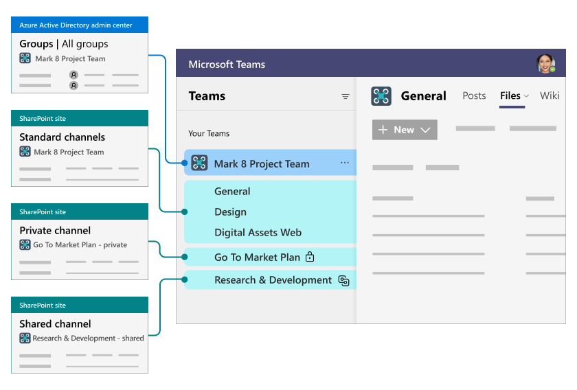

# Overview of Teams and SharePoint integration

In this article, learn about how Teams and SharePoint work together. 

## The basic parts of Teams and SharePoint

These are the basic parts of Teams and SharePoint and how they relate to each other:

- **Teams** - Teams is a collaboration tool where you can chat with other people about a particular subject or task. Each team is connected to other tools that you can use to collaborate with others.

- **SharePoint** - SharePoint is a tool for creating web sites, publishing content, and storing files.

- **SharePoint site** - A SharePoint site is a web site in SharePoint where you can create web pages and store and collaborate on files. SharePoint sites can be used independently and are also used by Teams for file storage (these are called *Teams-connected sites*). A Teams-connected site is created automatically whenever you create a team.

- **Team** - A team is a place in Teams where you can invite others to collaborate. Each team is connected to one or more SharePoint sites. These sites are where the team's files are stored.

- **Channel** - A channel is a location in a team where you can collaborate with others on a specific thing. A team can have multiple channels for different purposes. For example, you might have a team for marketing with different channels for different products or events. There are three types of channels in Teams: *standard*, *private*, and *shared*.

- **Standard channel** - A standard channel is a channel that all members of a team have access to. Each team comes with a standard channel called "General." Team owners and members can add additional standard channels. It always shows up first in a team's list of channels, and it can't be deleted (every team must have at least one channel). 

- **[Private channel](/MicrosoftTeams/private-channels)** - A private channel is a channel that only some of the team's members have access to. It is used for private conversations and collaboration. Each private channel has its own SharePoint site for file storage. Only members of the private channel can access this site.

- **[Shared channels](/MicrosoftTeams/shared-channels)** - A shared channel is a channel that you can add anyone to, even if they're not a member of the team. It is used for broader collaboration with people outside the team. Each shared channel has its own SharePoint site for file storage. Only members of the shared channel can access this site.

- **Parent site** - The SharePoint site that is created when you create the team. This site is used for file storage for all standard channels. All team owners and members have access to this site.

- **Channel site** - The SharePoint site that is created when you create a private or shared channel in a team. Only owners and members of the private or shared channel have access to this site.

- **Public team** - A public team is a team that anyone in the organization can join. Public teams do not require a team owner to invite someone to the team.

- **Private team** - A private team is a team that a person can only join when invited by a team owner. Both public teams and private teams offer the same channel types - standard, private, and shared.

- **[Microsoft 365 group](/microsoft-365/solutions/collaboration-governance-overview#why-microsoft-365-groups-are-important-in-collaboration-governance)** - A Microsoft 365 group is a membership group that gives people access to multiple Microsoft 365 services at the same time. The membership for each team is stored in a Microsoft 365 group and that group also gives those people access to the team's parent SharePoint site.

- **Azure AD** - Azure AD is the directory service where Microsoft 365 user accounts are stored. (You can manage these accounts from Microsoft 365 as well.) Microsoft 365 groups are also stored in Azure AD. Azure AD allows administrators to manage users and groups and to apply business rules to user accounts, such as requiring multi-factor authentication.

Each team is connected to a Microsoft 365 group in Azure AD where the team membership is stored. The files you see on the **Files** tab in a team are stored in a SharePoint site. All standard channels in a team share the same SharePoint site, but each private channel has its own site.

 

> [!VIDEO https://www.microsoft.com/videoplayer/embed/RE4Txae?autoplay=false]

## When do Teams and SharePoint get connected?

Teams and SharePoint are connected in the following scenarios:

- When you create a new team from scratch, a new SharePoint site is created and connected to the team.
- When you create a new team from an existing Microsoft 365 group, the team is connected to the SharePoint site associated with the group.
- When you add Teams to an existing SharePoint site, that site is connected to the new team.
- When you create a new private or shared channel, a new SharePoint site is created and connected to that channel.

In Teams, the Files tab on each standard channel is connected to a folder in the parent site's default document library. The Files tab on each private and shared channel is connected to the default document library in the corresponding channel site. Whenever you add or update a file on the Files tab, you are accessing the SharePoint site.

## Example of a team with multiple channel types

Contoso has a team called Mark 8 Project Team. This team has several standard channels, and one private channel called Compete Analysis.

The standard channels display as folders in the parent site. The private channel has its own channel site that is separate from the parent site.

## Teams-connected sites and channel types

Teams-connected sites are a specialized type of SharePoint site that's been optimized for a Teams connection. These include the parent site that is created when you create the team, and any channel sites that are created when you create a private or shared channel.

This table describes how site, file, and folder sharing work for each type of channel in Teams.

|Channel type|SharePoint site|Site sharing|File and folder sharing|
|:-----------|:--------------|:-----------|:----------------------|
|Standard|One SharePoint site is shared by all standard channels. There is a separate folder for each channel.|Team owners and members are automatically included in the site owners and members permission groups. Sharing the site separately is possible but managing access through Teams is recommended for easiest user management and the best user experience.|Files and folders can be shared with anyone in the organization by using sharable links. If guest sharing is enabled, *Anyone* and *Specific people* links can be used to share with people outside the organization.|
|Private|Each private channel has its own SharePoint site.|Channel owners and members are automatically included in the site owners and members permission groups. The site can't be shared separately.|Files and folders can be shared with anyone in the organization by using sharable links. If guest sharing is enabled, *Anyone* and *Specific people* links can be used to share with people outside the organization.|
|Shared|Each shared channel has its own SharePoint site.|Team owners and members are automatically included in the site owners and members group. The site can't be shared separately.|Files and folders can be shared with anyone in the organization and external participants in the channel by using sharable links. Sharing with people outside the organization who are not channel members is not supported.|

## Where to manage Teams and SharePoint settings

Teams-connected sites are managed differently than the typical SharePoint site. Certain site settings can only be managed from Teams. For channel sites, some settings are inherited from the parent site and can't be changed. This table describes where SharePoint settings are managed for Teams-connected sites.

|Setting|Parent site|Channel site|
|:------|:----------|:-----------|
|Site permissions|Team permissions are synced with the site. Team and site owners can add additional people directly to the site. (Managing all permissions through Teams is recommended.)|Channel site permissions are inherited from the channel itself. Site permissions can't be managed in SharePoint, but will display permissions in read-only mode.|
|Site sharing settings|Team and site owners can set the sharing settings for files, folders, and the site. This is a SharePoint-specific setting.||
|Guest access expiration|Guest access expiration can be set in the SharePoint admin center.||
|Sensitivity|Sensitivity labels can be applied either to the team or the parent site. The same label is used for both and a change made in either location is reflected in the other.|Sensitivity of channel sites is inherited from the parent site.|
|Site quota|The site quota can be set in the SharePoint admin center.|The site quota can be set in the SharePoint admin center.|
|Default sharing link type|The default sharing link type can be set in the SharePoint admin center.|The default sharing link type can be set in the SharePoint admin center.|

## Related topics

[Create a Microsoft Team from SharePoint](https://support.microsoft.com/office/545973b6-c38f-426a-b2b6-16405a561628)

[Teams can have standard or private channels](https://support.microsoft.com/office/de3e20b0-7494-439c-b7e5-75899ebe6a0e)

[Overview of security and compliance](/microsoftteams/security-compliance-overview)

[Manage teams policies in Teams](/MicrosoftTeams/teams-policies)

[Manage team settings and permissions in Teams](https://support.microsoft.com/office/ce053b04-1b8e-4796-baa8-90dc427b3acc)

