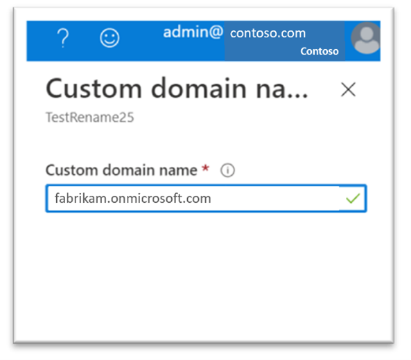
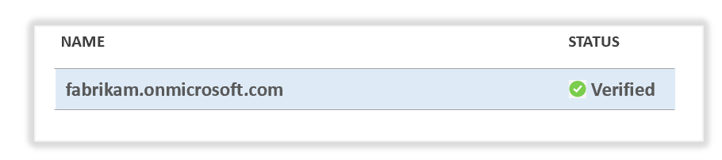

# Rename your SharePoint domain

It's now possible to change the SharePoint domain name for your organization in Microsoft 365. For example, if the name of your organization changes from "Contoso" to "Fabrikam," you can change `contoso.sharepoint.com` to `fabrikam.sharepoint.com`.

> [!IMPORTANT]
> - This feature is only available for customers that have been accepted into the Private Preview program. If you would like to do so, you can [nominate yourself into the Private Preview](https://aka.ms/SPOTenantRenameNomination). Note that the nomination does not necessarily mean that you will be accepted. We review these on a case-by-case basis and will only be in contact if you are accepted.
> - This feature is not available for organizations that have set up a multi-geo.
  
> [!NOTE]
> - This change affects only SharePoint and OneDrive URLs. It doesn't impact email addresses.
> - For info about changing a site address, for example, from `https://contoso.sharepoint.com/sites/sample1` to  `https://contoso.sharepoint.com/sites/sample2`, see [Change a site address](change-site-address.md).  
> - When you rename your SharePoint domain, we create a redirect at the previous address.

## Limitations

### Low impact

|App/feature  |Limitation  |Action required  |
|---------|---------|---------|
| Hub site menu items | Although the menu items will continue to work, items that contain absolute URLs aren't changed.  | Edit the menu items and if necessary, change the URLs to the new domain name. |
| Office "Recent" and "Pinned" lists | These lists are updated immediately for the first 100 users for each URL that was changed. The remaining are updated over time depending on usage. | None |
|Office.com | The URLs at https://www.office.com can take 24 hours to be updated. | None |
| OneDrive | Only the domain name portion in URLs is changed. The relative path that's based on the User Principle Name (UPN) isn't changed. | None |
| OneDrive sync app (OneDrive.exe) | Requires version 17.3.6943.0625 or later for all users. | Make sure the URLs "oneclient.sfx.ms" and "g.live.com." aren't blocked, and that all computers in your organization can reach them to apply updates. |
| OneDrive sync app (OneDrive.exe) | The organization name displayed in Office apps isn't changed. (For example, the app displays the old folder name C:\Users\Sophia\OneDrive – Contoso) | Users can disconnect and reconnect their account in the Office app. |  
| OneNote | Requires a recent version of OneNote. | Make sure all users have the following versions installed: <br> OneNote desktop app: Version 16.0.8326.2096 or later. <br> OneNote for Windows 10: Version 16.0.8431.1006 or later. <br> OneNote mobile app: Version 16.0.8431.1011 or later. |
| OneNote | While the domain name is being changed, users might receive a notebook sync error.| None |
| SharePoint mobile apps | Requires a recent version of the mobile app. | Make sure all users have the following versions installed:<br>iOS: 4.20.0 or later. <br> Android: 3.21.0 or later. |
| SharePoint mobile apps | While the domain name is being changed, users might receive a notebook sync error. | None |
| Search and Delve | The search index might take a while to reflect new URL changes. | None |
| Search and Delve | Search results might not be complete or might return results for the original URLs until the search index is updated.| None |
| SharePoint content  | Although content (such as text on pages) that includes the domain name will continue to work, it won't be updated to display the new name. | Search for the old domain name and edit content to display the new domain name. |

### Medium impact

|App/feature  |Limitation  |Action required  |
|---------|---------|---------|
| Custom apps and Group Policy objects | Absolute URLs embedded in these apps and objects aren't changed. | Edit custom apps and Active Directory Group Policy objects that contain absolute URLs and if necessary, change the URLs to the new domain name. Confirm with third-party app publishers that apps don't contain absolute URLs. |
| Custom and third-party apps | Some apps might not process the HTTP 308 direct correctly. | Edit custom apps and work with third-party app publishers to ensure that they handle HTTP 308 responses correctly. |
| Delve | It can take 24 hours before People profiles can be viewed. | None |
| eDiscovery | Holds can't be removed until you update the URLs. | In the Compliance center, change the eDiscovery hold URLs to the new domain name. |
| InfoPath forms | Forms that use a SharePoint connection as a data source won't work. | Reconnect these forms to SharePoint. |
| Power Apps | SharePoint forms modified with Power Apps won't work. | Delete any forms you don't need anymore or reset them to enable the default SharePoint form. You might need to delete some forms by using PowerShell. You might also need to recreate SharePoint forms in Power Apps. |
| Power Apps | Apps that use a SharePoint connection as a data source won't work. | Reconnect the apps to SharePoint. |
| Power BI | Power BI reports using SharePoint connections as a data source won't work. |	Before changing your domain name, download the Power BI reports that are using SharePoint connections as a data source as a .pbix file. After you change the domain name, edit the connections in the Power BI Desktop app and republish the report. <br> Power BI reports that are not created or maintained in the Power BI Desktop app will need to be recreated. |
| Project Online | Workflows that are “in flight” won't complete and will be orphaned. <br> New workflow instances can't be initiated. <br> Association to previous workflow instances isn't available and will be orphaned. | Before changing your domain name, make sure all “in flight” workflows are completed. After you change the domain name, republish the workflows. You can then reset them to "in flight" in Project Web App by going to PWA Settings > Change or Restart Workflows. |
| Project Online | URLs embedded in workflows aren't changed. For example, if a workflow contains the embedded URL `contoso.sharepoint.com`, it isn't changed. This might impact the functionality of the workflow. | Workflows that contain URLs referring to the original domain name might need to be updated to the new name. |
| Project Online | References to PWA sites in Project Online at https://project.microsoft.com won't work. | In Project Online at https://project.microsoft.com, change the URL of the PWA sites under Settings > My PWA Site. |
| Project Online | Custom Excel Reports that use Microsoft Project Data connections as a data source won't work. | These reports will need to be reconnected. |
| Project Pro | The app won't work until you update the URL of the PWA site. | Before changing your domain name, make sure that all projects that are checked out in Project Pro are checked in. After you change the domain name, change the URL of the PWA site under File > Info > Manage Accounts. |
| SharePoint 2013 workflows | Workflows that are “in flight” won't complete and will be orphaned. <br> New 2013 Workflow instances can't be initiated. <br>Association to previous workflow instances isn't available and will be orphaned. | Before changing your domain name, make sure all “in flight” workflows are completed. After you change the domain name, republish the workflows. |
| SharePoint 2013 workflows | URLs embedded in workflows aren't changed. For example, if a workflow contains the embedded URL `contoso.sharepoint.com`, it isn't changed. This might impact the functionality of the workflow. | Workflows that contain URLs referring to the original domain name might need to be updated to the new name. |
| SharePoint add-ins | Add-ins might not function as expected. | The add-ins might need to be republished. <br>Review the App configuration settings in Azure AD for the add-in and update any URLs to the new domain name. <br> For SPFx applications, in Azure AD update the Authentication URLs to the new domain for the SharePoint Online Client Extensibility Web Application Principal. |
| Site customizations and embedded code | Absolute URLs embedded in SharePoint customizations aren't updated. | Edit customizations that contain absolute URLs and if necessary, change the URLs to the new domain name. |
| Teams on the web and Teams desktop app | The first time someone tries to access the Files tab for a team or private channel, they'll receive an error. The tab will work for all users after that. | None |
| Teams on the web and Teams desktop app | It can take 72 hours for meeting notes to work (for both current and previous meetings). | None |
| Teams on the web and Teams desktop app | On the Files tab, any folders added with the "Add cloud storage" (which point to another SharePoint site) won't work.| Remove and readd the folders. |
| Teams on the web and Teams desktop app | Document libraries added as a tab won't work. | Remove and readd the tab. |
| Teams on the web and Teams desktop app | Embedded images in Wikis won't be displayed. | Edit the Wiki .mht file located in the SharePoint Site Teams Wiki Data library and if necessary, change the URLs of the embedded images to the new domain name. |
| Third-party apps including backup solutions | Absolute URLs embedded in these third-party apps (including backup solutions) aren't changed. | Confirm with third-party app publishers (including backup solutions) that they support tenant renames. |

### High impact

|App/feature  |Limitation  |Action required  |
|---------|---------|---------|
| Deleted sites | Any sites that have been deleted can't be restored after the change. | Before changing your domain name, review the Deleted sites page in the SharePoint admin center and restore any sites that you might want to keep. |
| Long URLs | Any absolute URLs to sites or content that exceed the maximum URL length limit of 400 characters won't work. | If the new domain name is longer than the original, review the URLs of all sites, lists, document libraries, list items, and files before your change the domain name to make sure the new URLs won't exceed 400 characters. |
| Multi-Geo configurations | Your SharePoint domain name can't be changed if your organization is currently set up for Microsoft 365 Multi-Geo or was previously set up for it.  | No action available. |
| Point-in-time restoration | Restoring a site to a previous time before the domain name change isn't possible. | No action available.|
| Vanity domain configurations | Your domain name can't be changed if you have a vanity domain configuration. | No action available. |


## Step 1: Add the new domain name

1. Check the availability of the new domain you want by entering the full SharePoint URL in your browser (for example, `https://fabrikam.sharepoint.com`). If you get a “not found” (404) error, it indicates the domain is most likely available. If the domain is already registered by another customer, we can't provide any information or contact the customer. 

    -or-

    If you own the domain for another subscription, you need to [delete that tenant in Azure AD](/azure/active-directory/enterprise-users/directory-delete-howto). Deleting a tenant typically takes three days to complete and to make the domain available. 

    > [!WARNING]
    > Do NOT use the domain to test this procedure in a test environment first. If you do, you won't be able to use the domain for your production environment.

2. Go to the [Custom domain names page in the Azure AD admin center](https://aka.ms/SPORenameAddDomain).

3. Select **Add custom domain**.

4. In the **Custom domain name** box, add the full new “.onmicrosoft.com” domain, and then select **Add domain**.

    

    > [!IMPORTANT]
    > Do NOT include any hyphens (-) in the new domain. They aren't supported in SharePoint.
 
5. Make sure you get a confirmation message. If the domain isn't available, try a different domain. 
 
6. After getting a confirmation that the domain was added successfully, you might see a message that the properties could not be found. Select the message to refresh domain references.

    > [!WARNING]
    > Do NOT add any other domains. Do NOT configure the new domain as the initial domain.
 
7. Confirm that your domain has been added to the list. 

    

    > [!IMPORTANT]
    > The domain name must have the status of "Verified."

## Step 2: Use Microsoft PowerShell to rename your domain

> [!WARNING]
> Changing your SharePoint domain name might take several hours to days depending on the number of sites and OneDrive users that you have. We strongly recommend that you make this change during a period of low usage (like a weekend) and tell users to avoid accessing SharePoint and OneDrive content during the change. In addition, any actions that create new OneDrives and sites (such as creating a new team or private channel in Microsoft Teams) will be temporarily blocked during the rename. 
  
1. [Download the latest SharePoint Online Management Shell](https://go.microsoft.com/fwlink/p/?LinkId=255251).

    > [!NOTE]
    > If you installed a previous version of the SharePoint Online Management Shell, go to Add or remove programs and uninstall "SharePoint Online Management Shell." 

2. Connect to SharePoint as a [global admin or SharePoint admin](./sharepoint-admin-role.md) in Microsoft 365. To learn how, see [Getting started with SharePoint Online Management Shell](/powershell/sharepoint/sharepoint-online/connect-sharepoint-online).

Example: 

> `Connect-SPOService -Url "https://contoso-admin.sharepoint.com"`
    
3. Run the following command to specify the new domain name:
  
    ```PowerShell
    Start-SPOTenantRename -DomainName <DomainName> -ScheduleDateTime <YYYY-MM-DDTHH:MM:SSZ> [-WhatIf] [-Confirm] 
    ```

    Where "ScheduleDateTime" is at least 24 hours in the future, but not more than 30 days.

You can get the status of the rename by running `Get-SPOTenantRenameStatus`.

During and after the rename, you can get the state of a site by running `Get-SPOSiteRenameState`. For more info about this cmdlet, see [Get-SPOSiteRenameState](/powershell/module/sharepoint-online/get-spositerenamestate).

## Step 3: Review features and settings after the rename

1. Review any firewall rules that might block access to the new domain.

2. Review organization browser settings to make sure  the new domain is a trusted location. This includes reviewing any Group Policy settings that might control browser settings.

3. Review any third-party apps, custom apps, and scripts that access SharePoint. They might need to be modified to use the new domain.
