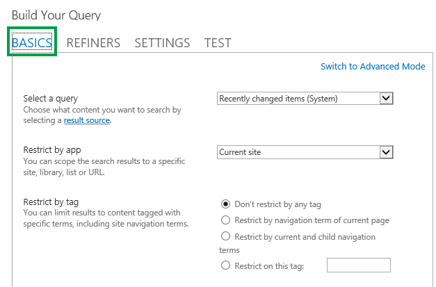

# Configure a Content Search Web Part in SharePoint

Display content on your SharePoint classic pages by configuring simple and advanced queries in a Content Search Web Part.
  
This web part is designed for classic pages. If you're not using classic pages, check out the [Use the Highlighted content web part](https://support.office.com/article/e34199b0-ff1a-47fb-8f4d-dbcaed329efd).
  
## About the Content Search Web Part (CSWP)

When visitors browse to a page that contains a CSWP, the Web Part automatically issues a query. The search results are displayed within the CSWP. In most cases, visitors won't even know that search technology is being used to display the content they're viewing. To them, it'll look and feel like any other webpage.
  
By configuring a query in a CSWP, you can define which content visitors will see when they browse to a page that contains a CSWP. By default, the query in the CSWP is configured to show the three most recently changed items on the site. By configuring the query, you can change the number of items that are shown in the CSWP and which content is shown. For example, you can configure the query so that the CSWP will show nine list items from a particular list, or the last six documents the visitor created in a document library.
  
[Display content on your SharePoint classic pages by configuring simple and advanced queries in a Content Search Web Part.This web part is designed for classic pages. If you're not using classic pages, check out the Use the Highlighted content web parthttps://support.office.com/article/e34199b0-ff1a-47fb-8f4d-dbcaed329efd.](the-content-search-web-part.md#__top)
  
## Add a Content Search Web Part

1. Make sure that you're a member of the Designers SharePoint group on the site where you want to add the Web Part.
    
2. Go to the page where you want to add the Web Part.
    
3. From **Settings**, select **Edit page**.
    
4. In the Zone where you want to add the Web Part, select **Add a Web Part**.
    
5. In the **Categories** list, select **Content Rollup**.
    
6. In the **Parts** list, select **Content Search** > **Add**.
    
[Display content on your SharePoint classic pages by configuring simple and advanced queries in a Content Search Web Part.This web part is designed for classic pages. If you're not using classic pages, check out the Use the Highlighted content web parthttps://support.office.com/article/e34199b0-ff1a-47fb-8f4d-dbcaed329efd.](the-content-search-web-part.md#__top)
  
## Display content by configuring a simple query in a Content Search Web Part

If the query that you want the CSWP to issue is simple, for example, if you want to limit search results to a [result source](understanding-result-sources.md) or to a specific tag, then you'll probably only need to use the configuration options on the **BASICS** tab. 
  

  
1. Make sure that you're a member of the Designers SharePoint group on the site that contains the CSWP.
    
2. Go to the page that contains the CSWP that you want to edit. 
    
3. From **Settings**, select **Edit Page**.
    
4. In the Web Part, select the Content Search Web Part Menu arrow > **Edit Web Part**.
    
5. In the Web Part tool pane, in the **Properties** section, in the **Search Criteria** section, select **Change query**.
    
    A dialog box as shown in the image above opens. Here, you can configure the query as described in the following table. 
    
|****Select a query****|**Select a [result source](manage-result-sources.md) to specify which content should be searched.**|
|:-----|:-----|
|**Restrict results by app**   |Select an option from the list to restrict results to a specific site, library, list, or URL.    |
|**Restrict by tag**   |You can limit results to content that is tagged with a term.    Select one of the following:    |****Don't restrict by any tag****|**Search results aren't limited by a term.**|
|:-----|:-----|
|**Restrict by navigation term of current page**   |Search results are limited to content that's tagged with the navigation term of the current page. The navigation term is displayed as the last part of the friendly URL. This option is only meaningful for sites that use managed navigation.    |
|**Restrict by** **current and child navigation**   |Search results are limited to content that is tagged with the navigation term of the current page (displayed as the last part of the friendly URL), and content that is tagged with sub-terms of the current navigation term. This option is only meaningful for sites that use managed navigation.    > [!NOTE]>  In a cross-site publishing scenario, this selection will work only when the result source that you selected from the **Select a query** menu is the catalog result source that was created when you [Connect and disconnect a publishing site to a catalog in SharePoint](https://support.office.com/article/df2bdea4-ceb0-459a-91d2-a47a1d807d71).           |
|**Restrict on this tag**   |Search results are limited to content that is tagged with the tag that you type inside the box.    |
   
|
   
[Display content on your SharePoint classic pages by configuring simple and advanced queries in a Content Search Web Part.This web part is designed for classic pages. If you're not using classic pages, check out the Use the Highlighted content web parthttps://support.office.com/article/e34199b0-ff1a-47fb-8f4d-dbcaed329efd.](the-content-search-web-part.md#__top)
  
## Display content by configuring an advanced query in a Content Search Web Part

If the query that you want the CSWP to issue is advanced, for example you want to use [Keyword Query Language (KQL) Syntax Reference](https://msdn.microsoft.com/en-us/library/ee558911%28v=office.15%29.aspx), you'll need to use the configuration options that are available in **Advanced Mode** on the **BASICS** tab. 
  
When you configure the query in **Advanced Mode**, you can also use [query variables](https://technet.microsoft.com/library/jj683123.aspx) . Query variables are placeholders that are replaced with values when a query is run. Examples of query variables are {User.Name}, which is a placeholder for the name of the user who is viewing the page, or {URLToken.1}, which is a placeholder for the first value in the URL as counted from right to left. 
  
1. Make sure that you're a member of the Designers SharePoint group on the site that contains the CSWP.
    
2. Go to the page that contains the CSWP that you want to edit. 
    
3. From **Settings**, select **Edit Page**.
    
4. In the Web Part tool pane, in the **Properties** section, in the **Search Criteria** section, select **Change query**. 
    
5. In the dialog box that opens, select **Switch to Advanced Mode**.
    
6. Configure your query as described in the following tables:
  
|****BASICS** tab**|
|:-----|
|Select a query    |Select a result source to specify which content should be searched.    |
|Keyword filter    |You can use keyword filters to add query variables to your query. For a list of available query variables, see [Query variables in SharePoint Server 2013](https://technet.microsoft.com/en-us/library/jj683123).    You can select predefined query variables from the drop-down list, and then add them to the query by selecting **Add keyword filter**.    |
|Property filter    |You can use property filters to query the content of managed properties that are set to queryable in the search schema.    You can select managed properties from the **Property filter** drop-down list. Select **Add property filter** to add the filter to the query.    > [!NOTE]> Custom managed properties are not shown in the **Property filter** list. To add a custom managed property to your query, in the ** Query text ** box, enter the name of your custom managed property followed by the query condition, for example  *MyCustomColorProperty:Green*           |
|Query text    |Type your query by using [Keyword Query Language (KQL)](https://msdn.microsoft.com/en-us/library/ee558911%28v=office.15%29.aspx), or use the **Keyword filter** and **Property filter** lists to build the query.    The keyword query can consist of free-text keywords, property filters, or operators. Use braces to enclose query variables. Query variables are replaced with an actual value when the query is run.    Keyword queries have a maximum length of 2,048 characters.    |
   
|****REFINERS** tab**|
|:-----|
|Use this tab if you want your search results to be limited to items that have one or more refiner values. The managed properties that are enabled as refiners in the search schema are listed in the **Choose your refiners** section. Select a refiner value in the list, and then select **Add** to add it to the query.    If you want search results to display as a group on one or more managed properties, select **Show more**. This is useful to display several variants for a given item, and want to group them under a single result.    |
   
|****SORTING** tab**|
|:-----|
|In this tab, you can specify how you want your search results to be sorted. The managed properties that are set as sortable in the search schema are listed in the **Sort by** drop-down list. From this list, select a managed property, and then select **Descending** or **Ascending**. To add more sorting levels, select Add sort level.    If you selected **Rank** from the **Sort by** list, you can select which ranking model to use for sorting in the **Ranking Model** list. You can also add more rules and conditions by selecting **Add dynamic ordering rule**.    |
   
|****SETTINGS** tab**|
|:-----|
|Query rules    |Select if to use [query rules](understanding-query-rules.md).    |
|URL Rewriting    |Select if you want the URL rewrite to the item details page to be relative for each catalog item as defined when you [Connect and disconnect a publishing site to a catalog in SharePoint](https://support.office.com/article/df2bdea4-ceb0-459a-91d2-a47a1d807d71). If you select **Don't rewrite URLs**, the URLs for catalog items will point directly to the library item of the connected catalog.    |
|Loading behavior    |Select when you want the search results returned by the CSWP to appear on the web page. If you use the default option, **Sync option: Issue query from the server**, queries are issued from the server, and the search results are included in the page response that SharePoint returns. If you select **Async option: Issue query from the browser**, the queries are issued from the user's browser after the complete page is received. You can use this option for content such as Recommendations or Popular Items.    |
|Priority    |Select the priority for content that's displayed by this Web Part in relation to other Search Web Parts. If SharePoint is running under a heavy load, the queries will be run according to their priority.    |
|Caching    |Select one Active Directory security group if you want search results to be cached for users in the group. By caching search results for a security group, you can reduce page load time.    > [!NOTE]>  You should only select a security group where search results are identical for all users in the group. For more information, see [Make pages load faster with caching in the Content Search Web Part](make-pages-load-faster-with-caching-in-the-content-search-web-part.md).           |
   
|****TEST** tab**|
|:-----|
|In this tab, you can preview query details sent by the CSWP.    |
|Query text    |Shows the query that will be run by the CSWP.    |
|Select **Show more** to display additional information.    |
|Query template    |Shows the content of the query template that is applied to the query.    |
|Refined by    |Shows the refiners applied to the query as defined on the **REFINERS** tab.    |
|Grouped by    |Shows search results that are grouped by managed property as defined in the **REFINERS** tab.    |
|Applied query rules    |Shows which [query rules](manage-query-rules.md) are applied to the query.    |
|Query template variables    |Shows the query variables that are applied to the query, and the values of these variables as they apply to the current page. To preview the results, select **Test Query**.    |
|To test how the query works for different user segment terms, select **Add user segment** term. To preview the results, select **Test Query**.    |
|**Query text**   |Shows the query that will be issued by the CSWP.    |
   
[Display content on your SharePoint classic pages by configuring simple and advanced queries in a Content Search Web Part.This web part is designed for classic pages. If you're not using classic pages, check out the Use the Highlighted content web parthttps://support.office.com/article/e34199b0-ff1a-47fb-8f4d-dbcaed329efd.](the-content-search-web-part.md#__top)
  
## Control how content is displayed in a Content Search Web Part

To control how content is displayed in a CSWP, you have to customize  *display templates*  . To learn how to create a custom display template, see [SharePoint 2013 Design Manager display templates](https://msdn.microsoft.com/library/jj945138.aspx)
  
[Display content on your SharePoint classic pages by configuring simple and advanced queries in a Content Search Web Part.This web part is designed for classic pages. If you're not using classic pages, check out the Use the Highlighted content web parthttps://support.office.com/article/e34199b0-ff1a-47fb-8f4d-dbcaed329efd.](the-content-search-web-part.md#__top)
  
## Tips on how to configure the Content Search Web Part to reduce page load time

The CSWP offers a lot of flexibility for configuring the query. But, if you configure the Web Part to use a very complex query, SharePoint has to work harder to resolve the query, which again can lead to increased page load time. In search jargon, this is the same as increased query latency. 
  
The following tips can help you reduce the query complexity and page load time:
  
- Avoid using several OR operators. OR operators increase the query complexity more than AND operators. If your query contains OR operators, try changing the query to use AND operators instead.
    
- Avoid using the wildcard operator (\*). Instead, try to configure the query to use exact matching.
    
- Avoid using keyword phrases. Instead, try to use a single keyword.
    
- Avoid using query variables that contain User properties or Term and term set properties. See [Query variables in SharePoint Server 2013](https://technet.microsoft.com/library/jj683123.aspx) for information and examples of these properties. 
    
- Avoid adding custom sorting such as sort levels and dynamic ordering rules. Instead, try to use the default sorting options from the **Sort by** and **Ranking Model** pull-down menus on the **SORTING** tab 
    
- If you're not using [query rules](understanding-query-rules.md), select **Don't use Query Rules** from the **SETTINGS** tab. 
    
- If you're not using the CSWP to show content from a [Enable a library or list as a catalog in SharePoint](https://support.office.com/article/d1d377f3-77d5-4023-82d6-0a04e8c74ba4), select **Don't rewrite URLs** from the **SETTINGS** tab. 
    
## See also

#### Other Resources

[Change settings for the Search Results Web Part](the-search-results-web-part.md)

