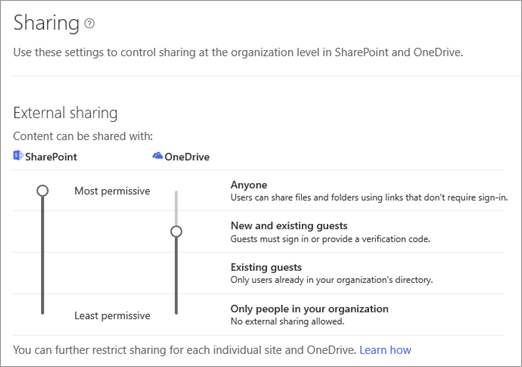
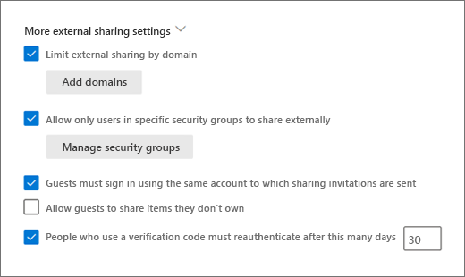
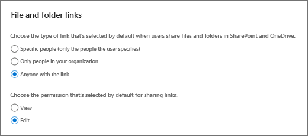
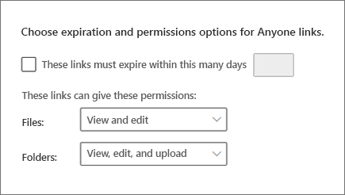
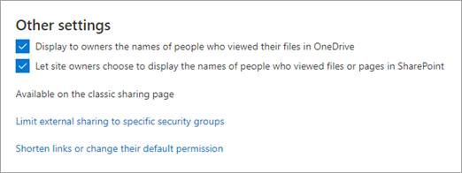
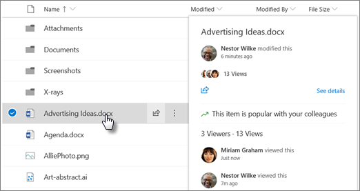

# Manage sharing settings

This article describes how global and SharePoint admins in Office 365 can change their organization-level sharing settings for SharePoint and OneDrive.

For end-to-end guidance around how to configure guest sharing in Microsoft 365, see:
- [Collaborate with guests on a document](https://docs.microsoft.com/Office365/Enterprise/collaborate-on-documents)
- [Collaborate with guests in a site](https://docs.microsoft.com/Office365/Enterprise/collaborate-in-a-site)
- [Collaborate with guests in a team](https://docs.microsoft.com/Office365/Enterprise/collaborate-as-a-team)

To change the sharing settings for a site after you've set the organization-level sharing settings, see [Turn external sharing on or off for for a site](change-external-sharing-site.md). To learn how to change the external sharing setting for a user's OneDrive, see [Change the external sharing setting for a user's OneDrive](/onedrive/user-external-sharing-settings). 
  
 
## Change the organization-level external sharing setting

  
1. Go to the [Sharing page of the new SharePoint admin center](https://admin.microsoft.com/sharepoint?page=sharing&modern=true) and sign in with an account that has [admin permissions](/sharepoint/sharepoint-admin-role) for your organization.

>[!NOTE]
>If you have Office 365 Germany, [sign in to the Microsoft 365 admin center](https://go.microsoft.com/fwlink/p/?linkid=848041), then browse to the SharePoint admin center and open the Sharing page.  If you have Office 365 operated by 21Vianet (China), [sign in to the Microsoft 365 admin center](https://go.microsoft.com/fwlink/p/?linkid=850627), then browse to the SharePoint admin center and open the Sharing page.

2. Under **External sharing**, specify your sharing level for SharePoint and OneDrive. The default level for both is "Anyone."

    > [!NOTE]
    >  The SharePoint setting applies to all site types, including those connected to Office 365 groups.   The OneDrive setting can be more restrictive than the SharePoint setting, but not more permissive.   The SharePoint external sharing setting on this page is the same as the one in the Microsoft 365 admin center, under **Settings** \> **Services & add-ins** \> **Sites**. These settings are also the same as those in the OneDrive admin center. 

    

    This setting is for your organization overall. Each site has its own sharing setting which you can set independently, though it must be at the same or more restrictive setting as the organization. See [Change the external sharing setting for a site](change-external-sharing-site.md) for more information.
  
### Which option to select...

|**Select this option:**|**If you want to:**|
|:-----|:-----|
|**Anyone**    | Allow users to share files and folders by using links that let anyone who has the link access the files or folders without authenticating. This setting also allows users to share sites with new and existing guests who authenticate. If you select this setting, you can restrict the Anyone links so that they must expire within a specific number of days, or so that they can give only View permission. [File requests](https://support.office.com/article/f54aa7f8-2589-4421-b351-d415fc3b83af) requires that OneDrive be set to **Anyone** and edit permissions for **Anyone** links be enabled. OneDrive settings other than **Anyone** disable file requests.  See [Best practices for sharing files and folders with unauthenticated users](https://docs.microsoft.com/Office365/Enterprise/best-practices-anonymous-sharing) for more information. |
|**New and existing guests**   | Require people who have received invitations to sign in with their work or school account (if their organization uses Office 365) or a Microsoft account, or to provide a code to verify their identity. Users can share with guests already in your organization's directory, and they can send invitations to people who will be added to the directory if they sign in. For more info about verification codes, see [Secure external sharing in SharePoint](what-s-new-in-sharing-in-targeted-release.md)   Invitations to view content can be redeemed only once. After an invitation has been accepted, it cannot be shared or used by others to gain access.    |
|**Existing guests**   |Allow sharing only with guests who are already in your directory. These guests may exist in your directory because they previously accepted sharing invitations or because they were manually added, such as through [Azure B2B collaboration](/azure/active-directory/b2b/what-is-b2b). (To see the guests in your organization, go to the [Guests page in the Microsoft 365 admin center](https://admin.microsoft.com/Adminportal/Home#/GuestUsers)).    |
|**Only people in your organization**   | Turn off external sharing.

> [!NOTE]
>  If you turn off external sharing for your organization and later turn it back on, guests who previously had access will regain it. If you know that external sharing was previously turned on and in use for specific sites and you don't want guests to be able to regain access, first turn off external sharing for those specific sites. If you restrict or turn off external sharing, guests will typically lose access within one hour of the change.  

### Advanced settings for external sharing

**Limit external sharing by domain**

This is useful if you want to limit sharing with particular partners, or help prevent sharing with people at certain organizations. The organization-level setting on this page affects all SharePoint sites and each user's OneDrive. To use this setting, list the domains (maximum of 3000) in the box, using the format *domain.com*. To list multiple domains, press Enter after adding each domain. 
    
You can also limit external sharing by domain by using the [Set-SPOTenant](/powershell/module/sharepoint-online/Set-SPOTenant) Microsoft PowerShell cmdlet with -SharingDomainRestrictionMode and either -SharingAllowedDomainList or -SharingBlockedDomainList. For info about limiting external sharing by domain at the site level, see [Restricted domains sharing](restricted-domains-sharing.md).

**Guests must sign in using the same account to which sharing invitations are sent**

By default, guests can receive an invitation at one account but sign in with a different account. After they redeem the invitation, it can't be used with any other account.

**Allow guests to share items they don't own**

By default, guests must have full control permission to share items externally.

## File and folder links

Choose the option you want to show by default when a user gets a link. 

> [!NOTE]
> This setting specifies the default for your organization, but site owners can choose a different default link type for a site.

- **Specific people** - This option allows users to enter external email addresses. This is the best option for external sharing of sensitive or proprietary information because it requires that the recipient verify their identity before they can access the file.
- **Only people in your organization** - If links are forwarded, they'll work for anyone in the organization. This option is best if your organization shares broadly internally and rarely shares externally.
- **Anyone with the link** - This option is available only if your external sharing setting is set to "Anyone." Forwarded links will work internally or externally, but you won't be able to track who has access to shared items or who has accessed shared items. This is best for friction-free sharing if most files and folders in SharePoint and OneDrive aren't sensitive. 
  
> [!IMPORTANT]
> If you select "Anyone with the link," but the site or OneDrive is set to allow sharing only with guests who sign in or provide a verification code, the default link will be "Only people in your organization." Users will need to change the link type to "Specific people" to share files and folders in the site or OneDrive externally. 

### Advanced settings for "Anyone" links

**Link expiration** - You can require all "Anyone" links to expire, and specify the maximum number of days allowed

**Link permissions** - You can restrict "Anyone" links so that they can only provide view permission for files or folders.

If you are using file requests, the link permissions must be set for **View and edit** for files and **View, edit, and upload** for folders.

## Other

**Display to owners the names of people who viewed their files**

This setting lets you control whether the owner of a shared file can see on the file card the people who only view (and don't edit) the file in OneDrive. The file card appears when users hover over a file name or thumbnail in OneDrive. The info includes the number of views on the file, the number of people who viewed it, and the list of people who viewed it. To learn more about the file card, see [See files you shared in OneDrive](https://support.office.com/article/6b67b82b-9c5c-4348-ab10-fd5b0d8df76c). 

> [!NOTE]
> This setting is selected by default. If you clear it, file viewer info is still recorded and available to you to audit as an admin. OneDrive owners will also still be able to see people who have viewed their shared Office files by opening the files from Office.com or from the Office desktop apps.

**Let site owners choose to display the names of people who viewed files or pages in SharePoint**

This setting lets you specify whether site owners can allow users who have access to a file, page, or news post to see on the file card who has viewed the item. 

This setting is turned on by default at the organization level and off at the site level for existing sites. Viewer information is shown only when the setting is on at both the organization and site level. We recommend that site owners turn on this feature only on team sites that don't have sensitive information. [Learn how site owners can turn on this feature](https://support.office.com/article/ee26dde0-c30e-4eca-b1c3-38922c450967).

> [!NOTE]
> Historical data is included when this setting is enabled. Likewise, if the setting is turned off and back on at the organization level or site level, the views during the off period will be included in the history.

On the classic Sharing page, you can limit external sharing by security group and shorten sharing links or change their default permission.

## Need more help?

[!INCLUDE[discussionforums.md](includes/discussionforums.md)]

You can also find help on security and permissions in these [YouTube videos from SharePoint community experts](https://www.youtube.com/playlist?list=PLKurDp05sqD0oE3KnohD69dkP5fHmrfuN).

## See also

[Limit accidental exposure to files when sharing with guests](/Office365/Enterprise/sharing-limit-accidental-exposure)

[Create a secure guest sharing environment](https://docs.microsoft.com/Office365/Enterprise/create-a-secure-guest-sharing-environment)

[Stop sharing files or folders or change permissions](https://support.office.com/article/0a36470f-d7fe-40a0-bd74-0ac6c1e13323)
