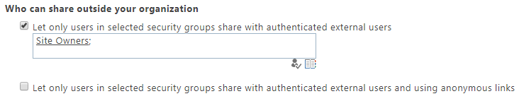

# Turn external sharing on or off for SharePoint Online

If you're working with vendors, clients, or customers outside of your organization, you might want to give them access to specific sites, folders, or files. In this article, we'll show you how to set your organization-level external sharing setting for SharePoint Online. You must be a global or SharePoint admin in Office 365 to do this.
  
External sharing is controlled at both the organization level and the site collection level. The organization-level settings determine what options are available at the site collection level. The external sharing settings for individual site collections can be more restrictive than whatever is allowed at the organization level, but these settings can't be more permissive. 

For info about changing the external sharing setting for a site collection, see [Change the external sharing setting for a site](change-external-sharing-site.md).
  
 
## Change the organization-level external sharing setting

When you turn on external sharing at the organization level, you can turn it on for the sites you want.  
  
1. Sign in to https://admin.microsoft.com as a global or SharePoint admin. (If you see a message that you don't have permission to access the page, you don't have Office 365 administrator permissions in your organization.)
    
    > [!NOTE]
    > If you have Office 365 Germany, sign in at https://portal.office.de. If you have Office 365 operated by 21Vianet (China), sign in at https://login.partner.microsoftonline.cn/. Then select the Admin tile to open the admin center.  

2. In the left pane, under **Admin centers**, select **SharePoint**. (You might need to select **Show all** to see the list of admin centers.) 

3. If the classic SharePoint admin center appears, select **Try it now** to open the new SharePoint admin center. 

4. In the left pane of the new SharePoint admin center, under **Policies**, select **Sharing**.

5. Under **External sharing**, specify your sharing level for SharePoint and OneDrive.

> [!NOTE]
>  The SharePoint setting applies to all site types, including those connected to Office 365 groups.   The OneDrive setting can be more restrictive than the SharePoint setting, but not more permissive.   The SharePoint external sharing setting on this page is the same as the one in the Microsoft 365 admin center, under **Settings** \> **Services & add-ins** \> **Sites**. The external sharing settings on this page are also the same as those in the OneDrive admin center. 
  
### Which option to select...

|**Select this option:**|**If you want to:**|
|:-----|:-----|
|**Anyone**    | Allow users to share files and folders by using links that let anyone who has the link access the files or folders anonymously. This setting also allows users to share sites with new and existing guests who authenticate. If you select this setting, you can restrict the Anyone links so that they must expire within a specific number of days, or so that they can give only View permission. |
|**New and existing guests**   | Require people who have received invitations to sign in with a their work or school account (if their organization uses Office 365) or a Microsoft account, or to provide a one-time code to verify their identity. Users can share with guests already in your organization's directory, and they can send invitations to people who will be added to the directory if they sign in. For more info about verification codes, see [Secure external sharing in SharePoint Online](what-s-new-in-sharing-in-targeted-release.md)   Invitations to view content can be redeemed only once. After an invitation has been accepted, it cannot be shared or used by others to gain access.    |
|**Only existing guests**   |Allow sharing only with guests who are already in your directory. These users may exist in your directory because they previously accepted sharing invitations or because they were manually added, such as through [Azure B2B collaboration](/azure/active-directory/b2b/what-is-b2b). (To see the guests in your organization, in the Microsoft 365 admin center, go to **Users** \> **Guests**.)    |
|**Only people in your organization**   | Turn off external sharing.

> [!NOTE]
>  If you turn off external sharing for your entire organization and later turn it back on, guests who previously had access will regain it. If you know that external sharing was previously turned on and in use for specific sites and you don't want guests to be able to regain access, first turn off external sharing for those specific sites. If you restrict or turn off external sharing, guests will typically lose access within one hour of the change.  

### Advanced settings for external sharing

**Limit external sharing by domain**

This is useful if you want to limit sharing with particular partners, or help prevent sharing with people at certain organizations. The organization-level setting on this page affects all SharePoint sites and each user's OneDrive. List the domains (maximum of 1000) in the box provided, using the format  *domain.com.*. If listing more than one domain, press Enter after adding each domain. 
    
You can also limit external sharing by domain by using the [Set-SPOTenant](/powershell/module/sharepoint-online/Set-SPOTenant) Microsoft PowerShell cmdlet with -SharingDomainRestrictionMode and either -SharingAllowedDomainList or -SharingBlockedDomainList. For info about limiting external sharing by domain at the site level, see [Restricted domains sharing](restricted-domains-sharing.md).

**Guests must accept sharing invitations using the same account that the invitations were sent to**

Guests must sign in using the same account to which the sharing invitation was sent 

**Let guests share items they don't own**

Guests can't share files, folders, or sites with anyone (including internal users) if they don't 

## Additional settings

To specify additional sharing settings, go to the classic SharePoint admin center.

1. Sign in to https://admin.microsoft.com as a global or SharePoint admin. (If you see a message that you don't have permission to access the page, you don't have Office 365 administrator permissions in your organization.)
    
    > [!NOTE]
    > If you have Office 365 Germany, sign in at https://portal.office.de. If you have Office 365 operated by 21Vianet (China), sign in at https://login.partner.microsoftonline.cn/. Then select the Admin tile to open the admin center.  
    
2. In the left pane, under **Admin centers**, select **SharePoint**. (You might need to select **Show all** to see the list of admin centers.) If this opens the new SharePoint admin center, select **Classic SharePoint admin center** in the left pane.

3. In the classic SharePoint admin center, select **sharing** in the left pane.

**Specify who can share outside your organization**

You can manage who can send sharing invitations to external users by limiting such sharing to members of a specified security group. Select  **Let only users in selected security groups share with authenticated external users** or **Let only users in selected security groups share with authenticated external users and using anonymous links** and specify any security group in your organization. The full list of available security groups could be found [here](https://admin.microsoft.com/adminportal/home?ref=groups). 

**Set a default link type and default permissions**
  
To better manage the type of links users share, you can set the default type of link - and the permissions for that link - that shows when users select **Get a link** to share documents and folders. 
  

  
The most permissive types of links, of course, are Anonymous Access links (Anyone links) which grant access to anyone who has the link. Internal links can be used only by users within your organization, and Direct links are accessible only by users who already have permission to access the document or folder. For more information, see [Change the default link type when users get links for sharing](change-default-sharing-link.md).

Note that these options provide a default setting for the sites in your organization, but site owners can choose different default link types and permissions for each site if they choose to.
  
 **Additional settings**
  
When you choose to allow users to share outside your organization, you have some additional ways to allow or limit sharing.
  

  
 **Limit external sharing using domains**: You can allow or restrict access to specific domains. For more information, see [Restricted Domains Sharing in Office 365 SharePoint Online and OneDrive for Business](restricted-domains-sharing.md).
  
 **Prevent external users from sharing files, folders, and sites they don't own**: External users cannot share anything they don't own with anyone else. 
  
 **External users must accept sharing invitations using the same account that the invitations were sent to**: External users cannot use a different account than the one that the sharing invitation was sent to get access. 
 
 **Require recipients to continually prove account ownership when they access shared items**: External users should re-authenticate every time when they access shared items. 
  
 **Notifications**
  
To help your OneDrive for Business users monitor and control which external users have access to their files, you can specify that owners of OneDrive for Business files and folders are emailed when:
  
- Another user invites external users to shared files

- An anonymous access link is created or changed.

> [!NOTE]
> The **External users accept invitations to access files** notification no longer works for the new sharing experience that appears in most places. This setting will be removed.
    

  
## See also

[Stop sharing files or folders or change permissions](https://support.office.com/article/0a36470f-d7fe-40a0-bd74-0ac6c1e13323)
