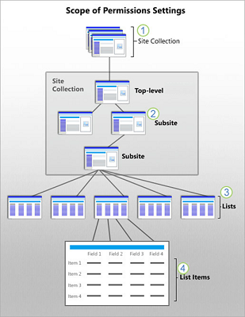

# Understanding permission levels in SharePoint

After you have created a SharePoint site, you may want to provide or restrict user access to the site or its contents. For example, you might want to provide access only to members of your team, or you might want to provide access to everyone, but restrict editing for some. The easiest way to work with permissions is to use the default groups and permissions levels provided, which cover most common scenarios. But, if you need to, you can set more fine-grained permissions beyond the default levels. This article describes the different permissions and permission levels, how SharePoint groups and permissions work together, and how permissions cascade through a site collection.
  
> [!NOTE]
> Want to go straight to the steps for changing or setting permission levels? See [How to create and edit Permission Levels](how-to-create-and-edit-permission-levels.md). 
  
## Overview and permissions inheritance

If you work on a site, you are working inside a site collection. Every site exists in a site collection, which is a group of sites under a single top-level site. The top-level site is called the root site of the site collection.
  
The following illustration of a site collection shows a simple hierarchy of sites, lists and list items. The permissions scopes are numbered, starting at the broadest level at which permissions can be set, and ending at the narrowest level (a single item in a list).
  

  
 **Inheritance**
  
An important concept to understand is permissions inheritance. By design, all the sites and site content in a collection inherit the permissions settings of the root or top-level site. When you assign unique permissions to sites, libraries, and items, those items no longer inherit permissions from their parent site. Here's more information on how permissions work within the hierarchy:
  
- A site collection administrator configures permissions for the top level site or root site for the whole collection.
    
- If you are a site owner, you can change permission settings for the site, which stops permission inheritance for the site.
    
- Lists and libraries inherit permissions from the site to which they belong. If you are a site owner, you can stop permissions inheritance and change the permission settings for the list or library.
    
- List items and library files inherit permissions from their parent list or library. If you have control of a list or library, you can stop permissions inheritance and change permissions settings directly on a specific item.
    
    It is important to know that a user can interrupt the default permission inheritance for a list or library item by sharing a document or item with someone who does not have access. In that case, SharePoint automatically stops inheritance on the document.
    
## Default Permission Levels

Default permission levels allow you to quickly and easily provide common levels of permissions for one user or groups of users.
  
You can make changes to any of the default permissions levels, except **Full Control** and **Limited Access**, both of which are described more fully in the table below.
  
|**Permission Level**|**Description**||
|:-----|:-----|:-----|
|Full Control    |Contains all available SharePoint permissions. By default, this permission level is assigned to the Owners group. It can't be customized or deleted.    |
|Design    |Create lists and document libraries, edit pages and apply themes, borders, and style sheets on the site. There is no SharePoint group that is assigned this permission level automatically.    |
|Edit    |Add, edit, and delete lists; view, add, update, and delete list items and documents. By default, this permission level is assigned to the Members group.    |
|Contribute    |View, add, update, and delete list items and documents.    |
|Read    |View pages and items in existing lists and document libraries and download documents.    |
|Limited Access    |Enables a user or group to browse to a site page or library to access a specific content item when they do not have permissions to open or edit any other items in the site or library. This level is automatically assigned by SharePoint when you provide access to one specific item. You cannot assign Limited Access permissions directly to a user or group yourself. Instead, when you assign edit or open permissions to the single item, SharePoint automatically assigns Limited Access to other required locations, such as the site or library in which the single item is located.    |
|Approve    |Edit and approve pages, list items, and documents. By default, the  *Approvers*  group has this permission.    |
|Manage Hierarchy    |Create sites and edit pages, list items, and documents. By default, this permission level is assigned to the  *Hierarchy Managers*  group.    |
|Restricted Read    |View pages and documents, but not historical versions or user permissions.    |
|View Only    |View pages, items, and documents. Any document that has a server-side file handler can be viewed in the browser but not downloaded. File types that do not have a server-side file handler (cannot be opened in the browser), such as video files, .pdf files, and .png files, can still be downloaded.    |
|||
   
> [!NOTE]
> Office 365 plans create a security group called "Everyone except external users" that contains every person you add into the Office 365 directory (except people who you add explicitly as External Users). This security group added to the Members group automatically, so that users in Office 365 can access and edit the SharePoint Online site. In addition, Office 365 plans create a security group called "Company Administrators", which contains Office 365 Admins (such as Global and Billing Admins). This security group is added to the Site Collection Administrators group. 
To learn more about "Everyone except external users" permission, see [Special SharePoint Groups](https://docs.microsoft.com/sharepoint/default-sharepoint-groups#special-sharepoint-groups)
  
## Permission levels and SharePoint groups

Permission levels work together with SharePoint groups. A SharePoint group is a set of users who all have the same permission level.
  
The way this works is that you put related permissions together into a permission level. Then you assign that permission level to a SharePoint group.
  

  
By default, each kind of SharePoint site includes certain SharePoint groups. For example, a Team Site automatically includes the Owners, Members, and Visitors group. A Publishing Portal site includes those groups and several more, such as Approvers, Designers, Hierarchy Managers, and so on. When you create a site, SharePoint automatically creates a pre-defined set of SharePoint groups for that site. In addition, a SharePoint admin can define custom groups and permission levels.
  
To learn more about SharePoint groups, see [Understanding SharePoint groups](/sharepoint/default-sharepoint-groups).
  
The SharePoint groups and permission levels that are included by default in your site may differ, depending on:
  
- The template that you choose for the site
    
- Whether a SharePoint admin created a unique permissions set on the site that has a specific purpose, such as Search
    
The following table describes the default permission levels and associated permissions for three standard groups: Visitors, Members, and Owners.
  
|**Group**|**Permission level**|
|:-----|:-----|
|**Visitors**   |**Read** This level includes these permissions:     Open     View Items, Versions, pages, and Application pages     Browse User Information     Create Alerts     Use Self-Service Site Creation     Use Remote Interfaces     Use Client Integration Features    |
|**Members**   |**Edit** This level includes all permissions in Read, plus:     View, add, update and delete Items     Add, Edit and Delete Lists     Delete Versions     Browse Directories     Edit Personal User Information     Manage Personal Views     Add , Update, or Remove Personal Web Parts    |
|**Owners**   |**Full Control** This level includes all available SharePoint permissions.    |
   
## Site permissions and permission levels

Site permissions apply generally across a SharePoint site. The following table describes the permissions that apply to sites, and show the permission levels that use them.
  
|**Permission**|**Full Control**|**Design**|**Edit**|**Contribute**|**Read**|**Limited Access**|**Approve**|**Manage Hierarchy**|**Restricted Read**|**View Only**|
|:-----|:-----|:-----|:-----|:-----|:-----|:-----|:-----|:-----|:-----|:-----|
|Manage Permissions    |X    |||||||X    |||
|View Web Analytics Data    |X    |||||||X    |||
|Create Subsites    |X    |||||||X    |||
|Manage Web Site    |X    |||||||X    |||
|Add and Customize Pages    |X    |X    ||||||X    |||
|Apply Themes and Borders    |X    |X    |||||||||
|Apply Style Sheets    |X    |X    |||||||||
|Create Groups    |X    ||||||||||
|Browse Directories    |X    |X    |X    |X    |||X    |X    |||
|Use Self-Service Site Creation    |X    |X    |X    |X    |X    ||X    |X    ||X    |
|View Pages    |X    |X    |X    |X    |X    ||X    |X    |X    |X    |
|Enumerate Permissions    |X    |||||||X    |||
|Browse User Information    |X    |X    |X    |X    |X    |X    |X    |X    ||X    |
|Manage Alerts    |X    |||||||X    |||
|Use Remote Interfaces    |X    |X    |X    |X    |X    ||X    |X    ||X    |
|Use Client Integration Features    |X    |X    |X    |X    |X    |X    |X    |X    ||X    |
|Open    |X    |X    |X    |X    |X    |X    |X    |X    |X    |X    |
|Edit Personal User Information    |X    |X    |X    |X    |||X    |X    |||
   
## List permissions and permission levels

List permissions apply to content in lists and libraries. The following table describes the permissions that apply to lists and libraries, and show the permission levels that use them.
  
|**Permission**|**Full Control**|**Design**|**Edit**|**Contribute**|**Read**|**Limited Access**|**Approve**|**Manage Hierarchy**|**Restricted Read**|**View Only**|
|:-----|:-----|:-----|:-----|:-----|:-----|:-----|:-----|:-----|:-----|:-----|
|Manage Lists    |X    |X    |X    |||||X    |||
|Override Check-Out    |X    |X    |||||X    |X    |||
|Add Items    |X    |X    |X    |X    |||X    |X    |||
|Edit Items    |X    |X    |X    |X    |||X    |X    |||
|Delete Items    |X    |X    |X    |X    |||X    |X    |||
|View Items    |X    |X    |X    |X    |X    ||X    |X    |X    |X    |
|Approve Items    |X    |X    |||||X    ||||
|Open Items    |X    |X    |X    |X    |X    ||X    |X    |X    ||
|View Versions    |X    |X    |X    |X    |X    ||X    |X    ||X    |
|Delete Versions    |X    |X    |X    |X    |||X    |X    |||
|Create Alerts    |X    |X    |X    |X    |X    ||X    |X    ||X    |
|View Application Pages    |X    |X    |X    |X    |X    ||X    |X    ||X    |
   
## Personal permissions and permission levels

Personal permissions apply to content that belongs to a single user. The following table describes the permissions that apply to personal views and web parts, and show the permission levels that use them.
  
|**Permission**|**Full Control**|**Design**|**Edit**|**Contribute**|**Read**|**Limited Access**|**Approve**|**Manage Hierarchy**|**Restricted Read**|**View Only**|
|:-----|:-----|:-----|:-----|:-----|:-----|:-----|:-----|:-----|:-----|:-----|
|Manage Personal Views    |X    |X    |X    |X    |||X    |X    |||
|Add/Remove Private Web Parts    |X    |X    |X    |X    |||X    |X    |||
|Update Personal Web Parts    |X    |X    |X    |X    |||X    |X    |||
   
## Permissions and dependent permissions

SharePoint permissions can depend on other SharePoint permissions. For example, you must be able to open an item to view it. In this way, View Items permission depends on Open permission.
  
When you select a SharePoint permission that depends on another, SharePoint automatically selects the associated permission. Similarly, when you clear SharePoint permission, SharePoint automatically clears any SharePoint permission that depends on it. For example, when you clear View Items, SharePoint automatically clears Manage Lists (you can't manage a list if you can't view an item).
  
> [!TIP]
> The only SharePoint permission without a dependency is Open. All other SharePoint permissions depend on it. To test a custom permission level, you can just clear "Open". This automatically clears all other permissions. 
  
The following sections contain tables that describe SharePoint permissions for each permission category. For each permission, the table shows the dependent permissions.
  
- [Site permissions and dependent permissions](understanding-permission-levels.md#BKMK_Site_Dependent)
    
- [List permissions and dependent permissions](understanding-permission-levels.md#BKMK_listdependent)
    
- [Personal permissions and dependent permissions](understanding-permission-levels.md#BKMK_personaldependent)
    
 **Site permissions and dependent permissions**
  
The following table describes the permissions that apply to sites, and show the permissions that depend on them.
  
|**Permission**|**Description**|**Dependent permissions**|
|:-----|:-----|:-----|
|Manage Permissions    |Create and change permission levels on the website and assign permissions to users and groups.    |Approve Items, Enumerate Permissions, Open    |
|View Web Analytics Data    |View reports on website usage.    |Approve Items, Open    |
|Create Subsites    |Create subsites such as team sites, Meeting Workspace sites, and Document Workspace sites.    |View Pages, Open    |
|Manage website    |Perform all administration tasks for the website, which includes managing content.    |View Pages, Open    |
|Add and Customize Pages    |Add, change, or delete HTML pages or Web Part pages, and edit the website by using a Windows SharePoint Services-compatible editor.    |View Items, Browse Directories, View Pages, Open    |
|Apply Themes and Borders    |Apply a theme or borders to the whole website.    |View Pages, Open    |
|Apply Style Sheets    |Apply a style sheet (.css file) to the website.    |View Pages, Open    |
|Create Groups    |Create a group of users who can be used anywhere within the site collection.    |View Pages, Open    |
|Browse Directories    |Enumerate files and folders in a website, by using an interface such as SharePoint Designer or web-based Distributed Authoring and Versioning (Web DAV).    |View Pages, Open    |
|Use Self-Service Site Creation    |Create a website by using Self-Service Site Creation.    |View Pages, Open    |
|View Pages    |View pages in a website.    |Open    |
|Enumerate Permissions    |Enumerate permissions on the website, list, folder, document, or list item.    |View Items, Open Items, View Versions, Browse Directories, View Pages, Open    |
|Browse User Information    |View information about users of the website.    |Open    |
|Manage Alerts    |Manage alerts for all users of the website    |View Items, Create Alerts, View Pages, Open    |
|Use Remote Interfaces    |Use Simple Object Access Protocol (SOAP), Web DAV, or SharePoint Designer interfaces to access the website.    |Open    |
|Open\*    |Open a website, list, or folder to access items inside that container.    |No dependent permissions    |
|Edit Personal User Information    |Allow a user to change personal information, such as adding a picture.    |Browse User Information, Open    |
   
 **List permissions and dependent permissions**
  
The following table describes the permissions that apply to lists and libraries, and show the permissions that depend on them.
  
|**Permission**|**Description**|**Dependent permissions**|
|:-----|:-----|:-----|
|Manage Lists    |Create and delete lists, add or remove columns in a list, and add or remove public views of a list.    |View Items, View Pages, Open, Manage Personal Views    |
|Override Check-Out    |Discard or check in a document that is checked out to another user.    |View Items, View Pages, Open    |
|Add Items    |Add items to lists, add documents to document libraries, and add web discussion comments.    |View Items, View Pages, Open    |
|Edit Items    |Edit items in lists, edit documents in document libraries, edit web discussion comments in documents, and customize Web Part Pages in document libraries.    |View Items, View Pages, Open    |
|Delete Items    |Delete items from a list, documents from a document library, and web discussion comments in documents.    |View Items, View Pages, Open    |
|View Items    |View items in lists, documents in document libraries, and web discussion comments.    |View Pages, Open    |
|Approve Items    |Approve a minor version of a list item or document.    |Edit Items, View Items, View Pages, Open    |
|Open Items    |View the source of documents that use server-side file handlers.    |View Items, View Pages, Open    |
|View Versions    |View past versions of a list item or document.    |View Items, View Pages, Open    |
|Delete Versions    |Delete past versions of a list item or document.    |View Items, View Versions, View Pages, Open    |
|Create Alerts    |Create e-mail alerts.    |View Items, View Pages, Open    |
|View Application Pages    |View documents and views in a list or document library.    |Open    |
   
 **Personal permissions and dependent permissions**
  
The following table describes the permissions that apply to personal views and web parts, and show the permissions that depend on them.
  
|**Permission**|**Description**|**Dependent permissions**|
|:-----|:-----|:-----|
|Manage Personal Views    |Create, change, and delete personal views of lists.    |View Items, View Pages, Open    |
|Add/Remove Private Web Parts    |Add or remove private Web Parts on a Web Part Page.    |View Items, View Pages, Open, Update Personal Web Parts    |
|Update Personal Web Parts    |Update Web Parts to display personalized information.    |View Items, View Pages, Open    |
   
## Lockdown mode

 *Limited-access user permission lockdown mode*  is a [site collection feature](https://support.office.com/article/A2F2A5C2-093D-4897-8B7F-37F86D83DF04) that you can use to secure published sites. When lockdown mode is turned on, fine-grain permissions for the limited access permission level are reduced. The following table details the default permissions of the limited access permission level and the reduced permissions when the lockdown mode feature is turned on. 
  
|**Permission**|**Limited access - default**|**Limited access - lockdown mode**|
|:-----|:-----|:-----|
|List permissions: View Application Pages    |X    ||
|Site permissions: Browse User Information    |X    |X    |
|Site permissions: Use Remote Interfaces    |X    ||
|Site permissions: Use Client Integration Features    |X    |X    |
|Site permissions: Open    |X    |X    |
   
Lockdown mode is on by default for all publishing sites, including if a legacy publishing site template was applied to the site collection. Lockdown mode is the recommended configuration if greater security on your sites is a requirement.
  
If you disable the limited-access user permission lockdown mode site collection feature, users in the "limited access" permissions level (such as Anonymous Users) can gain access to certain areas of your site. 
  
## Plan your permission strategy

Now that you have learned about permissions, inheritance, and permission levels, you may want to plan your strategy so that you can set guidelines for your users, minimize maintenance, and ensure compliance with your organization's data governance policies. For tips on planning your strategy, see [Plan your permissions strategy](plan-your-permissions-strategy.md).
  

