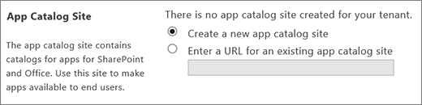
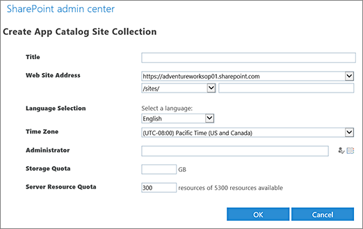
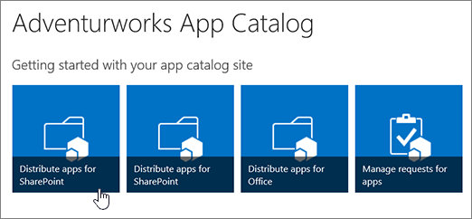
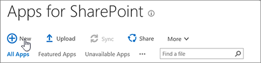
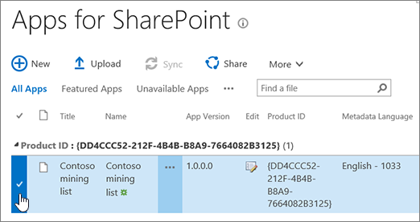
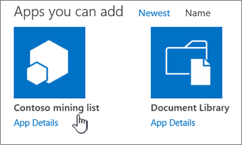
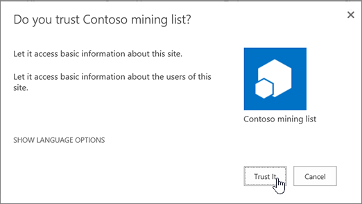
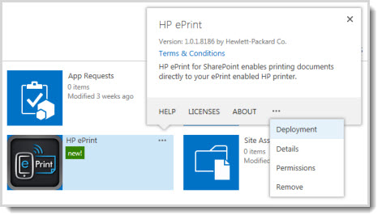
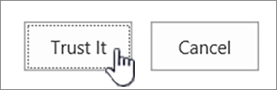

# Use the App Catalog to make custom business apps available for your SharePoint environment

As a SharePoint or global admin in Microsoft 365, you can create an App Catalog site to make internally developed custom apps available for users to install when they browse apps under the **From Your Organization** filter on the Site Contents page. Site owners can then add these apps to customize sites with specific functionality or to display information.
  
After the App Catalog site has been created, you can use it to upload any custom apps that your organization has developed. Uploading custom apps isn't much more complicated than uploading a document to a library and setting some properties. You can use the App Catalog site to do things like install custom or third-party apps on sites for users (also called app deployment). You can also manage app requests from users.
  
For more information about your options for developing custom apps for SharePoint, see: [Build apps for SharePoint](https://go.microsoft.com/fwlink/p/?LinkID=789301) and [Apps for SharePoint compared with SharePoint solutions](https://go.microsoft.com/fwlink/p/?LinkID=265569).
  
## Step 1: Create the App Catalog site collection

The first step is to create the App Catalog site collection if it hasn't already been created.
  
Even if you don't plan to make internal custom apps available, you will not be able to do things like change the purchase settings for the SharePoint Store until you create the App Catalog site collection. You can have only one App Catalog site collection for your organization, and you only need to create it once.
  
1. Go to the [More features page of the new SharePoint admin center](https://admin.microsoft.com/sharepoint?page=classicfeatures&modern=true), and sign in with an account that has [admin permissions](/sharepoint/sharepoint-admin-role) for your organization.

>[!NOTE]
>If you have Office 365 Germany, [sign in to the Microsoft 365 admin center](https://go.microsoft.com/fwlink/p/?linkid=848041), then browse to the SharePoint admin center and open the More features page.  If you have Office 365 operated by 21Vianet (China), [sign in to the Microsoft 365 admin center](https://go.microsoft.com/fwlink/p/?linkid=850627), then browse to the SharePoint admin center and open the More features page.
 
2. Under **Apps**, select **Open**.

3. Select **App Catalog**.
    
4. If the **App Catalog** site doesn't open, select **Create a new app catalog site**, and then select **OK**.
    
    
  
5. On the **Create App Catalog Site Collection** page, enter the required info, and then select **OK**.
    
    
  
## Step 2: Add custom apps to the App Catalog site

To get to the App Catalog site once it's been created, follow steps 1 and 2 in the previous section. The site may take a little time to appear. The App Catalog site will have a document library for Apps for Office and a document library for Apps for SharePoint, as well as a list that tracks App Requests from site users.
  

  
1. On the home page of the **App Catalog** site, select the tile labeled either **Distribute apps for SharePoint** or **Distribute apps for Office**, depending on which type of app you are uploading.
    
    
  
2. Select **New**, and browse to the app you want upload, or drag the app into the library.
    
    
  
    > [!NOTE]
    > Depending on the functionality that the app provides, the developer can set a flag that allows you to make the app available to all sites in the organization. If the app builds something (for example, it creates a new list), you can't make it available to all sites and will need to deploy it as described in the next section under "Deploy a custom app." We always recommend testing solutions before deploying them more broadly. If the "Do you trust" dialog appears when you upload the app, and you want to make the app available to all sites in your organization, select **Make this solution available to all sites in the organization**, and then click **Deploy**.
  
3. To help site owners identify and use the app, right-click it, and then select **Properties**.
    
    
  
4. In the properties dialog form, you can change the **Name** for the app and enter optional information like a description, images, category, publisher, and support URL. Follow the instructions on the screen for details like image size.
    
5. Make sure the **Enabled** check box is selected so that users are able to add this app to sites.
    
6. If it appears, in the **Hosting Licenses** box, specify the number of licenses you think you will need.
    
7. Select **Save**.
    
> [!NOTE]
>  If you want to make third-party apps available for users to find and install, you simply need to buy a site license for them. When you buy a site license for a third-party app from the SharePoint store, the apps will automatically display under **Apps You Can Add**.
  
## Step 3 (optional): Install an app for users

If you want all users to use an app, you can deploy it to specific site collections, managed paths, or site templates. Deploying an app essentially installs that app on a site for users so that is available for use. Deployed apps appear on the Site Contents page for a site.
  
You can deploy a third-party app, or you can [deploy a custom app](use-app-catalog.md#__deploy_a_custom).

 > [!NOTE]
> This option is only available for SharePoint add-ins. To see tenant-scoped deployment options for SharePoint Framework solutions, see [Tenant-scoped solution deployment for SharePoint Framework solutions](https://docs.microsoft.com/sharepoint/dev/spfx/tenant-scoped-deployment). 
  
 **Deploy a third-party app**
  
If you buy a site license for a third-party app, then that app is automatically available for users to install when they browse apps under **Apps You Can Add**.
  

  
However, if you want to make the app available for use without requiring users to find and install it, you can deploy it.
  
1. If you have not already purchased the app, you must buy it first. For info about how to do this, see [Buy an app from the SharePoint Store](https://support.office.com/article/dd98e50e-d3db-4ecb-9bb7-82b189822d43).
    
2. On the **App Catalog** site, select **Settings**, and then select **Add an app**.
    
3. Select the app you want to add, and when prompted, select **Trust It**.
    
    
  
4. On the **Site Contents** page, find the app you want to deploy.
    
5. Select **...** (ellipses icon) next to the app, and to view the menu, select **...** (ellipses icon) again in the callout, and then select **Deployment**. (For some apps, the **Deployment** command may appear on the first callout.)
    
    
  
6. On the **Manage App Deployments** page, enter the URL for each site collections to which you want to deploy the app, and to add it to the list, select **Add** .
    
7. In the **Managed Paths** section, to specify which managed paths should have this app available, select **Add**.
    
8. In the **Site Templates** section, to specify which site templates should have this app available, select **Add**.
    
9. Select **OK**.
    
10. If you are prompted to Trust the app, select **Trust It**.
    
 **Deploy a custom app**

  
If you upload a custom app to the App Catalog, it is automatically available for users to install when they browse apps under **From Your Organization**. If you want you want the app to be available for use without the need for site users to install it, you can deploy it.
  
1. Before you can deploy a custom app, you must first upload it to the **App Catalog** site. For step-by-step guidance about how to do this, see the previous section, [Step 2: Add custom apps to the App Catalog site](use-app-catalog.md#__add_custom_apps).
    
2. After you have uploaded the app, you then must add it as an app to the App Catalog site so that it appears on the Site Contents page for the App Catalog itself. On the App Catalog site, go to **Settings** and then click **Add an app**.
    
3. Select the app you want to add, and when prompted, select **Trust It**.
    
    
  
4. On the **Site Contents** page, find the app you want to deploy.
    
5. Next to the app, select **...** (ellipses icon), and to view the menu, select **...** (ellipses icon) again in the callout, and then select **Deployment**. (For some apps the **Deployment** command may appear on the first callout.)
    
    
  
6. On the **Manage App Deployments** page, enter the URL for each site collections to which you want to deploy the app, and to add it to the list, select **Add**.
    
7. In the **Managed Paths** section, to specify which managed paths should have this app available, select **Add**.
    
8. In the **Site Templates** section, to specify which site templates should have this app available, select **Add**.
    
9. Select **OK**.
    
10. If you are prompted to Trust the app, select **Trust It**.
    
    > [!NOTE]
    >  It may take up to 30 minutes for an app to deploy.  If you deploy an app that adds commands to the item callout for document libraries or lists, then those commands are visible to users. However, if you deploy an app that features custom ribbon controls or an App Part, additional steps may be required to make the user interface commands for the app appear.
  
## Remove an app from the App Catalog

If you no longer want a specific app to be available for users to install, you can remove it from the app catalog. Any instances of the app that have already been added to sites by users will remain, but the app will no longer be available for users to add to additional sites.
  
1. On the **App Catalog** site, select the **Apps for SharePoint** list.
    
2. Right-click the app that you want to remove, and select **Delete**.
    
3. In the dialog, to confirm that you want to send the item to the site Recycle Bin, select **OK**.
    
## See also

[Configure settings for the SharePoint Store](configure-sharepoint-store-settings.md)
  
[Manage app licenses for a SharePoint environment](manage-app-licenses.md)
  
[Monitor apps for your SharePoint environment](monitor-apps.md)
  
[Add an app to a site](https://support.office.com/article/ef9c0dbd-7fe1-4715-a1b0-fe3bc81317cb)
