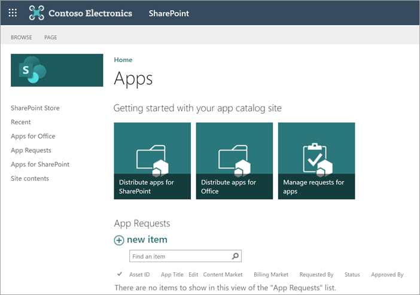

# Manage apps using the App Catalog

As a SharePoint or global admin in Microsoft 365, you can create and use the App Catalog to manage custom apps and apps from the SharePoint Store.
  
For more information about your options for developing custom apps for SharePoint, see: [Overview of the SharePoint Framework](/sharepoint/dev/spfx/sharepoint-framework-overview) and [SharePoint add-ins](/sharepoint/dev/sp-add-ins/sharepoint-add-ins).
  
## Create the App Catalog 

The first step is to create the App Catalog if it hasn't already been created.
  
Even if you don't plan to make internal custom apps available, you won't be able to do things like change settings for the SharePoint Store until you create the App Catalog. You can have only one App Catalog for your organization, and you only need to create it once.
  
1. Go to the [More features page of the new SharePoint admin center](https://admin.microsoft.com/sharepoint?page=classicfeatures&modern=true), and sign in with an account that has [admin permissions](./sharepoint-admin-role.md) for your organization.

    >[!NOTE]
    >If you have Office 365 Germany, [sign in to the Microsoft 365 admin center](https://go.microsoft.com/fwlink/p/?linkid=848041), then browse to the SharePoint admin center and open the More features page.  If you have Office 365 operated by 21Vianet (China), [sign in to the Microsoft 365 admin center](https://go.microsoft.com/fwlink/p/?linkid=850627), then browse to the SharePoint admin center and open the More features page.
 
2. Under **Apps**, select **Open**.

3. Select **App Catalog**.
    
4. If the **App Catalog** site doesn't open, select an option for creating it or specifying it, and then select **OK**.
    
    
  
## Work with custom apps

The App Catalog has a document library for Apps for Office and a document library for Apps for SharePoint, as well as a list that tracks App Requests from site users.

When you upload a custom app to the App Catalog, it's available for users to install when they browse apps under **From Your Organization**. 

1. Go to the [More features page of the new SharePoint admin center](https://admin.microsoft.com/sharepoint?page=classicfeatures&modern=true), and sign in with an account that has [admin permissions](./sharepoint-admin-role.md) for your organization.

    >[!NOTE]
    >If you have Office 365 Germany, [sign in to the Microsoft 365 admin center](https://go.microsoft.com/fwlink/p/?linkid=848041), then browse to the SharePoint admin center and open the More features page.  If you have Office 365 operated by 21Vianet (China), [sign in to the Microsoft 365 admin center](https://go.microsoft.com/fwlink/p/?linkid=850627), then browse to the SharePoint admin center and open the More features page.
 
2. Under **Apps**, select **Open**.

3. Select **App Catalog**. If you just created it, it might take a few minutes to appear. 
  

4. On the home page of the app catalog, select the tile labeled either **Distribute apps for SharePoint** or **Distribute apps for Office**, depending on which type of app you're uploading.

5. Select **New**, and browse to the app you want upload, or drag the app into the library. SharePoint Framework solutions have the file name extension .sppkg. and SharePoint add-ins have the file name extension .app.

    

6. Review the info in the "Do you trust" dialog box. Depending on the functionality that the app provides, the developer can set a flag that allows you to add the app to all sites in the organization. To do this, select **Make this solution available to all sites in the organization**. 

    > [!NOTE]
    > We recommend testing solutions before deploying them broadly. 

7. Select **Deploy**.

8. To help site owners identify and use the app, right-click it, and then select **Properties**.
    
    
  
9. Review and edit the **Name** for the app and enter optional information like a description, images, category, publisher, and support URL. Follow the instructions on the screen for details like image size.
    
10. Make sure the **Enabled** checkbox is selected so that users are able to add this app to sites.
    
11. If it appears, in the **Hosting Licenses** box, specify the number of licenses you think you will need.
    
12. Select **Save**.
    
### Deploy SharePoint add-ins

After you upload a SharePoint add-in by following the steps in the previous section, follow these steps to deploy the add-in to specific sites, managed paths, or site templates. This installs the add-in so that site owners don't need to add it. 
    
1. In the App Catalog, go to **Settings** and then click **Add an app**.
    
2. Select the app you want to add, and when prompted, select **Trust It**.
    
    
  
3. On the **Site Contents** page, find the app you want to deploy.
    
4. Next to the app, select **...** (ellipses icon), and to view the menu, select **...** (ellipses icon) again in the callout, and then select **Deployment**. (For some apps the **Deployment** command may appear on the first callout.)
    
    
  
5. On the **Manage App Deployments** page, enter the URL for each site collections to which you want to deploy the app, and to add it to the list, select **Add**.
    
6. In the **Managed Paths** section, to specify which managed paths should have this app available, select **Add**.
    
7. In the **Site Templates** section, to specify which site templates should have this app available, select **Add**.
    
8. Select **OK**.
    
10. If you're prompted to Trust the app, select **Trust It**.
    
    > [!NOTE]
    >  It may take up to 30 minutes for an app to deploy.  If you deploy an app that adds commands to the item callout for document libraries or lists, then those commands are visible to users. However, if you deploy an app that features custom ribbon controls or an App Part, additional steps may be required to make the user interface commands for the app appear.
  
## Work with SharePoint Store apps

When you add an app from the SharePoint Store to the App Catalog, you make it available for site owners to add from the My apps page. 

1. In the app catalog, select **SharePoint Store** in the left pane.
2. Search for an app or select a category on the left to scroll through available apps.
3. Select an app you want to add. In some cases, adding the app might be supported in the SharePoint Store classic experience only.
4. Select **Add**.
5. Review app permissions and data access.
6. If you want to add the app to all sites in the organization, so that site owners don't have to, select **Add this app to all sites**. 
7. Select **Add**.
8. If the app requires additional permissions, a message will appear. Select **Go to API access page** to approve the permissions.

### Deploy SharePoint add-ins

After you add a SharePoint add-in by following the steps in the previous section, follow these steps to deploy the add-in to specific sites, managed paths, or site templates. This installs the add-in so that site owners don't need to add it. 
    
1. In the **App Catalog**, select **Settings**, and then select **Add an app**.
    
2. Select the app you want to add, and when prompted, select **Trust It**.
    
    
  
3. On the **Site Contents** page, find the app you want to deploy.
    
4. Select **...** (ellipses icon) next to the app, and to view the menu, select **...** (ellipses icon) again in the callout, and then select **Deployment**. (For some apps, the **Deployment** command may appear on the first callout.)
    
    
  
5. On the **Manage App Deployments** page, enter the URL for each site collections to which you want to deploy the app, and to add it to the list, select **Add** .
    
6. In the **Managed Paths** section, to specify which managed paths should have this app available, select **Add**.
    
7. In the **Site Templates** section, to specify which site templates should have this app available, select **Add**.
    
8. Select **OK**.
    
9. If you're prompted to trust the app, select **Trust It**.
    

## Remove an app from the App Catalog

If you no longer want a specific app to be available for users to add, you can remove it from the App Catalog. Any instances of the app that have already been added to sites by users will remain, but the app will no longer be available for users to add to additional sites.
  
1. In the **App Catalog**, select the **Apps for SharePoint** list.
    
2. Right-click the app that you want to remove, and select **Delete**.
    
3. Select **OK** to confirm that you want to send the app to the recycle bin.
    
## See also

[Configure settings for the SharePoint Store](configure-sharepoint-store-settings.md)
  
[Monitor apps for your SharePoint environment](monitor-apps.md)
  
[Add an app to a site](https://support.office.com/article/ef9c0dbd-7fe1-4715-a1b0-fe3bc81317cb)
