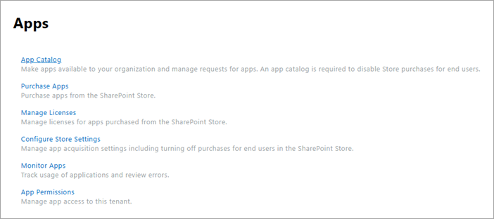
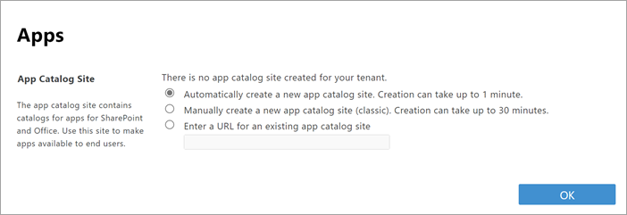

# Manage apps using the App Catalog

As a SharePoint or global admin in Microsoft 365, you can acquire solutions from the SharePoint Store or distribute custom apps that can be used across SharePoint, Microsoft Teams, and Viva Connections. The first step in acquiring solutions is to have an App Catalog you can use to store and distribute solutions. 
  
For information about your options for developing custom apps for SharePoint, see [Overview of the SharePoint Framework](/sharepoint/dev/spfx/sharepoint-framework-overview) and [SharePoint add-ins](/sharepoint/dev/sp-add-ins/sharepoint-add-ins).
  
## Create the App Catalog 

The first step is to create the App Catalog if it hasn't already been created. You can have only one App Catalog for your organization, and you only need to create it once. (If your organization is set up for Microsoft 365 Multi-Geo, you will have an App Catalog for each geo location.)
  
Even if you don't plan to make internal custom apps available, you won't be able to do things like change settings for the SharePoint Store until you create the App Catalog. 
  
1. Go to the [More features page of the new SharePoint admin center](https://admin.microsoft.com/sharepoint?page=classicfeatures&modern=true), and sign in with an account that has [admin permissions](./sharepoint-admin-role.md) for your organization.

    >[!NOTE]
    >If you have Office 365 Germany, [sign in to the Microsoft 365 admin center](https://go.microsoft.com/fwlink/p/?linkid=848041), then browse to the SharePoint admin center and open the More features page.  If you have Office 365 operated by 21Vianet (China), [sign in to the Microsoft 365 admin center](https://go.microsoft.com/fwlink/p/?linkid=850627), then browse to the SharePoint admin center and open the More features page.
 
2. Under **Apps**, select **Open**.

3. Select **App Catalog**.

    
    
4. If the **App Catalog** site doesn't open, select an option for creating it or specifying it, and then select **OK**.
    
    
  
## Work with SharePoint Store apps

When you add an app from the SharePoint Store to the App Catalog, you make it available for site owners to add from the My apps page. 

1. On the Manage apps page, select **SharePoint Store** in the left pane.

2. Search for an app or select a category on the left to scroll through available apps.

3. Select an app you want to add. In some cases, adding the app might be supported in the SharePoint Store classic experience only.

4. Select **Add**.

    :::image type="content" alt-text="Deploy a SharePoint Framework app from the store." source="media/deployspfxappfromstore.gif" lightbox="media/deployspfxappfromstore.gif":::

5. Review app permissions and data access.

6. Some apps have the option to be added to all sites in the organization so that site owners don't have to. If you want to do this, select **Add this app to all sites**. 

7. Select **Add**.

8. If the app requires additional permissions, a message will appear. Select **Go to API access page** to approve the permission request.

## Work with custom apps

When you upload a custom app to the App Catalog, it's available for users to install when they browse apps under **From Your Organization**. 

1. Go to the [More features page of the new SharePoint admin center](https://admin.microsoft.com/sharepoint?page=classicfeatures&modern=true), and sign in with an account that has [admin permissions](./sharepoint-admin-role.md) for your organization.

    >[!NOTE]
    >If you have Office 365 Germany, [sign in to the Microsoft 365 admin center](https://go.microsoft.com/fwlink/p/?linkid=848041), then browse to the SharePoint admin center and open the More features page.  If you have Office 365 operated by 21Vianet (China), [sign in to the Microsoft 365 admin center](https://go.microsoft.com/fwlink/p/?linkid=850627), then browse to the SharePoint admin center and open the More features page.
 
1. Under **Apps**, select **Open**.

1. On the Manage apps page, select **Upload**, and browse to the app you want upload, or drag the app into the library. SharePoint Framework solutions have the file name extension .sppkg. and SharePoint add-ins have the file name extension .app.

    

1. Review the info in the "Do you trust" dialog box. Depending on the functionality that the app provides, the developer can set a flag that allows you to add the app to all sites in the organization. To do this, select **Make this solution available to all sites in the organization**. 

    > [!NOTE]
    > We recommend testing solutions before deploying them broadly. 

1. Select **Deploy**.

1. To help site owners identify and use the app, right-click it, and then select **Properties**.
    
    
  
1. Review and edit the **Name** for the app and enter optional information like a description, images, category, publisher, and support URL. Follow the instructions on the screen for details like image size.
    
1. Make sure the **Enabled** checkbox is selected so that users are able to add this app to sites.
    
1. If it appears, in the **Hosting Licenses** box, specify the number of licenses you think you will need.
    
1. Select **Save**.

## Remove an app from the App Catalog

If you no longer want a specific app to be available for users to add, you can remove it from on the Manage apps page. Any instances of the app that have already been added to sites by users will remain, but the app will no longer be available for users to add to additional sites.
  
1. On the Manage apps page, select the app that you want to delete.
    
1. Select **Delete**.
    
1. Select **Delete** to confirm that you want to send the app to the recycle bin.

## Related topics

[Configure settings for the SharePoint Store](configure-sharepoint-store-settings.md)
  
[Monitor apps for your SharePoint environment](monitor-apps.md)
  
[Add an app to a site](https://support.office.com/article/ef9c0dbd-7fe1-4715-a1b0-fe3bc81317cb)
