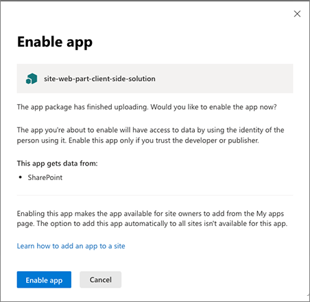

# Manage apps using the Apps site

As a SharePoint or global admin in Microsoft 365, you can acquire solutions from the SharePoint Store or distribute custom apps that can be used across SharePoint, Microsoft Teams, and Viva Connections.
  
For information about your options for developing custom apps for SharePoint, see [Overview of the SharePoint Framework](/sharepoint/dev/spfx/sharepoint-framework-overview) and [SharePoint add-ins](/sharepoint/dev/sp-add-ins/sharepoint-add-ins).

## Add apps from the SharePoint Store

When you add an app from the SharePoint Store to the Apps site, you make it available for site owners to add from the My apps page. 

1. On the Manage apps page, select **SharePoint Store** in the left pane.

2. Search for an app or select a category on the left to scroll through available apps.

3. Select an app you want to add. In some cases, adding the app might be supported in the SharePoint Store classic experience only.

4. Select **Add**.

    :::image type="content" alt-text="Deploy a SharePoint Framework app from the store." source="media/deployspfxappfromstore.gif" lightbox="media/deployspfxappfromstore.gif":::

5. Review app permissions and data access.

6. Some apps have the option to be added to all sites in the organization so that site owners don't have to. If you want to do this, select **Add this app to all sites**. 

7. Select **Add**.

8. If the app requires additional permissions, a message will appear. Select **Go to API access page** to approve the permission request.

## Add custom apps

When you upload a custom app to the Apps site, it's available for users to install when they browse apps under **From Your Organization**. 

1. Go to <a href="https://go.microsoft.com/fwlink/?linkid=2185077" target="_blank">**More features** in the SharePoint admin center</a>, and sign in with an account that has [admin permissions](./sharepoint-admin-role.md) for your organization.

    >[!NOTE]
    >If you have Office 365 operated by 21Vianet (China), [sign in to the Microsoft 365 admin center](https://go.microsoft.com/fwlink/p/?linkid=850627), then browse to the SharePoint admin center and open the More features page.
 
1. Under **Apps**, select **Open**.

1. On the Manage apps page, select **Upload**, and browse to the app you want upload, or drag the app into the library. SharePoint Framework solutions have the file name extension .sppkg.

1. Review the info in the **Enable app** panel. Depending on the functionality that the app provides, the developer can set a flag that allows you to add the app to all sites in the organization. To do this, select **Enable this app and add it to all sites**. 

    

    > [!NOTE]
    > We recommend testing solutions before deploying them broadly. 

1. Select **Enable app**.

1. Select **Close**.

1. To help site owners identify and use the app, select the app, and then select **Properties**.

    

1. Review and edit the **Name** for the app and enter optional information like a description, images, category, publisher, and support URL. Follow the instructions on the screen for details like image size.
    
1. Make sure the **Enabled** checkbox is selected so that users are able to add this app to sites.
    
1. If it appears, in the **Hosting Licenses** box, specify the number of licenses you think you will need.
    
1. Close the panel.

## Add an app to all sites

App developers can choose to allow administrators to automatically add an app to all sites. This makes the app available for site owners.

If you did not choose to add an app to all sites when you enabled it, you can do so later on the Apps site.

To add an app to all sites
1. On the Manage apps page, select the app that you want to add to all sites.
1.  Select **Add to all sites**.
1. Select **Confirm**.
1. Select **Close**.

## Stop automatically adding an app to new sites

If you chose to have an app automatically added to all sites, you can stop adding it to new sites by changing the setting on the Apps site.

To stop adding an app to new sites
1. On the Manage apps page, select the app that you want to stop adding to new sites.
1. Select **Stop adding to new sites**.
1. Select **Confirm**.
1. Select **Close**.

## Add an app to Teams

Some apps can be added to Teams. You can add them on the Apps site.

To add an app to Teams
1. On the Manage apps page, select the app that you want to add to Teams.
1. Select **Add to Teams**.

## Disable an app

If you want to prevent users from using an app that you've already enabled, you can disable it.

1. On the Manage apps page, select the app that you want to disable, and then select **Properties**.
    
1. Clear the **Enabled** check box.

1. Close the panel.

## Remove an app from the Apps site

If you no longer want a specific app to be available for users to add, you can remove it from on the Manage apps page. Any instances of the app that have already been added to sites by users will remain, but the app will no longer be available for users to add to additional sites.

> [!IMPORTANT]
> If you delete an app, existing instances of the app will no longer work.
  
1. On the Manage apps page, select the app that you want to delete.
    
1. Select **Delete**.
    
1. Select **Delete** to confirm that you want to send the app to the recycle bin.

## Related topics

[Configure settings for the SharePoint Store](configure-sharepoint-store-settings.md)
  
[Add an app to a site](https://support.office.com/article/ef9c0dbd-7fe1-4715-a1b0-fe3bc81317cb)
