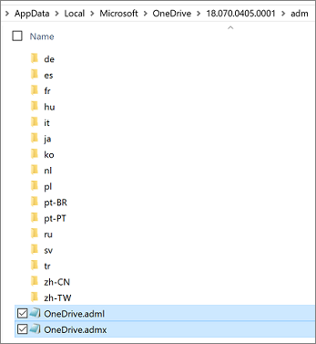
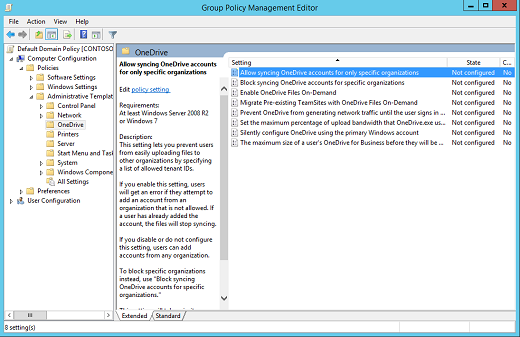
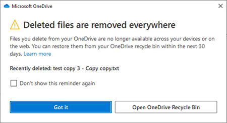
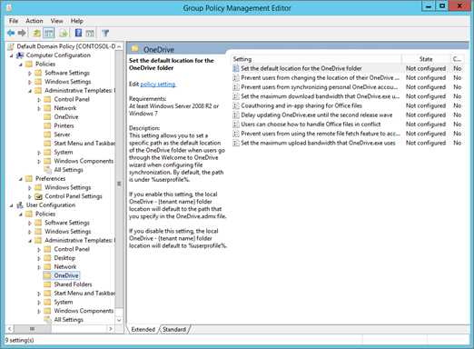

# IT Admins - Use OneDrive policies to control sync settings

This article describes the OneDrive Group Policy objects (GPOs) that administrators can configure by using Group Policy or by using [administrative templates in Microsoft Intune](configure-sync-intune.md). You can use the registry key information in this article to confirm that a setting is enabled.
  
> [!NOTE]
> If you're not an IT administrator, see [Sync files with the new OneDrive sync app in Windows](https://support.office.com/article/615391c4-2bd3-4aae-a42a-858262e42a49) for information about OneDrive sync settings.

> [!VIDEO https://www.microsoft.com/videoplayer/embed/RE2CnSx]

## Manage OneDrive using Group Policy

1. Install the OneDrive sync app for Windows. (For information on the builds that are being released, and on the download builds, see [release notes](https://support.office.com/article/845dcf18-f921-435e-bf28-4e24b95e5fc0?).) Installing the sync app downloads the .adml and .admx files.

1. Browse to `%localappdata%\Microsoft\OneDrive\\*BuildNumber*\adm\` (for [per-machine sync app](per-machine-installation.md) browse to `%ProgramFiles(x86)%\Microsoft OneDrive\BuildNumber\adm\` or `%ProgramFiles%\Microsoft OneDrive\BuildNumber\adm\` (depending on the OS architecture)) to the subfolder for your language, as necessary (where *BuildNumber* is the number displayed in sync app settings under the **About** tab).

    
   
3. Copy the .adml and .admx files.

4. Paste the .admx file in your domain's Central Store, `\\\\*domain*\sysvol\domain\Policies\PolicyDefinitions` (where *domain* is your domain name, such as corp.contoso.com), and the .adml file in the appropriate language subfolder, such as en-us. If the PolicyDefinitions folder doesn't exist, see [How to create and manage the Central Store for Group Policy Administrative Templates in Windows](https://support.microsoft.com/help/3087759), or use your local policy store under `%windir%\policydefinitions`.

5. Configure settings from the domain controller or on a Windows computer by running the [Remote Server Administration Tools](/windows-server/remote/remote-server-administration-tools).

6. Link the GPOs to an Active Directory container (a site, domain, or an organizational unit). For more information, see [Link Group Policy objects to Active Directory containers](/previous-versions/windows/desktop/Policy/linking-gpos-to-active-directory-containers).

7. Use security filtering to narrow the scope of a setting. By default, a setting is applied to all user and computer objects within the container to which it's linked, but you can use security filtering to narrow the scope of the policy's application to a subset of users or computers. For more information, see [Filtering the scope of a GPO](/previous-versions/windows/desktop/Policy/filtering-the-scope-of-a-gpo).

The OneDrive GPOs work by setting registry keys on the computers in your domain.
  
- When you enable or disable a setting, the corresponding registry key is updated on computers in your domain. If you later change the setting back to **Not configured**, the corresponding registry key isn't modified, and the change doesn't take effect. After you configure a setting, set it to **Enabled** or **Disabled**, going forward.

- The location where registry keys are written has been updated. When you use the latest files, you might delete registry keys that you set previously.

> [!NOTE]
> For information about storage, see [OneDrive Files On-Demand and Storage Sense for Windows 10](https://support.office.com/article/de5faa9a-6108-4be1-87a6-d90688d08a48) and [Policy CSP - Storage](/windows/client-management/mdm/policy-csp-storage).

## List of policies by string ID

- (AddedFolderHardDeleteOnUnmount) [Hard-deletes the contents of an added folder when unmounted](#hard-delete-the-contents-of-an-added-folder-when-unmounted)

- (AddedFolderUnmountOnPermissionsLoss) [Hard-deletes contents of an added folder when user loses permissions to the folder](#hard-delete-the-contents-of-an-added-folder-when-user-loses-permissions-to-the-folder)

- (AllowTenantList) [Allow syncing OneDrive accounts for only specific organizations](use-group-policy.md#allow-syncing-onedrive-accounts-for-only-specific-organizations)

- (AutomaticUploadBandwidthPercentage) [Limit the sync app upload rate to a percentage of throughput](use-group-policy.md#limit-the-sync-app-upload-rate-to-a-percentage-of-throughput)

- (BlockExternalListSync) This setting controls Lists sync and is listed here for convenience. For more information, see [Prevent users from syncing lists shared from other organizations](/sharepoint/lists-sync-policies#prevent-users-from-syncing-lists-shared-from-other-organizations).

- (BlockExternalSync) [Prevent users from syncing libraries and folders shared from other organizations](use-group-policy.md#prevent-users-from-syncing-libraries-and-folders-shared-from-other-organizations)

- (BlockTenantList) [Block syncing OneDrive accounts for specific organizations](use-group-policy.md#block-syncing-onedrive-accounts-for-specific-organizations)

- (DefaultRootDir) [Set the default location for the OneDrive folder](use-group-policy.md#set-the-default-location-for-the-onedrive-folder)

- (DehydrateSyncedTeamSites) [Convert synced team site files to online-only files](use-group-policy.md#convert-synced-team-site-files-to-online-only-files)

- (DisableAutoConfig) [Prevent authentication from automatically happening](use-group-policy.md#prevent-authentication-from-automatically-happening)

- (DisableCustomRoot) [Prevent users from changing the location of their OneDrive folder](use-group-policy.md#prevent-users-from-changing-the-location-of-their-onedrive-folder)

- (DisableFirstDeleteDialog) [Hide the "Deleted files are removed everywhere" reminder](use-group-policy.md#hide-the-deleted-files-are-removed-everywhere-reminder)

- (DisableFREAnimation) [Disable animation that appears during OneDrive Setup](use-group-policy.md#disable-animation-that-appears-during-onedrive-setup)

- (DisableNewAccountDetection) [Hide the messages to sync Consumer OneDrive files](use-group-policy.md#hide-the-messages-to-sync-consumer-onedrive-files)

- (DisableNucleusSilentConfig) [Prevent users from getting silently signed in to offline experiences on the web](lists-sync-policies.md#prevent-users-from-getting-silently-signed-in-to-offline-experiences-on-the-web).

- (DisableNucleusSync) This setting controls Lists sync and is listed here for convenience. For more information, see [Prevent Lists sync from running on the device](/sharepoint/lists-sync-policies#prevent-lists-sync-from-running-on-the-device).

- (DisableOfflineMode) [Prevent users at your organization from enabling offline mode in OneDrive on the web](#prevent-users-at-your-organization-from-enabling-offline-mode-in-onedrive-on-the-web)

- (DisableOfflineModeForExternalLibraries) [Prevent users at your organization from enabling offline mode in OneDrive on the web for libraries and folders that are shared from other organizations](#prevent-users-at-your-organization-from-enabling-offline-mode-in-onedrive-on-the-web-for-libraries-and-folders-that-are-shared-from-other-organizations)

- (DisablePauseOnBatterySaver) [Continue syncing when devices have battery saver mode turned on](use-group-policy.md#continue-syncing-when-devices-have-battery-saver-mode-turned-on)

- (DisablePauseOnMeteredNetwork) [Continue syncing on metered networks](use-group-policy.md#continue-syncing-on-metered-networks)

- (DisablePersonalSync) [Prevent users from syncing personal OneDrive accounts](use-group-policy.md#prevent-users-from-syncing-personal-onedrive-accounts)

- (DisableTutorial) [Disable the tutorial that appears at the end of OneDrive Setup](use-group-policy.md#disable-the-tutorial-that-appears-at-the-end-of-onedrive-setup)

- (DiskSpaceCheckThresholdMB) [Set the maximum size of a user's OneDrive that can download automatically](use-group-policy.md#set-the-maximum-size-of-a-users-onedrive-that-can-download-automatically)

- (DownloadBandwidthLimit) [Limit the sync app download speed to a fixed rate](use-group-policy.md#limit-the-sync-app-download-speed-to-a-fixed-rate)

- (EnableAllOcsiClients) [Coauthor and share in Office desktop apps](use-group-policy.md#coauthor-and-share-in-office-desktop-apps)

- (EnableAutomaticUploadBandwidthManagement) [Enable automatic upload bandwidth management for OneDrive](use-group-policy.md#enable-automatic-upload-bandwidth-management-for-onedrive)

- (EnableAutoStart) [Start OneDrive automatically when signing in to Windows](use-group-policy.md#always-start-onedrive-automatically-when-signing-in-to-windows)

- (EnableHoldTheFile) [Allow users to choose how to handle Office file sync conflicts](use-group-policy.md#allow-users-to-choose-how-to-handle-office-file-sync-conflicts)

- (EnableODIgnoreListFromGPO) [Exclude specific kinds of files from being uploaded](use-group-policy.md#exclude-specific-kinds-of-files-from-being-uploaded)

- (EnableSyncAdminReports) [Enable sync health reporting for OneDrive](use-group-policy.md#enable-sync-health-reporting-for-onedrive)

- (FilesOnDemandEnabled) [Use OneDrive Files On-Demand](use-group-policy.md#use-onedrive-files-on-demand)

- (ForcedLocalMassDeleteDetection) [Require users to confirm large delete operations](use-group-policy.md#require-users-to-confirm-large-delete-operations)

- (GPOSetUpdateRing) [Set the sync app update ring](use-group-policy.md#set-the-sync-app-update-ring)

- (KFMBlockOptIn) [Prevent users from moving their Windows known folders to OneDrive](use-group-policy.md#prevent-users-from-moving-their-windows-known-folders-to-onedrive)

- (KFMBlockOptOut) [Prevent users from redirecting their Windows known folders to their PC](use-group-policy.md#prevent-users-from-redirecting-their-windows-known-folders-to-their-pc)

- (KFMOptInWithWizard) [Prompt users to move Windows known folders to OneDrive](use-group-policy.md#prompt-users-to-move-windows-known-folders-to-onedrive)

- (KFMSilentOptIn) [Silently move Windows known folders to OneDrive](use-group-policy.md#silently-move-windows-known-folders-to-onedrive)

- (LocalMassDeleteFileDeleteThreshold) [Prompt users when they delete multiple OneDrive files on their local computer](use-group-policy.md#prompt-users-when-they-delete-multiple-onedrive-files-on-their-local-computer)

- (MinDiskSpaceLimitInMB) [Block file downloads when users are low on disk space](use-group-policy.md#block-file-downloads-when-users-are-low-on-disk-space)

- (PermitDisablePermissionInheritance) [Allow OneDrive to disable Windows permission inheritance in folders synced read-only](use-group-policy.md#allow-onedrive-to-disable-windows-permission-inheritance-in-folders-synced-read-only)

- (PreventNetworkTrafficPreUserSignIn) [Prevent the sync app from generating network traffic until users sign in](use-group-policy.md#prevent-the-sync-app-from-generating-network-traffic-until-users-sign-in)

- (SharedContentDeleteConfirmation) [Prompt users to confirm when they delete shared content](use-group-policy.md#prompt-users-to-confirm-when-they-delete-shared-content)

- (SharePointOnPremFrontDoorUrl) Specify SharePoint Server URL and organization name. This setting is for customers who have SharePoint Server 2019. For information about using the new OneDrive sync app with SharePoint Server 2019, see [Configure syncing with the new OneDrive sync app](/SharePoint/install/configure-syncing-with-the-onedrive-sync-app/).

- (SharePointOnPremPrioritization) Specify the OneDrive location in a hybrid environment. This setting is for customers who have SharePoint Server 2019. For information about using the new OneDrive sync app with SharePoint Server 2019, see [Configure syncing with the new OneDrive sync app](/SharePoint/install/configure-syncing-with-the-onedrive-sync-app/).

- (SilentAccountConfig) [Silently sign in users to the OneDrive sync app with their Windows credentials](use-group-policy.md#silently-sign-in-users-to-the-onedrive-sync-app-with-their-windows-credentials)

- (TenantAutoMount) [Configure team site libraries to sync automatically](use-group-policy.md#configure-team-site-libraries-to-sync-automatically)

- (UploadBandwidthLimit) [Limit the sync app upload speed to a fixed rate](use-group-policy.md#limit-the-sync-app-upload-speed-to-a-fixed-rate)

- (WarningMinDiskSpaceLimitInMB) [Warn users who are low on disk space](use-group-policy.md#warn-users-who-are-low-on-disk-space)

## Computer Configuration policies

Under Computer Configuration\Policies\Administrative Templates\OneDrive, navigate to **Computer Configuration > Policies**.
  


### Hard-delete the contents of an added folder when unmounted

If you enable this setting, when an unmount of an Added Folder is received, the Sync client will hard-delete all the contents of the folder.

If admins disable or do not configure this setting, Sync will by default move the contents of the unmounted folder to the recycle-bin.

Enabling this policy sets the following registry key value to 1:

`[HKCU\SOFTWARE\Policies\Microsoft\OneDrive]"AddedFolderHardDeleteOnUnmount"=dword:00000001`

### Hard-delete the contents of an added folder when user loses permissions to the folder

If you enable this setting, when the Sync client detects that the user lost permissions to an Added Folder, the Sync client will hard-delete all the contents of the folder and the folder itself.

If admins disable or do not configure this setting, Sync will by default mark the folder in error and prompt the user to remove it. When the user confirms the removals, the contents of the folder are moved to the recycle-bin.

Enabling this policy sets the following registry key value to 1:

`[HKCU\SOFTWARE\Policies\Microsoft\OneDrive]"AddedFolderUnmountOnPermissionsLoss"=dword:00000001`

### Allow OneDrive to disable Windows permission inheritance in folders synced read-only

This setting lets the OneDrive sync app remove all inherited permissions within read-only folders syncing on a user's PC. This removal of inherited permissions improves the performance of the sync app when syncing folders that the user has read-only permission to.

Enabling this setting for a user doesn't change their permissions to view or edit content in SharePoint.

We don't recommend setting this policy for users not syncing read-only content.

Enabling this policy sets the following registry key value to 1:

`[HKLM\SOFTWARE\Policies\Microsoft\OneDrive]"PermitDisablePermissionInheritance"=dword:00000001`
  
### Allow syncing OneDrive accounts for only specific organizations

This setting lets you prevent users from easily uploading files to other organizations by specifying a list of allowed tenant IDs.

If you enable this setting, users get an error if they attempt to add an account from an organization that isn't allowed. If a user has already added the account, the files stop syncing.

To enter a tenant ID, in the **Options** box, select **Show**.
  
This policy sets the following registry key:
  
`[HKLM\SOFTWARE\Policies\Microsoft\OneDrive\AllowTenantList] "1111-2222-3333-4444"`
  
where "1111-2222-3333-4444" is the [tenant ID](find-your-office-365-tenant-id.md).
  
This setting takes priority over [Block syncing OneDrive accounts for specific organizations](use-group-policy.md#block-syncing-onedrive-accounts-for-specific-organizations). Don't enable both settings at the same time.

### Block file downloads when users are low on disk space

This setting lets you specify a minimum amount of available disk space and block the OneDrive sync app (OneDrive.exe) from downloading files when users have less than this amount.

Users are prompted with options to help free up space.
  
Enabling this policy sets the following registry key value to a number from 0 through 10240000:

`[HKLM\SOFTWARE\Policies\Microsoft\OneDrive] "MinDiskSpaceLimitInMB"=dword:00000000`

### Block syncing OneDrive accounts for specific organizations

This setting lets you prevent users from uploading files to another organization by specifying a list of blocked tenant IDs.

If you enable this setting, users get an error if they attempt to add an account from an organization that's blocked. If a user has already added the account, the files stop syncing.
  
To enter the tenant ID, in the **Options** box, select **Show**.
  
This policy sets the following registry key:
  
`[HKLM\SOFTWARE\Policies\Microsoft\OneDrive\BlockTenantList] "1111-2222-3333-4444"`
  
where "1111-2222-3333-4444" is the [tenant ID](find-your-office-365-tenant-id.md).
  
This setting does NOT work if you enable the [Allow syncing OneDrive accounts for only specific organizations](use-group-policy.md#allow-syncing-onedrive-accounts-for-only-specific-organizations) setting. Don't enable both settings at the same time.
  
### Convert synced team site files to online-only files

This setting lets you convert synced SharePoint files to online-only files when you enable **OneDrive Files On-Demand**. If you have many PCs syncing the same team site, enabling this setting helps you minimize network traffic and local storage usage.
  
If you enable this setting, files in currently syncing team sites are changed to online-only files, by default. Files later added or updated in the team site are also downloaded as online-only files. To use this setting, the computer must be running Windows 10 Fall Creators Update (version 1709) or later, and you must enable **OneDrive Files On-Demand**.
This feature isn't enabled for on-premises SharePoint sites.

Enabling this policy sets the following registry key value to 1:
  
`[HKLM\SOFTWARE\Policies\Microsoft\OneDrive]"DehydrateSyncedTeamSites"=dword:00000001`

For information about querying and setting file and folder states, see [Query and set Files On-Demand states](files-on-demand-mac.md).
  
### Enable automatic upload bandwidth management for OneDrive

This setting lets the OneDrive sync app (OneDrive.exe) upload data in the background only when unused bandwidth is available. It prevents the sync app from interfering with other apps that are using the network. This setting is powered by the Windows LEDBAT (Low Extra Delay Background Transport) protocol. When LEDBAT detects increased latency that indicates other TCP connections are consuming bandwidth, the sync app reduces its own consumption to prevent interference. When network latency decreases again and bandwidth is freed up, the sync app increases the upload rate and consume the unused bandwidth.

If you enable this setting, the sync app upload rate is set to **Adjust automatically** based on bandwidth availability, and users won't be able to change it.

If you don't configure this setting, users can choose to limit the upload rate to a fixed value (in KB/second), or set it to **Adjust automatically**.

> [!IMPORTANT]
> If you enable or disable this setting, and then change it back to **Not Configured**, the last configuration will remain in effect. We recommend enabling this setting instead of **Limit the sync app upload speed to a fixed rate**. You shouldn't enable both settings at the same time. This setting will override **Limit the sync app upload rate to a percentage of throughput** if both are enabled on the same device.

Enabling this policy sets the following registry key value to 1:

`[HKLM\Software\Policies\Microsoft\OneDrive]"EnableAutomaticUploadBandwidthManagement"=dword:00000001`

### Always start OneDrive automatically when signing in to Windows

This policy overrides the user's choice, ensuring OneDrive will automatically start every time they sign in to Windows.

Enabling this policy sets the following registry key value to 1:

`
[HKCU\Software\Policies\Microsoft\OneDrive]"EnableAutoStart"=dword:00000001
`

### Enable sync health reporting for OneDrive

This policy lets the OneDrive sync app report sync device and health data included in administrative sync reports.

If you enable this setting, the OneDrive sync app reports device and health data to include in administrative sync reports. You must enable this setting on the devices you want to get reports from.

If you disable or don't configure this setting, OneDrive sync app device and health data won't appear in the admin reports.

Enabling this policy sets the following registry key value to 1:

`[HKLM\SOFTWARE\Policies\Microsoft\OneDrive]"EnableSyncAdminReports"=dword:00000001`

### Exclude specific kinds of files from being uploaded

This setting lets you enter keywords to prevent the OneDrive sync app (OneDrive.exe) from uploading certain files to OneDrive or SharePoint. You can enter complete names, such as "setup.exe", or use the asterisk (\*) as a wildcard character to represent a series of characters, such as \*.pst. Keywords aren't case-sensitive.

> [!NOTE]
> The OneDrive sync app doesn't sync .tmp and .ini files.

If you enable this setting, the sync app doesn't upload new files that match the keywords you specified. No errors appear for the skipped files, and the files remain in the local OneDrive folder.

> [!NOTE]
> This setting will only block files that match your specification. It won't apply to existing files that are renamed to match the specified keywords. Additionally, new files that are created inside the synced folder and named to match the specified keywords will also not be blocked.

In File Explorer, the files appear with an "Excluded from sync" icon in the **Status** column. The OneDrive sync app must be restarted after this setting is enabled, for the setting to take effect.


Users will also see a message in the OneDrive activity center that explains why the files aren't syncing.

> [!NOTE]
> Users can still browse to their OneDrive in a web browser to upload a file that has been excluded from their local OneDrive folder. We recommend that users remove the local file after doing this upload because having a file with the same name in the same folder will result in a sync conflict with the skipped file.

If you disable or don't configure this setting, all supported files in all synced folders will be uploaded.

Enabling this policy creates a list of strings under the following path:

`HKLM\SOFTWARE\Policies\Microsoft\OneDrive\EnableODIgnoreListFromGPO`

> [!NOTE]
> This setting gives you more flexibility than the [Block syncing of specific file types setting](block-file-types.md) in the admin center. Also, with this setting, users don't see errors for the excluded files. This setting doesn't support upload of Office files that are being excluded. All other file types are supported.

### Hide the "Deleted files are removed everywhere" reminder

When a user deletes local files from a synced location, a warning message appears that the files will no longer be available across all the devices of the user and on the web. This setting lets you hide the warning message.



If you enable this setting, users won't see the **Deleted files are removed everywhere** reminder when they delete files locally. (This reminder is called "Deleted files are removed for everyone" when a user deletes files from a synced team site.)

If you disable or don't configure this setting, the reminder appears until users select **Don't show this reminder again**.

Enabling this policy sets the following registry key value to 1:
`HKLM\SOFTWARE\Policies\Microsoft\OneDrive\DisableFirstDeleteDialog =dword:00000001`

### Disable animation that appears during OneDrive Setup

This setting lets you prevent the animation from showing during OneDrive Setup.

Enabling this policy sets the following registry key value to 1:

`HKLM\SOFTWARE\Policies\Microsoft\OneDrive\DisableFREAnimation =dword:00000001`

### Hide the messages to sync Consumer OneDrive files

This setting determines whether a user will be prompted to sync their Consumer files using a detected known Microsoft Account (MSA).

**Enable**: Enable this setting if you want to suppress the messages from being displayed to your users; yet, allow them to manually configure their Consumer accounts to sync with their OneDrive Consumer files.

Enabling this policy sets the following registry key value to 1:

`[HKLM\SOFTWARE\Policies\Microsoft\OneDrive]"DisableNewAccountDetection"=dword:00000001`

**Disable**: Disable this setting or don't configure it, to allow your users to be prompted to sync their Consumer files.

### Limit the sync app upload rate to a percentage of throughput

This setting lets you balance the performance of different upload tasks on a computer by specifying the percentage of the computer's upload throughput that the OneDrive sync app (OneDrive.exe) can use to upload files. Setting this throughput as a percentage lets the sync app respond to both increases and decreases in throughput. The lower the percentage you set, the slower the files get uploaded. We recommend a value of 50% or higher. The sync app periodically uploads without restriction for one minute and then slows down to the upload percentage you set. This pattern lets small files upload quickly while preventing large uploads from dominating the computer's upload throughput. We recommend enabling this setting temporarily when you roll out [Silently move Windows known folders to OneDrive](use-group-policy.md#silently-move-windows-known-folders-to-onedrive), or [Prompt users to move Windows known folders to OneDrive](use-group-policy.md#prompt-users-to-move-windows-known-folders-to-onedrive) to control the network impact of uploading known folder contents.


> [!NOTE]
> The maximum throughput value detected by the sync app can sometimes be higher or lower than expected because of the different traffic-throttling mechanisms that your Internet Service Provider (ISP) might use. For information about estimating the network bandwidth you need for a sync, see [Network utilization planning for the OneDrive sync app](network-utilization-planning.md).

If you enable this setting and enter a percentage (from 10 to 99) in the **Bandwidth** box, computers use the percentage of upload throughput that you specify when uploading files to OneDrive, and users can't change it.

Enabling this policy sets the following registry key to a value described in the following example:
  
`[HKLM\SOFTWARE\Policies\Microsoft\OneDrive]"AutomaticUploadBandwidthPercentage"=dword:00000032`
  
The previous registry key sets the upload throughput percentage to 50, using the hexadecimal value for 50, which is 00000032.
  
If you disable or don't configure this setting, users can choose to limit the upload rate to a fixed value (in KB/second), or set it to **Adjust automatically**, which sets the upload rate to 70% of throughput. For information about the end-user experience, see [Change the OneDrive sync app upload or download rate](https://support.office.com/article/71cc69da-2371-4981-8cc8-b4558bdda56e).

> [!IMPORTANT]
> If you enable or disable this setting, and then change it back to **Not Configured**, the last configuration remains in effect. We recommend enabling this setting instead of **Limit the sync app upload speed to a fixed rate** to limit the upload rate. You shouldn't enable both settings at the same time.

### Prevent authentication from automatically happening

This setting determines whether or not the Sync client can automatically sign in.

If you enable this setting, it prevents Sync from automatically signing in with an existing Microsoft Entra credential that is made available to Microsoft applications.

If you disable or don't configure this setting, Sync will automatically sign in.
  
Enabling this policy sets the following registry key value to 1:
  
`[HKLM\SOFTWARE\Policies\Microsoft\OneDrive]"DisableAutoConfig"=dword:00000001`

### Prevent the sync app from generating network traffic until users sign in

This setting lets you block the OneDrive sync app (OneDrive.exe) from generating network traffic (checking for updates) until users sign in to OneDrive or start syncing files on their computer.
  
If you enable this setting, users must sign in to the OneDrive sync app on their computer, or select to sync OneDrive or SharePoint files on the computer, for the sync app to start automatically.
  
If you disable or don't configure this setting, the OneDrive sync app starts automatically when users sign in to Windows.

> [!IMPORTANT]
> If you enable or disable this setting, and then change it back to **Not Configured**, the last configuration remains in effect.

Enabling this policy sets the following registry key value to 1:
  
`[HKLM\SOFTWARE\Policies\Microsoft\OneDrive]"PreventNetworkTrafficPreUserSignIn"=dword:00000001`

### Prevent users at your organization from enabling offline mode in OneDrive on the web

By default, offline mode is turned on for users of OneDrive on the web. If you enable this policy, offline mode in OneDrive on the web will be disabled for all the users on the device.

Enabling this policy sets the following registry key value to 1:

`[HKLM\SOFTWARE\Policies\Microsoft\OneDrive]"DisableOfflineMode"="dword:1"`

To re-enable offline mode in OneDrive on the web for users at your organization, set the following registry key value to 0:

`[HKLM\SOFTWARE\Policies\Microsoft\OneDrive]"DisableOfflineMode"="dword:0"`

### Prevent users at your organization from enabling offline mode in OneDrive on the web for libraries and folders that are shared from other organizations

Enabling this setting prevents users at your organization from enabling offline mode for libraries and folders that are shared from other organizations. After the setting is enabled (by entering value **1**) on a computer, libraries and folders shared by other organizations won't have the option of enabling offline mode when working with them in OneDrive on the web. Disable the setting (by entering the value **0**) to allow your users to enable or disable offline mode in OneDrive on the web when working with libraries and folders that are shared from other organizations.

Prevent users at your organization from enabling offline mode in OneDrive on the web for libraries and folders that are shared from other organizations with:

`[HKLM\SOFTWARE\Policies\Microsoft\OneDrive]"DisableOfflineModeForExternalLibraries"="dword:1"`

Re-enable offline mode in OneDrive on the web for libraries and folders that are shared from other organizations with:

`[HKLM\SOFTWARE\Policies\Microsoft\OneDrive]"DisableOfflineModeForExternalLibraries"="dword:0"`

### Prevent users from fetching files remotely

> [!NOTE]
> This setting has been removed from the OneDrive administrative template files (ADMX/ADML) because the Fetch files feature was deprecated on July 31, 2020.

### Prevent users from moving their Windows known folders to OneDrive

This setting prevents users from moving their Documents, Pictures, and Desktop folders to any OneDrive account.
  
> [!NOTE]
> Moving known folders to personal OneDrive accounts is already blocked on domain-joined PCs.
  
If you enable this setting, users aren't prompted with a window to protect their important folders, and the *Manage backup* command is disabled. If the users have already moved their known folders, the files in those folders remain in OneDrive. To redirect the known folders back to the user's device, select **No**. This setting doesn't take effect if you've enabled **Prompt users to move Windows known folders to OneDrive** or **Silently move Windows known folders to OneDrive**.
  
If you disable or don't configure this setting, users can choose to move their known folders.
  
Enabling this policy sets the following registry key value to 1:
  
`[HKLM\SOFTWARE\Policies\Microsoft\OneDrive]"KFMBlockOptIn"=dword:00000001`

To redirect the known folders back to the user's device and enable this policy, set the following registry key value to 2:

`[HKLM\SOFTWARE\Policies\Microsoft\OneDrive]"KFMBlockOptIn"=dword:00000002`

### Prevent users from redirecting their Windows known folders to their PC

This setting forces users to keep their Documents, Pictures, and Desktop folders directed to OneDrive.

If you enable this setting, the **Stop protecting** button in the **Set up protection of important folders** window is disabled, and users receive an error if they try to stop syncing a known folder.
  
If you disable or don't configure this setting, users can choose to redirect their known folders back to their PC.
  
Enabling this policy sets the following registry key value to 1:
  
`[HKLM\SOFTWARE\Policies\Microsoft\OneDrive]"KFMBlockOptOut"=dword:00000001`

### Prevent users from syncing libraries and folders shared from other organizations

The B2B Sync feature of the OneDrive sync app lets users at an organization to sync OneDrive and SharePoint libraries and folders shared with them from another organization. For more information, see [B2B Sync](b2b-sync.md).

Enabling this setting prevents users at your organization from being able to use B2B Sync. After the setting is enabled (by entering value 1) on a computer, the sync app doesn't sync libraries and folders shared from other organizations. Modify the setting to the disabled state (by entering value 0) to restore B2B Sync capability for your users.

Prevent B2B Sync with:

`[HKLM\SOFTWARE\Policies\Microsoft\OneDrive] "BlockExternalSync"=dword:1`

Restore B2B Sync with:

`[HKLM\SOFTWARE\Policies\Microsoft\OneDrive] "BlockExternalSync"=dword:0`

### Prompt users to confirm when they delete shared content

When local synced files, which multiple users have access to, are deleted, a dialog appears informing the user that other users will no longer have access to that content and asking them to confirm the action before OneDrive completes the deletes online. After confirming, deletes of other shared content, for a short period of time, do not trigger additional confirmations. Other content will continue to sync. Enable this setting to prevent users from hiding the confirmation dialog. Each time the user deletes shared content, their confirmation is required before the item is deleted for everyone online. Disable this setting to not show the delete confirmation message. Deletes will immediately be made in the cloud. 

Enabling this policy sets the following registry key to the value shown in the following example:

`[HKLM\SOFTWARE\Policies\Microsoft\OneDrive]"SharedContentDeleteConfirmation"=dword:1`

### Prompt users to move Windows known folders to OneDrive

This setting shows a window that prompts users to move their Documents, Pictures, and Desktop folders to OneDrive.

If you enable this setting and provide your tenant ID, users who are syncing their OneDrive see the previous window when they're signed in. If they close the window, a reminder notification appears in the Activity Center until they move all their known folders. If users have already redirected their known folders to a different OneDrive account, they're prompted to direct the folders to the account for your organization (leaving existing files behind).
  
If you disable or don't configure this setting, the window that prompts users to protect their important folders doesn't appear.
  
Enabling this policy sets the following registry key to the value shown in the following example:
  
`[HKLM\SOFTWARE\Policies\Microsoft\OneDrive]"KFMOptInWithWizard"="1111-2222-3333-4444"`
  
where "1111-2222-3333-4444" is the [tenant ID](find-your-office-365-tenant-id.md).

For information and recommendations, see [Redirect and move Windows known folders to OneDrive](redirect-known-folders.md).

### Prompt users when they delete multiple OneDrive files on their local computer

This policy sets the threshold for how many files a user can delete from a local OneDrive folder before the user is notified that the files will also be deleted from the cloud.

If you enable this policy, users see a notification if they delete more than the specified number of files from OneDrive on their local computer. The user is given the option to continue to remove the cloud files, or restore the local files.

> [!NOTE]
> Even if you enable this policy, users won't receive notifications if they've checked the **Always remove files** checkbox on a previous notification, or if they've cleared the **Notify me when many files are deleted in the cloud** checkbox in OneDrive sync app settings.

If you disable this policy, users won't receive a notification when they delete numerous OneDrive files on their local computer.

If you don't configure this policy, users will see a notification when they delete more than 200 files within a short period of time.

Enabling this policy sets the following registry key value to a number from 0 through 100000:

`[HKLM\SOFTWARE\Policies\Microsoft\OneDrive]"LocalMassDeleteFileDeleteThreshold"`

### Require users to confirm large delete operations

This setting makes users confirm that they want to delete files in the cloud when they delete a large number of synced files.

If you enable this setting, a warning always appears when users delete a large number of synced files. If a user doesn't confirm a delete operation within seven days, the files aren't deleted.

If you disable or don't configure this setting, users can choose to hide the warning, and always delete files in the cloud.

Enabling this policy sets the following registry key value to 1:
  
`[HKLM\SOFTWARE\Policies\Microsoft\OneDrive]"ForcedLocalMassDeleteDetection"=dword:00000001`

### Set the maximum size of a user's OneDrive that can download automatically

This setting is used with [Silently sign in users to the OneDrive sync app with their Windows credentials](use-group-policy.md#silently-sign-in-users-to-the-onedrive-sync-app-with-their-windows-credentials) on devices that don't have **OneDrive Files On-Demand** enabled. Any user who has a OneDrive that's larger than the specified threshold (in MB) is prompted to choose the folders they want to sync before the OneDrive sync app (OneDrive.exe) downloads the files.
  
To enter the tenant ID and the maximum size in MB (from 0 to 4294967295), in the **Options** box, select **Show**. The default value is **500**.
  
Enabling this policy sets the following registry key:
  
`[HKLM\SOFTWARE\Policies\Microsoft\OneDrive\DiskSpaceCheckThresholdMB]"1111-2222-3333-4444"=dword:0005000`
  
where "1111-2222-3333-4444" is the [tenant ID](find-your-office-365-tenant-id.md) and "0005000" sets a threshold of "5000 MB".
  
### Set the sync app update ring

We release OneDrive sync app (OneDrive.exe) updates to the public through three rings - first to Insiders, then Production, and finally Deferred. This setting lets you specify the ring for users in your organization. When you enable this setting and select a ring, users can't change it.

"Insiders ring" users receive builds that let them preview new features coming to OneDrive.

"Production ring" users get the latest features as they become available. This ring is the default one.

"Deferred ring" users get new features, then bug fixes, and performance improvements last. This ring lets you deploy updates from an internal network location, and control the timing of the deployment (within a 60-day window).

> [!IMPORTANT]
> We recommend selecting several people in your IT department as early adopters to join the "Insiders ring" and receive features early. We recommend leaving everyone else in the organization in the default "Production ring" to ensure they receive bug fixes and new features in a timely fashion. [See all our recommendations for configuring the sync app.](ideal-state-configuration.md)

If you disable or don't configure this setting, users can join the [Windows Insider program](https://insider.windows.com/) or the [Office Insider program](https://products.office.com/office-insider) to get updates on the "Insiders ring".

Enabling this policy sets the following registry key:

`[HKLM\SOFTWARE\Policies\Microsoft\OneDrive]"GPOSetUpdateRing"=dword:0000000X`

Set the value **4** for Insider, **5** for Production, or **0** for Deferred. When you configure this setting to **5** for Production, or **0** for Deferred, the **Get OneDrive Insider preview updates before release** checkbox in the sync app doesn't appear on the **Settings > About** tab.
  
For more information on the builds currently available in each ring, see the [release notes](https://support.office.com/article/845dcf18-f921-435e-bf28-4e24b95e5fc0?). For more information about the update rings and how the sync app checks for updates, see [The OneDrive sync app update process](sync-client-update-process.md).

### Silently move Windows known folders to OneDrive

Use this setting to redirect and move your users' Documents, Pictures, and/or Desktop folders to OneDrive without any user interaction.

> [!NOTE]
> We recommend deploying the silent policy for existing devices and new devices while limiting the deployment of existing devices to 1,000 devices a day and not exceeding 4,000 devices a week. We also recommend using this setting together with [Prompt users to move Windows known folders to OneDrive](use-group-policy.md#prompt-users-to-move-windows-known-folders-to-onedrive). If moving the known folders silently doesn't succeed, users will be prompted to correct the error and continue. [See all our recommendations for configuring the sync app.](ideal-state-configuration.md)
  
You can move all folders at once or select the folders you want to move. After a folder is moved, this policy won't affect that folder again, even if you clear the checkbox for the folder.

If you enable this setting and provide your tenant ID, you can choose whether to display a notification to users after their folders have been redirected. If you disable or don't configure this setting, your users' known folders aren't silently redirected to OneDrive.

Enabling this policy sets the following registry keys:

`[HKLM\SOFTWARE\Policies\Microsoft\OneDrive]"KFMSilentOptIn"="1111-2222-3333-4444"`

where "1111-2222-3333-4444" is a string value representing the [tenant ID](find-your-office-365-tenant-id.md).
  
`[HKLM\SOFTWARE\Policies\Microsoft\OneDrive]"KFMSilentOptInWithNotification"=dword:00000001`
  
Setting this value to **1** shows a notification after a successful redirection.

If you don't set any of the following policies, then the default policy will move all the folders (Desktop, Documents, and Pictures) into OneDrive. If you want to specify the folders to move, then you can set any combination of the following policies:

`[HKLM\SOFTWARE\Policies\Microsoft\OneDrive]"KFMSilentOptInDesktop"=dword:00000001`: Setting this value to **1** will move the Desktop folder.

`[HKLM\SOFTWARE\Policies\Microsoft\OneDrive]"KFMSilentOptInDocuments"=dword:00000001`: Setting this value to **1** will move the Documents folder.

`[HKLM\SOFTWARE\Policies\Microsoft\OneDrive]"KFMSilentOptInPictures"=dword:00000001`: Setting this value to **1** will move the Pictures folder.

> [!IMPORTANT]
> The Group Policy object **User Configuration** > **Administrative Templates** > **Desktop** > **Prohibit User from manually redirecting Profile Folders** must be set to **Disabled** or **Not configured**. Folders will not move to OneDrive if set to **Enabled**.

For more information, see [Redirect and move Windows known folders to OneDrive](redirect-known-folders.md).
  
### Silently sign in users to the OneDrive sync app with their Windows credentials

> [!IMPORTANT]
> [Microsoft Authentication Library](/azure/active-directory/develop/msal-overview) (MSAL) is enabled automatically when the sync user is provisioned via `SilentAccountConfig`; so you don't have to enable it separately.
>
> The *Silently sign in users to the OneDrive sync app with their Windows credentials* feature works for computers that are joined to Microsoft Entra ID.
  
If you enable this setting, users who are signed in on a PC that's joined to Microsoft Entra ID can set up the sync app without entering their account credentials. Users will still be shown OneDrive Setup so that they can select folders to sync and change the location of their OneDrive folder. If a user is using the previous OneDrive for Business sync app (Groove.exe), the new sync app attempts to take over syncing the user's OneDrive from the previous app, and preserves the user's sync settings. This setting is frequently used together with [Set the maximum size of a user's OneDrive that can download automatically](use-group-policy.md#set-the-maximum-size-of-a-users-onedrive-that-can-download-automatically) on PCs that don't have **OneDrive Files On-Demand** but have [Set the default location for the OneDrive folder](use-group-policy.md#set-the-default-location-for-the-onedrive-folder).

> [!IMPORTANT]
> We recommend enabling silent account configuration when you configure the sync app. [See all our recommendations for configuring the sync app.](ideal-state-configuration.md)

Enabling this policy sets the following registry key value to 1:
  
`[HKLM\SOFTWARE\Policies\Microsoft\OneDrive]"SilentAccountConfig"=dword:00000001`
  
For more information about this feature, including troubleshooting steps, see [Silently configure user accounts](use-silent-account-configuration.md).
Let us know if you have feedback on this feature or encounter any issues. Right-click the OneDrive icon in the notification area and select **Report a problem**. Tag any feedback with "SilentConfig" so that your feedback is sent directly to engineers working on this feature.

### Specify SharePoint Server URL and organization name

This setting is for customers who have SharePoint Server 2019. For information about using the new OneDrive sync app with SharePoint Server 2019, see [Configure syncing with the new OneDrive sync app](/SharePoint/install/configure-syncing-with-the-onedrive-sync-app/).

### Specify the OneDrive location in a hybrid environment

This setting is for customers who have SharePoint Server 2019. For information about using the new OneDrive sync app with SharePoint Server 2019, see [Configure syncing with the new OneDrive sync app](/SharePoint/install/configure-syncing-with-the-onedrive-sync-app/).

### Use OneDrive Files On-Demand

This setting lets you control whether **OneDrive Files On-Demand** is enabled for your organization. **OneDrive Files On-Demand** helps you save storage space on your users' computers, and minimize the network impact of a sync. The feature is available to users running Windows 10 Fall Creators update (version 1709 or later). For more information, see [Save disk space with OneDrive Files On-Demand for Windows 10](https://support.office.com/article/0e6860d3-d9f3-4971-b321-7092438fb38e).

> [!IMPORTANT]
> We recommend keeping **OneDrive Files On-Demand** enabled. [See all our recommendations for configuring the sync app.](ideal-state-configuration.md)
  
If you enable this setting, new users who set up the sync app see online-only files in File Explorer, by default. File contents don't download until a file is opened. If you disable this setting, Windows 10 users have the same sync behavior as users of previous versions of Windows, and aren't able to turn on **OneDrive Files On-Demand**. If you don't configure this setting, users can turn on or off the **OneDrive Files On-Demand** option.

Enabling this policy sets the following registry key value to 1:
  
`[HKLM\SOFTWARE\Policies\Microsoft\OneDrive]"FilesOnDemandEnabled"=dword:00000001`

Meet Windows and OneDrive sync app requirements and still can't see **OneDrive Files On-Demand** option available at "Settings"? Ensure the service "Windows Cloud Files Filter Driver" start type is set to **2** (AUTO_START). Enabling this feature sets the following registry key value to 2:

`[HKLM\SYSTEM\CurrentControlSet\Services\CldFlt]"Start"=dword:00000002`

### Warn users who are low on disk space

This setting lets you specify a minimum amount of available disk space, and warn users when the OneDrive sync app (OneDrive.exe) downloads a file that causes them to have less than this amount. Users are prompted with options to help free up space.
  
Enabling this policy sets the following registry key value to a number from 0 through 10240000:

`[HKLM\SOFTWARE\Policies\Microsoft\OneDrive] "WarningMinDiskSpaceLimitInMB"=dword:00000000`

## User Configuration policies

Find *User Configuration policies* under User Configuration\Policies\Administrative Templates\OneDrive.
  


### Allow users to choose how to handle Office file sync conflicts

This setting specifies what happens when conflicts occur between Office file versions during a sync. (This option is available for Office 2016 or later only. With earlier versions of Office, both copies are always kept.)

If you enable this setting, users can decide if they want to merge changes or keep both copies.
  
Enabling this policy sets the following registry key value to 1:
  
`[HKCU\SOFTWARE\Policies\Microsoft\OneDrive] "EnableHoldTheFile"=dword:00000001`

If you disable this setting, when a sync conflict occurs, both copies of the file are kept.

If this policy is left unconfigured, users are given the choice on how to handle the conflict.

To enable this setting, you must enable [Coauthor and share in Office desktop apps](#coauthor-and-share-in-office-desktop-apps).
  
### Coauthor and share in Office desktop apps

This setting lets multiple users use the Microsoft 365 Apps for enterprise, Office 2019, or Office 2016 desktop apps to simultaneously edit an Office file stored in OneDrive. It also lets users share files from the Office desktop apps.

> [!IMPORTANT]
> We recommend keeping this setting enabled to make syncing faster and reduce network bandwidth. [See all our recommendations for configuring the sync app.](ideal-state-configuration.md)

Enabling this policy sets the following registry key value to 1:
  
`[HKCU\SOFTWARE\Policies\Microsoft\OneDrive] "EnableAllOcsiClients"=dword:00000001`

If you disable this setting, coauthoring and in-app sharing for Office files are disabled. When file conflicts occur, both copies of the file are kept.
  
### Configure team site libraries to sync automatically

This setting lets you specify SharePoint team site libraries to sync automatically the next time users sign in to the OneDrive sync app (OneDrive.exe), within an eight-hour window, to help distribute network load. To use this setting, the computer must be running Windows 10 Fall Creators Update (version 1709) or later, and you must enable **OneDrive Files On-Demand**.
This feature isn't enabled for on-premises SharePoint sites.

> [!IMPORTANT]
> For performance reasons, we recommend not enabling this setting to libraries with more than 5,000 files or folders.
> Don't enable this setting to the same library with more than 1,000 devices.

If you enable this setting, the OneDrive sync app automatically syncs the contents of the libraries you specified as online-only files the next time the user signs in. The user isn't able to stop syncing the libraries.  

If you disable this setting, team site libraries that you've specified aren't automatically synced for new users. Existing users can choose to stop syncing the libraries, but the libraries won't stop syncing automatically.

To configure the setting, in the **Options** box, select **Show**, enter a friendly name to identify the library in the **Value Name** field, and then enter the entire library ID (tenantId=xxx&siteId=xxx&webId=xxx&listId=xxx&webUrl=httpsxxx&version=1) in the **Value** field.

To find the library ID, sign in as a global or SharePoint administrator in Microsoft 365, browse to the library, and select **Sync**. In the **Starting sync** dialog, select the **Copy library ID** link.


The special characters in this copied string are in Unicode and must be converted to ASCII according to the following table.

|Find |Replace|
|---- |-------|
| %2D |   -   |
| %7B |   {   |
| %7D |   }   |
| %3A |   :   |
| %2F |   /   |
| %2E |   .   |

Alternatively, you can run the following command in PowerShell, replacing "Copied String" with the library ID:

```powershell
[uri]::UnescapeDataString("Copied String")
```

Enabling this policy sets the following registry key, using the entire URL from the library ID you copied:

`[HKCU\Software\Policies\Microsoft\OneDrive\TenantAutoMount]"LibraryName"="LibraryID"`

### Continue syncing on metered networks

This setting lets you turn off the auto-pause feature when devices connect to metered networks.

If you enable this setting, syncing continues when devices are on a metered network. OneDrive doesn't automatically pause syncing.

If you disable or don't configure this setting, syncing pauses automatically when a metered network is detected, and a notification appears. To not pause, in the notification, select **Sync Anyway**. When syncing is paused, to resume syncing, in the notification area of the taskbar, select the OneDrive cloud icon, and at the top of the Activity Center, select the alert.

Enabling this policy sets the following registry key value to 1:

`[HKCU\SOFTWARE\Policies\Microsoft\OneDrive] "DisablePauseOnMeteredNetwork"=dword:00000001`
  
### Continue syncing when devices have battery saver mode turned on

This setting lets you turn off the auto-pause feature for devices that have battery saver mode turned on.  

If you enable this setting, syncing continues when users turn on battery saver mode. OneDrive doesn't automatically pause syncing.

If you disable or don't configure this setting, syncing pauses automatically when battery saver mode is detected, and a notification appears. To not pause, in the notification, select **Sync Anyway**. When syncing is paused, to resume syncing, in the notification area of the taskbar, select the OneDrive cloud icon, and at the top of the Activity Center, select the alert.

Enabling this policy sets the following registry key value to 1:

`[HKCU\SOFTWARE\Policies\Microsoft\OneDrive] "DisablePauseOnBatterySaver"=dword:00000001`

### Disable the tutorial that appears at the end of OneDrive Setup

This setting lets you prevent the tutorial from showing at the end of OneDrive Setup.

If you enable this setting, users don't see the tutorial after they complete OneDrive Setup.
  
Enabling this policy sets the following registry key value to 1:
  
`[HKCU\SOFTWARE\Policies\Microsoft\OneDrive] "DisableTutorial"=dword:00000001`

### Limit the sync app download speed to a fixed rate

This setting lets you configure the maximum speed at which the OneDrive sync app (OneDrive.exe) can download files. This rate is a fixed value in kilobytes per second, and applies only to syncing, not to downloading updates. The lower the rate, the slower the files download.

We recommend that you use this setting in cases where **OneDrive Files On-Demand** is NOT enabled, and where strict traffic restrictions are required, such as when you initially deploy the sync app in your organization or enable syncing of team sites. We don't recommend that you use this setting on an ongoing basis because it decreases sync app performance and negatively impacts the user experience. After the initial sync, users typically sync only a few files at a time, and it doesn't have a significant effect on network performance. If you enable this setting, computers use the maximum download rate that you specify, and users can't change it.

If you enable this setting, enter the rate (from 1 to 100000) in the **Bandwidth** box. The maximum rate is 100000 KB/s. Any input lower than 50 KB/s sets the limit to 50 KB/s, even if the UI shows a lower value.

If you disable or don't configure this setting, the download rate is unlimited, and users can choose to limit it in OneDrive sync app settings. For information about the end-user experience, see [Change the OneDrive sync app upload or download rate](https://support.office.com/article/71cc69da-2371-4981-8cc8-b4558bdda56e).

Enabling this policy sets the following registry key value to a number from 50 through 100,000:
  
`[HKCU\SOFTWARE\Policies\Microsoft\OneDrive] "DownloadBandwidthLimit"=dword:00000032`
  
The previous registry key sets the download throughput rate limit to 50 KB, using the hexadecimal value for 50, which is 00000032.

> [!NOTE]
> OneDrive.exe must be restarted on users' computers to apply this setting.
  
For information about estimating the network bandwidth you need for a sync, see [Network utilization planning for the OneDrive sync app](network-utilization-planning.md).

### Limit the sync app upload speed to a fixed rate

This setting lets you configure the maximum speed at which the OneDrive sync app (OneDrive.exe) can upload files. This rate is a fixed value in kilobytes per second. The lower the rate, the slower the computer uploads files.

If you enable this setting and enter the rate (from 1 to 100000) in the **Bandwidth** box, computers use the maximum upload rate that you specify, and users can't change it in OneDrive settings. The maximum rate is 100000 KB/s. Any input lower than 50 KB/s sets the limit to 50 KB/s, even if the UI shows a lower value.

If you disable or don't configure this setting, users can choose to limit the upload rate to a fixed value (in KB/second), or set it to **Adjust automatically** which sets the upload rate to 70% of throughput. For information about the end-user experience, see [Change the OneDrive sync app upload or download rate](https://support.office.com/article/71cc69da-2371-4981-8cc8-b4558bdda56e).

We recommend that you use this setting only in cases where strict traffic restrictions are required. In scenarios where you need to limit the upload rate (such as when you roll out Known Folder Move), we recommend enabling [Limit the sync app upload rate to a percentage of throughput](use-group-policy.md#limit-the-sync-app-upload-rate-to-a-percentage-of-throughput) to set a limit that adjusts to changing conditions. You shouldn't enable both settings at the same time.

Enabling this policy sets the following registry key value to a number from 50 through 100,000:
  
`[HKCU\SOFTWARE\Policies\Microsoft\OneDrive]"UploadBandwidthLimit"=dword:00000032`
  
The previous registry key sets the upload throughput rate limit to 50 KB, using the hexadecimal value for 50, which is 00000032.

> [!NOTE]
> OneDrive.exe must be restarted on users' computers to apply this setting.  
  
For information about estimating the network bandwidth you need for a sync, see [Network utilization planning for the OneDrive sync app](network-utilization-planning.md).
  
### Prevent users from changing the location of their OneDrive folder

This setting lets you block users from changing the location of the OneDrive folder on their computer.
  
To use this setting, in the **Options** box, select **Show**, and enter your [tenant ID](find-your-office-365-tenant-id.md). To enable the setting, enter **1**; to disable it, enter **0**.
  
If you enable this setting, the **Change location** link is hidden in OneDrive Setup. The OneDrive folder is created in the default location, or in the custom location you specified if you enabled [Set the default location for the OneDrive folder](use-group-policy.md#set-the-default-location-for-the-onedrive-folder).
  
Enabling this policy sets the following registry key value to 1:

`[HKCU\Software\Policies\Microsoft\OneDrive\DisableCustomRoot] "1111-2222-3333-4444"=dword:00000001`
  
where "1111-2222-3333-4444" is the tenant ID.
  
If you disable this setting, users can change the location of their sync folder in OneDrive Setup.

### Prevent users from syncing personal OneDrive accounts

This setting lets you block users from signing in with a Microsoft account to sync their personal OneDrive files. By default, users are allowed to sync personal OneDrive accounts.
  
If you enable this setting, users are prevented from setting up a sync relationship for their personal OneDrive account. Users who are already syncing their personal OneDrive when you enable this setting can't continue syncing (they receive a message that syncing has stopped), but any files synced to the computer remain on the computer.

Enabling this policy sets the following registry key value to 1:
  
`[HKCU\SOFTWARE\Policies\Microsoft\OneDrive]"DisablePersonalSync"=dword:00000001`

### Receive OneDrive sync app updates on the Deferred ring

> [!IMPORTANT]
> This setting will be removed soon. We recommend using the new setting [Set the sync app update ring](use-group-policy.md#set-the-sync-app-update-ring) instead.
  
For more information about the update rings and how the sync app checks for updates, see [The OneDrive sync app update process](sync-client-update-process.md).

### Set the default location for the OneDrive folder

This setting lets you set a specific path as the default location of the OneDrive folder on users' computers. By default, the path is under %userprofile%.
  
If you enable this setting, the default location of the *OneDrive - {organization name}* folder is the path that you specify. To specify your tenant ID and the path, in the **Options** box, select **Show**.
  
This policy sets the following registry key to a string that specifies the file path:
  
`[HKCU\SOFTWARE\Policies\Microsoft\OneDrive\DefaultRootDir] "1111-2222-3333-4444"="{User path}"`
  
where "1111-2222-3333-4444" is the tenant ID.
  
If you disable this setting, the local  *OneDrive - {organization name}*  folder location defaults to %userprofile%.
  
> [!NOTE]
> The %logonuser% environment variable won't work through Group Policy. We recommend you use %username% instead.
  
## See also

[Deploy the new OneDrive sync app in an enterprise environment](deploy-on-windows.md)

[Prevent users from installing the sync app](prevent-installation.md)

[Allow syncing only on computers joined to specific domains](allow-syncing-only-on-specific-domains.md)

[Block syncing of specific file types](block-file-types.md)

[Deploy and configure the new OneDrive sync app for Mac](deploy-and-configure-on-macos.md)

[Lists sync policies](/sharepoint/lists-sync-policies)
