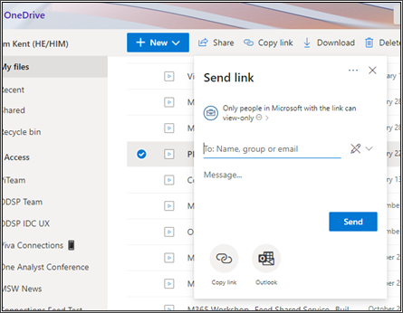
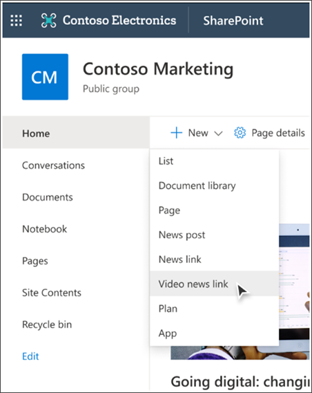
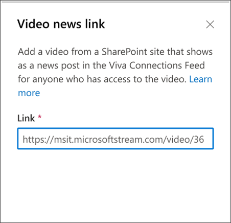
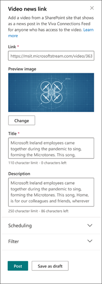
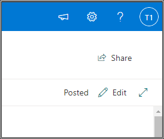
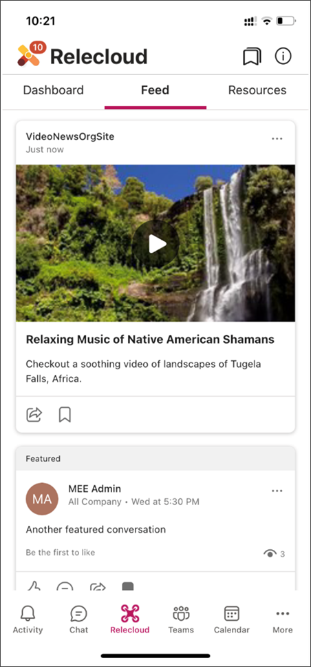

# Embed Video news links in the Viva Connections feed (Preview)
  
Learn how to communicate with your organization by embedding videos in the Viva Connections feed.
Videos are an engaging way to reach users in your organization. They provide endless opportunities to communicate with your organization. Share an update, rebroadcast an all-hands meeting, or provide reusable training materials.
 
## How to publish a Video news link
You can publish videos hosted on SharePoint sites as news posts in the Viva Connections Feed from the **+ New** menu on any SharePoint organizational news site.  
1.  Select the video in OneDrive or SharePoint that you want to publish.

2.  Create a sharing link with the appropriate permissions for the intended viewing audience.  

    > [!TIP]
    > Create a sharing link that includes members of your organization that already have access to the video so they can play it.
    >
    > 

3.  Navigate to a SharePoint organizational site and select **Video** from the **+ New** menu.  Currently, videos can only be published as news items from organizational news sites.

    

4.  Paste the sharing link into the **Link** field.

    

5.  Update the **Title** and **Description** fields. A title and description will be automatically populated from the video. You can use the default information, or update it to say something different.

    

6.  Select **Post** to publish to the video news link to the Feed.
**Options for publishing Video news links:**
-  Schedule the video to publish at a future date and time. Videos without a schedule date will be published immediately.
- Target the video to a specific audience so it’s only shown to those certain people. Or, leave the Audience target field blank to make it available to all users who have access to the site you’re publishing from.
- Boost the video to promote it within the Viva Connections feed.

> [!NOTE] 
> Scheduling and audience targeting is available from the **Page details** option at the top of the page when the page is in edit mode.

## How to edit active Video news links

1.  Open the Site content of the site you published the video from.
2.  Find the page in the list of published pages and open it.
3.  Select **Edit** on the top-right of the page.

    
 
4.  Edit content on the page, and then select **Update post** to republish.

## FAQs

**Q:** What types of videos are supported? 
 

**A:** Stream videos built on SharePoint or OneDrive can be published as a video news link in the Viva Connections feed.  Videos uploaded to Stream (classic) are not supported. 
 
 

**Q:** Can I post external videos from YouTube, Vimeo, etc.?
 

**A:** No, only Stream videos hosted by SharePoint or OneDrive are supported.
 
 

**Q:** Where will Video news links display?
 

**A:** Videos published as Video news links will only appear in the Viva Connections feed.
 
 

**Q:** Can I schedule a video to be published at a future date?
 

**A:** Yes, use the **Scheduling** options in the publishing flow to select a date and time in the future to delay when the video is published.
 
 

**Q:** What will the video look like when published to the Viva Connections feed?
 

**A:** Video news links will appear as a card in the Viva Connections feed. Tapping on the card will play the video full screen.
> 