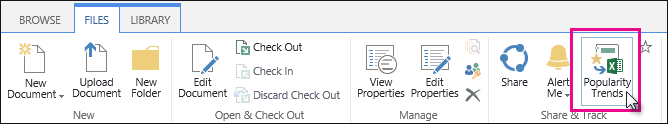
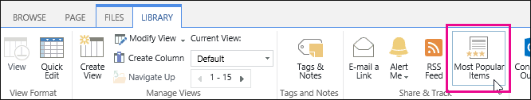

# View Popularity Trends and Most Popular Items

To identify usage trends and find out at what times activity is high or low, you can view **Popularity Trends** reports for a [site](view-popularity-trends-and-most-popular-items.md#__view_popularity_trends_1) or a [site collection](view-popularity-trends-and-most-popular-items.md#__view_popularity_trends_2). The reports show historical usage information, such as number of views (hits) and unique users per day or month. Popularity Trends for [a page or item in a library](view-popularity-trends-and-most-popular-items.md#__view_popularity_trends) in a library show how many views the page or item has had recently. 
  
You can also view the [most popular items](view-popularity-trends-and-most-popular-items.md#__view_the_most) in a library. You'll see which items have the most views, either recently or ever (from the first time the item became available.) 

>[!NOTE]
> For SharePoint Modern sites, please see [View usage data for your SharePoint site](https://support.office.com/article/view-usage-data-for-your-sharepoint-site-2fa8ddc2-c4b3-4268-8d26-a772dc55779e).
  
## View Popularity Trends for a site

1. On the site, select **Settings** , and then select **Site settings**. If you don't see **Site settings**, select **Site information**, and then select **View all site settings**.
    
2. Under **Site Administration**, click **Popularity Trends**.
    
3. Click **Usage**.
    
4. Click Open to open the report in Excel.
    
## View Popularity Trends for a site collection

1. On the site, select **Settings** , and then select **Site settings**. If you don't see **Site settings**, select **Site information**, and then select **View all site settings**.
    
2. Under **Site Collection Administration**, click **Popularity and Search Reports**.
    
3. Under **Usage Reports**, click **Usage**.
    
4. Click Open to open the report in Excel.
    
You can also view other reports for the site collection, see [View usage and search reports](view-search-usage-reports.md).
  
## View Popularity Trends for a page or item in a library

1. On your site, navigate to the relevant document library.
    
2. Select one or more pages or items that you want to look at trends for.
    
3. Click the **FILES** tab. 
    
4. On the ribbon, click **Popularity Trends**.
    
    
  
5. Click Open to open the **Usage Details** report in Excel. There's one tab in the report for each item you selected. 
    
You can also see popularity trends for a page or item from the **Most Popular Items** view. 
  
Or, you can go to an individual page and select the **PAGE** tab \> **Popularity Trends**.
  
## View the Most Popular Items in a library

1. On your site, go to the relevant document library.
    
2. Click the **LIBRARY** tab. 
    
3. On the ribbon, click **Most Popular Items**. 
    
    
  
You can sort the list by **Recent** (views the last 14 days), or **Ever** (views from the first time the item became available). 
  
To see more details for each item, click the **Popularity Trends** link under each item URL. 
  
## View Usage and Search reports for all sites

If you're a global or SharePoint admin in Office 365, you can view search usage reports for the whole organization. See [View usage and search reports](view-search-usage-reports.md).
  

