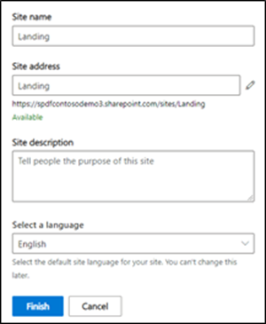
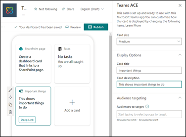
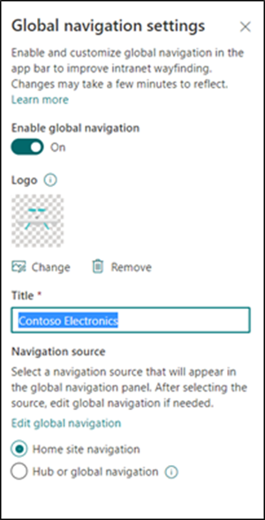
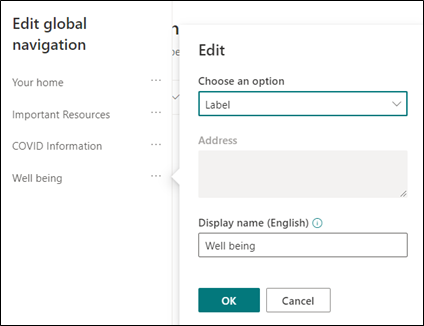
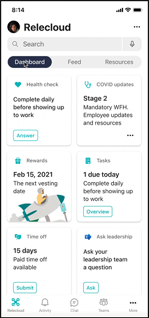

# Set up the Viva Connections experience in a specific language
Viva Connections is available in most major languages used in Microsoft 365. Learn more about how to create and deploy the Viva Connections mobile experience in a specific language other than your organization’s default language. 

Broadly, [Viva Connections](viva-connections-overview.md) mobile has four components that influence the end user’s overall language experience - the Viva Connections Dashboard, Feed, Resources, and the Teams mobile app. 

> [!NOTE]
> Teams and SharePoint may individually support more languages than the ones below.

1. Catalan
2. Chinese(S)	
3. Chinese(T)
4. Czech	
5. Danish
6. Dutch
7. English	
8. Finish
9. French	
10. German		
11. Greek	
12. Hungarian	
13. Indonesian	
14. Italian	
15. Japanese 
16. Korean	
17. Norwegian 
18. Polish		
19. Portuguese (Brazil)
20. Portuguese (Portugal)
21. Romanian
22. Russian
23. Spanish
24. Swedish
25. Thai
26. Turkish
27. Ukrainian

Learn how to set up Viva Connections components to display content in another language other than your organization’s default language. The steps below use English as an example, but the steps apply for any one of the 27 languages specified above. 

## Viva Connections Dashboard
The Dashboard is intended to enable quick access to content and tasks from various sources including intranet content, line-of-business applications, HR tools, frontline worker tools, and other internal or third-party applications.

1. Create a communication site and make sure to select English as the default language at site creation time.

   

2. Make this communication site the home site of your tenant, which will enable the Dashboard creation on that site. [Learn more about how to set a home site](home-site.md). 

3. When creating the dashboard, make sure the Dashboard author is typing the content in the English language for details like card titles and descriptions – [even if their own preferred language setting](https://support.microsoft.com/office/change-your-personal-language-and-region-settings-caa1fccc-bcdb-42f3-9e5b-45957647ffd7) in Microsoft 365 is not English. 

> [!NOTE]
> For [custom cards](/sharepoint/dev/spfx/web-parts/guidance/localize-web-parts), ask your card developer to include strings localized in English language

   

## Viva Connections Feed
The Feed experience will show SharePoint news posted from [organizational news sites](organization-news-site.md), sites you frequent and follow, [videos hosted on SharePoint](video-news-links.md), Yammer posts in the [All-company group](/yammer/manage-yammer-groups/yammer-all-company-yammer-community), Yammer posts in communities you follow, and [SharePoint news that has been boosted](https://support.microsoft.com/office/boost-news-from-organization-news-sites-46ad8dc5-8f3b-4d81-853d-8bbbdd0f9c83).

#### Organizational news
Make sure that authoritative news sites (there can be more than one organization news site) are created with English as the default language and that authors of news post are creating the news posts in English language – even if their own [preferred language setting in Microsoft 365](https://support.microsoft.com/office/change-your-personal-language-and-region-settings-caa1fccc-bcdb-42f3-9e5b-45957647ffd7) is not English. 

#### All company Yammer
Announcement posts in the [All-company group in Yammer](/yammer/manage-yammer-groups/yammer-all-company-yammer-community) should be created in English.

## Viva Connections Resources
The Resources experience displays intranet resources from [global navigation in the SharePoint app bar](sharepoint-app-bar.md).

> [!NOTE]
> Global navigation and a Dashbaord can only be enabled and customized from the [home site](home-site-plan.md) and required site owner (or higher) permissions. The default language of that site should already be English.

1. Navigate to the **Settings** panel from the home site and select **Global navigation**.
2. The global navigation **Title** should be in English.
3. The navigational node in the global navigation must be entered in English.

   

## Microsoft Teams mobile app 
In the Teams mobile app, Viva Connections is displayed as another tab in the Teams app bar. The language experience of the mobile app is driven by the device language set by the user. Make sure to inform your users to set it to English for a cohesive experience – although it is not required. 

If a user has a device set to the French language the Teams mobile app “system” strings (text that Microsoft provides out-of-the box for end-user experience in the app) will all be in French while the Dashboard cards, Feed, and Resources content will be in English.

## More resources

[Overview of Viva Connections](viva-connections-overview.md)

[Set up and launch Viva Connections](guide-to-setting-up-viva-connections.md)
