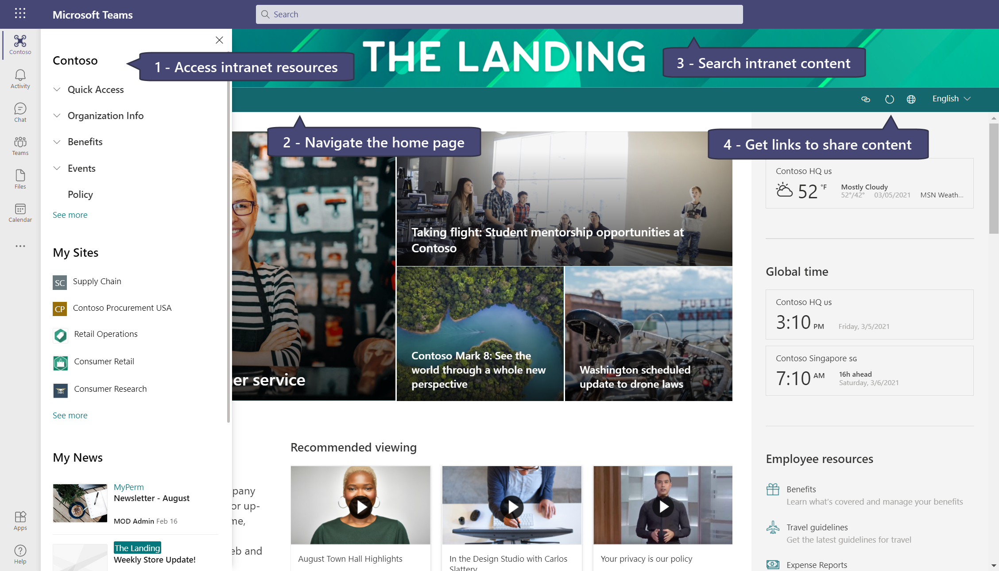

# Add Viva Connections for desktop 

Microsoft [Viva Connections](https://techcommunity.microsoft.com/t5/microsoft-viva-blog/microsoft-viva-connections-to-start-rollout-to-general/ba-p/2175802) - one of the [four Viva modules](https://www.microsoft.com/en-us/microsoft-365/blog/2021/02/04/microsoft-viva-empowering-every-employee-for-the-new-digital-age/) - is your gateway to a modern employee experience. The Viva Connections for desktop experience, formerly known as the [Home site app](https://techcommunity.microsoft.com/t5/microsoft-sharepoint-blog/the-home-site-app-for-microsoft-teams/ba-p/1714255), combines the power of your intelligent SharePoint intranet with chat and collaboration tools in Microsoft Teams. Viva Connections enables users to discover and search relevant content, sites, and news from across the organization right from the Team’s app bar. Viva Connections also allows you to incorporate your organization’s brand and identity directly in Teams. 

## Benefits of using Viva Connections 

   

1.	**Highlight specific resources:** Viva Connections uses the company-curated [global navigation](https://docs.microsoft.com/SharePoint/sharepoint-app-bar) links along with personalized content like sites and news, which are powered by [Microsoft Graph](https://docs.microsoft.com/graph/overview). Global navigation is configured in SharePoint and can be accessed by selecting the icon in Teams app bar.

2.	**Navigate intranet resources in Teams:** Navigate to all modern SharePoint sites, pages, and news within Teams without losing context. All files will open in the Teams file preview window. 

3.	**Search for intranet content in Teams:** On the home page, you can search for intranet content in SharePoint by searching in the Teams search bar. Search results will be displayed on a SharePoint site in the browser. 

    

4.	**Share content easily:** Features in the SharePoint site header will dynamically display tools that help users collaborate depending on the type of content being viewed. Tasks such as sharing a link to a SharePoint page in a Teams chat are much easier. 

>[!IMPORTANT]
> - You need site owner permissions (or higher) to apply Viva Connections for desktop in the Microsoft Teams Admin Center.
> - Viva Connections for desktop is not yet supported in the Teams mobile app.
> - Only modern SharePoint sites and pages can be accessed in the global navigation tab of the Team’s app bar.
> - Global navigation menu links can be [audience targeted](https://support.microsoft.com/office/target-content-to-a-specific-audience-on-a-sharepoint-site-68113d1b-be99-4d4c-a61c-73b087f48a81) so that specific content is surfaced to certain groups of people. Audience targeting settings in the SharePoint global navigation menu will carry over to global navigation in Teams.
> - Search customizations applied to SharePoint sites will apply to search results in Teams when on the home site.
> All SharePoint out-of-the-box site headers are compatible with Viva Connections desktop. However, if you modify your SharePoint site to remove, or significantly change the site header, then these contextual actions may not be available to the user. 
> - Viva Connections was originally announced as the [Home site app](https://techcommunity.microsoft.com/t5/microsoft-sharepoint-blog/the-home-site-app-for-microsoft-teams/ba-p/1714255).
> - Viva Connections for mobile will become available in Summer 2020 and will include enhancements to the overall configuration and deployment experience.
> - The Viva Connections for desktop PowerShell script in the Microsoft download center will become available on March 29, 2021.

## Prepare for Viva Connections
The first version of Viva Connections can be provisioned through PowerShell and then will be [uploaded as an app in the Teams Admin Center](https://docs.microsoft.com/microsoftteams/upload-custom-apps#upload). The PowerShell script will be available on March 29, 2021. Future versions of Viva Connections will be automatically available through the Teams Admin Center. Prepare your organization for Viva Connections now, or in the near future, by reviewing the following recommendations:

   

#### Deploy Viva Connections with following elements:

- **SharePoint home site -** We highly recommend that you use the SharePoint home site as the landing experience for Viva Connections. If you don't already have a SharePoint [home site](https://review.docs.microsoft.com/sharepoint/home-site?branch=viva-connections-desktop), learn more about how to [plan home site navigation](https://docs.microsoft.com/sharepoint/information-architecture-modern-experience) and review considerations for [planning a global intranet](https://docs.microsoft.com/sharepoint/set-up-global-intranet).

- **Global navigation is enabled in SharePoint -** It is recommended that global navigation is enabled and customized in the [SharePoint app bar](https://docs.microsoft.com/SharePoint/sharepoint-app-bar) so that SharePoint resources to appear in Teams.

- **Modern SharePoint sites and pages -** Only modern SharePoint sites and pages will appear in the SharePoint app bar and Viva Connections. Learn more about how to [modernize classic SharePoint sites and pages](https://docs.microsoft.com/sharepoint/dev/transform/modernize-userinterface-site-pages).

## Set up Viva Connections desktop
Complete the following steps to enable Viva Connections desktop using [SharePoint PowerShell](https://docs.microsoft.com/powershell/sharepoint/sharepoint-online/introduction-sharepoint-online-management-shell?view=sharepoint-ps):

1.	**Set up a SharePoint home site:** We highly recommend that you set up a [SharePoint home site](https://docs.microsoft.com/sharepoint/home-site) and use that site as the default landing experience for your users in Teams. 

2.	**Enable global navigation and customize navigational links:** [Set up and customize global navigation in the SharePoint app bar](https://docs.microsoft.com/SharePoint/sharepoint-app-bar). Learn about the different ways you can [set up the home site navigation and global navigation](https://docs.microsoft.com/SharePoint/sharepoint-app-bar#see-all-the-different-ways-you-can-set-up-global-navigation) to surface the right content at the right time.

3.	**Create a Viva Connections app package in PowerShell:** The tenant admin needs to download and run PowerShell script from the Microsoft download center to create the Viva Connections desktop package. Ensure that you are using the [latest version](https://www.powershellgallery.com/packages/Microsoft.Online.SharePoint.PowerShell/16.0.20912.12000) of the [SharePoint Management Shell](https://docs.microsoft.com/powershell/sharepoint/sharepoint-online/introduction-sharepoint-online-management-shell?view=sharepoint-ps) tool before running the script. 

>[!IMPORTANT]
> -	The Viva Connections PowerShell script will be available in the Microsoft download center on March 29, 2021.
> -   Tenant admin credentials are required to use SharePoint PowerShell.
> -	The tenant admin who creates the Viva Connections desktop package needs site owner permissions (or higher) to the home site in SharePoint. 
> -	If your tenant is using an older version of PowerShell, uninstall the older version and replace it with the most [up to date version](https://www.powershellgallery.com/packages/Microsoft.Online.SharePoint.PowerShell/16.0.20912.12000). 

4.	**Provide tenant and site information to create the package:** This article will be updated with the PowerShell script and instructions on March 29, 2021 that explains how to create the Viva Connections app package.

**When you create a new package in PowerShell, you will be required to complete the following fields:**

- **URL of your tenant’s home site:** Provide the tenant's home site URL starting with "https://". This site will become the default landing experience for the Home site app in Teams.
- Provide the following details when requested:
 

   - **Name:** The name of your Viva Connections desktop package, as it should appear in Teams app bar.
   - **App short description (80 characters):** A short description for your app, which will appear in Teams app catalog.
   - **App long description (4000 characters):** A long description for your app, which will appear in Teams app catalog.
   - **Privacy policy:** The privacy policy for custom Teams apps in your organization (needs to start with https://). If you do not have a separate privacy policy, press Enter and the script will use the default SharePoint privacy policy from Microsoft.
   - **Terms of use:** The terms of use for custom Teams apps in your organization (needs to start with https://). If you do not have separate terms of use, press Enter and the script will use the default SharePoint terms of use from Microsoft.
   - **Company name:** Your organization name that will be visible on the app page in Teams app catalog in “Created By” section.
   - **Company website:** Your company’s public website (needs to start with https://) that will be linked to your company’s app name on the app page in Teams app catalog in “Created By” section.
   - **Icons:** You are required to provided two PNG icons, which will be used to represent your Viva Connections desktop app in Teams; a 192X192 pixel colored icon for Teams app catalog and a 32X32 pixel monochrome icon for Teams app bar. [Learn more about Teams icon guidelines](https://docs.microsoft.com/microsoftteams/platform/concepts/build-and-test/apps-package#app-icons).

>[!NOTE]
> Microsoft does not have access to any information provided by you while running this script.

5.	**Upload the Viva Connections desktop package in the Teams Admin Center:** Once you successfully provide the details, a Teams app manifest, which is a .zip file, will be created and saved on your device. The Teams administrator of your tenant will then need to upload this app manifest to **Teams admin center > Manage apps**. 
 

      Learn more about [how to upload custom apps in Teams admin center](https://docs.microsoft.com/microsoftteams/upload-custom-apps#upload).

6.	**Manage and pin the icon by default for your users:** Once the Viva Connections desktop package is successfully uploaded in the Teams admin center, it can be managed like any other app. You can [configure user permissions](https://docs.microsoft.com/microsoftteams/teams-app-permission-policies#:~:text=Create%20a%20custom%20app%20permission%20policy%201%20In,allow%20all%20others%20...%20See%20More....%20See%20More.) to make this app available to the right set of users. Permitted users can then find this app in Teams app catalog. 

      We *highly recommend* that you pin this app by default for users in your tenant so that they can easily access their company’s intranet resources without having to discover the app in Teams app catalog. Use [Teams app setup policies](https://docs.microsoft.com/MicrosoftTeams/teams-app-setup-policies) to pin this app by default in Teams app bar and then [apply this policy to a batch of users](https://docs.microsoft.com/microsoftteams/assign-policies#assign-a-policy-to-a-batch-of-users).

### Then, onboard end users for Viva Connections

Help end users understand [how to use Viva Connections](https://support.microsoft.com/office/your-intranet-is-now-in-micosoft-teams-8b4e7f76-f305-49a9-b6d2-09378476f95b) to improve workplace communication and collaboration. 

## FAQs

**Q: Can any site be pinned as default landing experience in Teams?**
 

**A:** Modern SharePoint communication sites are eligible for pinning in Teams via Viva Connections. However, we **highly recommend** that you nominate a [home site in SharePoint](https://docs.microsoft.com/sharepoint/home-site) and pin that as the default landing experience for your users in Teams.
 
 

**Q: Can I create multiple Viva Connections packages to be pinned in Teams?**
 

**A:** You can create multiple packages using the PowerShell script and then use [Teams permission and setup policies](https://docs.microsoft.com/microsoftteams/teams-app-permission-policies#:~:text=Create%20a%20custom%20app%20permission%20policy%201%20In,apps%20and%20allow%20all%20others%20More%20items) to make different apps available to relevant user segments within your tenant.
 
 

**Q: Can my classic SharePoint site be pinned in Teams?**
 

**A:** No, classic SharePoint sites are not supported in Microsoft Teams.
 
 

**Q: Do I need Viva Connections for the global navigation to show up in Teams?**
 

**A:** Yes, the global navigation menu links are stored in the home site of a tenant, and is required in order for the navigation panel to appear in Viva Connections in Teams. Learn more about how to [enable and set up global navigation in the SharePoint app bar](https://docs.microsoft.com/SharePoint/sharepoint-app-bar).
 
 

**Q: What happens if I don’t configure global navigation links before setting up Viva Connections?**
 

**A:** The user will still be able to access recommended sites and news by selecting the global navigation icon in Teams but will not have direct access to intranet navigational items.
 
 

**Q: What is the difference between using Viva Connections and adding the SharePoint Home page as a tab in Microsoft Teams?**
 

**A:** Viva Connections allows organizations to pin an organization branded entry point to their intranet that creates an immersive experience, complete with navigation, megamenus, and support for tenant-wide search.  Viva Connections also provides quick access to organization curated resources, followed sites, and news like those provided by the SharePoint app. Home pages (or any other SharePoint pages) [pinned as tabs in Teams](https://support.microsoft.com/office/add-a-sharepoint-page-list-or-document-library-as-a-tab-in-teams-131edef1-455f-4c67-a8ce-efa2ebf25f0b) channels provide ways to bring content directly into Team collaboration workspace, and these pages do not feature navigation and search elements.
 
 

**Q: Is this the same feature that was announced in fall 2020 as the Home site app?**
 

**A:** Viva Connections was originally announced as the [Home site app](https://techcommunity.microsoft.com/t5/microsoft-sharepoint-blog/the-home-site-app-for-microsoft-teams/ba-p/1714255) but will be called Viva Connections moving forward.
 
 

**Q: When will Viva Connections for mobile become available?**
 

**A:** Following on our spring release of the desktop experience for Viva Connections, we are rolling out an update that includes native mobile experiences for Teams on iOS and Android, enhancements to the overall IT configuration and deployment experience for the combined desktop and mobile app, as well as new Dashboard and Feed web parts for the desktop to complement the experience.
 

## More resources

[Set up a home site for your organization](https://docs.microsoft.com/sharepoint/home-site)
 

[Enable and set up global navigation in the SharePoint app bar](https://docs.microsoft.com/SharePoint/sharepoint-app-bar)
 

[Introduction to SharePoint Online Management Shell](https://docs.microsoft.com/powershell/sharepoint/sharepoint-online/introduction-sharepoint-online-management-shell?view=sharepoint-ps)

[Learn more about Microsoft Viva](https://www.microsoft.com/microsoft-365/blog/2021/02/04/microsoft-viva-empowering-every-employee-for-the-new-digital-age/)

[Learn more about Viva Connections](https://techcommunity.microsoft.com/t5/microsoft-viva-blog/microsoft-viva-connections-to-start-rollout-to-general/ba-p/2175802)

