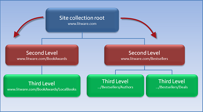
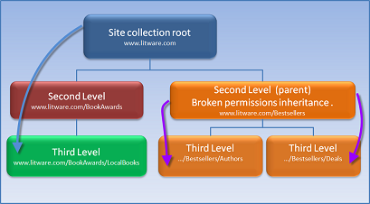

# Permissions inheritance in SharePoint

While SharePoint allows considerable customization of site permissions, including changing inheritance, we highly recommend not breaking inheritance. Use the built-in SharePoint groups for communication sites and manage team site permissions through the associated Office 365. Use sharing links to share individual files and folders with people outside the site. This allows for much easier administration. For information about managing permissions in the SharePoint modern experience,see [Sharing and permissions in the SharePoint modern experience](modern-experience-sharing-permissions.md).

## What is permissions inheritance?

Permissions inheritance means that the permission settings of an element in a site collection are passed on to the children of that element. In this way, sites inherit permissions from the root site of the site collection, libraries inherit from the site that contains the library, and so on. Permission inheritance enables you to make a permission assignment once, and have that permission apply to all sites, lists, libraries, folders and items that inherit permissions. This behavior can reduce complexity and the amount of time Administrators and Site Owners spend on security management.
  
By default, SharePoint sites inherit permissions from a parent site. This means that when you assign a user to the Members group, the user's permissions automatically cascade down through all the sites, lists, libraries, folders and items that inherit the permission level.
  
## What is a parent in SharePoint permissions?

The term parent, when used in SharePoint permissions, is just a way to emphasize inheritance. The parent passes down its permission settings to all its children. By default, the root site of a site collection is the first parent for all the sites and other objects that are below it in the site hierarchy.
  
The site collection root is not the only parent on a site. Every securable object (sites, libraries, lists, and so on) in a site collection can be a parent. That is, the site collection root is the parent of its subsites, each site is the parent of its libraries and lists, and each list is the parent of the list items in it. In this terminology, an object with a parent is known as a child. So, a subsite is the child of its parent site, a list item is the child of its list parent, and so on.
  
By default, permissions are inherited from parent to child. That is, if you do not change the permission structure, then a list item inherits permissions (through its parent list) from the top-level site in the collection. However, even if you break inheritance for a list, that list is still a parent for its own list items. The list items for the list inherit the permissions that the list has, and if you change the permissions for the list, the list items inherit the changes.
  
When you first break this chain of inheritance from parent to child, the child starts with a copy of the parent's permissions. Then, you edit these permissions to make them the way that you want. You can add permissions, remove permissions, create special groups, and so on. None of the changes affect the original parent. And, if you decide that breaking inheritance was the wrong decision, you can resume inheriting permissions at any time.

When a user shares or stops sharing an item that contains other items with broken inheritance, a one-time push down of that permission addition or removal is sent to all child items, even those with broken inheritance. This is true for both direct permissions and sharing links. When managing permissions for an item with broken inheritance, users are able to remove any direct permissions on it. If an item with broken inheritance is accessible by a sharing link that was created on one of its parent folders and a user does not want that link to grant access to the item, then users can either remove the link entirely or they can move the file outside of the folder for which sharing link has permissions.
  
## More about permissions inheritance

Permission inheritance enables an administrator to assign permission levels at one time, and have the permissions apply throughout the site collection. Permissions pass from parent to child throughout the SharePoint hierarchy, from the top level of a site to the bottom. Permission inheritance can save time for site administrators, especially on large or complex site collections.
  
However, some scenarios have different requirements. In one scenario, you might have to restrict access to a site because it contains sensitive information that you must protect. In a different scenario, you might want to expand access and invite others to share information. If you want, you can break the inheritance behavior (stop inheriting permissions) at any level in the hierarchy.
  
Let's look at examples of these different scenarios.
  
Suppose that you have a book distribution company called Litware, and that you subscribe to Office 365. You create a SharePoint site named www.litware.com. This is the site collection root. At the site collection root, you set up SharePoint groups, assign permission levels, and add users to the groups.
  
Suppose then that you create subsites, such as www.Litware.com/BookAwards and www.litware.com/Bestsellers, and that these subsites contain more subsites.
  
### A scenario that uses default behavior

The following illustration shows the default behavior, when permissions pass directly to subsites. That is, the groups and permission levels that you assigned at the site collection root pass down automatically to the subsite for reuse.
  

  
### A scenario that restricts access to a site and its children

You might want to do this to restrict access to the separated site and its children.
  
For example, suppose that your company, Litware, supports active promotional opportunities and deals for bestsellers. Because the deals that the company offers are secret, only certain people in the company can access the information about the bestseller authors and deals. So, the administrators decide to separate the Bestsellers site, and break inheritance.
  
In the following illustration, the www.Litware.com/Bestsellers breaks inheritance from the parent site, www.litware.com. The site owners for the Best Sellers site change the permissions for the site, removing some groups and creating others. The subsites of the Bestsellers site, Authors and Deals, now inherit permissions only from the Bestsellers subsite. Only the groups and users for Bestsellers can access the lists and libraries that contain sensitive information.
  

  
For ease of maintenance, we recommend that you use a similar method to restrict access. That is, organize your site so that sensitive material is in the same place. If you organize the site this way, you only have to break inheritance one time, for that specific site or library. This is much less overhead. It requires much less work than creating separate permission structures in many locations for individual subsites and libraries.
  
### A scenario that shares access for a library and its documents

In this scenario, suppose that Jane is an editor in your Local Books division. Jane is collaborating with an author on a history of the labor union movement. She compiled a research document that she wants to share with the author. The research would be really useful in their collaboration. However, the author does not work for Litware and can't access the information on the Litware site.
  
Jane has a simple solution - she can just share the document together with the author by clicking a command on the ribbon. SharePoint automatically handles all the details of permissions and access, by breaking inheritance on the document itself. Now, the local author can browse the site to the document location and access the document, but can't view or access any other information on the site.
  
For more information about inviting an external user to use information on your site, see [Share SharePoint files or folders in Office 365](https://support.office.com/article/1fe37332-0f9a-4719-970e-d2578da4941c).
