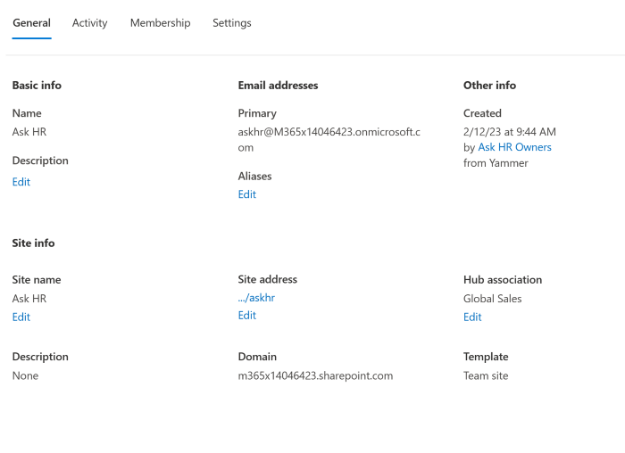

# What's new in the SharePoint admin center

We're continuously adding new features to the new SharePoint admin center and fixing issues we learn about. Here's a summary of what's included. You can help us improve the admin center by sending us your suggestions and reporting bugs you encounter. In the lower-right corner of the admin center, click the **Feedback** button.
  
> [!NOTE]
> The new SharePoint admin center is supported in Microsoft Edge, Internet Explorer, Chrome, Firefox, and Safari.
> 
> Some functionality is introduced gradually to organizations that have opted in to the [Targeted release option in Microsoft 365](/office365/admin/manage/release-options-in-office-365). This means that you might not yet see some features described in this article.
> 
> For info about new features in the Microsoft 365 admin center, see [What's new in the Microsoft 365 admin center](/microsoft-365/admin/whats-new-in-preview). For info about new features in Migration Manager, see [What's new in Migration Manager](/sharepointmigration/mm-whats-new).

> [!IMPORTANT]
> Microsoft 365 apps and services will not support Internet Explorer 11 starting August 17, 2021 (Microsoft Teams will not support Internet Explorer 11 earlier, starting November 30, 2020). [Learn more](https://aka.ms/AA97tsw). Please note that Internet Explorer 11 will remain a supported browser. Internet Explorer 11 is a component of the Windows operating system and [follows the Lifecycle Policy](/lifecycle/faq/internet-explorer-microsoft-edge) for the product on which it is installed. 

## June 2021

- **Info about connection to Microsoft Teams**. On the Active sites page, you can use the new Teams column to view and filter sites connected to Microsoft Teams. When you select a site, the details panel also shows whether the site is connected to Microsoft Teams. 
- **Info about site creation source**. On the Active sites page, you can use the new Created from column to see how the site was created. When you select a site, this info appears on the General tab of the details panel, under **Creation**. This info isn't available for sites created before October 2020.  
- **New dashboard on home page**. On the home page, you can now add, remove, and rearrange cards. Several new cards were added:

    - SharePoint storage usage over time
    - OneDrive usage
    - OneDrive file activity
    - Search active sites
    - Sensitivity labels
    - Term store operations
    - Microsoft 365 active users report

You can also create a card by [tracking a view](manage-sites-in-new-admin-center.md#track-a-view) on the Active sites page. 

[Learn more about the new home page dashboard](get-started-new-admin-center.md)

## April 2021

- **New "How can we help?" experience**. To search help, open a new service request, or manage existing service requests, select **Need help?** in the lower-right corner.

## March 2021

- **OneDrive settings**. On the Settings page, you can now manage OneDrive settings. The OneDrive **Notifications** setting lets you [control whether users can receive notifications about file activity](/onedrive/turn-on-external-sharing-notifications). The **Retention** setting lets you [specify the days to retain a deleted user's OneDrive](/onedrive/set-retention). The **Storage limit** setting lets you [set the default OneDrive storage space](/onedrive/set-default-storage-space). The **Sync** setting lets you show or hide the Sync button on the OneDrive website, [allow syncing only on computers joined to specific domains](/onedrive/allow-syncing-only-on-specific-domains), and [block upload of specific file types](/onedrive/block-file-types). 

## June 2020

- **Improvements to the Export feature**. On the Active sites page, you can [export your customized view as a .csv file](manage-sites-in-new-admin-center.md#export-to-csv).
- **New Segments column on the Active sites page**. Organizations that use information barriers can now view and manage the segments associated with sites. [Learn about using information barriers with SharePoint](information-barriers.md)

## April 2020

- **Support for the Global reader role**. Users assigned this role can view all info in the admin center, but can't save any changes. [Learn more about this role](/azure/active-directory/users-groups-roles/directory-assign-admin-roles#global-reader). The following features aren't available for people who are signed in as global readers: Content type gallery page, Migration page, API access page, link to OneDrive admin center, customizing the navigation in the left pane.

## December 2019

- **Customizable navigation pane**. You can [customize the navigation pane to show or hide items](./get-started-new-admin-center.md#customize-the-navigation-pane).
    
    

- **Root site replacement**. On the [Active sites page](https://admin.microsoft.com/sharepoint?page=siteManagement&modern=true), you can [select and replace the root site](modern-root-site.md). 

    

- **People cards**. On the [Active sites page](https://admin.microsoft.com/sharepoint?page=siteManagement&modern=true), you can point to a name in the Primary admin column or on the Permissions tab of the details panel and see info about the person. 

    

- **Redesigned details panel**. On the [Active sites page](https://admin.microsoft.com/sharepoint?page=siteManagement&modern=true), the details panel that appears when you select a site has been redesigned to divide the information among multiple tabs. [Learn more about managing sites](manage-sites-in-new-admin-center.md).

    

- **Additional site-level sharing settings**. On the [Active sites page](https://admin.microsoft.com/sharepoint?page=siteManagement&modern=true), when you select a site and then select **Sharing**, you can [change the default sharing link type and default link permissions for the site](change-external-sharing-site.md). 

    

- **Site permission details**. On the [Active sites page](https://admin.microsoft.com/sharepoint?page=siteManagement&modern=true), a new experience lets you manage all site admins in one panel, view site members and visitors, and add site admins to sites that belong to Microsoft 365 groups. [Learn more about managing site permissions](site-permissions.md) 

    

- **Redesigned Settings page**. The [Settings page](https://admin.microsoft.com/sharepoint?page=settings&modern=true) has been redesigned to let you see the value for each setting without selecting each one for more info.

    

- **Updated More features page**. Classic features can now be found on the [More features page](https://admin.microsoft.com/sharepoint?page=classicfeatures&modern=true). [Learn where to find features in the new SharePoint admin center](./get-started-new-admin-center.md#where-to-find-things-in-the-new-sharepoint-admin-center).

    

## November 2019

- If you're using the [new sensitivity labels](/microsoft-365/compliance/sensitivity-labels-teams-groups-sites), you can view and edit them from the Active sites page.

## October 2019

- From the Active sites page, you can [change site addresses](change-site-address.md).

## June 2019

- The new SharePoint admin center is set as the default experience unless you select to open the classic SharePoint admin center by default (on the Settings page).

- On the Active sites page, you can select multiple sites and bulk edit sharing and hub association settings.

- Classic SharePoint admin features such as Term Store, User Profiles, Search, Apps, and more are available from the More features page so you can access them directly from the new SharePoint admin center.

