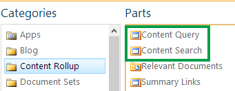
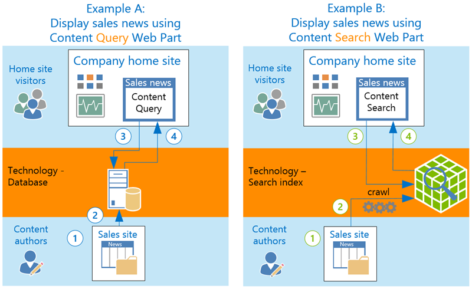
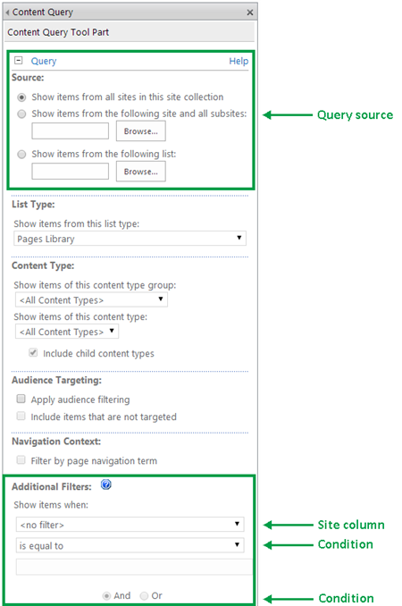
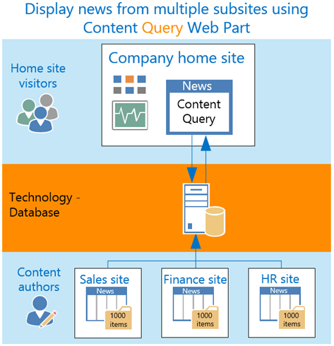
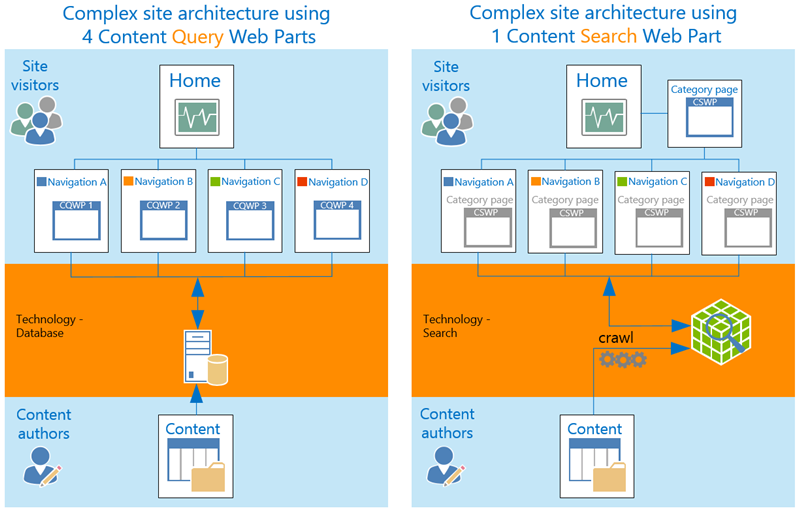
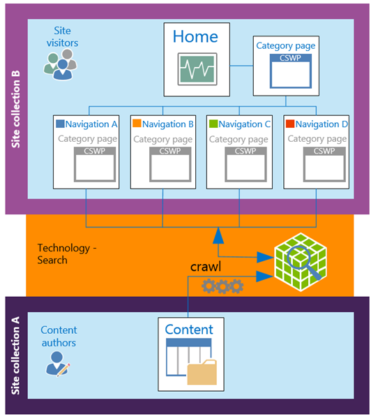

# When to use the Content Query Web Part or the Content Search Web Part in SharePoint

There are two Web Parts that can be used to search data on a SharePoint site. They are very similar: the **Content Query Web Part (CQWP)** and the **Content Search Web Part (CSWP)**. Just by looking at their names, it's not clear to distinguish the difference between the two.
  

  
In this article, we'll help you understand how these Web Parts work, and when you should use one Web Part over the other. 
  
## Compare the strengths and limitations of the Web Parts

It's important that you understand the strengths and limitations of the two Web Parts because if you choose the wrong one, your site could run into performance problems. You can use both Web Parts to show content that is based on a query. In a simplified world, here's how you can decide between the two:
  
- Use the CQWP when you have a limited amount of content, your query is simple, and you don't expect your content to grow much in the future.
    
- Use the CSWP in all other scenarios when you want to show content that is based on a query.
    
The table below gives a comparison of the two Web Parts: 
  
|**Web Part behavior**|**Content Query Web Part**|**Content Search Web Part**|
|:-----|:-----|:-----|
|Query configuration    |Easy    |You'll need to know about certain search features such as [managed properties](manage-the-search-schema.md).    |
|Query across large amounts of content    |Limited    |Yes    |
|Handle complex queries    |Limited    |Yes    |
|Scale to handle future content growth    |Limited    |Yes    |
|Display content from other site collections    |No    |Yes (see [Use the Content Search Web Part to display content from other site collections](when-to-use-the-content-query-web-part-or-the-content-search-web-part-in-sharepo.md#xsp) below)    |
|Design of query results can be customized    |Yes, by using XSLT.    |Yes, by using HTML.    |
|Maintenance cost in a complex site architecture    |High    |Small (see [Keep maintenance cost down with the Content Search Web Part ](when-to-use-the-content-query-web-part-or-the-content-search-web-part-in-sharepo.md#complex) below)    |
|Narrow down the query results that are displayed in the Web Part    |No    |Yes, in combination with the [Refinement Web Part](about-configuring-the-refinement-web-part.md).    |
   
## How the Web Parts display content

You can use both Web Parts to display information that is stored in a subsite. The user experience for content authors and home site visitors is identical, regardless of which Web Part you use. The difference between the two Web Parts is the technology that the Web Parts use. The CQWP queries a database, whereas the CSWP queries the search index.
  
Here's an example of how these Web Parts behave. Example A shows a company that's using a CQWP to show content from its sales subsite, and example B shows a company that's using a CSWP to show content from its sales subsite.
  

  
|**Image callout**|**Example A:          Content Query Web Part**|**Example B:          Content Search Web Part**|
|:-----|:-----|:-----|
|1    |You author content in a list.    |You author content in a list.    |
|2    |The list items are immediately stored in a **database**.    |At a set time interval, the list items are automatically crawled and added to the **search index**.    |
|3    |A visitor views the home site. The CQWP automatically issued a query to the **database**.    |A visitor views the home site. The CSWP automatically issues a query to the **search index**.    |
|4    |The **database** returns a query result and displays it in the CQWP.    |The **search index** returns a query result and displays it in the CSWP.    |
   
## Factors to help you decide which to use

Because the Web Parts use different technologies, the use cases for when you should choose one Web Part over the other differ. A use case is often more complex than the simple example shown in the previous section. Before you decide which Web Part to use, it's important that you consider the following:
  
- How much content do I have?
    
- How complex will by query be?
    
- Where's my content going to be stored?
    
- How much will my content grow over time?
    
- How much will my maintenance costs grow over time?
    
We recommend that you address all of these areas as a whole rather than separately.
  
> [!NOTE]
>  If you're considering moving from a SharePoint on-premises site to a SharePoint Online site, and you are using CQWPs on your SharePoint on-premises site, you could run into a couple of performance issues. In SharePoint Online you won't be able to scale your tenant to improve performance. Also, the caching functionality behaves differently in SharePoint Online than in SharePoint on-premises. 
  
## What affects the performance of the Content Query Web Part

In the previous example, if the News list contains less than 5000 items, the performance of the CQWP is likely to be very good. However, if the News list exceeds 5000 items, and the query in the CQWP is complex, the Web Part can run into performance problems. It's difficult to define exactly what a complex query is, but a **Source** that goes across all sites in your site collection is more complex than a **Source** that queries a specific list. Also, if you query uses **Additional Filters**, the query complexity increases. The query complexity increases depending on the site column types and conditions that you use. Here are some examples:
  
- A query that filters on a site column of type  *Multiple*  * lines of text *  is more complex than a query that filters on a site column of type  *Yes/No*  . 
    
- A filter that uses  *a contains*  condition is more complex than a query that uses an  *is equal*  to condition. 
    
- Multiple  *Or*  conditions increases the complexity of the query. 
    

  
The performance of the CQWP is also affected by where your content is stored. If your content is stored across several sites, the total amount of list items the Web Part has to process will affect its performance. For example, on your company's home site, you want to display the latest news items from lists that are maintained in multiple subsites. Each list contains 1000 items. That means that the CQWP will have to query across 3000 items.
  

  
In this example, if the query is simple, the performance of the CQWP is likely to be good as long as the total amount of items is less than 5000. However, if the query is complex, the CQWP could run into performance problems even when the total amount of items is a few thousand.
  
Another important factor that can affect the performance of the CQWP is if your content grows. A solution that works well today might not apply to your future content. If you expect a large increase in the number of sites or amount of content, you should not use the CQWP.
  
## Keep maintenance cost down with the Content Search Web Part

You can use both Web Parts to display content based on information from your site navigation. For example, when a visitor goes to a page, the Web Part on that page automatically issues a query that contains information from your site navigation. The search results are displayed in the Web Part. If you don't have much content and the query is simple, you can use several CQWPs to display your content. However, because you have to maintain each CQWP individually, your maintenance costs can quickly escalate.
  
By using the CSWP with managed navigation and a category page, your maintenance costs will stay the same as your content grows. For example, if you add a new navigation category to your content, you can use the same category page to display the content that belongs to the new navigation category. So even though your content is growing, you'll only need to maintain the same amount of pages.
  
See these additional articles for more info:
  
- [Enable managed navigation for a site in SharePoint](https://support.office.com/article/49a067dc-77d2-455d-9e77-250ec7cc0a6d)
    
- [Assign a category page and a catalog item page to a term in SharePoint](https://support.office.com/article/2f8e4278-770b-46f6-922e-be4ac52a1ac8)
    
In the example below, you can see how four CQWPs can be replaced by one CSWP on a category page.
  

  
## Use the Content Search Web Part to display content from other site collections

You can use the CSWP to display content from other site collections. For example, if you want to author content in one site collection and display this content in another site collection, you have to use the CSWP. The CQWP can only display content from one site collection. 
  

  
## When in doubt, choose the Content Search Web Part

If you're unsure about which Web Part to use, then the CSWP is probably the best choice in most cases. This Web Part is more flexible than the CQWP and will give you better performance results if you're planning on expanding your content over time. 
  
If you decide to use the CQWP, we recommend that you do testing to find out if the Web Part meets your current and future performance and maintenance requirements.
  
## More information on Content Search and Content Query Web Parts

- [Configure a Content Search Web Part in SharePoint](the-content-search-web-part.md)
    
- [Display a dynamic view of content on a page by adding the Content Query Web Part](https://support.office.com/article/3e35bd58-d159-43d6-bfc7-77878b4a856d)
    

