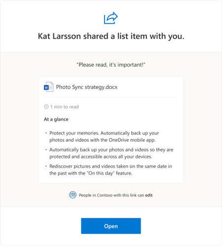

# Summaries in sharing emails

When users share a Word document in SharePoint or OneDrive, recipients get an email that shows:

- The key points in the doc (derived from content extracted from the document by artificial intelligence)
- An estimated time to read the doc (based on the word count and the average reading speed in English) 

This summary info helps recipients plan for the work that the doc will require. 

> [!div class="mx-imgBorder"]
> 
  
> [!NOTE]
> Files that have been marked as sensitive by DLP do not include the summary info. The summary info that appears in sharing emails also [appears on file cards in SharePoint and OneDrive](https://support.microsoft.com/office/87a23bbc-a516-42e2-a7b6-0ecb8259e026).

If you, as a global or SharePoint admin in Microsoft 365, don't want recipients to receive summary info in sharing emails, you can disable it. 

1. [Download the latest SharePoint Online Management Shell](https://go.microsoft.com/fwlink/p/?LinkId=255251).

    > [!NOTE]
    > If you installed a previous version of the SharePoint Online Management Shell, go to Add or remove programs and uninstall "SharePoint Online Management Shell."
	> 
	> On the Download Center page, select your language and then click the Download button. You'll be asked to choose between downloading a x64 and x86 .msi file. Download the x64 file if you're running the 64-bit version of Windows or the x86 file if you're running the 32-bit version. If you don't know, see [Which version of Windows operating system am I running?](https://support.microsoft.com/help/13443/windows-which-operating-system). After the file downloads, run it and follow the steps in the Setup Wizard.

2. Connect to SharePoint as a [global admin or SharePoint admin](./sharepoint-admin-role.md) in Microsoft 365. To learn how, see [Getting started with SharePoint Online Management Shell](/powershell/sharepoint/sharepoint-online/connect-sharepoint-online).
    
3. Run the following command:
    
   ```PowerShell
   Set-SPOTenant -IncludeAtAGlanceInShareEmails $false 
   ```