# Add and configure the Recommended Items and Popular Items Web Part in SharePoint Server

[!INCLUDE[appliesto-2013-2016-2019-xxx-md](../includes/appliesto-2013-2016-2019-xxx-md.md)] 
  
The previous article in this series, [Change the Content Search Web Part display template and use Windows PowerShell to start Usage analytics in SharePoint Server](change-the-content-search-web-part-display-template-and-use-windows-powershell-t.md), explained how to change the CSWP to log the  *Views*  usage event, and how you can use Microsoft PowerShell to start Usage analytics. 
  
> [!NOTE]
> The examples in this series are based on an on-premises SharePoint Server deployment. 
  
## Add a Recommended Items Web Part to a page

Navigate to the page where you want to add the Recommended Items Web Part (RIWP). In our Contoso scenario, we want to add the RIWP to our catalog item page. Here's how you do that:
  
1. Select the **Settings** menu --> **Edit page**. 
    
2. In the Web Part Zone where you want to add the Web Part, select **Add a Web Part**. 
    
3. In the **Categories** list, select **Search-Driven Content**. 
    
4. In the **Parts** list, select **Recommended Items**, and then **Add**. 
    
    In our Contoso scenario, we'll show the RIWP below the CSWP.
    
     
  
## About the recommendedfor managed property

In a previous blog article we told you about the  *UsageAnalyticsId*  managed property that is used by Usage analytics to specify how recommendations between individual items should be calculated (see [About the UsageAnalyticsID managed property](an-introduction-to-recommendations-and-popular-items.md#BKMK_AbouttheUsageAnalyticsIDManagedProperty)). The result of this calculation is sent to the  *recommendedfor*  managed property. The RIWP uses the  *recommendedfor*  managed property to query for recommendations. You don't have to know about this managed property when you configure the RIWP. But, to understand how the query in the RIWP works, it's important that you keep the  *recommendedfor*  managed property in mind. 
  
## Configure the Recommended Items Web Part

When you configure the RIWP, you should configure it on an item details page where recommendations are generated. Remember the previous article in this series, when we invited some coworkers to a "[Why you should simulate the generation of Views usage events](change-the-content-search-web-part-display-template-and-use-windows-powershell-t.md#BKMK_WhyYouShouldSimulateTheGenerationOfViewsUsageEvents)." At the click party, your coworkers click specific items so recommendations are generated. In our Contoso scenario, add the RIWP to an item details page where you know recommendations are generated through the clicking of your coworkers.
  
Here are the steps to configure the RIWP:
  
1. Select the **Settings** menu --> **Edit page**. 
    
2. In the RIWP, select the **Web Part Menu** --> **Edit Web Part**. 
    
     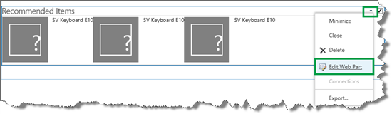
  
3. In the Web Part tool pane, select **Change query**. This opens a dialog box. 
    
4. In the **Build Your Query** dialog box, select the following: 
    
  - In the **Get recommended items for** section, select **A token from the URL** and then select from which URL value that you want to get recommendations. In our Contoso scenario, we want to get recommendations from **{URL.Token.2} (number)**. 
    
  - In the **Restrict by app** section, select **Specify a URL**, and then enter the URL of your catalog. 
    
     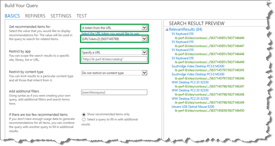
  
You might be thinking "OK, that was easy, but what does it actually mean?" Understanding this can be is a bit difficult. Let's take a closer look.
    
  - **A token from the URL** means that we want to obtain recommendations for a value that is used in the URL. 
    
  - **{URL.Token.2}** is a query variable that represents the second value in the URL as counted from right to left. For example, in the URL  *http://www.contoso.com/computers/desktops/5637145799/5637146352*  , the query variable **{URLToken.2}** represents the value  *5637145799*  . Remember when we connected our publishing site to the catalog (see [Stage 5: Connect your publishing site to a catalog in SharePoint Server](stage-5-connect-your-publishing-site-to-a-catalog.md)), we specified that the value of  *Group Number*  should be used as the second to last value in the URL of our catalog item page. That means the query variable **{URL.Token.2}** represents the value of  *Group Number*  . Also, we mapped [Change the mapping of the UsageAnalyticsID managed property](change-the-content-search-web-part-display-template-and-use-windows-powershell-t.md#BKMK_ChangeTheMappingFoTheUsageAnalyticsIDManagedPriperty) so the Usage analytics calculation would be based on  *Group Number*  . 
    
  - **Specify a URL** means that we want to specify from which site we get recommendations, in this case our Authoring site. 
    
    But from these settings, it is not clear which managed property is used in the query. So, to view more information about the query, select **TEST**. The query that is issued by the Web Part is shown in the **Query text** section. 
    
     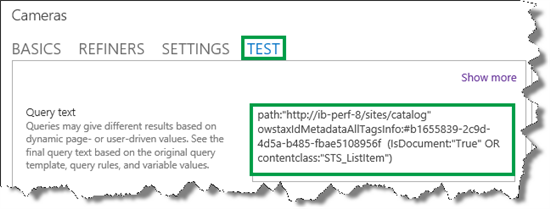
  
If we break this down, we get the following:
    
  - **recommendedfor** is the managed property that is used in the query. 
    
  - The colon : means "contains."
    
  - **5637145799** is the value of the query variable {URL.Token.2}, which is a  *Group Number*  value. 
    
  - **path:"http://ib-perf-8/sites/catalog"** is the URL to our Authoring site. 
    
  - **(IsDocument:"True" OR contentclass:"STS_ListItem")** narrows the search result down to only documents or list items. 
    
    If we put all this information together, we can understand that the query means the following:
    
    From the  *URL of the Authoring site*  , search for  *document or list items*  where the value of the managed property  *recommendedfor*  contains the value that is currently used as the second value in the URL, counting from right to left. 
    
    So, now we know what the query means. But we're not completely done with the configuration. In the **SEARCH RESULT PREVIEW** section, we can see that all items in a product group are displayed, for example all  *SV Keyboard E10*  (notice that they all have the same value for Group Number in the URL). 
    
     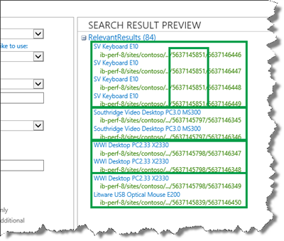
  
    All items in the product group are shown because the Usage analytics calculation is performed on the group level. Remember, in [Change the Content Search Web Part display template and use Windows PowerShell to start Usage analytics in SharePoint Server](change-the-content-search-web-part-display-template-and-use-windows-powershell-t.md), we mapped  *UsageAnalyticsId*  to  *aws_ProductCatalogGroupNumber*  . But we only want to display one item per product group. Luckily, we can do this by grouping search results. 
    
    To group search results, do the following:
    
5. Select **REFINERS --\> Show more**. 
    
     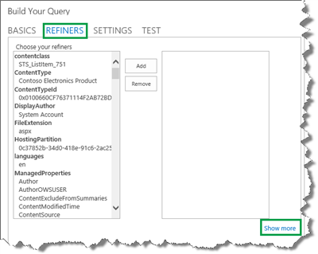
  
6. From the **Group by** menu, select **Show all properties**. 
    
     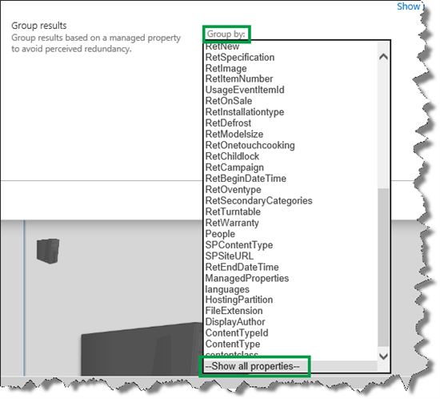
  
7. We want to show only one item per product group. Therefore, we select  *ProductCatalogGroupNumberOWSTEXT*  (the managed property of  *Group Number*  ). We only want to display one item per group. So we leave the value in **Show there results** as **1**. 
    
     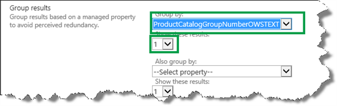
  
In the **SEARCH RESULT PREVIEW**, we can now see that only one item per product group is shown. 
    
     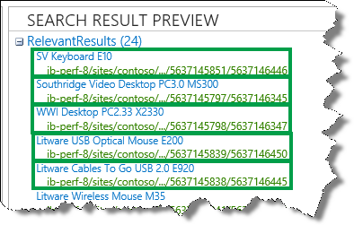
  
8. Select **OK** to save the changes. 
    
9. In the Web Part tool pane, in the **Number of items** to show field, enter how many items that you want to display in the Web Part. 
    
     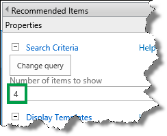
  
10. Select **OK**, and save the page. 
    
    Even though it doesn't look good, good recommendations are now displayed on our catalog item page.
    
     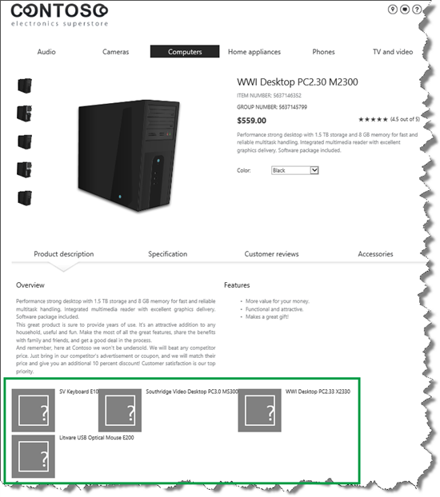
  
## About the display template that is used by the Recommended Items Web Part

Just as you do with the Content Search Web Part (CSWP), you use display templates to control how content should be displayed in a RIWP. [Stage 11: Upload and apply display templates to the Content Search Web Part in SharePoint Server](stage-11-upload-and-apply-display-templates-to-the-content-search-web-part.md) explains how to upload and apply display templates to the Content Search Web Part. You can do the same for the RIWP. But the display template that is used by the RIWP contains important code that logs the two usage events:  *Recommendation Displayed*  and  *Recommendation Clicked*  . 
  
In [An introduction to recommendations and popular items in SharePoint Server](an-introduction-to-recommendations-and-popular-items.md) we told you about the three default usage events in SharePoint Server. The usage events  *Recommendation Displayed*  and  *Recommendation Clicked*  are used to record statistics of how visitors have interacted with the content on your website. When an item is displayed as a recommendation, a  *Recommendation Displayed*  usage event is recorded. When an item is clicked on when it is displayed as a recommendation, a  *Recommendation Clicked*  usage event is recorded. We'll show you how you can view these statistics in a later article. 
  
In [Change the Content Search Web Part display template and use Windows PowerShell to start Usage analytics in SharePoint Server](change-the-content-search-web-part-display-template-and-use-windows-powershell-t.md), we changed the CSWP display template to log the  *Views*  usage event. The logging of the  *Recommendation Displayed*  and  *Recommendation Clicked*  usage events are performed in the RIWP. The default display template that is used by the RIWP is  *Item_RecommendationsClickLogging*  . This display template contains the two functions  *LogRecsViewToEventStore*  and  *LogRecsClickToEventStore*  . These two functions log the  *Recommendation Displayed*  and  *Recommendation Clicked*  usage events. 
  
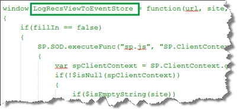
  
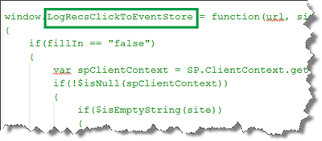
  
When you change your RIWP display template, you should copy the  *Item_RecommendationsClickLogging*  file, change the copied version, and apply it to your RIWP. That way, you don't have to worry about how to add code in the same manner that we did for the CSWP. 
  
After applying the changed display template to the RIWP, the recommended items are displayed nicely.
  
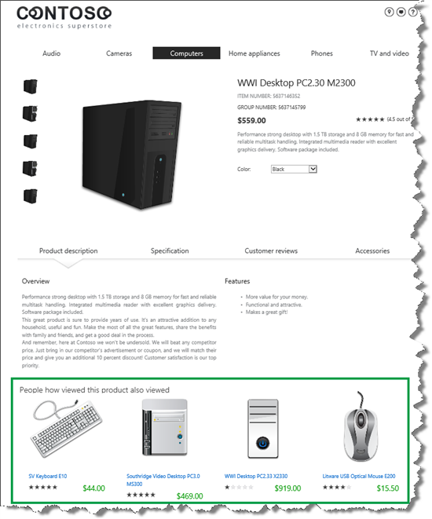
  
## Add a Popular Items Web Part to a page

You can display the most popular, that is,  *the most viewed*  items within your catalog by adding a Popular Items Web Part (PIWP) to your category page. It's important to understand that when you add a PIWP to your catalog page, the PIWP will automatically show the most viewed items  *within each category* . For example, if a visitor is viewing the  *Cameras*  category, the PIWP will show the most viewed items within the  *Cameras*  category. If a visitor is viewing the  *Camcorders*  category, the PIWP will show the most viewed items within the  *Camcorders*  category. 
  
To add a PIWP, navigate to the page where you want to add the PIWP. In our Contoso scenario, we'll add a PIWP to our category page. Do the following:
  
1. Select the **Settings** menu --> **Edit page**. 
    
2. In the Web Part Zone where you want to add the Web Part, select **Add a Web Part**. 
    
3. In the **Categories** list, select **Search-Driven Content**. 
    
4. In the **Parts** list, select **Popular Items**, and then **Add**. 
    
In our Contoso scenario, we'll show the PIWP above the CSWP.
  
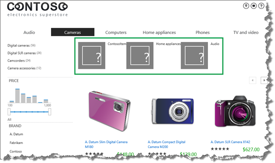
  
## Configure the Popular Items Web Part

1. Select the **Settings** menu --> **Edit page**. 
    
2. In the PIWP, select the **Web Part Menu** --> **Edit Web Part**. 
    
     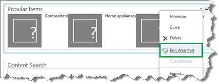
  
3. In the Web Part tool pane, select **Change query**. This will open a dialog box. 
    
4. In the **Restrict by app** section, select **Specify a URL** and enter the URL of your Authoring site. 
    
5. In the **Restrict by** tag section, select **Restrict by current and child navigation terms**. 
    
    No results are displayed in the **SEARCH RESULT PREVIEW** section. What's going on? 
    
     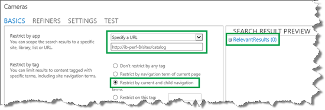
  
    To see more about the query that the PIWP issues, select **TEST**. On the **TEST** tab we can see the **Query text**. 
    
     
  
The query text means the following:
    
  - **path:"http://ib-perf-8/sites/catalog"** is the URL to our Authoring site. 
    
  - **owstaxIdMetadataAllTagsInfo** is the managed property that is used in the query. 
    
  - The colon : means "contains."
    
  - 91eb9f0d-3e5a-41a8-8487-78dfe234ca7c is the GUID of the current category. In this example the current category is  *Cameras*  . 
    
  - **(IsDocument:"True" OR contentclass:"STS_ListItem")** narrows the search result down to only documents or list items. 
    
    If we put this information together, we can understand that the query means the following:
    
    From the  *URL of the Authoring site*  , search for  *document or list items*  where the value of the managed property  *owstaxIdMetadataAllTagsInfo*  contains the GUID of the current navigation category or any of the children of the current navigation. 
    
    An important piece of information that we can see in the query text is that the PIWP uses the  *owstaxIdMetadataAllTagsInfo*  managed property in its query. You can't change the query in the PIWP to use another managed property. That means that for the query in the PIWP to work correctly, the  *owstaxIdMetadataAllTagsInfo*  managed property has to include the value of the managed property that we use to drive managed navigation (for more information, see [Stage 8: Assign a category page and a catalog item page to a term in SharePoint Server](stage-8-assign-a-category-page-and-a-catalog-item-page-to-a-term.md). In our Contoso scenario, the managed property that drives managed navigation is  *owstaxIdProductCatalogItemCategory*  . So, what we have to do is to map the crawled property of  *owstaxIdProductCatalogItemCategory*  to the  *owstaxIdMetadataAllTagsInfo*  managed property. 
    
    [Change the Content Search Web Part display template and use Windows PowerShell to start Usage analytics in SharePoint Server](change-the-content-search-web-part-display-template-and-use-windows-powershell-t.md) explains how to map a crawled property to a managed property. 
    
    > [!IMPORTANT]
    > You have to do the mapping on the authoring site. 
  
    In our Contoso scenario, the correctly mapped  *owstaxIdMetadataAllTagsInfo*  property looks as follows: 
    
     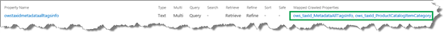
  
    After you've changed the mapping of the property, you have to start a full crawl, as explained in [Stage 4: Set up search and enable the crawling of your catalog content in SharePoint Server](stage-4-set-up-search-and-enable-the-crawling-of-your-catalog-content.md).
    
    There is one very important thing that you can't see in the query text, and that is how the search results are sorted. The PIWP sorts search results in a descending order on the  *ViewsRecent*  managed property. By default, the  *ViewsRecent*  managed property contains the number of views for an item within the last 14 days. Later in this series we'll explain how to change this, for example, to the past 7 days. This means that the query issued by the PIWP will do the following: 
    
    From the  *URL of the authoring site*  , search for  *document or list items*  where the value of the managed property  *owstaxIdMetadataAllTagsInfo*  contains the GUID of the current navigation category, or any of the children of the current navigation. Sort the search results in  *descending order of views for the past 14 days*  . 
    
    When the full crawl has finished, you'll see search result in the Web Part.
    
     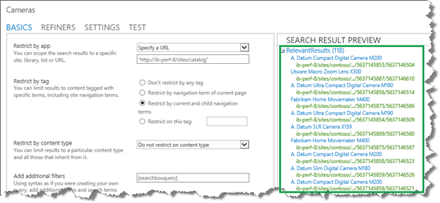
  
6. Select **OK** to save the changes, and save the page. 
    
     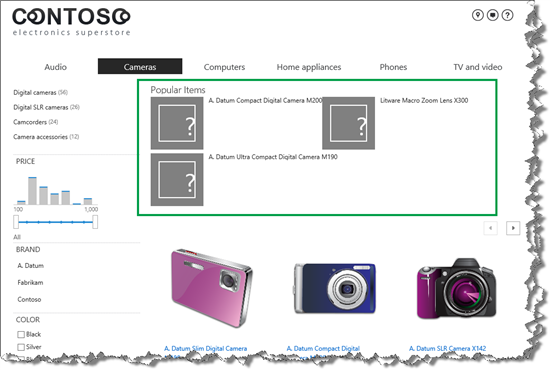
  
    To display the popular items nicely, you can apply a display template in the same manner that you did with the CSWP. For more information, see [Stage 11: Upload and apply display templates to the Content Search Web Part in SharePoint Server](stage-11-upload-and-apply-display-templates-to-the-content-search-web-part.md).
    
    To check that the PIWP is working correctly, go to the  *Cameras*  section. On this page, the most viewed items within the  *Cameras*  category are displayed. 
    
     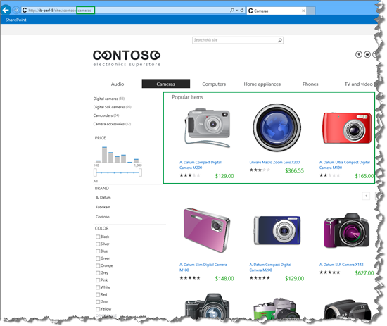
  
    When we go to the  *Camcorders*  category, the most viewed items within the  *Camcorders*  category are displayed. 
    
     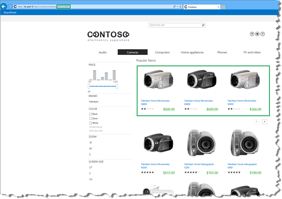
  
    Our PIWP is working the way it should. Nice!
    
    So now you know how to configure the RIWP and the PIWP. When you you perform these tasks, you should be logged in to your own account.
    
     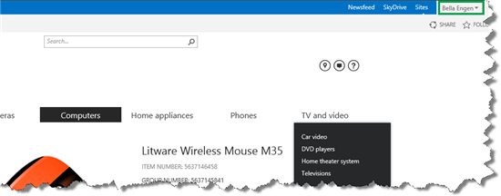
  
In the next article of this series, we'll explain how all this works if the website only has anonymous users, that is, users who are not logged in.
  
### Next article in this series

[Use recommendations and popular items on websites with anonymous users in SharePoint Server](use-recommendations-and-popular-items-on-websites-with-anonymous-users.md)
  

