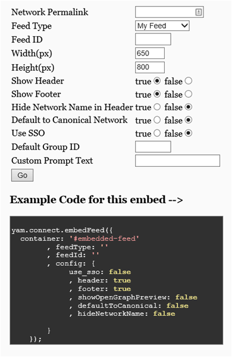

# Add the Yammer Embed widget to a SharePoint page

 **Summary:** Learn how to use the Yammer Embed widget to include Yammer feeds on SharePoint pages. 
  
The Yammer Embed widget is a thin layer of JavaScript that renders HTML, which you can insert into a SharePoint Server 2013 page. The widget displays one of several types of Yammer feeds directly from Yammer, and it also handles authentication. If a user hasn't yet logged on to Yammer, the widget provides a user interface to do this.
  
To use Yammer Embed, just add the JavaScript snippet for the feed to your SharePoint site. You can use the [Yammer Embed configuration tool](https://go.microsoft.com/fwlink/p/?LinkId=507500), as depicted in the screenshot below, to select the feed type and settings that you want to use, and then get a JavaScript snippet that contains those settings to embed into a SharePoint page.
  
**Yammer Embed configuration tool**

  
When you use this JavaScript snippet on a SharePoint page, you can add it to a Script Editor Web Part and place it anywhere on the page. The widget shows users the latest messages based on how Yammer Embed is configured.
  
For more information about how to use the Yammer Embed widget, see [Embed](https://go.microsoft.com/fwlink/p/?LinkId=507501) in the [Yammer Developer Center](https://go.microsoft.com/fwlink/p/?LinkId=507502).
  
## See also

#### Concepts

[Integrate Yammer with on-premises SharePoint 2013 environments](integrate-yammer-with-on-premises-sharepoint-2013-environments.md)

